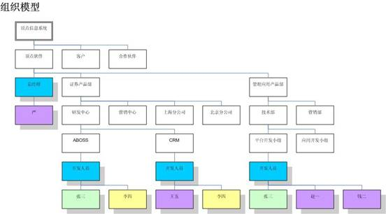
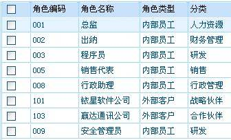
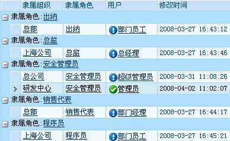
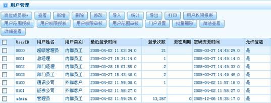

# 

> LiveBOS Studio > 概念手册 > 基础架构 > 权限管理

---

### 组织模型

任何一个LiveBOS上的应用，都应该有一个明确的组织体系架构。LiveBOS应用在组织架构体系上进行用户、角色（岗位）的管理。用户的权限管理是基于组织体系、角色（岗位）上进行的。组织结构是一个多层次的树状结构。角色是一个单层次平面结构，可以按职能或任务进行分类，一个角色下可包含一个或多个人员。角色可以挂接在组织结构多个单元上。人员是指可以使用LiveBOS系统的用户，可以是员工、客户或合作伙伴。一个用户可以有一或多个角色，即人员与角色是n:n关系。用户必须通过角色挂接于组织中，即为组织单元分配用户时必须选定用户的角色。

图5.1.1组织模型

#### 组织

组织结构是以一个多层次的树状结构展示，描述了组织的框架体系。组织一般体现人员的职责、权限和相互关系。

组织机构页面展示：

图5.1.2

#### 角色

角色是一个单层次平面结构，可以按职能或者任务进行分类。一个角色下可以包含一个或多个人员。用户可以挂接在组织结构多个单元上。

图5.1. 3即为一组系统角色列表，各角色按其属性分为“内部员工”与“外部客户”，“内部员工”里包含有总监、出纳等多个人员。

图5.1.3

如图5.1.4，用户“安全管理员”既可隶属于“总部”，同时也挂接于“研发中心”：

图5.1.4

#### 用户

人员是指可以使用LiveBOS系统的用户，可以是员工、客户或合作伙伴。一个用户可以有一个或多个角色，即人员与角色是n:n关系。用户必须通过角色挂接于组织中，即为组织单元分配用户是必须选定用户的角色。

全部用户查看：

图5.1.5
