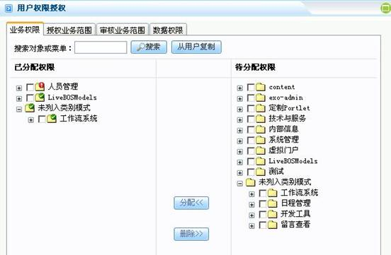
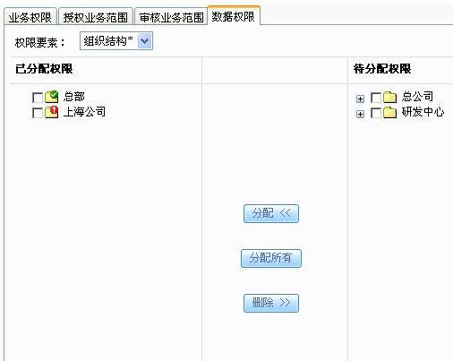
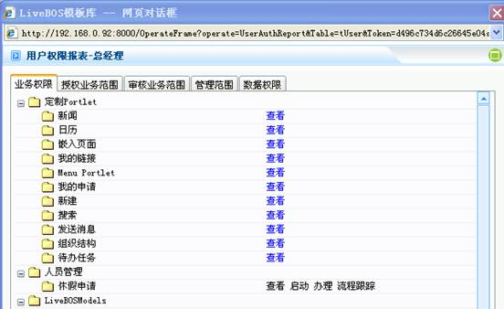

# 

> LiveBOS Studio > 概念手册 > 基础架构 > 权限管理

---

### 权限授权

#### 授权

对用户角色或者组织授予某项业务或权限的操作。

授权步骤实例：

1.如图5.1.6，对用户“总经理”进行业务权限分配：

图5.1.6

2.如图5.1.7，“总部”已通过安全管理员的授权，可正式生效；而“上海公司”未通过审核。

图5.1.7

#### 审核

对权限授权后会处于待审核状态，必须进行审核以后，权限的修改才真正的生效。

如图5.1.8～图5.1.10步骤：对用户“总经理”所分配的权限进行审核

1.待审核状态：勾选“人员管理”审核权限

图5.1.8

2.“人员管理”进入审核：当“人员管理”通过审核后，权限的修改方可生效。

图5.1.9

这时可查看用户权限报表，审查员工管理权限修改是否已生效：

图5.1.10
