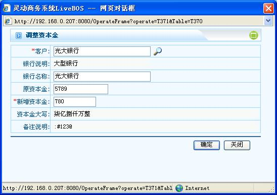
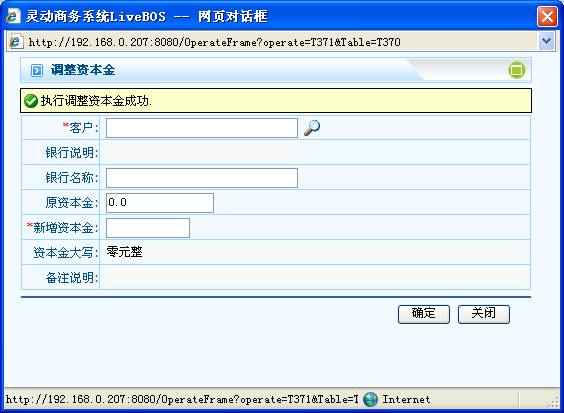

# 

> LiveBOS Studio > 概念手册 > 对象模型 > 方法设计

---

### 控制属性

#### 要求安全保护

要求通过SSL安全连接才能访问对象数据。

#### 允许连续操作

在成功操作后，是否支持继续操作，其页面如图1.5.3.1和图1.5.3.2：

1.修改数据：

图1.5.6

2.成功提交修改后页面：

图1.5.7

#### 定制操作界面

使用定制的操作界面。

#### 使用嵌入式窗口

操作时不弹出新窗口，直接在当前页面下操作。

#### 批量操作是否启用事务

表明在进行批量操作(选中记录或者全部记录）时，是否启用事务。如果启用事务，整批记录有异常或者有某条记录失败时，全部回滚。如果没有启用事务，则成功提交正常操作的记录。
