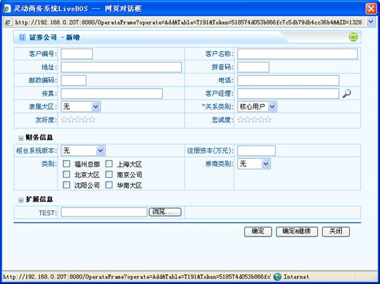
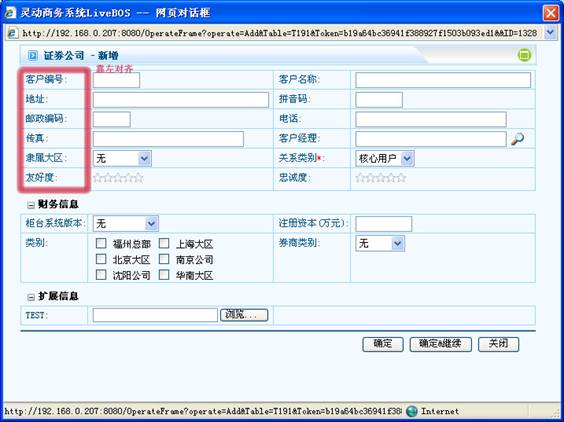
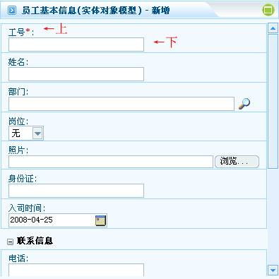
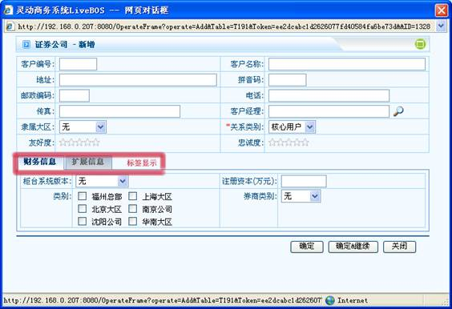
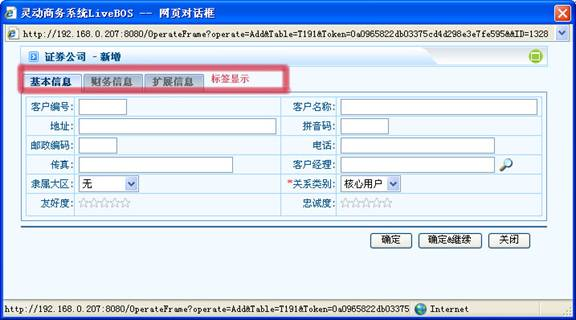

# 

> LiveBOS Studio > 概念手册 > 对象模型 > 方法设计

---

### 展现属性

#### 网格类型

默认，普通表格或者可编辑表格。

##### 默认

##### 普通表格

即只可读不可修改的表格。

##### 可编辑表格

可直接进行编辑操作的表格。

###### 每条提交

每修改一条记录即提交。

###### 整体提交

修改全部表格记录后点击相应按钮后，再进行提交。

###### 后台每条提交

每修改一条记录，提交操作在后台进行。

#### 操作界面方案

操作界面的布局方案，如左对齐方案、右对齐方案、上下布局方案、分组页标签、完全页标签。

###### 普通方案

图1.5.1普通方案

###### 左对齐方案

图1.5.2左对齐方案

###### 上下布局方案

字段标签和字段控件按上下方式布局。

图1.5.3上下布局方案

###### 分组页标签

表单分组按标签页显示。

图1.5.4分组页标签

###### 完全页标签

以标签页显示分组，并且页面包括完整表单所具备的功能。

图1.5.5完全页标签

#### Tip提示信息

操作按钮的浮动提示。

#### 操作界面布局

###### 操作界面列数

在操作界面每行显示的列数。

#### 支持局部刷新

指定页面当数据限制或字段触发刷新页面其他内容时是否采用AJAX局部刷新
