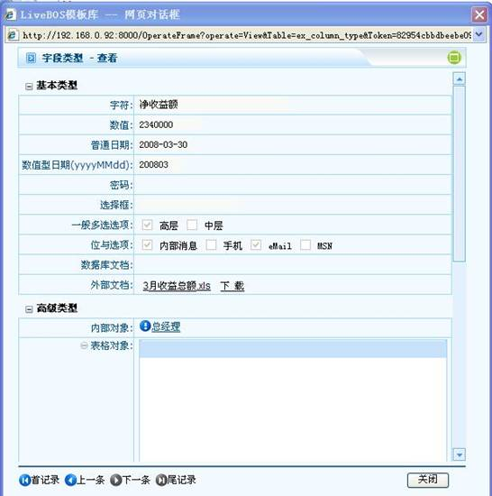

# 

> LiveBOS Studio > 概念手册 > 对象模型 > 对象属性 > 字段基本属性

---

#### 字段类型

字段类型页面展示：

图1.3.1

包含有基本类型与高级类型选项，可对其进行增、删、改、查等操作。

##### 基本类型

###### 字符

一般文字。

###### 数值

包括整数与小数。

###### 日期

普通日期

表达日期与时间。

数值型日期

以数字类型保存日期。如：2008-4-10，这样的日期将以数字20080410方式保存。

###### 密码

特殊加密文字。

###### 选择项

用于表达可罗列（须事先在数据字典中定义）的情况中的一种。

###### 布尔型

显示真假的字段。

###### 多值选项

表达可罗列的情况中的一种或多种存在的情况（须事先在数据字典中定义）。

一般选项

在多值选项中，用分号分隔的字符串方式保存数据。

位与选项

对象按位与进行保存，必须对应于数据字典中位与条目。

###### 文档类型

内部文档

用于保持文档的字段，可上传或下载，长度由系统设定，其文档直接存放于数据库中。

外部文档

与内部文档相同，但其保存于应用服务器的特定目录下。

##### 高级类型

###### 内部对象

用于引用系统内部特定类型的对象；对象类型可以是实体对象，也可以是对象细分或对象视图。

###### 表格对象

数据按照表格方式存放。其本身对应相应数据库的表。

主标识列

表格对象可以将内部对象的字段设成主标识列。当设置主标识列后，在操作时可以通过选择按钮一次性加入多条件。主标识支持值范围限制。

一般用法：如订单对象中订单明细的表格对象，可以将其商品字段设成主标识字段。这样可以一次选择多个商品。

###### 表格模板对象

普通实体对象的一种，可以对其数据进行维护，并可被多个对象以表格方式引用。其数据可全部或经筛选后预填至表格中（通过简历表格模板或通过字段限制，实现预设的数据根据相关字段变化而变化。）

存放表格模板数据的数据表为模板对象表名，而引用表格模板字段的数据表则为[对象名\_字段名\_表格模板名]。

###### 泛对象

表示一个不事先约定类型的对象。

###### 单选泛对象

与泛对象相同，但只能选择一个对象实例。

###### 多值对象

与内部对象相似，但其一个字段可存放多个对象的实例值。
