# 

> LiveBOS Studio > 概念手册 > 对象模型 > 对象属性 > 字段基本属性

---

#### 展示属性

##### 控件类型

###### 不显示

不显示此字段。

###### 编辑框

普通的单行文本编辑框。

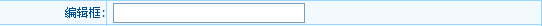

图1.3.2编辑框

###### 多行编辑框

多行文本编辑域。

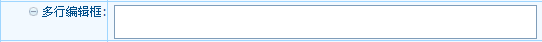

图1.3.3多行编辑框

###### HTML编辑控件

HTMl编辑控件。

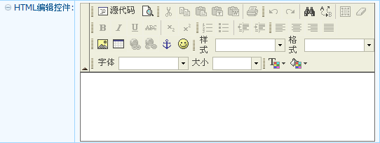

图1.3.4
HTML编辑控件

###### 组合框

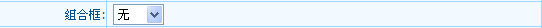

图1.3.5组合框

###### 自动完成下拉框

按用户输入的值,自动将匹配的记录列出。

图1.3.6自动完成下拉框

###### 日期控件

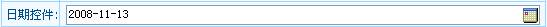

图1.3.7日期控件

###### 日期/时间选择器

日期和时间都可以由用户选择。

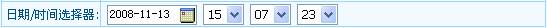

图 1.3.8日期/时间选择器

###### 日期时间控件

日期通过下拉框展现，时间（小时：分钟）通过选择器展现。

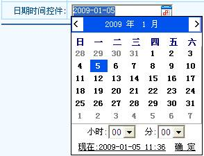

###### 日期/时间输入框

日期由用户选择，时间（小时：分钟：秒）由用户输入数值。

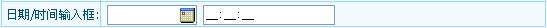

图 1.3.9日期/时间输入框

###### 下拉时间选择器

时间（小时：分钟）由用户通过下拉框进行选择。

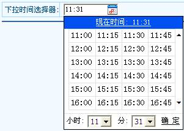

###### 掩码时间输入框

时间（小时：分钟：秒）由用户输入。

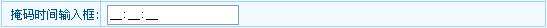

图 1.3.10掩码时间输入框

###### 时间选择器

时间（小时：分钟：秒）由用户选择。

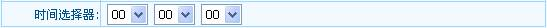

图 1.3.11时间选择器

###### 选择框

当字段类型为位与选择项时，显示控件才能选择“选择框”，可选择多项。

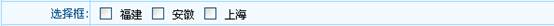

图1.3.12选择框

###### 下拉多选框

与选择框相同，当字段类型为位与选择项时，显示控件才能选择该控件，可选择多项。

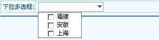

图 1.3.13下拉多选框

###### 单选框

图1.3.14单选框

###### 列表框

以多行形式展示的组合框。

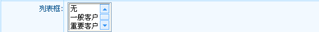

图1.3.15列表框

###### 密码框

用于用户输入密码的文本框。

图1.3.16密码框

###### 文件上传

用于上传客户端文件的控件,适用于字段类型为内部文档或外部文档的字段。

图1.3.17文件上传控件

###### 选项编辑框

用户可直接输入对象的输入标识，也可弹出窗口选择对象。

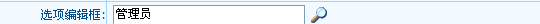

图1.3.18选项编辑框

###### 星级评分控件

用户可选择评分的星级数。

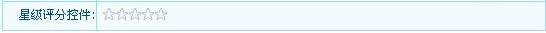

图 1.3.19星级评分控件

###### 下拉选项编辑框

用户可直接输入对象的输入标识，也可在当前页面下弹出下拉菜单窗口供用户选择对象。

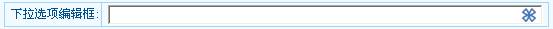

图1.3.20下拉选项编辑框

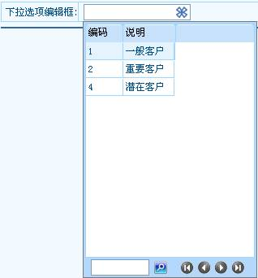

图1.3.21

###### 树形选项编辑框

与选项编辑框类似，弹出窗口根据分组项用树形展示。

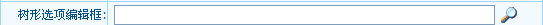

图1.3.22树形选项编辑控件

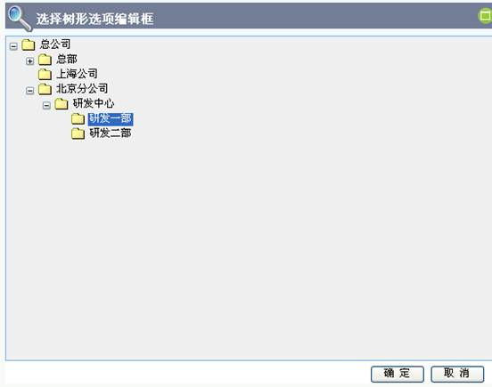

图1.3.23

###### 完全选项编辑框

与选项编辑框类似，弹出窗口展示对象的完整界面功能。

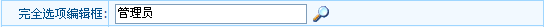

图1.3.24完全选项编辑框

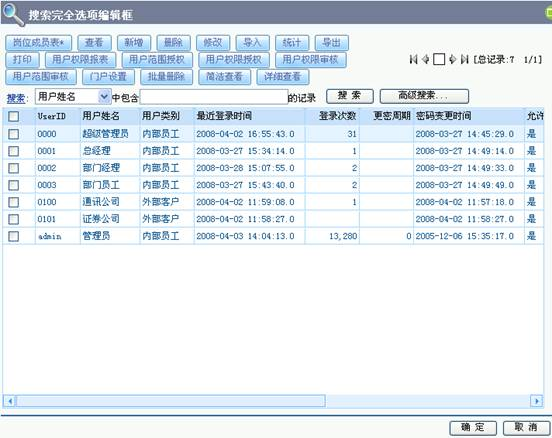

图1.3.25

###### 表格控件

用于录入从属对象信息的数据表格。

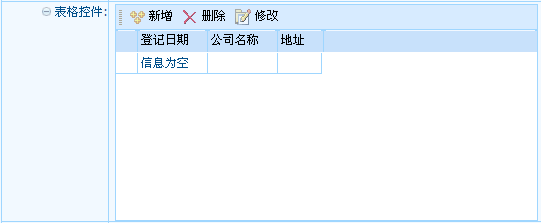

图1.3.26表格控件

新增表格控件页面如下图：

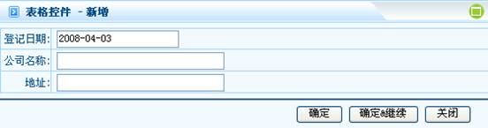

图1.3.27

###### 可编辑表格控件

可直接在界面上进行编辑操作的表格控件。

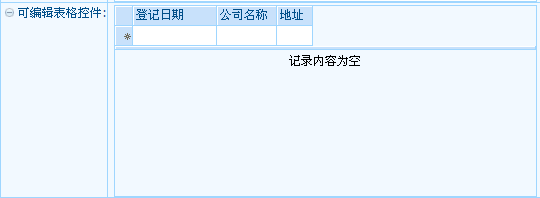

图1.3.28可编辑表格控件

显示删除图标

当表格数据可删除时是否在行头显示删除图标。

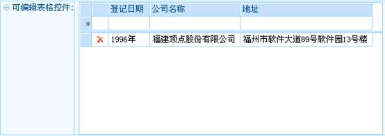

###### 泛对象选择器

可对多个泛对象进行选择。

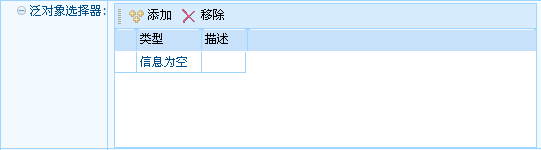

图1.3.29泛对象选择器

添加一泛对象页面如下图，右侧以标签形式展示对象类型：

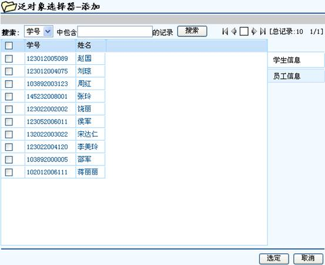

图1.3.30

###### 泛对象单选器

仅可对单选泛对象进行选择。

图1.3.31泛对象单选器

泛对象单选器页面如下图，右侧以标签形式展示对象类型：

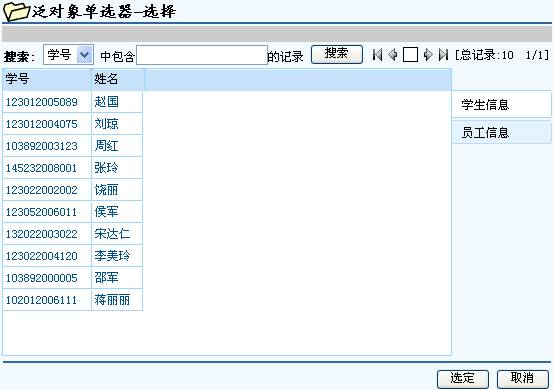

图1.3.32

###### 泛对象框

与泛对象选择器的功能类似，可以对多个泛对象进行选择。

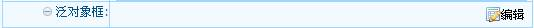

图1.3.33泛对象选择框

选择添加泛对象，页面如下图：

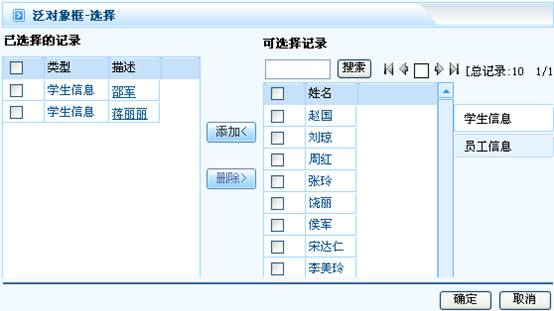

图1.3.34

###### 多值对象选择器

用于选择多个内部对象值。

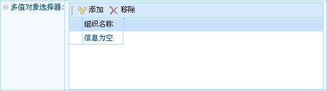

图1.3.35多值对象选择器

新增多值对象页面如下图：

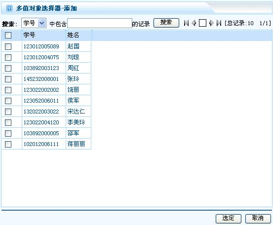

图1.3.36

###### 多值对象框

与多值对象选择器的功能类似，用于选择多个内部对象的值。

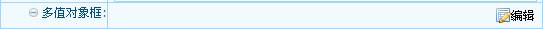

图1.3.37多值对象框

选择添加多值对象，页面如下：

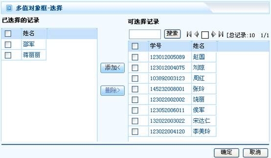

图1.3.38

###### 树形多值选项框

与多值对象选择器的功能类似，用于选择多个内部对象的值。展示时以树形方式展示。

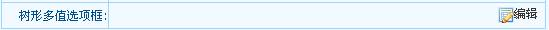

选择添加多值对象，页面如下：

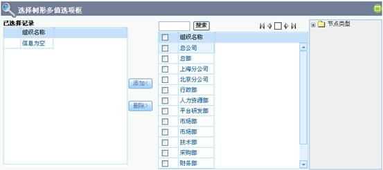

###### 文本标签

用于原样显示输出自定义简单HTML代码。

图1.3.39文本标签

###### 日历控件

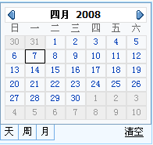

图1.3.40日历控件

###### 图形控件

显示图像，将内部文档或者外部文档中的图像文件直接显示出来。

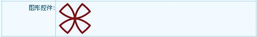

###### 多列下拉选择框

以多列的形式展现的组合框。针对选择项或内部对象类型的字段，当选择项值或内部对象值比较多时，可以考虑采用该控件。

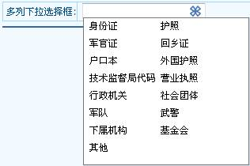

###### 颜色选择控件

适用于字段类型为数值型和字符型的字段，可以弹出颜色选择对话框,保存所选择的颜色值。

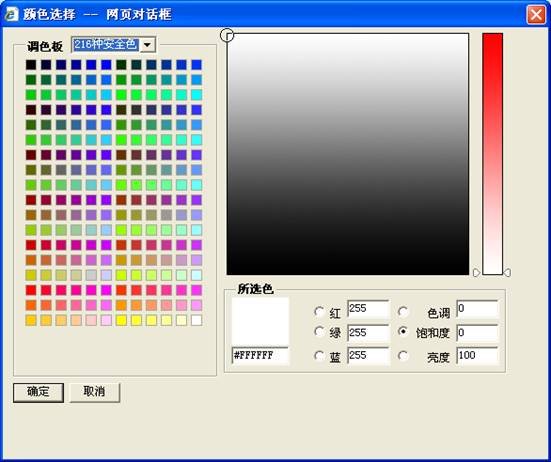

##### 是否刷新数据

在数据录入完成后，失去焦点时是否要刷新界面。此功能主要用于绑定字段的重新计算。

##### 隐藏公式

该字段在展示时是否显示计算公式。

##### 只读公式

该字段是否可修改的计算公式。

##### 隐藏标签

选择隐藏标签时，不显示字段对应名称的标签。

##### 强制换行

展示该字段前，表单自动换行。

##### 字段样式名

字段展现样式名，即定义界面字段控件对应css的Class名称，可以通过设置表单或网格的css来定义字段的风格。

##### 标签样式名

自定义字段标签，即定义界面字段标签对应css的Class名称，可以通过设置表单css来定义字段标签的风格。
