# 

> LiveBOS Studio > 概念手册 > 对象模型 > 对象属性 > 展现属性

---

#### 界面模式

##### 布局方案

对象设定的界面方案；默认为系统参数LayoutType的值。

###### 简单模式

页面显示的字体，颜色以及按钮控件均以简单页面模式展现。

简单模式实例展示：

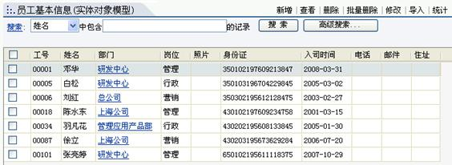

图1.3.41简单模式

###### 普通模式

以表格方式按序显示页面：

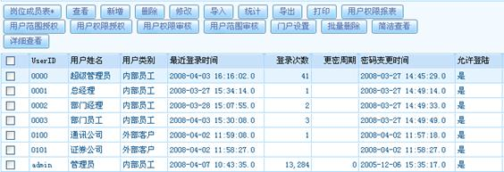

图1.3.42普通模式

###### 竖排查询表单

即查询方式以竖排显示：

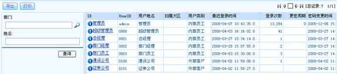

图1.3.43竖排查询表单

###### 分组树模式

页面左边以树状模式显示各个数据节点，右边配以相应节点内的相关信息。

分组树模式实例展示：

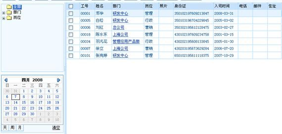

图1.3.44分组树模式

###### 左右模式

在显示模式为主从浏览模式时，布局方案设置为“左右模式”，左侧展示的是主对象信息，右侧展示的是选中记录的关联信息。如图1.3.45所示：

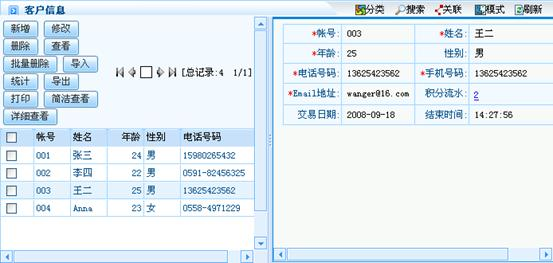

图1.3.45左右模式

###### 分组树左右模式

在为对象建立分组和主从浏览模式的基础上，左侧展示的是数据的节点，中间展示的是节点的相关信息，右侧展示的是选中记录的相关信息。如图1.3.46所示：

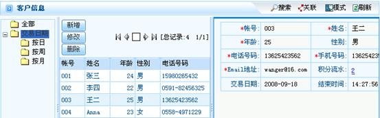

图1.3.46分组树左右模式

###### 默认

布局方案由系统参数来决定。

##### 显示模式

可选择单记录浏览模式、主从浏览模式、表格浏览模式、卡片浏览模式中的任一种。

###### 一般对象

表格浏览模式

表格方式显示数据集合：

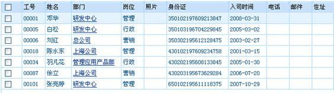

图1.3.47表格浏览模式

主从浏览模式

表格方式显示主对象数据,并显示明细模式和从属关联对象与主对象选中记录关联的信息。

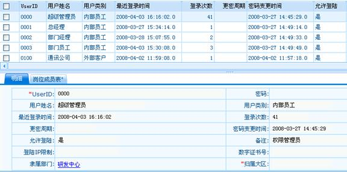

图1.3.48主从浏览模式

列表主从模式

以列表方式显示主对象数据,并显示明细模式和从属关联对象与主对象选中记录关联的信息。

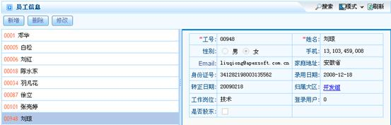

单记录浏览模式

将显示模式设定为单记录浏览模式，单记录模式用于展示当前记录。在一个页面内将对象的所有信息完全展示出来。

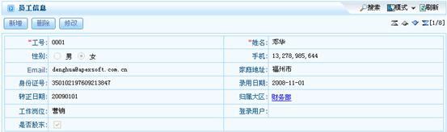

图1.3.49单记录浏览模式

单记录主从模式

单记录主从模式展示当前记录,并显示从属关联对象与主对象选中记录关联的信息。

单记录主从模式下的主表：

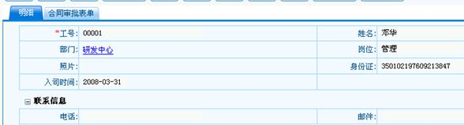

图1.3.50单记录主从模式

单记录主从模式下的从表：

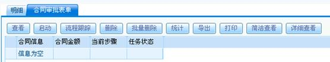

图1.3.51

卡片浏览模式

将显示模式设定为卡片浏览模式，卡片浏览模式用于展示当前所有记录。在一个页面内将对象的所有信息以卡片的形式展示出来。卡片展现如图1.3.52：（注：其中黄色卡片代表当前选中项）。

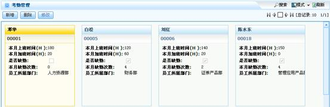

图1.3.52卡片浏览模式

卡片主从模式

将显示模式设定为卡片主从模式，卡片主从模式用于展示对象实例的基本信息记录和详细信息记录。上面以卡片的形式展现当前基本信息，下面以表格的形式展现选中记录的详细信息。（注：其中黄色卡片代表当前选中项）。

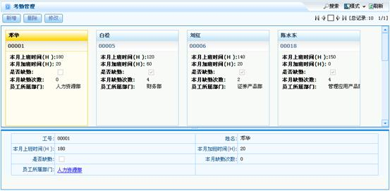

图1.3.53卡片主从模式

###### 层次模板

创建时同时建立上级节点、节点类型、节点级别、组织名称和上级域编码等字段。

树状模式

以树形模式显示各个数据节点。

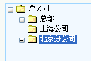

图1.3.54树状模式

树状明细模式

以树形模式显示各个数据节点,并显示选中节点明细信息。

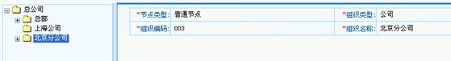

图1.3.55树状明细模式

单记录模式

单记录模式用于展示当前记录。

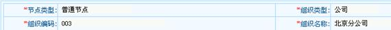

图1.3.56单记录模式

树状表格模式

以表格形式显示树的数据节点。

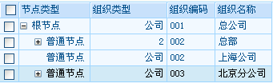

图1.3.57

树状表格明细模式

以表格形式显示树的数据节点,并显示选中节点的明细信息。

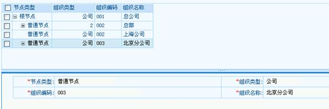

图1.3.58

###### 新闻模板

门户新闻模式

按分组标题模式显示新闻条目。

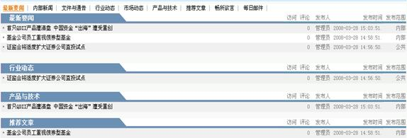

图1.3.59新闻模式

管理模式

即普通表格模式，用以管理新闻模板相关数据。

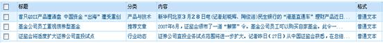

图1.3.60

单记录模式

以新闻单记录来显示当前新闻内容及相关联的新闻评论。

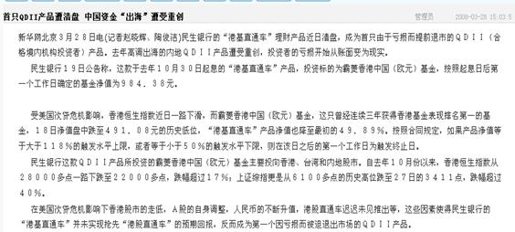

图1.3.61单记录模式

###### 投票模板

投票模式

展示投票模板的标题、注释、投票选项和投票结果信息。

图1.3.62投票模式

管理模式

即普通表格模式，用以管理投票数据。

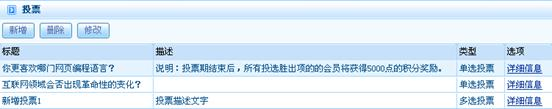

图1.3.63管理模式

明细模式

以主从方式显示投票数据和投票结果。

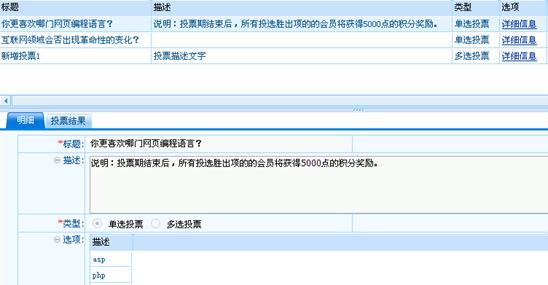

图1.3.64明细模式

###### 文档模板

文档明细模式

与新闻模板类似，按文档分类模式显示文档基本信息，并提供文档查看、下载功能。

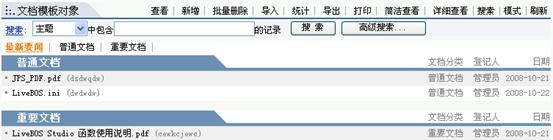

图1.3.65文档明细模式

文档表格模式

以表格模式显示文档创建时的信息，并提供文档的查看、下载功能。

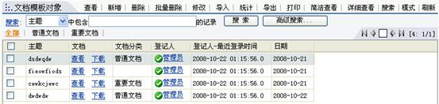

图1.3.66文档表格模式

##### 界面控制

###### 参数表单布局界面方案

该方案针对有参数的表单对象（如视图对象、数据集对象等）界面方案的显示，且只有在布局方案为“竖排查询表单”的情况下使用有效。

默认

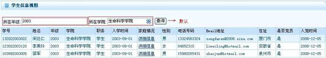

普通方案

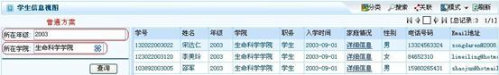

图1.3.67普通方案

左对齐方案

即查询参数靠左对齐。

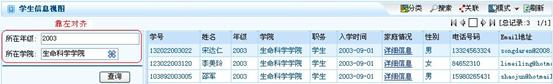

图1.3.68左对齐方案

上下布局方案

即查询参数标签及参数控件按上下方式布局。

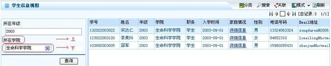

图1.3.69上下布局方案

分组页标签

即查询参数表单分组按照标签页显示。

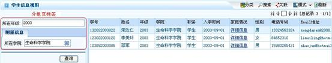

图1.3.70分组页标签

完全页标签

以标签页显示分组，并且页面包括完整表单所具备的功能。

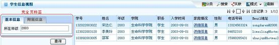

图1.3.71完全页标签

###### 主/从模式隐藏明细信息

在主从模式中不出现明细的标签。（该属性在新版本用明细信息显示模式替代）

###### 单记录浏览隐藏从属关系

当显示模式为单记录浏览模式时，是否将其从属关系隐藏起来。

没有勾选上改选项时：

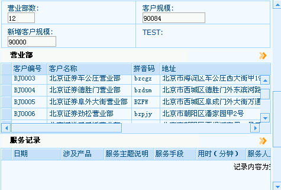

图1.3.72

勾选后：如图1.3.73，“营业部”与“服务记录”的信息将被隐藏。

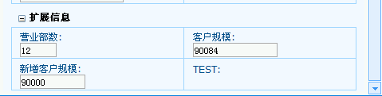

图1.3.73

###### 总是显示搜索栏对象

勾选上此选项时，自动显示搜索条（默认时隐藏），并在以从属关系展示时也可显示搜索条。

###### 不显示搜索栏

采用系统默认时，展现如图1.3.74：

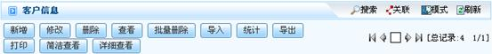

图1.3.74

勾选“不显示搜索栏”时，页面不显示搜索条，即不能进行搜索操作，展现如图1.3.75：

图1.3.75

###### 明细信息显示模式

无: 不显示明细信息。

普通:显示基本信息。

简洁:以简洁模式显示基本信息。

##### 网格属性

###### 网格类型

可为普通表格或可编辑表格。

默认

普通表格

即只可读不可修改的表格。

可编辑表格

可直接进行编辑操作的表格。

每条提交

每修改一条记录即提交。

整体提交

修改全部表格记录后点击相应按钮后，再进行提交。

后台每条提交

每修改一条记录，提交操作在后台进行。

###### 网格层次分组

根据已选定的字段进行表格的层次分组。

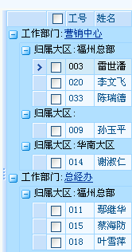

图1.3.76

###### 网格显示分组

所显示的表格列表信息仅包含其已选定的字段分组属性。

###### 网格显示字段

表格中列表信息仅显示设定的字段，该属性优先级高于网格显示分组。默认为全部显示。

###### 每页显示记录行数

展示界面列表中每页的行数。

###### 网格初始大小

用户可以根据自己的需求定义网格的尺寸，否则采用系统默认。用户可以通过设置网格尺寸的整数值或占全屏的比例值定义网格尺寸的大小。

###### 网格CSS定义

自定义CSS样式时，CSS选择符的定义

###### 网格CSS资源路径

自定义CSS样式时，CSS选择符的定义文件路径

###### 显示记录号

是否在表格行头显示记录号

##### 操作界面

###### 界面方案

操作界面的布局方案，如左对齐方案、右对齐方案、上下布局方案、分组页标签、完全页标签。

普通方案

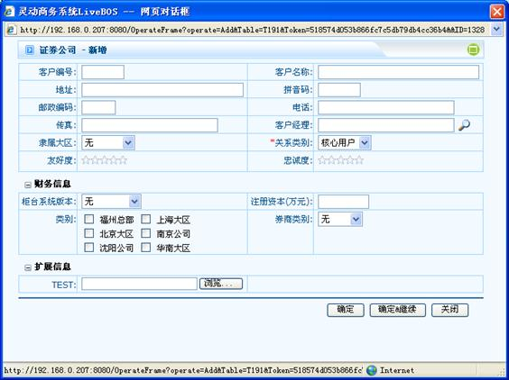

图1.3.77普通方案

左对齐方案

字段显示靠左对齐。

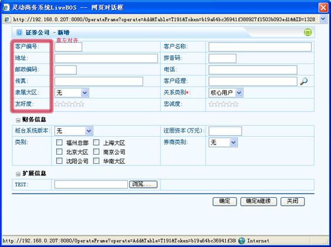

图1.3.78左对齐方案

上下布局方案

字段标签和字段控件按上下方式布局。

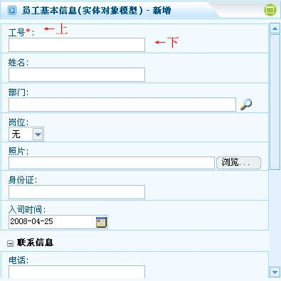

图1.3.79上下布局方案

分组页标签

表单分组按标签页显示。

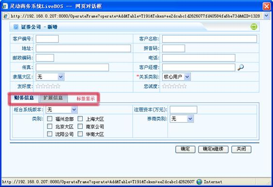

图1.3.80分组页标签

完全页标签

以标签页显示分组，并且页面包括完整表单所具备的功能。

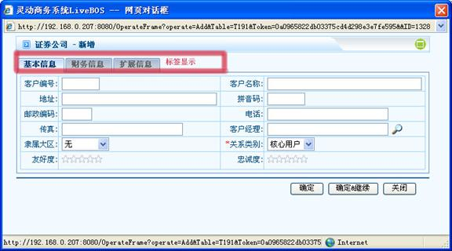

图1.3.81完全页标签

###### 定制操作界面

使用定制的操作界面。用户可以通过编写一个以HTML标记为基础的表单布局文件作为操作界面。

###### 使用嵌入式窗口

操作时不弹出新窗口，直接在当前页面下操作。

###### 操作界面布局

在操作界面每行显示的列数。

布局定义

独立一行

每一个选项框独自占一行。

换行

选项框换行排列。

占列

当前选项框可以占据几列的位置。

###### 支持局部刷新

指定页面当数据限制或字段触发刷新页面其他内容时是否采用AJAX局部刷新。

###### 弹出窗口初始大小

操作界面弹出窗口初始大小。

###### 表单CSS定义

操作表单CSS选择符的定义,如:我们需要让A字段的图片为固定大小,可以先在A字段上设置样式名C1,然后在这里定义：

.C1 img

###### 表单CSS资源路径

操作表单CSS选择符的定义文件路径

###### 客户端脚本定义

操作界面客户端脚本的定义,允许附加一些自定义的客户端javascript脚本

###### 客户端脚本资源路径

操作界面客户端脚本的定义文件路径

#### 直接查询

指定查询,带参数的视图及虚拟对象等页面展现时是否直接根据默认参数进行查询并显示结果,而无需用户点击查询按钮。
