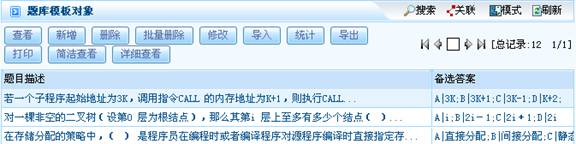
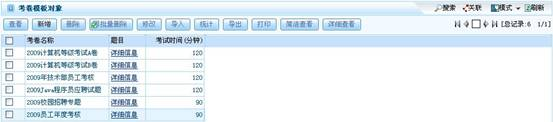
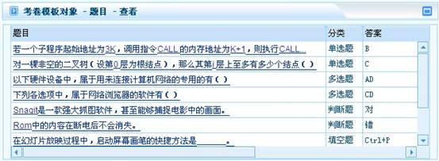
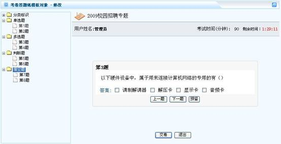
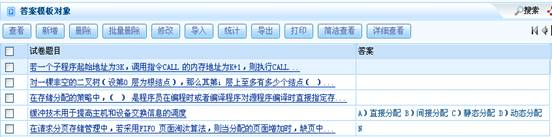

# 

> LiveBOS Studio > 概念手册 > 对象模型 > 对象模板

---

### 试卷模板

#### 题库模板

该模板主要配合试卷模板使用，试卷模板从题库中选取题目。该模板保留字段有题目类型、题目描述、备选答案和参考答案字段。

题库模板实例展示：

图1.2.5题库模板

#### 考卷模板

该模板建立试卷，配合题目模板使用，从题库中获取数据作为试卷的题目展现。该模板保留字段有考卷名称、题目和考试时间（分钟）字段。

试卷模板展示：

图1.2.6试卷模板

##### 题目模板

该模板由考卷调用。该模板的保留字段有考卷的题目、分类和答案字段。其中“题目”字段引用题库模板对象。

题目模板实例展示：

图1.2.7题目模板

#### 考卷答题纸模板

考卷答题纸模板配合试卷模板使用，答案模板作为该模板的载体。其保留字段有试卷代码、答案、考试开始时间、交卷时间和作答人字段。

考卷答题纸模板实例展示：

图1.2.8考卷答题纸模板

##### 答案模板

答案模板包含答案内容描述，作为考卷答题纸模板的载体使用。该模板保留字段有试卷题目和答案字段。

答案模板实例展示：

图1.2.9答案模板
