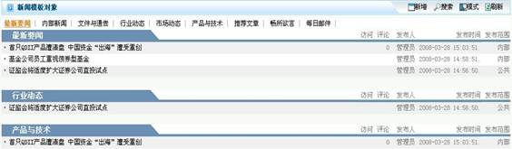
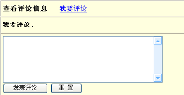

# 

> LiveBOS Studio > 概念手册 > 对象模型 > 对象模板

---

### 新闻模板

该模板数据以常见新闻方式来发布，并可发表评论。该模板的保留字段有标题、分类、内容、格式、访问、评论、回复时间、发布人、相关图片1、相关图片2、发布时间、发布范围、附件等等字段。

新闻模板对象展示：

图1.2.3新闻模板

#### 新闻评论模板

该模板主要配合新闻模板使用，作为新闻模板评论信息的载体。该模板的保留字段有发言人、评论、新闻对象、评论时间等字段。评论模板通常与新闻模板对象从属关联，即新闻对象字段引用相关的新闻模板对象，并在新闻模板对象中建立与评论模板对象的从属关系。

新闻评论模板展示：

图1.2.4新闻评论
