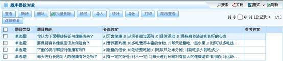
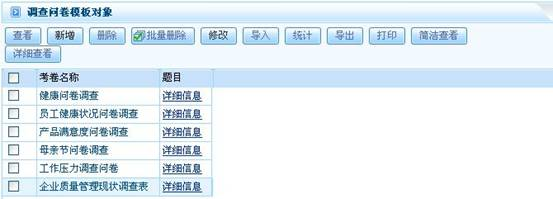
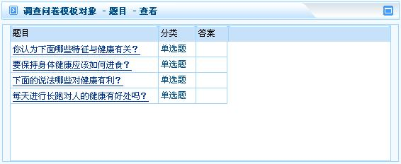
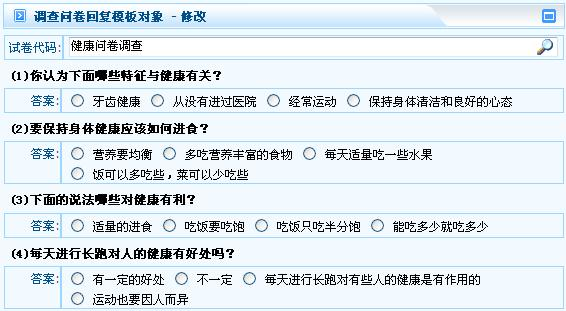
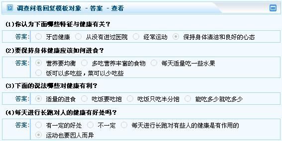

# 

> LiveBOS Studio > 概念手册 > 对象模型 > 对象模板

---

### 调查问卷模板

#### 题库模板

该模板主要配合调查问卷模板使用，调查问卷模板从题库中选取题目。该模板保留字段有题目类型、题目描述、备选答案和参考答案字段。

题库模板实例展示：

图1.2.10题库模板

#### 调查问卷模板

该模板建立调查问卷，配合题库模板使用，从题库中获取数据作为调查问卷的题目出现。该模板保留字段有考卷名称和题目字段。

调查问卷模板展示：

图1.2.11调查问卷模板

##### 调查问卷题目模板

该模板由调查问卷所调用。相应的题目对应相应的调查问卷。该模板的保留字段有调查问卷的题目、分类和答案字段。其中”题目”字段引用题库模板对象。

题目模板实例展示：

图1.2.12调查问卷题目模板

#### 调查问卷回复模板

调查问卷回复模板配合调查问卷模板使用，答案模板作为该模板的载体。其保留字段有试卷代码和答案字段。

调查问卷回复模板实例展示：

图1.2.13调查问卷回复模板

##### 调查问卷答案模板

答案模板包含答案内容描述，作为调查问卷回复模板的载体使用。该模板保留字段有试卷题目和答案字段。

答案模板实例展示：

图1.2.14调查问卷答案模板
