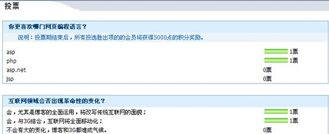
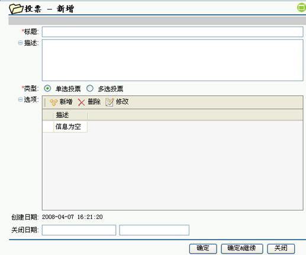
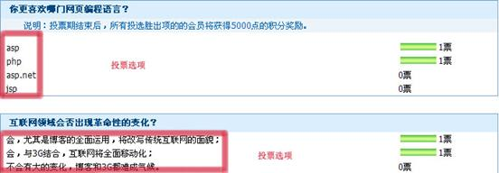
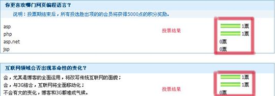

# 

> LiveBOS Studio > 概念手册 > 对象模型 > 对象模板

---

### 投票模板

可以让用户快速地对相关主题以投票形式进行调查，投票选项可单选也可多选。该模板保留字段有标题、描述、类型、选项、创建日期、关闭日期字段。其中“选项”字段引用投票选项模板对象。

投票模板对象展示：

图1.2.18投票模板

新增投票模板：

图1.2.11

#### 投票选项模板

即参与投票主题的相关选项，与投票模板配合使用。该模板保留字段有选项的"描述"字段。通常此模板创建的对象被投票模板对象引用。

投票选项模板对象展示：

图1.2.20投票选项

#### 投票结果模板

即投票模板的结果，对票数进行统计的结果展示。投票结果模板与投票模板配合使用，该模板的保留字段有投票、投票人、结果字段。其中“投票”字段通常引用投票模板对象，“结果”字段通常引用投票结果模板对象。

投票结果模板对象展示：

图1.2.21投票结果
