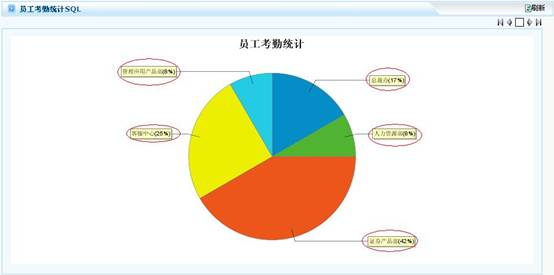
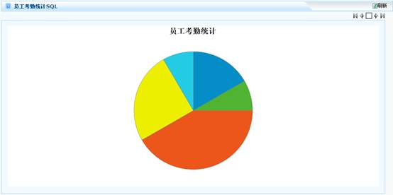
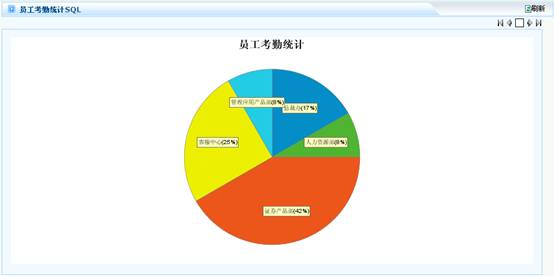
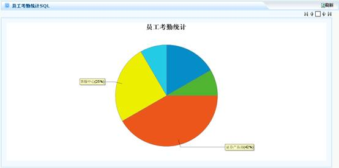
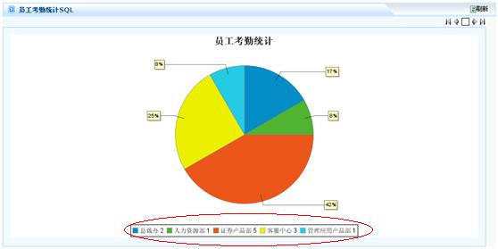
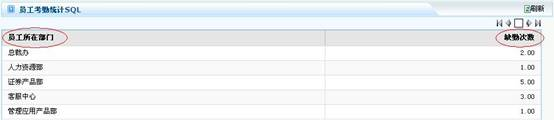
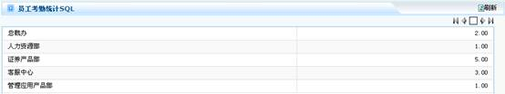
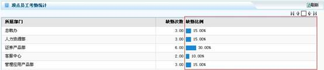
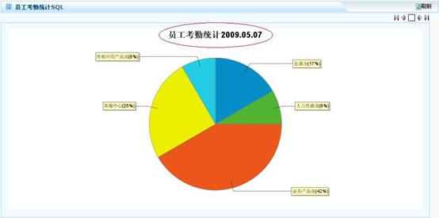
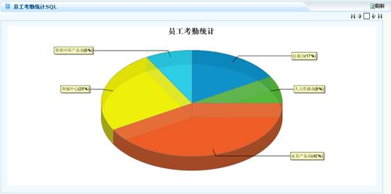

# 

> LiveBOS Studio > 概念手册 > 对象模型 > 对象类型

---

### 图表

#### 图表类型

目前支持的图表类型有饼图、折线图、分类折线图、柱状图、分类柱状图、堆叠柱状图、仪表盘、表格等。

##### 饼图

###### 标签格式

饼图各扇区的说明格式。默认标签格式为：标签名（百分比）

标签格式展示：

###### 标签显示样式

饼图标签的显示样式，有三种：不显示、普通、简单，默认普通。

标签显示样式设置为不显示时展示如下图：

标签显示样式设置为简单时展示如下图：

###### 标签最小百分比值

饼图标签最小百分比的比值，当比值小于这个数的时候，其在饼图上的标签不显示。

设置图中的标签最小百分比值为20，则百分比值小于20的标签不显示，如下图：

###### 图例格式

饼图图例显示的格式，可设置为表达式，默认格式为”标签名=标签值（百分比）”。

如果我们设置图例格式为：标签名标签值，则展示如下图：

##### 折线图

###### 值轴名称

折线图值坐标轴的显示名称

##### 柱状图

###### 值轴名称

柱状图值坐标轴的显示名称

###### 方向

设置柱状值轴的方向是垂直还是水平

##### 分类折线图

###### 值轴名称

分类折线图值坐标轴的显示名称

###### 分类轴名称

分类折线图分类坐标轴的名称

##### 分类柱状图

###### 值轴名称

分类柱状图值坐标轴的显示名称

###### 分类轴名称

分类柱状图分类坐标轴的名称

###### 方向

设置分类柱状值轴的方向是垂直还是水平

##### 堆叠柱状图

###### 值轴名称

堆叠柱状图值坐标轴的显示名称

###### 分类轴名称

堆叠柱状图分类坐标轴的名称

###### 方向

设置堆叠柱状值轴的方向是垂直还是水平

##### 仪表盘

###### 值范围

最小值

仪表盘刻度的最小值

低值

仪表盘刻度的低值

中值

仪表盘刻度的中值

最大值

仪表盘刻度的最大值

###### 颜色

低值颜色

最小值到低值扇区的颜色

中值颜色

低值到中值扇区的颜色

高值颜色

中值到高值扇区的颜色

###### 标签名

低值标签

最小值到低值扇区的标签

中值标签

低值到中值扇区的标签

高值标签

中值到高值扇区的标签

###### 值单位名

显示仪表盘数据值的单位

##### 表格

###### 标签标题

表格的标签列图表

###### 值标题

表格的值行标题

###### 是否显示表格头

是否显示表格的表格头

设置显示表格头：

设置不显示表格头：

###### 值格式

默认为#,###.00，这时取小数点后面两位小数

###### 比例条类型

以柱状图的形式显示表格的数据，有四种类型：不显示、值/合计值、值/最大值、比例值，默认不显示。

将比例条属性设置为比例值，则展现如下图：

###### 比例栏名称

比例栏显示标签。如果未进行设置，则默认显示比例条映射列名，如上图中的”缺勤比例”的标签名。

#### 关系映射

##### 值

映射方式有两种:SQL列名和查询字段显示列。若为SQL列名，则映射SQL语句中值的对应列。若为查询字段显示列，则映射值对应的查询字段。

##### 标签

映射方式有两种:SQL列名和查询字段显示列。若为SQL列名，则映射SQL语句中标签的对应列；若为查询字段显示列，则映射标签对应的查询字段。

##### 分类

映射方式有两种:SQL列名和查询字段显示列。若为SQL列名，则映射SQL语句中分类的对应列；若为查询字段显示列，则映射分类对应的查询字段。

#### 图表公共属性

##### 图表标题

图表显示的标题，可设置为表达式。如设置：”员工考勤统计”+ABS\_TODAY()，展现如下图所示：

##### 图表风格

图表风格有两种：2D和3D，默认为2D效果，也可设置成3D效果（如下图）。

##### 图例位置

只限仪表盘和表格之外的图表对象，设置图例显示的位置，默认为不显示。

##### 图表颜色序列

只限仪表盘和表格之外的图表对象，设置图表显示的颜色。

##### 显示链接

###### 是否显示超链接

图表是否显示超链接，默认为否

###### 超链接URL前缀

图表对象的URL链接前缀

###### 标签参数名

图表对象的标签参数

###### 分组参数

图表对象的分组值

##### 重要数据属性

###### 全记录集输出

与数据记录集的该属性相同

###### 直接查询

访问图表对象时，不用点查询按钮便可查询数据

###### 每页显示记录数

允许设置每页分析的数据记录数，通过多页图表来显示统计数据

###### 参数表单支持局部刷新

参数表单是否进行局部刷新
