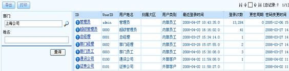
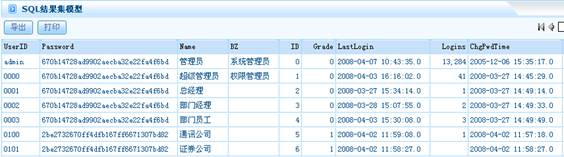

# 

> LiveBOS Studio > 概念手册 > 对象模型 > 对象类型

---

### 数据记录集

数据记录集的作用是存放与对象相关的数据，或者本身就是与数据有关联的对象，如在线用户查询和合同金额查询等等。数据的基本属性用来控制数据的展现、操作、记录的安全性。用户可以通过数据记录集对对象进行查询，并且在存储过程中，可以根据数据库种类的不同而采用不同的存储方式，这样方便了对数据的存储管理。

#### 查询对象

从一个或多个实体对象或视图对象中按照预定义的条件查询数据集，通常查询条件由引用实体、实体之间关系及筛选条件等部分组成。

对对象进行查询，引入一个对象，然后根据该对象的属性进行对象的关系定义和条件设计。

查询对象实例：

图1.1.13查询对象

#### SQL数据集

通过调用普通SQL语句或调用存储过程返回结果集，为创建起来的每一条数据定义SQL语句。并根据数据库的不同而选择不同的存储方式； Oracle数据库支持临时表和游标方式返回结果集。

用户管理的SQL结果集实例：

图1.1.14
SQL数据集

##### 类型

###### 普通SQL语句

使用普通查询SQL语句作为数据集。

###### 存储过程

执行一个存储过程，并通过存储过程返回一个结果集。当数据库是SQL server时，直接在存储过程中编写相应语句（select from等）返回。当数据库为ORACLE时，有两种方式可以返回结果集；一种是通过返回结果集游标，另外一种方式可以通过将数据放入ORACLE临时表中，并返回相应的查询语句。这两种方式可以在返回方式中指定。

###### 分页存储过程

基本同存储过程，但要求存储过程根据传入的对应页号与每页记录数组织好分页的结果集返回。第一个参数固定为记录数统计的出口参数，第二、三个参数分别为页号和每页行数入口参数。

##### 重要属性

###### 数据源

数据源根据系统文件resources.xml中配置的数据源名称来查找对应的数据库。通过设定该属性可以进行跨数据库查询数据。当该属性未设置时则表示当前数据源。

###### 自动分页

仅当语句类型为普通SQL语句或者是ORACEL中用临时表返回的结果集时有效。当勾选上该选项时表示系统将重新根据对应的SQL语句构造出分页查询的SQL语句。

###### 全记录集输出

在查询数据时将全部记录取出，并以分页的方式显示输出。

适用于查询数据较为复杂但量不多的情况；或者当数据集对象作为虚拟对象使用时，需要完整提交整个对象的修改。

###### 辅助对象

标识为内部使用对象，授权时这些对象将不可见。

###### 不作为Portlet使用

不能作为Portlet放置在门户上。

###### 原值字段输出

不对这些字段内容进行格式化。如数据记录集中有构造html标签的字段时，该功能会将html标签字段原样输出。

###### 隐藏列

在展示的时候,这些列不显示,一般用于配合数据集辅助筛选,将一些内部的ID列隐藏。

###### 直接查询

访问数据记录集时，不用点查询按钮便可查询数据。

#### JavaBean数据集

用户从外部引用的JAVA类，用户可以使用自定义的JAVA类做为结果集数据来源，此JAVA类需实现特定的接口。

#### FIX数据集

通过交易服务器接口根据指定或用户自定义的交易码查询结果集。
