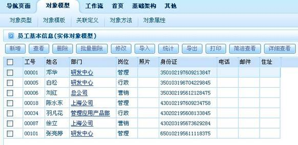
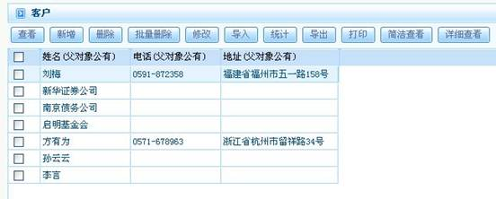
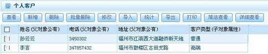
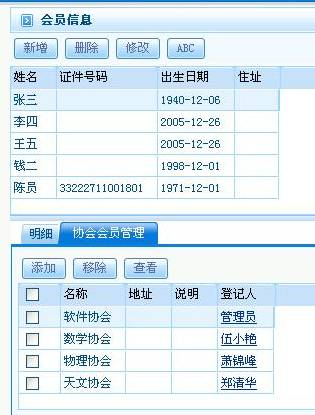
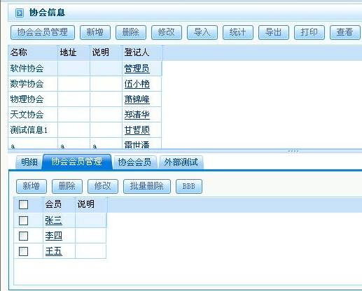
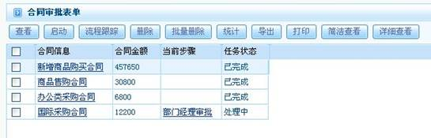
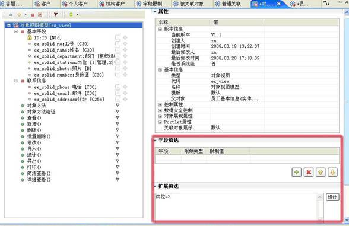
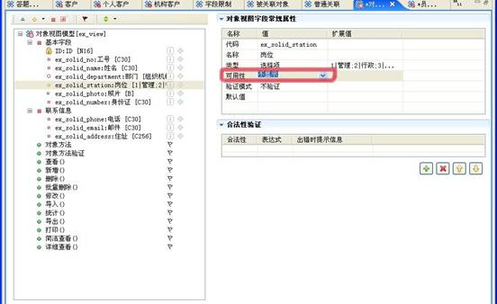
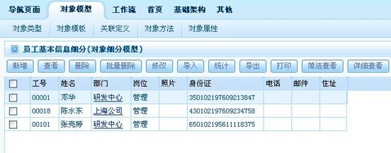
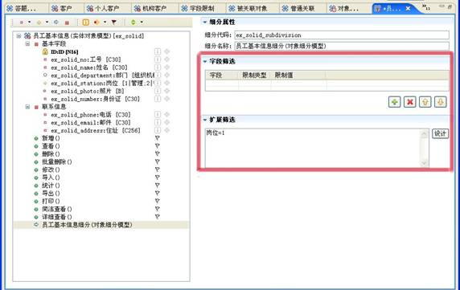

# 

> LiveBOS Studio > 概念手册 > 对象模型 > 对象类型

---

### 实体对象

#### 普通实体

实体对象对应着系统数据库中具体的物理表名。实体对象记载了对目标对象的描述，实体对象中的每一个字段都是对目标对象一个特性的具体描述，通过多个字段的记载，实体对象就可以完整记录下目标对象的所有特征属性。由于实体对象与数据库中的具体表一一对应，所以对实体对象的操作就成为用户在开发模型过程中最重要也是最基础的操作。视图、子对象、内部对象等等高级的修改应用也都要依靠实体对象进行。

实体对象模型实例（员工基本信息）：

图1.1.1员工信息

##### 父对象

一个普通实体对象派生出一个或多个子对象，则此对象称为子对象的父对象（源对象）。

父对象实例展示：

图1.1.2父对象

图1.1.2客户基本信息表即为一父对象。

图1.1.3个人客户

图1.1.4机构客户

如图1.1.3和图1.1.4，“个人客户”与“机构客户”均为“客户”的子对象。由“客户”细分而来，更详细地展示了客户的相关信息。

##### 子对象

在一个源对象基础上通过扩展属性、操作而产生的对象，称为子对象。多个子对象一般用于描述统一类型信息但又有类别差异的信息，如“研发人员”下的“退休人员”信息。因此子对象继承了父对象的所有字段和方法，并可以根据实际情况的需要更具体地定义自己的字段和方法。

子对象实例详见父对象实例展示（图1.1.2、图1.1.3和图1.1.4）。

##### 多对多对象

多对多对象，本质上也是一个实体，适用于对象之间的关联是一种N-N 方式的。比如：用户和角色之间，即一个用户可以拥有多个角色，一个角色可以分配给多个用户。这种关联方式的场合则适合通过多对多的方式来实现，同时，多对多对象也是存放这两个多对多关系的一个容器。

多对多对象实例展示：例如，一个会员可以同属于多个协会，而一个协会中又可包含多个会员。其会员与协会即为多对多对象。

图1.1.5

图1.1.6多对多对象

#### 表格模板对象

表格模板对象，普通实体对象的一种，可以对其数据进行维护。并可被多个对象以表格方式引用，其数据可全部或经筛选后预填至表格中（通过建立表格模板视图或通过字段限制，实现预设的数据根据相关字段变化而变化。）

存放表格模板数据的数据表为模板对象表名，而引用表格模板字段的数据表则为[对象名\_字段名\_表格模板名]。

#### 工作流表单

工作流表单是工作流流转过程中一个主要的信息载体,可以看作是LiveBOS中的实体对象。它是供工作流流程使用的对象，与工作流流程相关。比如一个合同审批表单。

工作流表单模型（合同审批表单展示）：

图1.1.7合同审批表单

#### 对象视图

对象视图不同于数据库中的视图概念，它是在实体对象基础上进行记录的筛选，在视图上，可以定义自己特定的操作。

对象视图模型展示：对象视图有自身的属性，如可以定制显示字段、设置默认值、字段合法性，可以有自身的方法。图中设置视图筛选条件：岗位=2，即筛选出行政岗位的员工，另外视图隐藏主体对象的一些字段信息：照片、身份证、住址。

图1.1.8

当可用性选“不显示”时，在视图模型上即不显示其相关属性，这也是对象视图所特有的。如图1.1.9：

图1.1.9

设置完以上选项，其页面展示如图1.1.10：

图1.1.10对象视图

#### 对象细分

对象细分，按照预先设定的规则筛选的对象记录集。在任何引用对象的地方，都可以用对象细分来代替，从而将对象引用范围缩小到目标范围之内。

对象细分必须依附于一个源对象建立，这个源对象可以是普通的实体（从属对象除外），细分适用于只需要简单的一些记录分组筛选的场合。

实体细分模型--员工信息细分：（从员工基本信息中按照岗位细分出）

图1.1.11对象细分

图1.1.12设置了对象细分的筛选条件：岗位=1，即筛选出管理岗位的员工。

图1.1.12
