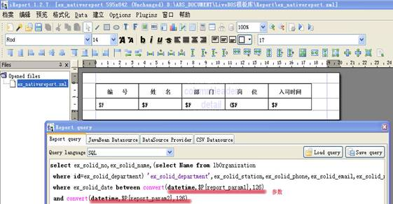
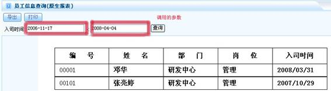

# 

> LiveBOS Studio > 概念手册 > 对象模型 > 对象类型

---

### 外部资源

#### 原生报表

由报表本身获取数据。系统提供参数值传入功能。

原生报表采用的设计工具：ireport

图1.1.15

原生报表由SQL语句通过本身获取数据。

原生报表展示页面：

图1.1.16原生报表

#### JSP资源

用户自定义的JSP页面。

#### SQL存储过程

保存用户SQL存储过程。

#### 页面导航器

页面导航设计器是一个简单的页面操作流程的设计工具，它所定义出来的页面流程并非是严格意义上的工作流程，只是方便最终用户完成一项任务时，可以更清晰地知道各个任务的功能以及任务的顺序。比如一个设备的管理流程，里面包含了很多的小功能，但是这些小功能模块之间是松散的关系，没有像传统的工作流定义的、有着严格流程走向的定义。

注意，它只是一个简单的页面导航，通过页面上的连接，快速进入到相关的对象中进行操作。
