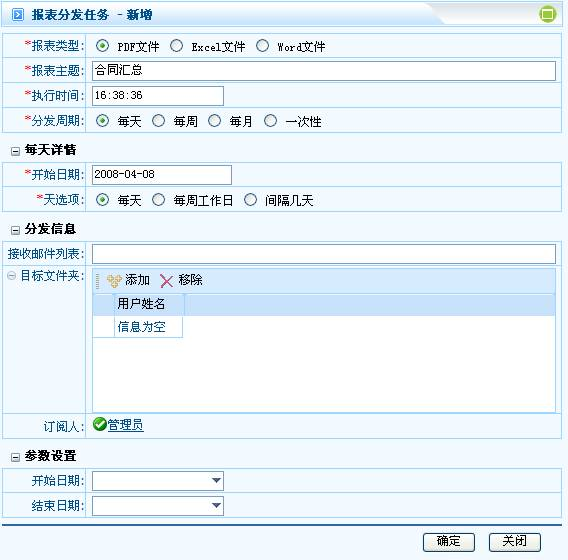

# 

> LiveBOS Studio > 概念手册 > 报表

---

## 报表操作

### 1.1.1.打印

系统支持两种方式的报表打印。一种是直接调用一个JAVA APPLET进行打印（要求客户端安装JDK1.4以上）；另一种方式可使用PDF阅读器来打印（要求客户端安装相应的PDF阅读器，如Adobe
Reader）。打印方式由系统参数system.print.engine决定。

### 1.1.2.导出

将报表数据导出成文件，可选择PDF、Excel和RTF等格式。

### 1.1.3.定时分发

设定一个或多个计划任务能定时执行报表打印，并发送到指定邮箱和用户文件夹。

图3.2.1报表分发
