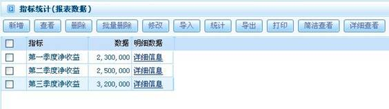

# 

> LiveBOS Studio > 概念手册 > 报表

---

## 报表类型

### 1.1.1.原生报表

由报表本身获取数据，系统提供参数值传入功能的报表。

### 1.1.2.多类型报表

为报表指定一个报表类型的参数，参数名为：@@REPORT\_SUBNAME。当该参数设值时系统调用报表名\_参数名.xml的报表格式文件来输出报表。

### 1.1.3.普通报表

即一般的报表文件。

普通报表数据展示：

图3.1.1普通报表
