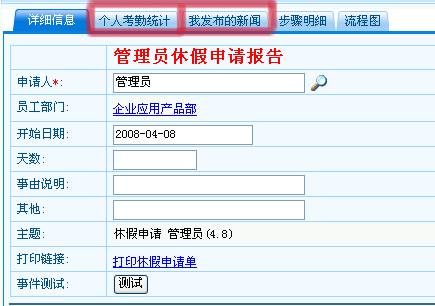

# 

> LiveBOS Studio > 概念手册 > 工作流

---

## 流程表单

工作流表单是工作流流转过程中一个主要的信息载体,可以看作是LiveBOS中的实体对象.比如一个休假申请单。

### 1.1.1.字段设定

#### 可见性

设定该字段在当前活动中是否可见。

#### 可编辑性

设定当前活动中字段是否禁止编辑。

#### 摘要列

作为当前活动的一个主题信息字段,用来方便流程监控的时候查看当前流程的情况。

### 1.1.2.关联信息设置

根据工作流表单设定的关联信息可在当前活动中指定哪些关联信息可显示。

图2.4.1

### 1.1.3.对象操作设置

根据工作流表单中指定的可在流程中显示的允许流程引用的用户方法来决定哪些操作可显示。
