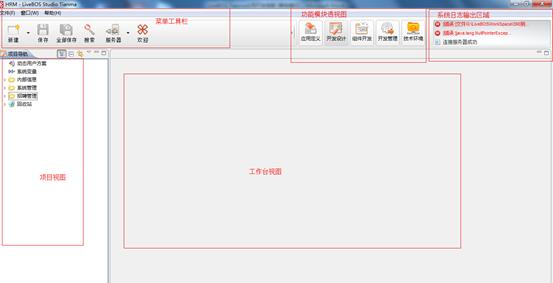

# 开始一个新项目

> LiveBOS Studio > 用户手册

---

# 3开始一个新项目

LiveBOS Studio设计器的工作区与通用的应用程序工作区类似，主要由菜单工具栏、项目视图、工作台视图、功能模块透视图和系统日志输出区域组成，见下图。

图工作区

【栏位说明】：LiveBOS Studio的界面分为五个部分，菜单工具栏部分、项目视图部分、工作台视图部分、功能模块透视图部分和系统日志输出区域。

l菜单工具栏：菜单栏提供了LiveBOS Studio自定义的打开项目、新建项目、切换项目、刷新项目、导入导出、服务端日志输出等功能；工具栏按钮的排列如下：新建、保存、全部保存、搜索、LiveBOS应用服务器连接、欢迎等。这些功能我们会在之后的章节中详细介绍，导入导出功能请查看《导入导出功能》章节内容。

l项目视图：显示当前项目下所有的包，以及动态用户方案、系统变量、回收站等等。点击这些包可以看到里面包含的内容，包括下级包节点以及包里面所有的对象信息。点击动态用户方案、系统变量等则进入相应的设计页面。下面列出几个项目视图自带的小工具：

1.按对象逻辑展示：点击后主对象与衍生对象（如视图、表格、子对象）之间显示层级关联关系。

2.全部折叠：点击后项目中所有的树形节点都收缩。

3.与编辑器链接接：点击后编辑区内选中对象标签，系统会自动在树形节点中找到对应节点。

4.视图菜单：目前只有“使用编辑器链接”这一项，点击可以取消或者选中与编辑器的链接。

5.最小化：项目导航视图最小化。

6.  最大化：项目导航视图最大化。

l工作台视图：显示各个工作台节点的编辑页面，我们所做的大部分工作都要在这个视图上进行。

l功能模块透视图：包含应用定义、开发设计、组件开发、开发管理、技术环境模块，方便模块间的切换。

l系统日志输出区域：显示系统操作日志，方便用户直接双击查看。
