# 应用定义

> LiveBOS Studio > 用户手册 > 业务建模设计

---

## 4.1应用定义

### 4.1.1数据字典设计

数据字典是一组自定义属性表，对象模型中选择项、多值选择项、位与选择项等类型将使用数据字典中定义的条目。

进入“应用定义”透视图，双击LiveBOS Studio左边的工作台节点“数据字典”进入数据字典编辑器（见下图）：

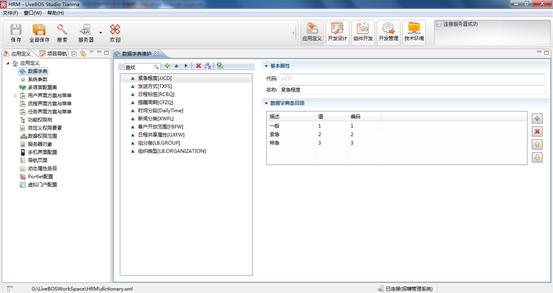

图4.1.1数据字典设计界面

【栏目说明】

l查找：当数据字典节点中有过多条目时，输入查询条件后，就可以达到快速查找的效果。这里的查询条件可以是条目名称，也可以是条目代码。

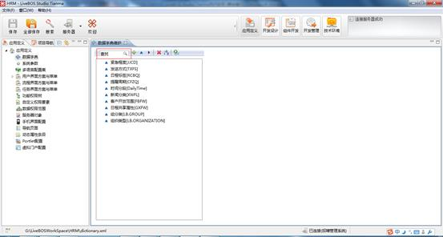

图4.1.2数据字典中的查询条件

比如输入查询条件“分”，就可以得到数据字典中所有条目代码或者是条目名称包含“分”的条目：

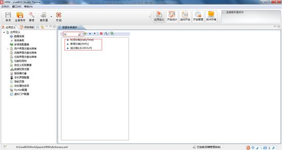

图4.1.3数据字典查询结果

l新建分组：新建数据字典条目分组，一个分组下可以有若干个数据字典条目。

l新建数据字典普通条目：点击后输入相应数据可以生成一条新的数据字典记录。

l新建数据字典位与条目：点击后输入相应数据可以生成一条新的位与条目，位与条目中的属性描述是按位与顺序排列的，而不是按普通条目那样的顺序排列。

l删除：删除选定的数据字典条目。

l排序：对列出的数据字典条目根据条目的名称进行排序。

l数据提交：提交数据字典条目到数据库。

### 4.1.2系统参数设计

LiveBOS Studio中的系统参数设计工具可以配置和修改系统运行控制的参数。

进入系统参数设计编辑器，在左侧空白区域右击，选择“新建系统参数”，就可以新建一个由用户自己定义的系统参数。在新建系统参数的时候，LiveBOS Studio会自动生成一个参数名称，同时默认参数类型为“普通参数”，用户可根据需要自定义参数名称和参数类型。除此之外，用户可以通过点击表格左上角的“新建系统参数”按钮来达到同样的效果。

用户在新建系统参数时可以修改参数名称，参数类型，并为参数赋值；新建完系统参数后可以修改参数类型，参数值以及为参数添加详细的注释。

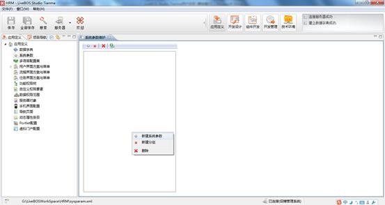

图4.1.4新建一个系统参数

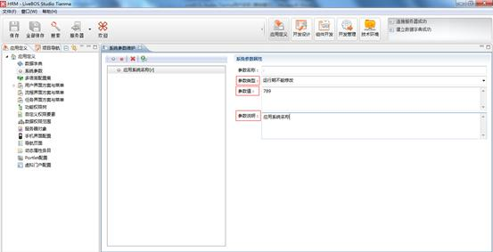

图4.1.5对系统参数进行修改

### 4.1.3多语言配置集

使用多语言配置前，需要先开启国际化多语言配置的开关。进入“技术环境”透视图，选择国际化配置，在打开的窗口中勾选”开启国际化”。语言种类的配置，则需要在”语言配置”窗口中进行。

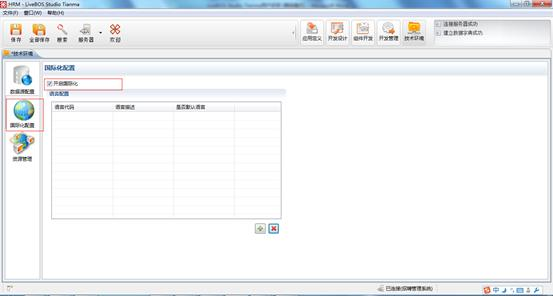

图4.1.6开启国际化语言配置

在语言配置窗口,添加语言种类,如我们添加一种常用的语言种”英语”,点击”确定”,如下:

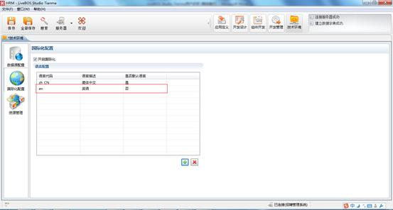

图4.1.7 添加语言种类

多语言配置的模块主要包括对象设计、数据字典设计、菜单设计以及工作流设计等。对象多语言配置在“应用定义”透视图——多语言配置集模块，设计界面如图:

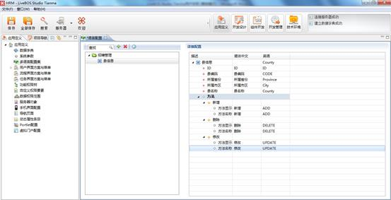

图4.1.8 对象多语言配置界面

在如上图所示的配置界面中,我们可以定义对象字段,对象方法,对象关联等多语言配置信息。

【操作说明】：

******添加对象多语言配置**：将当前项目中需要进行国际化配置的对象节点添加到语言配置窗口。

******删除选定的资源集**：删除选中对象语言配置节点。

数据字典多语言配置界面如图：

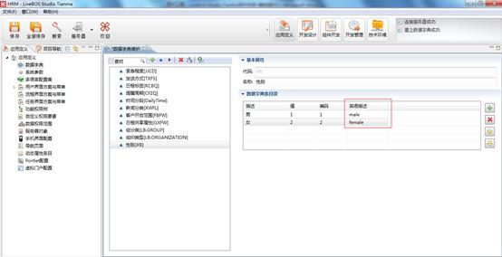

图4.1.9 数据字典多语言配置界面

菜单多语言配置界面如图：

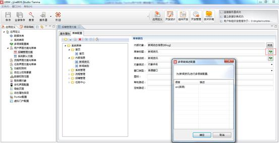

图4.1.10 菜单方案多语言配置界面

工作流多语言配置包括工作流描述信息，分类，知会面板等多语言配置选项。以流程描述为例，多语言配置如图所示：

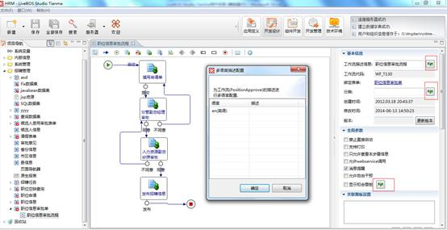

图4.1.11 工作流多语言配置界面

另外，多语言配置还支持手机菜单、导航页面、Portlet配置等模块的国际化配置,都可以在各模块中找到相应的配置项。

### 4.1.4多语言预览

各模块设置完成后，提交，以IE浏览器为例，打开IE-工具-Internet选项-语言，将要浏览的语言添加并移至语言第一项，刷新浏览器缓存后，即可进入应用系统，进行对象浏览等操作。

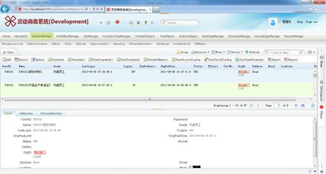

图4.1.12 多语言预览界面

### 4.1.5用户界面方案与菜单

LiveBOS Studio提供了为不同角色类型的用户定制不同的界面菜单方案，即不同角色类型的用户可以看到自己个性化的界面。用户界面方案与菜单，集成了用户界面方案和菜单方案2个功能的设计模块，为用户定制个性化界面展现提供了更为便捷的操作方式。

#### 4.1.5.1界面方案设计

选中”用户界面方案与菜单”节点单击右键，选择“新建用户界面方案与菜单”，在弹出的对话框（见下图）中设置新增用户界面方案的名称和代码，单击确定即可。

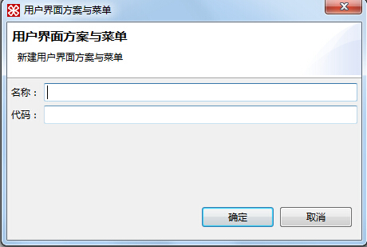

图4.1.13用户界面方案新建对话框

这时，我们会发现“用户界面方案与菜单”节点下多了一个节点“界面方案1”（见下图）：

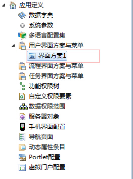

图4.1.14多了一个新增节点

双击该节点，进入用户界面方案编辑页面（见下图）：

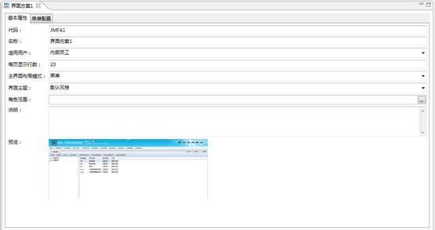

图4.1.15用户界面方案编辑页面

对于某个具体定制的界面方案与菜单，可对其进行提交、删除、设为系统界面方案等。可以根据需要提交界面方案菜单，删除冗余界面方案菜单等。

**界面方案编辑器工具栏说明**

l基本属性

**代码**：界面方案标识。

**名称**：界面方案描述信息。

**适用用户**：适用的用户类型，有三种：不限、内部员工（默认）、外部用户。

**每页显示行数**：每页显示记录的行数。

**主界面布局模式**：界面菜单布局展现模式，分别有普通菜单、树形菜单、outlook栏、标签+菜单、标签+树形菜单、标签+outlook栏、多列菜单和标签+多列菜单等展现模式。

**界面主题**：设置界面方案的背景显示样式与风格。分别有默认风格、银灰风格、商务风格、红色风格、绿色风格、W8风格等等。

**角色范围：**设置界面方案适用的角色范围。

**说明：**界面方案的详细信息描述。

**预览：**不同的主界面布局模式以及不同的界面主题下，界面方案的不同展现。

【注】：普通的用户界面方案也可以设置为系统默认方案，选中节点单击右键，在弹出的操作菜单列表中选择“设为系统界面方案”即可。

#### 4.1.5.2菜单方案设计

LiveBOS Studio中的菜单设计工具是定义业务系统的导航菜单工具，点击左侧工作台节点“用户界面方案与菜单”，展开后选择您想要打开的界面方案，双击打开，在打开页面中，进入 “菜单配置”，即可进入菜单编辑器编辑界面，如下图：

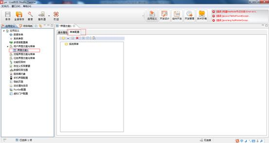

图4.1.16系统菜单编辑器

**系统菜单编辑器工具栏说明**

l新增菜单夹：点击后出现如下图，用户可以在这里定义菜单夹的名称，并在这个目录下增加新建的菜单。

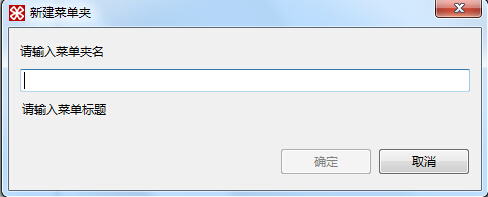

图4.1.17增加菜单夹

l新增分割符：增加菜单的分割符，是为了使菜单中的各项更加清晰，而加入菜单的分隔符号，在菜单中显示为一条短线，作用和普通Windows的菜单中的分隔符号相似。

l新建菜单项：点击后出现如下图，用户根据需要选定需要的对象，也可以选择定制方法，双击或点确定后选中并添加到菜单编辑器中，用户可以根据需要进行对象和定制方法的筛选。

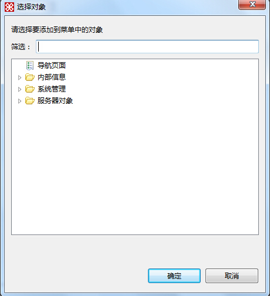

图4.1.18新增菜单项

备注：菜单项新增时，支持添加服务端对象，如首页、虚拟门户、工作流系统等，这些对象在添加过程中，要先通过**服务器对象配置**（见4.10章节）将他们预先加载至当前项目视图，然后在菜单项选择窗口的**服务器对象**节点下找到他们并选择添加至菜单中。

l删除菜单：删除无用的菜单。

l全部展开：将所有菜单展开。

l全部缩起：将所有菜单缩起。

l****菜单复制：可以从当前项目已经配置好的其他界面方案中复制菜单到当前界面方案。

表4.1菜单节点详细信息说明

|  |  |  |
| --- | --- | --- |
| 菜单信息 | 内部对象 | 选择一个系统内的对象作为菜单展示的对象 |
| 菜单标题 | 菜单显示的标题 |
| 菜单说明 | 即这个菜单一些说明信息，当鼠标移动到这个对象上的时候，将显示这个菜单说明信息。 |
| 对象描述 | 设置加入对象的标题展现，可选的类型包括对象命名、菜单标题、菜单说明。对象命名：即对象标题显示对象名称。菜单标题：对象标题显示该菜单设置的菜单标题。菜单说明：对象标题显示该菜单设置的菜单说明。 |
| 窗口类型 | 即选中这个菜单，展示这个对象的时候，是采用系统的默认方式，还是弹出一个新窗口，或者是弹出一个对话框。 |
| 图标 | 为生成的菜单指定一个图标，在这里记录图标的访问路径 |
| 帮助路径 | 即各对象帮助文件（页面文件）的路径，注意采用相对路径的方式.在设置帮助路径之前需要在系统参数中设置**HELP\_DIR**参数，参数的值为帮助文件的根路径，如**/Help/File**；如果帮助文件的文件名为**tuerhelp.html**，则帮助路径为：/**tuerhelp.html**。 |
| 定制路径 | 在定制操作时使用这个定制路径 |

### 4.1.6流程界面方案与菜单

LiveBOS Studio提供了为不同角色类型的用户定制不同的流程界面菜单方案，即不同角色类型的用户可以看到自己个性化的流程菜单界面。流程界面方案与菜单，集成了流程界面方案和菜单方案2个功能的设计模块，为用户定制个性化流程中心界面展现提供了更为便捷的操作方式。

#### 4.1.6.1流程界面方案设计

选中”流程界面方案与菜单”节点单击右键，选择“新建流程界面方案与菜单”，在弹出的对话框（见下图）中设置新增流程界面方案的名称和代码，单击确定即可。

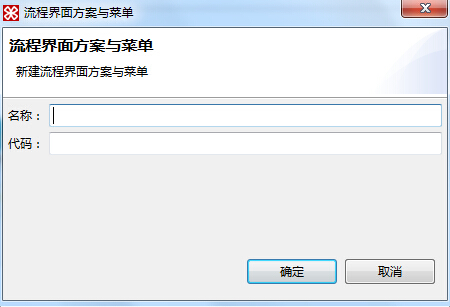

图4.1.19流程界面方案新建对话框

这时，我们会发现“流程界面方案与菜单”节点下多了一个节点“招聘流程方案”（见下图）：

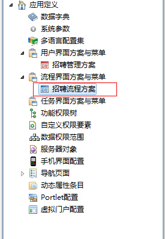

图4.1.20多了一个新增节点

双击该节点，进入流程界面方案编辑页面（见下图）：

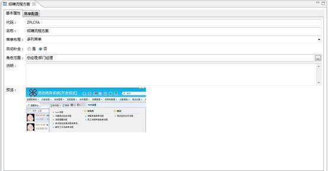

图4.1.21流程界面方案编辑页面

对于某个具体定制的流程界面方案与菜单，可对其进行提交、删除等。可以根据需要提交流程界面方案菜单，删除冗余流程界面方案菜单等。

**流程界面方案编辑器工具栏说明**

l基本属性

**代码**：流程界面方案标识。

**名称**：流程界面方案描述信息。

**菜单布局**：流程界面菜单布局展现模式，包含普通菜单、多列菜单模式。

**自动补全**：如果选择为“是”，则流程界面菜单则会自动补全用户有权限但是没有配置在流程菜单中的流程；如果选择为“否”，则流程界面菜单只显示用户有权限且配置在流程菜单中的流程。

**角色范围：**设置流程界面方案适用的角色范围。

**说明：**流程界面方案的详细信息描述。

**预览：**不同的菜单布局模式下，流程界面方案的不同展现。

#### 4.1.6.2流程菜单方案设计

LiveBOS Studio中的流程菜单设计工具是定义业务系统的流程菜单工具，点击左侧工作台节点“流程界面方案与菜单”，展开后选择您想要打开的流程界面方案，双击打开，在打开页面中，进入 “菜单配置”，即可进入流程菜单编辑器编辑界面，如下图：

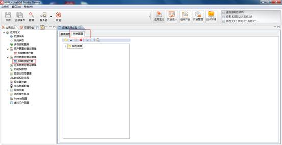

图4.1.22流程菜单编辑器

**【注】流程菜单编辑器工具栏各个工具的用法跟用户界面方案与菜单中的系统菜单编辑器工具栏的使用基本类似，这里不再一一赘述，唯一不同的是，系统菜单在新增菜单项的时候，可以选择系统中不同的业务对象，而流程菜单在新增菜单项的时候，只能选择系统中的流程定义。**

流程界面菜单配置完成之后，主要在流程中心展现，具体展现如下图所示：

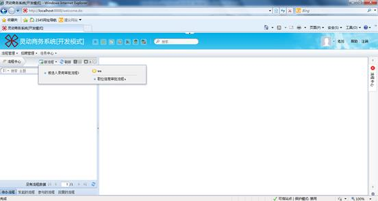图4.1.23流程菜单展现

### 4.1.7任务界面方案与菜单

LiveBOS Studio提供了为不同角色类型的用户定制不同的任务界面菜单方案，即不同角色类型的用户可以看到自己个性化的任务菜单界面。任务界面方案与菜单，集成了任务界面方案和菜单方案2个功能的设计模块，为用户定制个性化任务中心界面展现提供了更为便捷的操作方式。

#### 4.1.7.1任务界面方案设计

选中”任务界面方案与菜单”节点单击右键，选择“新建任务界面方案与菜单”，在弹出的对话框（见下图）中设置新增任务界面方案的名称和代码，单击确定即可。

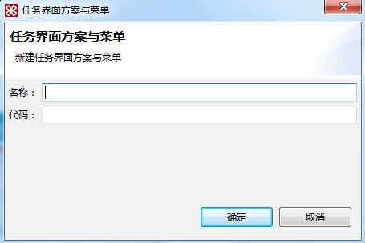

图4.1.24任务界面方案新建对话框

这时，我们会发现“任务界面方案与菜单”节点下多了一个节点“招聘任务”（见下图）：

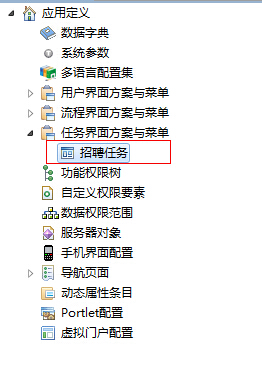

图4.1.25多了一个新增节点

双击该节点，进入任务界面方案编辑页面（见下图）：

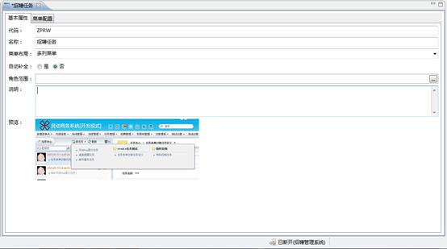

图4.1.26任务界面方案编辑页面

对于某个具体定制的任务界面方案与菜单，可对其进行提交、删除等。可以根据需要提交任务界面方案菜单，删除冗余任务界面方案菜单等。

**【注】任务界面方案编辑器工具栏与流程界面方案编辑器工具栏基本类似，这里就不再一一赘述，具体可参考流程界面方案设计。**

#### 4.1.7.2任务菜单方案设计

LiveBOS Studio中的任务菜单设计工具是定义业务系统的任务菜单工具，点击左侧工作台节点“任务界面方案与菜单”，展开后选择您想要打开的任务界面方案，双击打开，在打开页面中，进入 “菜单配置”，即可进入任务菜单编辑器编辑界面，如下图：

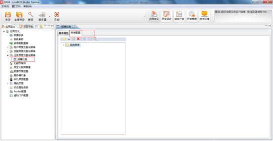

图4.1.27任务菜单编辑器

**【注】任务菜单编辑器工具栏各个工具的用法跟用户界面方案与菜单中的系统菜单编辑器工具栏的使用基本类似，这里不再一一赘述，唯一不同的是，系统菜单在新增菜单项的时候，可以选择系统中不同的业务对象，而任务菜单在新增菜单项的时候，只能选择系统中的任务定义。**

任务界面菜单配置完成之后，主要在任务中心展现，具体展现如下图所示：

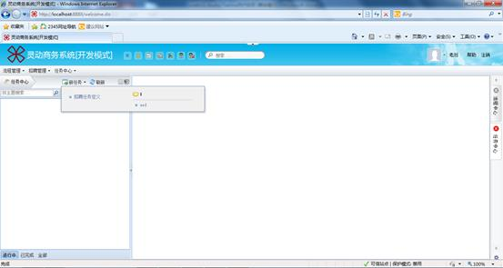

图4.1.28任务菜单展现

### 4.1.8功能权限树设计

#### 4.1.8.1说明

LiveBOS Studio从3.5RC3以后版本，使用权限功能树模块进行权限的维护与管理，这样管理员对于权限点的定义与维护比较清晰和直观。

功能权限树的生成方式有2种，一种是从菜单配置转换自动生成，一种是开发人员逐个进行定义。一般推荐选择第一种生成方式，这样可以根据当前系统菜单方案快速生成。

选中功能权限树节点，双击打开，进入功能权限树编辑器，选择工具栏上面的**从菜单配置转换**，如图：

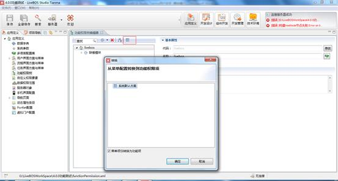

图4.1.29从菜单配置转换

选择要进行转换的用户界面菜单后，点击确定，系统会弹出覆盖原有功能权限树的提示对话框，点击**确定**，如图：

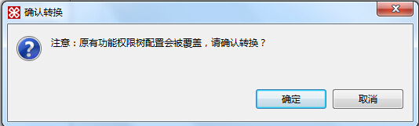

图4.1.30 继续操作确认对话框

系统会提示转换成功，如图：

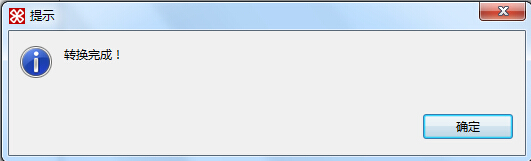

图4.1.31 功能权限树成功生成

点击确定后，工作区中展示功能权限树设计界面，如图：

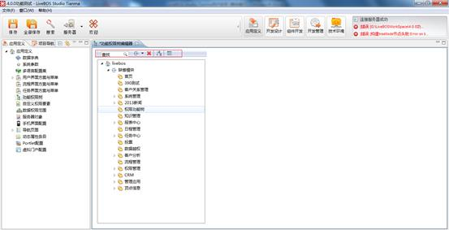

图4.1.32功能权限树设计界面

【栏目说明】

l新增模块：点击后输入模块的代码和名称可以生成一个新的模块节点。

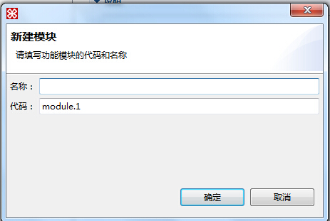

图4.1.33 新建模块

l新增功能包：选中所属模块节点，点击后输入功能包的代码和名称可以生成一个新的功能包节点。

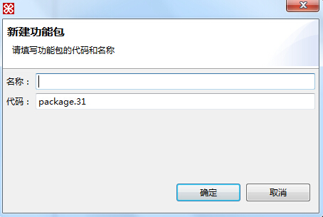

图4.1.34 新建功能包

l新增功能组件：选中所属功能包节点，点击后选择当前项目中要添加的业务对象，输入功能组件的代码和名称，生成一个新的功能组件节点。

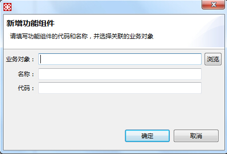

图4.1.35 新建功能组件

l新增功能项：选中所属功能包或功能组件节点，点击后输入功能项的代码和名称生成一个新的功能项节点。

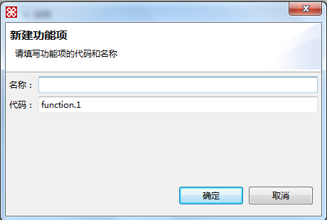

图4.1.36 新建功能项

l删除：删除选定的节点。

l排序：对当前列出的所有类型的节点根据节点名称进行排序。

l查找：当功能权限树节点过多时，查找可以达到快速查找并定位节点的效果。

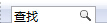

图4.1.37 输入查找条件

在搜索框输入查找条件，就可以得到功能权限树中所有代码或者名称中包含查找条件的节点：

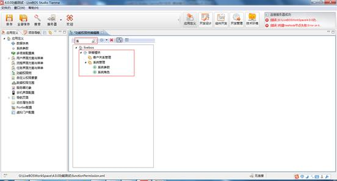

图4.1.38 查询结果列表

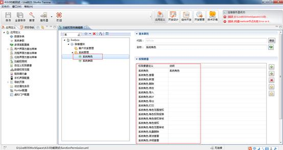

图4.1.39 定位功能权限树节点

#### 4.1.8.2权限要素设计

功能权限树管理模式下，功能项是最小的管理因子。功能项是由若干完成某个特定功能的权限要素组成的集合。权限要素则是完成某个特定功能所需的操作（如新增/修改/删除）。

如本例中，我们为职位申请的功能项设计权限要素。选中职位申请的功能项节点，可以看到右侧属性设计区的权限要素设计窗口，如图：

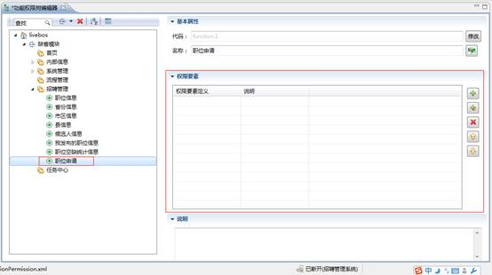

图4.1.40 权限要素设计窗口

【栏目说明】

l添加权限要素：为当前功能项添加所需操作定义。

点击后，弹出窗口中选中要添加的操作，如选中新增/修改/删除：

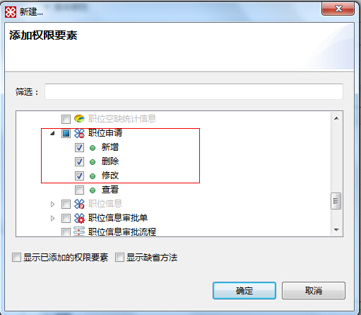

图4.1.41 新建权限要素

点击确定，权限要素添加成功，如图：

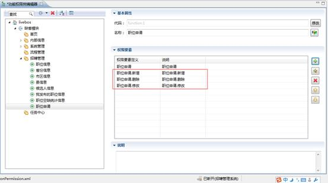

图4.1.42 添加完成后的权限要素列表

l添加自定义权限要素：从自定义权限要素列表中获取权限要素，并选择添加到当前功能项。

点击后，弹出自定义权限要素选择窗口，列出已有的自定义权限要素。

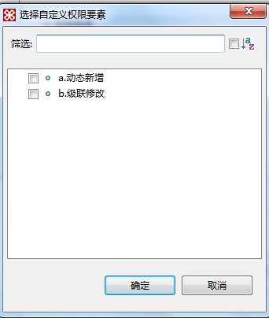

图4.1.43 自定义权限要素选择窗口

选中后点击**确定**，自定义权限要素添加成功。

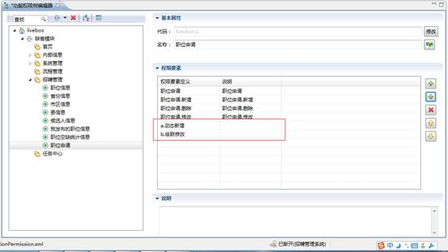

图4.1.44 自定义权限要素添加成功

l删除权限要素：删除选中的权限要素。

l|上移|下移权限要素：通过上移|下移操作调整权限要素列表的位置。

### 4.1.9自定义权限要素

LiveBOS Studio不仅支持本地对象的方法权限要素的添加，还支持自定义功能权限要素进行权限控制。该模块配合功能权限树的设计使用。

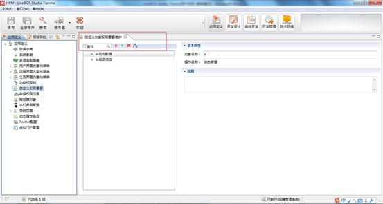

图4.1.45 自定义功能权限要素设计窗口

【栏目说明】

l查找：当权限要素条目过多时，输入查询条件查找可以达到快速查找并定位节点的效果。

l新建分组：分组的用处是有序地管理权限要素条目，可以将权限要素条目分别归类到不同的组中，方便用户对自定义权限要素条目的管理。点击后输入分组名生成一个新的分组节点。

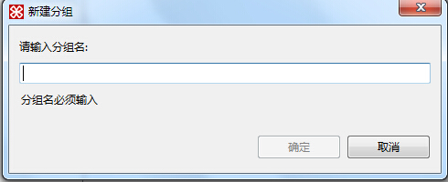

图4.1.46 新建权限要素分组

l新建权限要素：点击后输入权限要素的对象名称和操作名称生成一个新的权限要素条目。

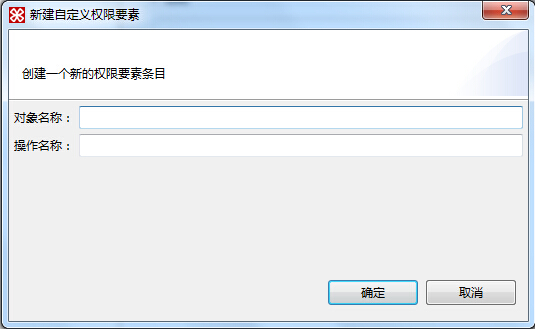

图4.1.47 新建自定义权限要素

l删除：删除选定的分组节点或权限要素节点。

l排序：对当前列出的所有类型的节点根据节点名称进行排序。

### 4.1.10数据权限范围

LiveBOS Studio数据权限范围设计工具是定义业务系统的数据范围因子，当定义完这些因子，可以在对象建模过程中使用这些因子为对象属性设定访问限制，并在业务系统数据权限授权时针对这些因子为用户或角色进行数据权限控制。

双击左边工作台节点中的“数据权限范围”节点进入数据范围设计界面，数据权限范围设计器菜单十分简洁，只有“新建”、“删除”、“上移”、“下移”、”提交”五个按钮（见下图）。

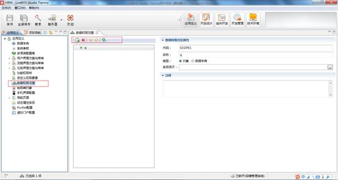

图4.1.48数据范围设计界面

点击“新建”按钮或者点击鼠标右键弹出的新建标签，将弹出新建数据权限范围对话框，如下图：

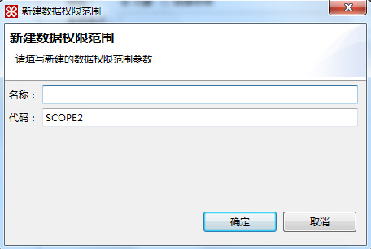

图4.1.49新建数据权限范围

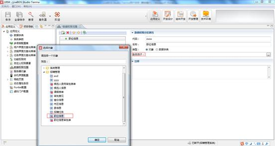

图4.1.50选择数据范围条目因子

对于建好的数据范围因子，可通过上移、下移操作调整上下位置。

**栏目说明**

l代码：数据范围信息在后台的识别代码，系统在新建时会自动生成以“SCOPE”开头的代码名称，并根据已有的数据范围条目进行重名判断确保不存在重名条目，默认为从SCOPE1,SCOPE2,SCOPE3….顺序累加。

l名称：对数据范围条目的描述。

l类型：标明要建立的数据范围是属于对象的还是属于数据字典条目。

l条目因子：数据范围的因子，在本例中，我们在类型里选择“对象”，然后在项目信息包里选择“职位信息”，就建立了一个基于“职位信息”对象的数据范围条目因子。

l注释：为数据范围条目添加注释，方便用户理解。

### 4.1.11服务器对象

#### 4.1.11.1说明

LiveBOS Studio在进行菜单编辑和功能权限树的设计时，对象节点信息不仅可以从本地xml文件中获取，还支持从指定服务器中获取，此时就需要一个辅助的模块支持从服务器中获取指定对象信息了，**服务器对象**模块可以实现以上需求。

双击左侧服务器对象节点，打开服务器对象配置编辑页面，如图：

图4.1.51 服务器对象配置设计窗口

此时服务器对象配置编辑窗口展现的是系统默认的服务器对象。

【栏目说明】

l新增包：点击后输入包名生成一个新的包节点。

图4.1.52 新建包

l新增服务器对象：点击后输入服务器对象的代码和名称生成一个新的服务器对象节点。

图4.1.53 新建服务器对象

l导入服务器对象：主要用于快速获取服务器对象信息。

点击后，在弹出窗口中选择要连接的服务器，如图：

图4.1.54 选择要连接的应用服务器

点击确定后，随后弹出的窗口中将会展现服务端对象列表，如图：

图4.1.55 服务器对象列表

点击**确定**，系统会弹出导入覆盖确认对话框，如图：

图4.1.56服务器对象导入确认对话框

如上图所示，选择**确定**后，服务器的对象节点将会全部覆盖当前服务器对象配置内容。

删除：删除选定的分组节点或服务器对象节点。

#### 4.1.11.2服务器对象使用方法

如前所述，服务器对象配置模块主要用于用户界面与菜单方案的菜单编辑和功能权限树的设计，下面将简单介绍服务器对象配置模块的使用方法。

1．打开用户界面与菜单方案的菜单编辑页面，点击新增菜单项，弹出窗口如图：

图4.1.57菜单项选择窗口的服务器对象节点

如上图所示，服务器对象节点下的包和对象信息即是从服务器对象配置中读取的数据。选中要添加的服务端对象节点，将其作为菜单项加入到相应的菜单节点。

2．打开功能权限树编辑窗口，点击**新建功能组件**，弹出窗口中选择业务对象，如图：

图4.1.58 功能组件选择窗口的服务器对象节点

如上图所示，服务器对象节点下的包和对象信息即是从服务器对象配置中读取的数据。选中要添加的服务器对象节点，将其作为功能组件加入到功能权限树节点中。

3．在权限功能树的权限要素设计框中，点击**添加权限要素**，弹出窗口如图：

图4.1.59 权限要素添加窗口的服务器对象节点

如上图所示，服务器对象节点下的包和对象信息即是从服务器对象配置中读取的数据。选中要添加的服务器对象节点，将其作为权限要素加入到权限要素定义窗口中。

### 4.1.12手机界面配置

LiveBOS Studio提供手机浏览查看对象信息的功能，即用户可以通过手机查看指定的对象信息。手机可浏览的对象目前可支持不同对象的浏览，包括流程中心、任务中心、普通的实体对象、虚拟对象、数据集、视图和细分对象等等。

双击左侧**手机界面配置**节点，进入手机界面配置编辑器页面。添加手机浏览对象，可以通过编辑页面的按钮来实现。在弹出的对话框（见下图）中选择要添加的对象，单击确定即可。

图4.1.60添加手机浏览对象

在手机界面配置编辑器中就会出现新增的节点，选中新增的对象节点（见下图）：

图4.1.61手机界面配置编辑页面

**栏目说明**

l基本属性

**代码：**对象的标识代码。

**显示名称**：对象的描述信息。

**页面风格**：对象在手机中展现页面的风格。当前支持两种页面风格，列表和表格。

**每页显示行数**：手机展示界面列表中每页的记录行数。

**显示图标配置：**列出多种对象显示图标供选择。

l显示的字段：对象在手机中的展现字段，可通过右下方的新建按钮添加。

l显示的操作：对象在手机中可以执行的操作方法。

【备注】：**设为首页**：进入手机浏览时首先浏览到的对象。选中对象，右键点击，选择“设为首页”将选中对象设置为首页对象，如果没有设置则停留在手机首页。

### 4.1.13导航页面

#### 4.1.13.1功能说明

LiveBOS导航页面是一个将业务系统的多个功能点进行组合显示的JSP页面。该功能类似于页面地图，可实现通过导航页面上的对象链接快速进入相应的对象页面进行操作。

Studio导航页面设计工具，是一款配合管理控制台的导航页面管理模块实现导航页面设计的工具，实现当前业务项目的组合功能。在应用定义透视图中选中导航页面节点，右击新建导航页面，系统会弹出导航页面新建对话框（如图）：

图4.1.62导航页面新增窗口

输入导航页面的代码、名称后，点击确定，完成新建。在左侧导航页面节点下，选中新建的导航节点，双击打开导航页面设计窗口（如图）：

图4.1.63 导航页面设计窗口

从上图可以看出导航页面设计窗口分为2个模块：导航页面详细设计框和导航页面属性设计框。导航页面详细设计框中，可以完成一级菜单、二级菜单和导航项的新增/修改/删除，拖拽调整二级菜单的布局等；导航页面属性设计框，可以完成导航页面属性的详细设计。

表 4.2 导航页面属性说明

|  |  |
| --- | --- |
| **页面代码** | 导航页面的标识 |
| **页面名称** | 导航页面的描述信息 |
| **页面说明** | 导航页面的说明信息 |
| **每行列数** | 显示在导航页面中二级菜单分组的列数 |
| **权限控制** | 权限控制方式有2种：只显示用户拥有权限的导航项；显示所有导航项，无权限的导航项禁止链接 |
| **搜索方式** | 导航项可以在导航页面中执行搜索的方式有2种：页动态搜索和框动态搜索。 |
| **布局方式** | 导航页面布局展现方式有5种，包含上下简洁布局、上下素雅布局、上下活泼布局、左右明亮布局、上下丰富布局。 |
| **二级标题** | 导航二级分组菜单标题是否显示 |

#### 4.1.13.2设计步骤及使用方法

1、点击导航页面新增一级菜单图标，弹出的对话框（如图）中填入一级菜单标题，点击确定。

图4.1.64 一级菜单新增对话框

一级菜单新增完成后，可以看到导航设计框中新增了一个一级菜单节点：

图4.1.65 一级菜单新增完成

2、选中新增的一级菜单节点，会发现新增二级菜单的图标由灰色变成亮色，点击该图标，弹出的对话框中输入二级菜单标题，点击确定完成新增。

图4.1.66 二级菜单新增对话框

图4.1.67 二级菜单新增完成

3、选中新增的二级级菜单节点，会发现新增导航项的图标由灰色变成亮色，点击该图标，在弹出的对象选择框中选择要添加的对象（如图），如选择“候选人信息”对象，点击确定：

图4.1.68 导航项对象选择窗口

图4.1.69 导航项添加完成

表 4.3 导航项属性说明

|  |  |
| --- | --- |
| **导航项标题** | 为导航项设定标题 |
| **导航项说明** | 即导航项的说明信息，当鼠标移动到这个对象上的时候，将显示这个导航项说明信息 |
| **对象** | 具体的导航项所对应的业务对象，如普通的对象、数据记录集、资源、报表、工作流等。 |
| **窗口类型** | 即选中这个导航项，显示这个对象的时候，是采用系统的默认方式，还是弹出一个新窗口，或者是弹出一个对话框 |
| **帮助路径** | 即各对象帮助文件（页面文件）的路径，注意采用相对路径的方式.在设置帮助路径之前需要在系统参数中设置HELP\_DIR参数，参数的值为帮助文件的根路径，如**/Help/File**；如果帮助文件的文件名为**navpagehelp.html**，则帮助路径为：/**navpagehelp.html**。 |
| **定制路径** | 在定制操作时使用这个定制路径 |

以当前项目为例，我们为当前项目建立导航页面，如图：

图4.1.70 导航页面设计完成

4、建立完成后，提交到服务器。预览效果如下图：

此时登录管理控制台，可以在导航页面管理模块中看到刚才提交的导航页面。

导航页面设计完成后，可以作为菜单项挂接在菜单中使用（如图）。

图4.1.71 导航页面添加到菜单项中

图4.1.72 菜单中浏览导航页面

### 4.1.14动态属性条目

动态属性条目类别对象和普通类型的实体对象没有太大区别，当某个实体对象中存在动态属性列（即值不同，所对应的属性也不同）时，对象上面可设置“支持动态属性”，当前对象上自动增加一个业务类型为“动态属性标识列”的字段，通过业务类型下方新建对象的链接入口，新建动态属性条目类别对象。动态属性条目类别对象可配置相应的字段属性。动态属性条目类别对象创建完之后，会在“应用定义”透视图的**动态属性条目**下生成同名的条目，条目可配置相应的条目字段属性，这些条目字段属性可以看成是动态属性条目类别对象的扩展属性。动态属性条目本质上依赖于动态属性条目类别对象。

下面我们用一个简单例子来说明动态属性条目的使用。

新建一个实体对象，比如“产品信息”，简单添加产品代码、产品名称两个字段。“产品信息”对象设置“支持动态属性”，则自动增加一个动态属性标识列的字段，我们取名为“产品类别”，通过动态属性标识列字段业务类型下方新建对象的链接入口，新建一个动态属性条目类别对象，这里我们为了操作上的方便，对象名称跟动态属性标识列字段名称保持一致。

具体步骤参照以下图示：

产品信息设置“支持动态属性”，自动增加一个动态属性标识列的字段，我们取名为“产品类别”：

图4.1.73支持动态属性

点击”产品类别”字段，进入产品类别字段属性编辑页面，点击“新建”，新建动态属性条目类别对象“产品类别”：

图4.1.74创建动态属性条目类别对象

这时候，打开“应用定义”透视图，可以看到动态属性条目下生成了相应的“产品类别”条目：

图4.1.75动态属性条目生成

打开动态属性条目类别对象”产品类别”，添加相应的字段信息（类别编码、类别名称，其中类别名称作为显示标识字段）：

图4.1.76动态属性条目类别对象添加相应字段

进入“应用定义”透视图，打开动态属性条目“产品类别”编辑界面，添加动态属性条目信息，这里的动态属性条目信息类似于动态属性条目类别对象“产品类别”的扩展属性，也可以在管理控制台—应用管理—动态条目管理进行配置：

图4.1.77动态属性条目添加条目信息

管理控制台动态条目管理除了可以进行条目定义，还可对条目的类别进行配置。比如我们给动态属性条目类别对象“产品类别”添加若干条数据，电器类，食品类，生活用品类等等。这样，在管理控制台动态条目管理的类别配置页面，我们就可以分别为这些类别进行相应的条目配置：

图4.1.78动态条目类别配置

到这里，动态属性条目的配置基本完成了，我们可以通过预览对象，看看实际配置的效果。比如产品类别选择电器类，则显示之前我们在管理控制台配置的电器类相应的条目信息：

图4.1.79产品信息预览

### 4.1.15Portlet配置

LiveBOS Studio支持定义Portlet组件内容的功能。目前支持五种类型的对象Portlet：对象列表模式、对象主题模式、图表Portlet、投票Portlet和组合Portlet。

**对象列表模式**：展示单个对象信息，支持实体对象、视图对象、工作流表单、虚拟对象、多对多关联对象等LiveBOS对象。不支持查询对象、事务处理、结果集对象等。

**对象主题模式**：展示单个对象信息，可选择的对象类型同列表模式。

**图表****Portlet**：以图表方式展示图表类型的对象。

**投票****Portlet**：展示投票对象页面，投票Portlet选择的对象必须是从投票模板创建的对象。

**组合****Portlet**：对象列表模式、对象主题模式、图表Portlet、投票Portlet以及系统定制Portlet等多种类型组合。

进入“应用定义”透视图，找到Portlet配置节点，双击该节点进入Portlet配置编辑界面。首先我们可以为各种Portlet新建分类，分类的意义在于用户可以将自定义的各种Portlet进行归类。分类的新建可以通过单击按钮，也可以通过右击新建完成。在新建分类的弹出对话框中设置分类的名称即可。

图4.1.80新建分类对话框

然后我们新建Portlet，新建Portlet操作可以通过右击新建完成，也可以通过单击按钮，在下拉框中（见下图）选择新建Portlet的类型。

图4.1.81新建Portlet下拉框

如上操作，我们选择新建对象Portlet（列表模式），选择完成后，将会弹出如下图所示的新建对话框。

图4.1.82新建Portlet对话框

在新建对话框中，点击“选择”，将会弹出一个对象选择窗口，选中我们想要添加的对象，点击确定即可（见下图）。

图4.1.83Portlet对象选择窗口

我们会看到，系统自动将Portlet名称和标题添加完成，如果用户想修改对象Portlet代码、名称和标题，在这里修改即可。

图4.1.84可以在此对话框中修改代码、名称及标题

点击确定后，我们就可以看到新增的Portlet属性编辑框了。

图4.1.85Portlet属性编辑页面

表 4.4对象列表模式Portlet属性配置说明

|  |  |  |  |
| --- | --- | --- | --- |
| 常规属性 | 代码 | | Portlet组件代码 |
| 名称 | | Portlet描述信息 |
| 标题 | | Portlet组件的显示标题 |
| 显示窗口图标 | | 窗口图标是否显示，可选系统默认、显示、不显示 |
| 显示刷新图标 | | 刷新图标是否显示，可选系统默认、显示、不显示 |
| 显示标题条 | | 标题是否显示，可选系统默认、显示、不显示 |
| 自定义风格 | | 默认 |
| 配置选项 | 对象 | | 点击对象链接可以对当前Portlet对象进行修改 |
| 选项列表 | 内部标签 | 显示在Portlet中的对象标签，默认显示当前对象名 |
| 每页显示记录数 | Portlet每页显示记录的行数 |
| 打开方式 | 对象在Portlet中的相关操作打开方式：当前窗口、新窗口、模式对话框 |
| 显示长度 | 对象在Portlet中显示的长度 |
| 显示方式 | 对象记录在Portlet中的展现模式：单记录浏览模式、查看模式 |
| 是否显示表头 | 是否在表格顶部显示字段的列名，默认不显示 |
| 字体样式 | 字体大小显示样式：正常、大字体、超大字体，默认正常 |
| 表格样式 | 对象记录表格显示的样式，有两种：行分隔、表格线 |
| 显示列 | 当前对象显示在Portlet中的字段 |
| 显示操作 | 当前对象显示在Portlet中的操作，系统默认方法、用户方法、向导方法、对象流程方法都支持 |

**其他****Portlet****属性配置说明**

l对象主题模式Portlet：

Ø常规属性：同对象列表模式。

Ø选项列表：同对象列表模式。

l图表Portlet：

Ø常规属性：同对象列表模式。

Ø选项列表：

宽度：图表对象在Portlet中的显示宽度。

高度：图表对象在Portlet中的显示高度。

l投票Portlet：

Ø常规属性：同对象列表模式。

Ø选项列表：

显示投票条数：投票对象在Portlet中的显示条数。

l组合Portlet：

Ø常规属性：同对象列表模式。

权限因子：组合Portlet对象根据某个对象的权限作为权限判断的依据。

**注**：Portlet配置完成，点击提交后，服务端需执行系统操作后，才能在Portlet组件添加窗口的常用Portlet组件框中出现当前配置项。

Portlet分类展现如下图所示：

图4.1.86Portlet分类展现

各种类型的Portlet展现如图4.1.87-4.1.91所示：

图4.1.87对象Portlet列表模式展现

图4.1.88对象Portlet主题模式展现

图4.1.89图表Portlet展现

图4.1.90投票Portlet展现

图4.1.91组合Portlet展现

### 4.1.16虚拟门户配置

虚拟门户，它的功能和模板有点类似，但是不同的是，它可以作为一个菜单项来使用，即可以作为独立的一个菜单，并且各个用户不能修改这个门户的信息。它主要针对功能上的界面的统一集成。如建立一个员工管理的虚拟门户，则可以把有关员工管理的所有的功能都放到这个虚拟门户来。虚拟门户可被授权、添加到菜单。

进入“应用定义”透视图，找到“虚拟门户配置”节点，右击，选择“新建虚拟门户”，弹出新建虚拟门户对话框，如图所示：

图4.1.92新建虚拟门户

输入名称和代码，点击确定，则在“虚拟门户配置”节点下生成新建的虚拟门户节点，双击，进入虚拟门户配置界面。

图4.1.93虚拟门户配置界面

点击“更改布局”按钮，选择一个布局方案。点击“添加Portlet”按钮，弹出Portlet配置模块配置好的Portlet对象供选择，也可选择定制Portlet进行添加。

图4.1.94添加Portlet

虚拟门户配置好后提交到服务器，通过服务器对象配置—导入服务器对象，就可以在菜单配置的时候选择服务器对象中的虚拟门户添加到菜单，并且可以对虚拟门户菜单进行授权。

图4.1.95虚拟门户导入服务器对象

图4.1.96添加虚拟门户菜单

图4.1.97虚拟门户菜单预览
