# 对象业务流程方法

> LiveBOS Studio > 用户手册 > 业务建模设计

---

## 4.10对象业务流程方法

### 4.10.1相关概念介绍

对象业务流程类似原来的对象方法，可以进行对象信息的复杂处理。对象业务流程由一系列的节点组成，节点类型分为控制节点和操作组件节点。控制节点提供流程的基本控制：包括判断、循环、迭代等常用的控制类型。操作节点为LiveBOS提供的可供调用的组件相关操作：包括对象相关操作、执行工作流动作、调用存储过程、执行SQL语句、调用系统服务、执行脚本、调用消息确认框、Fix操作以及调用其他对象业务流程等操作。

#### 4.10.1.1控制节点介绍

图4.19.1控制节点界面

表4.12控制节点介绍

|  |  |  |
| --- | --- | --- |
| **图标** | **名称** | **含义** |
|  | **选择工具** | 当指针指向某一活动时可出现注释。单击鼠标后，可对当前选项框进行拖拉或者延展 |
|  | **选取框工具** | 通过框选将一个或者多个活动同时选定 |
|  | **放大** | 通过放大按钮，将整个流程页面放大 |
|  | **缩小** | 通过缩小按钮，将整个流程页面缩小 |
|  | **空语句** | 不包含任何内容，只表示占位使用 |
|  | **赋值** | 为变量赋值，可设置的值包括常量，变量，变量的属性以及表达式计算值 |
|  | **验证** | 根据指定条件进行验证，有两种分支结果：成功（条件结果为真）或者失败（条件结果为假） |
|  | **输出** | 设置流程的输出信息，可以设置流程的返回值及返回信息，并可附加设置UI重定向信息进行URL重定向。通常在流程结束使用 |
|  | **判断** | 作为一个判断流转控制使用。可以通过设置IF、ELSEIF、ELSE控制元素进行灵活的流程控制。 |
|  | **循环** | 执行条件验证，当满足条件时，循环将重复调用，否则则退出该循环 |
|  | **迭代** | 将一个集合遍历后循环依次输出到一个变量中，可实现类似操作的循环调用 |
|  | **顺序** | 顺序中的子活动有序执行。 |
|  | **范围** | 一种普通活动，在该活动下可以定义局部变量。局部变量只在活动范围有效。 |
|  | **退出** | 遇到退出节点时，该过程将终止并退出。 |

#### 4.10.1.2操作组件介绍

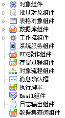

图4.19.2操作组件列表

**1.****对象组件：**提供对象的新增、删除、修改、重计算表达式等操作。

Ø包含三个重要属性，即对象名称、对象实例和输出对象。

Ø对象名称是指操作对象的类型，如员工信息表。

Ø对象实例一般是一个对象类型的变量。该变量可以通过对象查找操作或者是传入的主体对象变量等方式获取。若不指定该对象实例则代表当前的主体对象实例。

Ø输出对象为经过对象操作后的对象实例，通常在对象进行相关操作后需要补充其他操作时被引用。

**2.****批量对象组件：**提供批量对象查找、修改、删除、重计算表达式等操作。

Ø包含对象名称和对象筛选两个属性。

Ø对象名称是指操作对象的类型，如员工信息表。

Ø对象筛选包括三中筛选类型：定位条件、对象ID和对象ID集合。根据这些方式筛选出的指定的对象进行相关操作（删除、修改、重计算列）。

l定位条件：筛选的条件，条件类型包括语句（SQL语句）、变量、表达式，实质都是设计SQL语句；而对于变量，则设置值为SQL语句的变量；对于表达式，则设置表达式计算值为SQL语句的表达式。

l对象ID：筛选条件为ID等于指定的ID值，可以指定的ID值类型有常量、变量和表达式

l对象ID集合：筛选条件为ID在指定的对象ID集合中存在，可以指定的对象ID集合类型有常量、变量和表达式

Ø对于批量对象的查找操作，可指定查找结果的类型，包括首个对象、对象ID值、结果集、对象集等类型；首个对象即取得查找到的首个对象实例，对象ID值即取得查找到的结果集的ID数组、结果集即取得查找到的记录集、对象集即取得查找到的对象实例的集合；并将这些不同类型的查找结果存放在指定的变量中。

**3.****表格对象组件：**提供获取表格、新增、修改、删除表格数据等的操作。

Ø获取表格：从指定的对象实例中获取字段类型为表格字段（包括表格字段和表格模板字段，下文中统称为表格字段）的表格对象集实例（包括表格对象和表格模板对象，下文中统称表格对象实例），需要设置的基本属性包括：对象名称、对象实例、表格字段、输出对象。

l对象名称：表格字段的宿主对象的类型，例如查找员工基本信息对象中的家庭情况（表格对象）的实例，这时对象名称为员工基本信息的表名

l对象实例：表格字段的宿主对象实例，可选择对象类型的变量

l表格字段：表格字段在宿主对象中的字段代码

l输出对象：输出查找到的表格对象集实例到指定的变量中

Ø新增、修改、删除：在指定的表格对象集中新增一条记录或者修改、删除其中的一条记录。需要设置的基本属性包括：表格对象、表格实例，对于新增和修改操作还需要设置表格对象的字段值。

l表格对象：表格对象类型

l表格实例：表格对象集中具体的所有记录对应的表格对象实例

注意：对于更新表格对象的相关操作（新增、修改、删除等操作），在执行完表格对象的操作后，需要执行宿主对象实例的更新操作后，更新才生效，理由是：表格对象实例依附宿主对象实例存在，其单独的更新数据是没有意义的。更新宿主操作包括对象的新增、删除、修改、重计算表达式等。

**4.****数据库组件**

Ø执行SQL语句：执行SQL语句

l语句类型：可选择两种类型，普通sql语句和存储过程

l输入参数：对于存储过程类型，可配置输入参数并在存储过程中使用

lSQL语句：SQL语句内容，可指定语句、变量、表达式等类型

l指定数据源：可选的参数，默认为当前连接的数据源

**5.****工作流组件**

Ø执行动作：执行工作流指定的动作

l表单名：工作流流程表单的表名

l表单ID：工作流流程表单的ID

l动作ID：希望指定的工作流动作的ID

l摘要信息：对应工作流流程中表单信息中摘要列的内容

**6.****系统服务组件：**调用系统服务组件，提供桌面提醒服务，新浪短信服务，邮件发送服务，CoWork消息服务，外部服务，移动短信服务和公告服务等服务，根据不同的系统服务设置其对应的服务参数。

l服务名：系统服务名

**7.FIX****操作组件：**调用FIX操作组件。

l功能码：功能代码

l参数列表：对应参数的列表

**8.****存储过程组件：**调用系统存储过程对象的映射的存储过程。

l存储过程名：SQL存储过程资源集的表名

l输入参数：存储过程资源集中定义的输入参数

l输出参数：存储过程资源集中定义的输出参数

**9.****对象流程组件：**调用其他对象流程。

l对象流程：待调用的对象流程的表名

l对象：待调用对象流程的主体对象实例

**10.****消息确认框：**在流程中弹出提示信息对话框。

l提示信息：提示消息的内容

l提示标题：提示消息的标题

l提示图标：消息对话框显示的图标

l选择按钮：显示在消息对话框中的按钮

l输出值：将用户选择的按钮代码输出到对应的变量中

**11.****执行脚本：**执行脚本语句。

l表达式设计：设计脚本语句的内容

**12.Email****组件：**执行Email发送。

l收件人：邮件收件人地址

l抄送人：邮件抄送人地址

l主题：邮件主题

l内容：邮件内容

l附件：邮件附件，支持多附件发送

**13.****日志输出组件：**执行日志输出功能。

l消息等级：日志输出级别，分别有信息、调试、警告、错误

l消息内容：日志输出内容，可设置为表达式

**14.****数据集查询组件：**获取一个数据集的内容

l数据集名称：待获取的数据集的表名

l限制记录数：限制待获取数据集的数据条数

l查询记录数：获取的数据集的查询记录数

l输出结果集：输出到流程的结果集变量

l输出对象集：输出到流程的对象集变量

#### 4.10.1.3流程变量介绍

**系统变量**：系统默认提供这两个变量O\_MASTER、O\_PARAMETER，O\_MASTER为传入主体对象实例，O\_PARAMETER为传入对象流程方法的参数

**入口变量**：传入对象业务流程的变量。

**变量类型**：参数、主体对象、记录ID数组、记录集、对象集。

**普通变量**：流程中都能引用的全局变量，支持对象类型和字符、整型、长整型、浮点型、双精度浮点型、日期型等常用类型。对象类型需要设置对象实例，即选择该变量是具体的哪种对象类型。如下图所示：

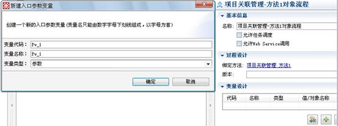

图4.19.3新建入口参数变量界面

表4.13变量类型描述

|  |  |
| --- | --- |
| **名称** | **描述** |
| **参数** | 类型与对象流程方法参数相同的参数变量，若对象流程方法的参数不只一个，可以通过变量。参数代码的方式取得具体的某个参数值。系统默认提供一个参数变量(O\_PARAMETER) |
| **主体对象** | 对象实例为主体对象的对象类型变量.系统默认提供一个主体对象(O\_MASTER) |
| **记录****ID****数组** | 类型为记录集的ID数组的变量，该变量的初始值为选中记录的ID数组（前提是对象流程方法的操作方式允许对多条记录进行操作）.当流程中存在该变量时，选择记录的操作将只调用一次该对象流程。（默认情况下是逐条记录依次调用对象流程操作） |
| **记录集** | 类型为记录集的变量，该变量的初始值为所有记录集（前提是对象流程方法的操作方式允许对多条记录进行操作）.当流程中存在该变量时，批量类型的操作将只调用一次该对象流程。（默认情况下是逐条记录依次调用对象流程操作） |
| **对象集** | 类型为所有对象集变量，该变量的初始值为选中的记录集对应的对象集（前提是对象流程方法的操作方式允许对多条记录进行操作）.当流程中存在该变量时，批量类型的操作将只调用一次该对象流程。（默认情况下是逐条记录依次调用对象流程操作） |

### 4.10.2对象流程使用方法

通过上述对对象流程方法的简单概念描述后，以下将对对象流程方法的使用进行介绍。

#### 4.10.2.1新建对象流程方法

可通过两种方法新建一个对象业务流程。

**方法一（常用方法）**：

打开一个实体对象，在节点按钮中找到“（对象流程方法）”点击新建一个对象业务流程。如下图：

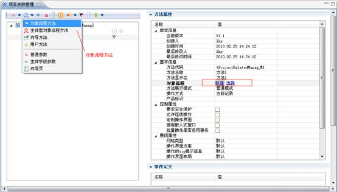

图4.19.4新建对象业务流程界面

再通过右侧相应的配置属性框中的“对象流程”，“新建”对象流程，或者“选择”已存在的对象流程，即完成新建步骤。一般采用此方法新建对象业务流程。

**方法二：**

还可直接为项目新建一个对象业务流程，并与相应的实体对象进行绑定。如下图：

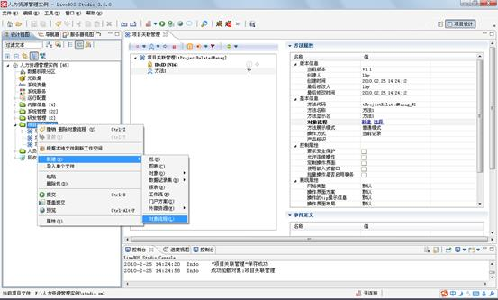

图4.19.5新建对象业务流程

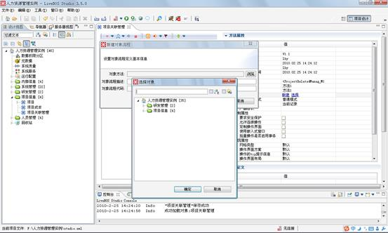

图4.19.6绑定实体对象

#### 4.10.2.2控制节点使用方法

##### **4.10.2.2.1****开始****/****结束节点**

******开始：**对象业务流程的开始。当希望在流程启动时进行限制，可以在开始节点上点击右键选择约束来设置启动限制。启动限制中新增验证节点，并设置验证表达式，当表达式计算结果为真时代表通过验证，启动对象流程。否则将提示用户验证失败不能启动对象流程。如下图所示：

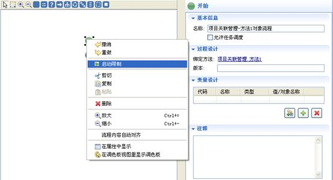

图4.19.7业务流程开始界面

******结束**：表示对象业务流程的结束。

##### **4.10.2.2.2****空语句节点**

**空语句：**不包含任何内容，只表示占位使用。一般在设计流程过程中作为预留的节点使用。

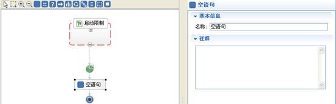

图4.19.8空语句界面

##### **4.10.2.2.3****赋值节点**

**赋值节点：**为变量赋值，可设置的值包括常量，变量，变量的属性以及表达式计算值。

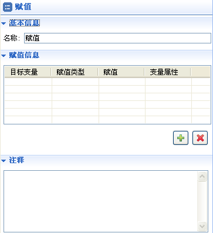

图4.19.9赋值节点属性框

可以通过赋值信息中的按钮添加赋值信息。赋值设置界面如下图所示：

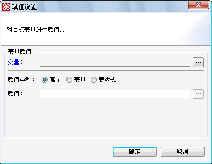

图4.19.10赋值设置界面

表4.14赋值类型描述

|  |  |  |
| --- | --- | --- |
| **名称** | **含义** | |
| **变量** | 待赋值的变量，变量必须实现在当前流程中定义 | |
| **赋值类型** | **常量** | 将常量值赋值给变量。常用于字符数字等基本类型 |
| **变量** | 将变量值或者一个变量的属性值赋值给变量 |
| **表达式** | 将表达式计算的结果值赋值给变量。 |

##### **4.10.2.2.4****验证节点**

**验证节点：**根据设定的条件进行验证，有两种分支结果，当条件结果为真时，验证成功，否则验证失败；其界面如下图所示

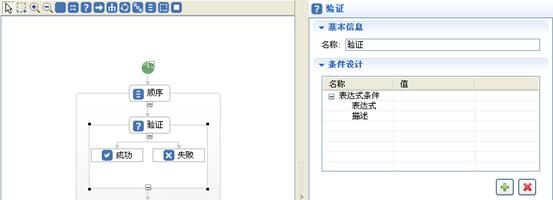

图4.19.11验证节点界面

条件设计详见：[4.14.2.1.14对象流程中的条件设计](_4_10.htm#_条件设计)。

##### **4.10.2.2.5****输出节点**

**输出节点：**设置过程的输出信息，在流程处理结束后可以设置过程的返回值及返回信息。并可附加设置UI重定向信息，设置希望跳转的转向信息。其界面如下图所示：

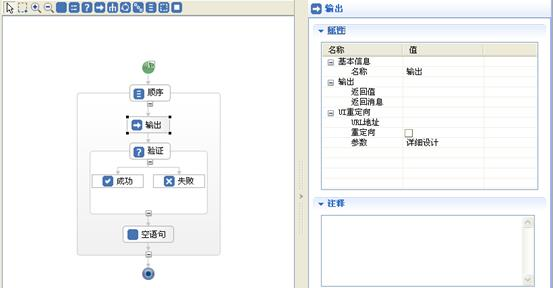

图4.19.12输出节点界面

表4.15输出节点属性描述

|  |  |
| --- | --- |
| **名称** | **含义** |
| **返回值** | 返回一个数值类型值，一般情况下大于零表示流程执行成功，否则代表流程执行失败。 |
| **返回消息** | 返回一个字符串信息作为操作的提示信息。 |

表4.16 UI重定向属性描述

|  |  |
| --- | --- |
| **名称** | **含义** |
| URL地址 | 重定向URL。 |
| UI重定向 | 是否需要让业务流程处理完进行页面转向。 |
| 参数 | URL地址所带的参数。 |

##### **4.10.2.2.6****判断节点**

**判断节点**：作为一个判断流转控制使用。可以通过设置IF、ELSEIF、ELSE控制元素进行灵活的流程控制，新增节点时，默认只有IF的判断节点，如果需要进行更复杂的流程控制，可添加ELSEIF、ELSE节点，添加方法：右键单击IF节点，添加即可。在IF、ELSEIF控制节点中，可设置判断条件。

判断节点的界面如下图所示：

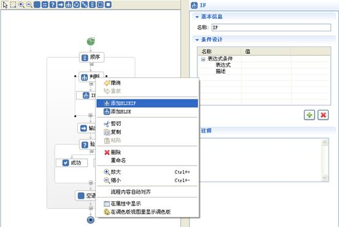

图4.19.13判断节点界面

表4.17判断条件描述

|  |  |
| --- | --- |
| **名称** | **描述** |
| IF | 当IF判断条件结果为真时，流程跳转到IF分支 |
| ELSE | 当IF及该ELSEIF之前的ELSEIF节点的条件结果都为假并且该ELSEIF条件结果为真时，流程跳转到ELSEIF分支 |
| ELSEIF | 当IF及所有的ELSEIF条件结果都为假时，流程跳转到ELSE分支 |

条件设计详见：[4.14.2.1.14对象流程中的条件设计](_4_10.htm#_条件设计)。

##### **4.10.2.2.7****循环节点**

**循环节点：**设置循环条件，当条件计算结果为真时，循环里的操作将重复执行，否则则退出该循环。其界面如下图所示：

**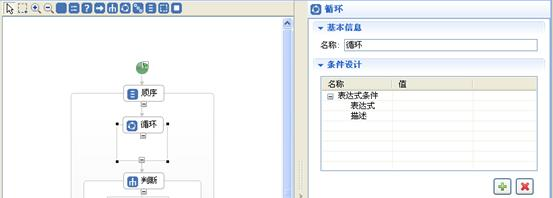**

图4.19.14循环节点界面

条件设计详见：[4.14.2.1.14对象流程中的条件设计](_4_10.htm#_条件设计)。

##### **4.10.2.2.8****迭代节点**

**迭代节点：**将一个迭代集合循环依次输出到一个变量中。迭代节点的界面及其属性如图：

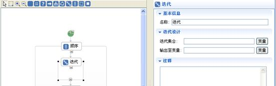

图4.19.15迭代节点界面

表4.18迭代节点属性描述

|  |  |
| --- | --- |
| **名称** | **描述** |
| **迭代集合** | 指一个集合变量。例如：数组、列表、结果集或者对象集等 |
| **输出至变量** | 将迭代集合里的元素通过循环，逐个赋值给指定的变量（即赋值给输出至变量选择的变量）。并且迭代下属的活动循环执行。在迭代范围内，可以依次取得该变量，进行相应的操作 |

##### **4.10.2.2.9****顺序节点**

**顺序节点：**代表活动的一组子活动顺序执行。当某一活动中的活动数大于等于两个时要用到顺序节点将其包括起来，顺序执行。顺序节点相当于程序代码中的“”的作用。使循环、验证、判断等节点依照顺序执行。其界面如下图所示：

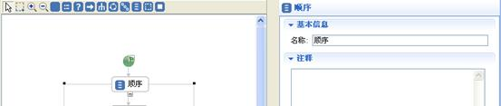

图4.19.16顺序节点界面

##### **4.10.2.2.10****范围节点**

**范围节点：**在范围内可以定义局部变量。局部变量只在范围内有效。其界面如下图所示：

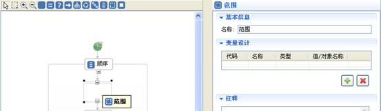

图4.19.17范围节点界面

变量设计：类似对象流程的普通变量。区别在于，流程的普通变量在流程的整个过程中都有效，而范围的变量只在范围内有效。

##### **4.10.2.2.11****退出节点**

**退出节点：**遇到退出节点时，该流程将终止并退出。其界面如下图所示：

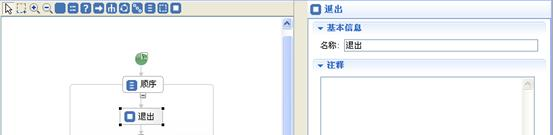

图4.19.18退出节点界面

##### **4.10.2.2.12****条件设计**

在对象业务流程中的许多节点有使用到条件设计。条件设计类型可以为：表达式条件、判断数据权限及判断业务权限。其新建条件对话框如下图所示：

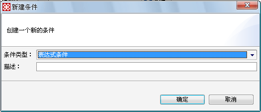

图4.19.19新建表达式条件对话框

表4.19条件类型描述

|  |  |
| --- | --- |
| **名称** | **描述** |
| **表达式条件** | 条件由表达式设计，判断是表达式计算的结果是否为真 |
| **判断数据权限** | 判断指定用户（若不指定为当前登录用户）是否有相应的数据权限 |
| **判断业务权限** | 判断指定用户（若不指定为当前登录用户）是否有相应的业务权限。 |

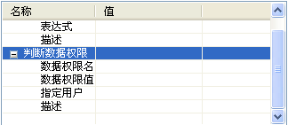

图4.19.20判断数据权限属性框

表4.20判断数据权限属性框描述

|  |  |
| --- | --- |
| **名称** | **含义** |
| **数据权限名** | 即对应的一个数据权限因子，可以从数据权限分区中选择。 |
| **数据权限值** | 判断数据值是否在数据权限名对应的数据权限范围内 |
| **指定用户** | 非必选项。若未设置指定用户选项，则默认为当前的操作用户。若设置该选项，则应从相应的用户数据中引用。指定用户的数据可以为常量、变量或表达式。 |

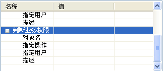

图4.19.21判断业务权限属性框

表4.21判断业务权限属性框描述

|  |  |  |
| --- | --- | --- |
| **名称** | **描述** | |
| **业务权限设置** | **对象名** | 指定业务权限的对象 |
| **操作** | 为选定的对象的指定操作，该选项非必选项。若无设置该操作，则仅对该选定对象进行权限验证。若设置指定操作则可对该指定操作进行权限验证。如新增、删除及用户自定义方法等 |
| **指定用户** | 设定验证上述权限的用户，默认为登录用户 | |

#### 4.10.2.3操作组件使用方法

注意：添加组件操作节点的方法为选中后拖入指定位置，而控制节点的添加方式为点击节点后在指定的位置再次点击后添加。

##### **4.10.2.3.1****对象组件**

表4.22对象组件操作描述

|  |  |
| --- | --- |
| **名称** | **描述** |
| **新增** | 在指定的对象中新增一条数据 |
| **修改** | 修改指定对象实例的数据。若对象实例没有指定，则表示修改当前操作的对象数据 |
| **删除** | 删除指定对象实例的数据，若无指定，则表示删除当前操作的对象实例数据 |
| **重计算表达式** | 即对指定对象实例中所有的表达式字段的值进行重新计算 |

详细属性说明请参见[操作组件介绍](_4_10.htm#_1.2操作组件介绍)

###### 4.10.2.3.1.1新增

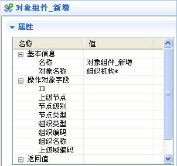

图4.19.22对象新增属性框

**操作说明**

l对象名称：增加要进行新增操作的对象类型，默认时增加当前业务流程的主体对象。

l操作对象字段：指定对应新增对象的各个字段。

l返回值：有两种返回方式

Ø输出值：以数值方式输出操作结果（即>0时，结果正确）

Ø输出对象：将操作后的对象输出

###### 4.10.2.3.1.2修改

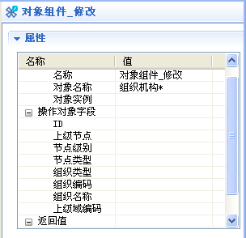

图4.19.23对象修改属性框

**操作说明**

l对象名称：选择要进行修改操作的对象类型，默认时修改当前业务流程的主体对象

l对象实例：选择要进行修改操作的对象中的实例

l操作对象字段：指定对应修改对象的各个字段

l返回值：有两种返回方式

Ø输出值：以数值方式输出结果（即>0时，结果正确）

Ø输出对象：将操作后的对象输出

###### 4.10.2.3.1.3删除

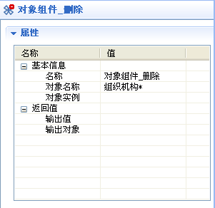

图4.19.24对象删除属性框

**操作说明**

l对象名称：选择要进行删除操作的对象类型，默认时删除当前业务流程的主体对象

l对象实例：选择要进行删除操作的对象中的实例

l返回值：有两种返回方式

Ø输出值：以数值方式输出结果（即>0时，结果正确）

Ø输出对象：将操作后的对象输出

###### 4.10.2.3.1.4重计算表达式

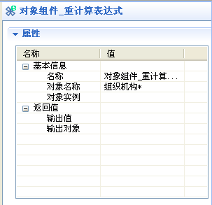

图4.19.25重计算表达式属性框

**操作说明**

l对象名称：选择要进行重计算操作的对象类型，默认时删除当前业务流程的主体对象

l对象实例：选择要进行重计算操作的对象中的实例

l返回值：有两种返回方式

Ø输出值：以数值方式输出结果（即>0时，结果正确）

Ø输出对象：将操作后的对象输出

##### **4.10.2.3.2****批量对象组件**

表4.23批量对象组件操作描述

|  |  |
| --- | --- |
| **名称** | **描述** |
| **查找** | 通过条件筛选，查找对象实例（也可以是对象实例集） |
| **修改** | 通过条件筛选，修改查找出的对象实例（也可以是对象实例集） |
| **删除** | 通过条件筛选，删除查找出的对象实例（也可以是对象实例集） |
| **重计算表达式** | 对筛选出的对象实例（也可以是对象实例集）的所有表达式字段的值进行重计算 |

详细属性说明请参见[操作组件介绍](_4_10.htm#_1.2操作组件介绍)

###### 4.10.2.3.2.1查找

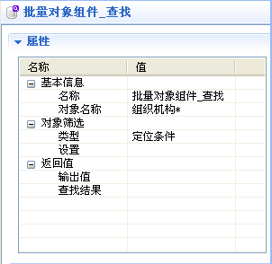

图4.19.26批量对象查找属性框

**操作说明**

l对象名称：选择要进行批量查找的对象类型，默认在当前业务流程的对象中查找

l对象筛选：根据所给出的条件对对象进行筛选。对象条件筛选的类型有：定位条件、对象ID值、对象ID集合。

Ø定位条件：即相当于SQL语句中的“where”。在条件选项中写入条件语句，可以以一个“：参数”引用指定参数中对应的参数，如下图：

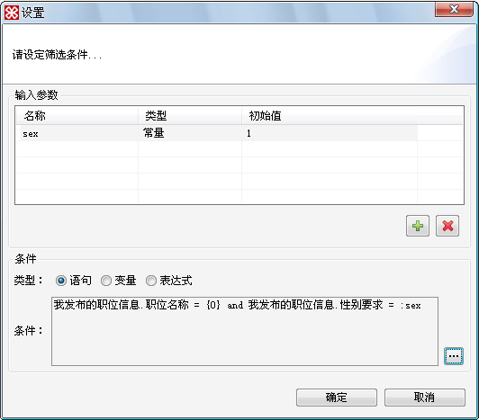

图4.19.27定位条件设置窗口

表4.24定位条件设置属性

|  |  |  |
| --- | --- | --- |
| **名称** | **描述** | |
| **输入参数** | 可为条件语句引用的参数，并可对其进行赋值 | |
| **条件** | **语句** | 输入一条普通的条件语句 |
| **变量** | 将指定变量的值作为条件语句 |
| **表达式** | 将表达式计算结果得出的值作为条件语句 |

Ø对象ID值：查找到对应ID的记录，如下图：

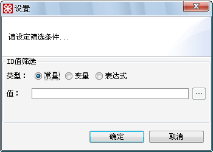

图4.19.28对象ID值设置窗口

表4.25对象ID值设置属性

|  |  |  |
| --- | --- | --- |
| **名称** | **描述** | |
| **ID****值筛选** | **常量** | 输入的数据为一个常量 |
| **变量** | 使用指定变量的值作为ID值 |
| **表达式** | 将表达式计算结果作为ID值 |

Ø对象ID集合：将数组或者集合中所有包含此ID值的所有记录全部查找出来，如下图：

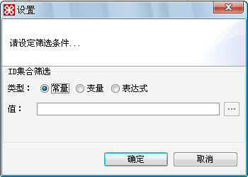

图4.19.29对象ID集合设置窗口

表4.26对象ID集合设置属性

|  |  |  |
| --- | --- | --- |
| **名称** | **描述** | |
| **ID****集合筛选** | **常量** | 输入的数据为一个常量。 |
| **变量** | 集合变量 |
| **表达式** | 将表达式计算结果作为集合值 |

l返回值：有两种返回方式

Ø输出值：以数值方式输出结果（即>0时，结果正确）

Ø查找结果：分为四种类型

²首个对象：引用查找到的第一个对象

²对象ID数组：引用查找到的对象ID

²结果集：引用查找到的对象结果集

²对象集：引用查找到的对象集

###### 4.10.2.3.2.2修改

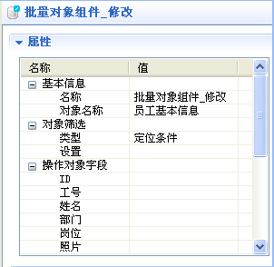

图4.19.30批量对象修改属性框

**操作说明**

l对象名称：选择要进行修改的对象类型，默认时修改当前业务流程的主体对象

l对象筛选：根据所给出的条件对对象进行筛选。对象条件筛选的类型有：定位条件、对象ID值、对象ID集合。

Ø定位条件：即相当于SQL语句中的“where”。在条件选项中写入条件语句，可以以一个“：参数”引用指定参数中对应的参数，如下图：

图4.19.31定位条件设置窗口

表4.27定位条件设置属性

|  |  |  |
| --- | --- | --- |
| **名称** | **描述** | |
| **输入参数** | 可为条件语句引用的参数，并可对其进行赋值 | |
| **条件** | **语句** | 输入一条普通的条件语句 |
| **变量** | 将指定变量的值作为条件语句 |
| **表达式** | 将表达式计算结果得出的值作为条件语句 |

Ø对象ID值：查找到对应ID的数组，如下图：

图4.19.32对象ID值设置窗口

表4.28对象ID值设置属性

|  |  |  |
| --- | --- | --- |
| **名称** | **描述** | |
| **ID****值筛选** | **常量** | 输入的数据为一个常量 |
| **变量** | 使用指定变量的值作为ID值 |
| **表达式** | 将表达式计算结果作为ID值 |

Ø对象ID集合：将数组或者集合中所有包含此ID值的所有记录全部查找出来，如图：

图4.19.33对象ID集合设置窗口

表4.29对象ID集合设置属性

|  |  |  |
| --- | --- | --- |
| **名称** | **描述** | |
| **ID****集合筛选** | **常量** | 输入的数据为一个常量。 |
| **变量** | 集合变量 |
| **表达式** | 将表达式计算结果作为集合值 |

l操作对象字段：指定对应修改对象的字段

l返回值：有两种返回方式

Ø输出值：以数值方式输出结果（即>0时，结果正确）

Ø输出对象：将操作后的对象集

###### 4.10.2.3.2.3删除

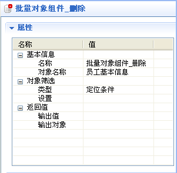

图4.19.34批量对象删除属性框

**操作说明**

l对象名称：选择要进行删除的对象类型，默认时删除当前业务流程的主体对象

l对象筛选：根据所给出的条件对对象进行筛选。对象条件筛选的类型有：定位条件、对象ID值、对象ID集合。

Ø定位条件：即相当于SQL语句中的“where”。在条件选项中写入条件语句，可以以一个“：参数”引用指定参数中对应的参数，如下图：

图4.19.35定位条件设置窗口

表4.30定位条件设置属性

|  |  |  |
| --- | --- | --- |
| **名称** | **描述** | |
| **输入参数** | 可为条件语句引用的参数，并可对其进行赋值 | |
| **条件** | **语句** | 输入一条普通的条件语句 |
| **变量** | 将指定变量的值作为条件语句 |
| **表达式** | 将表达式计算结果得出的值作为条件语句 |

Ø对象ID值：查找到对应ID的数组，如下图：

图4.19.36对象ID值设置窗口

表4.31对象ID值设置属性

|  |  |  |
| --- | --- | --- |
| **名称** | **描述** | |
| **ID****值筛选** | **常量** | 输入的数据为一个常量 |
| **变量** | 使用指定变量的值作为ID值 |
| **表达式** | 将表达式计算结果作为ID值 |

Ø对象ID集合：将数组或者集合中所有包含此ID值的所有记录全部查找出来，如图：

图4.19.37对象ID集合设置窗口

表4.32对象ID集合设置属性

|  |  |  |
| --- | --- | --- |
| **名称** | **描述** | |
| **ID****集合筛选** | **常量** | 输入的数据为一个常量。 |
| **变量** | 集合变量 |
| **表达式** | 将表达式计算结果作为集合值 |

l返回值：有两种返回方式

Ø输出值：以数值方式输出结果（即>0时，结果正确）

Ø输出对象：将操作后的对象集输出

###### 4.10.2.3.2.4重计算表达式

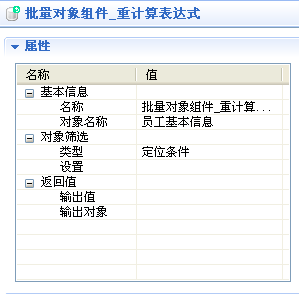

图4.19.38批量对象重计算表达式属性框

**操作说明**

对象名称：选择要进行重计算的对象类型，默认时操作当前业务流程的主体对象

l对象筛选：根据所给出的条件对对象进行筛选。对象条件筛选的类型有：定位条件、对象ID值、对象ID集合。

Ø定位条件：即相当于SQL语句中的“where”。在条件选项中写入条件语句，可以以一个“：参数”引用指定参数中对应的参数，如下图：

图4.19.39定位条件设置窗口

表4.33定位条件设置属性

|  |  |  |
| --- | --- | --- |
| **名称** | **描述** | |
| **输入参数** | 可为条件语句引用的参数，并可对其进行赋值 | |
| **条件** | **语句** | 输入一条普通的条件语句 |
| **变量** | 将指定变量的值作为条件语句 |
| **表达式** | 将表达式计算结果得出的值作为条件语句 |

Ø对象ID值：查找到对应ID的数组，如下图：

图4.19.40对象ID值设置窗口

表4.34对象ID值设置属性

|  |  |  |
| --- | --- | --- |
| **名称** | **描述** | |
| **ID****值筛选** | **常量** | 输入的数据为一个常量 |
| **变量** | 使用指定变量的值作为ID值 |
| **表达式** | 将表达式计算结果作为ID值 |

Ø对象ID集合：将数组或者集合中所有包含此ID值的所有记录全部查找出来，如图：

图4.19.41对象ID集合设置窗口

表4.35对象ID集合设置属性

|  |  |  |
| --- | --- | --- |
| **名称** | **描述** | |
| **ID****集合筛选** | **常量** | 输入的数据为一个常量。 |
| **变量** | 集合变量 |
| **表达式** | 将表达式计算结果作为集合值 |

l返回值：有两种返回方式

Ø输出值：以数值方式输出结果（即>0时，结果正确）

Ø输出对象：将操作后的对象集输出

##### **4.10.2.3.3****表格对象组件**

表4.36表格对象组件操作描述

|  |  |
| --- | --- |
| **名称** | **描述** |
| **获取表格** | 从指定的对象实例中获取字段类型为表格模板和表格字段的表格对象集实例 |
| **新增** | 在指定的对象中新增一条数据 |
| **修改** | 修改指定表格对象实例的数据。若表格对象实例没有指定则表示修改当前操作的表格对象数据 |
| **删除** | 删除指定的表格对象实例数据，若无指定则表示删除当前操作的表格对象实例数据 |

详细属性说明请参见[操作组件介绍](_4_10.htm#_1.2操作组件介绍)

###### 4.10.2.3.3.1获取表格

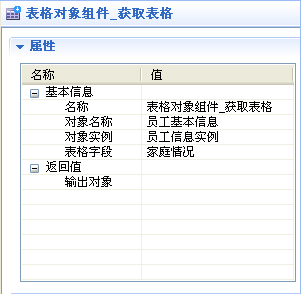

图4.19.42表格对象获取表格属性框

**操作说明**

l对象名称：表格字段的宿主对象的类型

l对象实例：表格字段的宿主对象实例，可选择要进行获取操作的对象类型的变量

l表格字段：表格字段在宿主对象中的字段代码

l返回值：

Ø输出对象：将操作后的表格对象实例集输出

###### 4.10.2.3.3.2新增

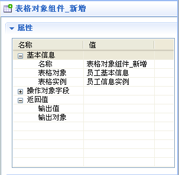

图4.19.43表格对象新增属性框

**操作说明**

l表格对象：表格对象的类型

l表格实例：表格对象集中要进行新增操作的具体的某一条记录对应的表格对象实例

l操作对象字段：指定新增表格对象的各个字段

l返回值：有两种返回方式

Ø输出值：以数值方式输出操作结果（即>0时，结果正确）

Ø输出对象：将操作后的表格对象实例集输出

###### 4.10.2.3.3.3修改

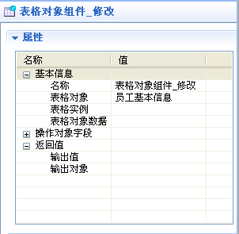

图4.19.44表格对象修改属性框

**操作说明**

l表格对象：表格对象的类型

l表格实例：表格对象集中要进行修改操作的所有记录对应的表格对象实例

l表格对象数据：指定修改表格对象的数据

l操作对象字段：指定修改表格对象的各个字段

l返回值：有两种返回方式

Ø输出值：以数值方式输出操作结果（即>0时，结果正确）

Ø输出对象：将操作后的表格对象实例集输出

###### 4.10.2.3.3.4删除

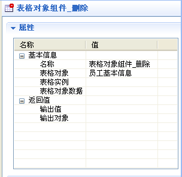

图4.19.45表格对象删除属性框

**操作说明**

l表格对象：表格对象的类型

l表格实例：表格对象集中要进行删除操作的所有记录对应的表格对象实例

l表格对象数据：指定删除表格对象的数据

l操作对象字段：指定删除表格对象的各个属性

l返回值：有两种返回方式

Ø输出值：以数值方式输出操作结果（即>0时，结果正确）

Ø输出对象：将操作后的表格对象实例集输出

##### **4.10.2.3.4****数据库组件**

表4.37数据库组件操作描述

|  |  |
| --- | --- |
| **名称** | **描述** |
| **执行****SQL****语句** | 直接执行SQL语句，对数据库数据进行操作 |

详细属性说明请参见[操作组件介绍](_4_10.htm#_1.2操作组件介绍)

###### 4.10.2.3.4.1执行SQL语句

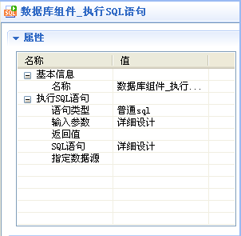

图4.19.46数据库执行SQL语句属性框

**操作说明**

l执行SQL语句：有两种语句类型，一种为普通SQL，一种为存储过程

Ø普通SQL：执行普通SQL语句对应的语句

表4.38普通SQL属性描述

|  |  |  |
| --- | --- | --- |
| **名称** | **描述** | |
| **输入参数** | 可为SQL语句引用的参数，并可对其进行赋值 | |
| **返回值** | 执行完SQL语句得到的值 | |
| **SQL****语句** | **语句** | 输入一条普通SQL语句 |
| **变量** | 将指定变量的值作为SQL语句 |
| **表达式** | 将表达式计算结果得出的值作为SQL语句 |
| **指定数据源** | 可选的参数，默认为当前连接的数据源 | |

Ø存储过程：执行一个存储过程

表4.39存储过程属性描述

|  |  |  |
| --- | --- | --- |
| **名称** | **描述** | |
| **输入参数** | 可为SQL语句引用的参数，并可对其进行赋值 | |
| **输出参数** | 将存储过程所定义的输出参数赋值到指定的变量中 | |
| **SQL****语句** | **语句** | 输入一条普通SQL语句 |
| **变量** | 将指定变量的值作为SQL语句 |
| **表达式** | 将表达式计算结果得出的值作为SQL语句 |
| **指定数据源** | 可选的参数，默认为当前连接的数据源 | |

##### **4.10.2.3.5****工作流组件**

表4.40工作流组件属性描述

|  |  |
| --- | --- |
| **名称** | **描述** |
| **执行动作** | 执行一个工作流的动作 |

详细属性说明请参见[操作组件介绍](_4_10.htm#_1.2操作组件介绍)

###### 4.10.2.3.5.1执行动作

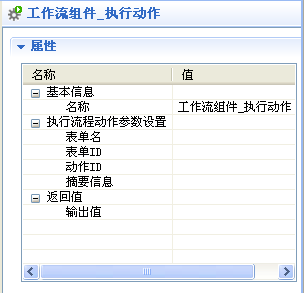

图4.19.47工作流执行动作属性框

**操作说明**

l执行动作参数设置：

Ø表单名：指对应的工作流表单的对象名。

Ø表单ID：指流程表单对应记录的ID值，如果该记录中流程实例值小于0，则代表该记录没有对应流程任务，本组件将自动启动一个流程任务，并将流程实例值绑定于该记录中。

Ø动作ID：对应流程中动作的ID值，当该值小于0时代表不执行流程动作。一般常见于启动流程。当是合法的值时将执行对应流程动作，并引发流程转向的流程事件处理等。

Ø摘要信息：填入流程步骤明细中摘要信息的内容。

l返回值：

Ø输出值：当执行完该动作时，将返回的结果赋值给所设置的变量中。当值>0时为该流程的实例号，<=0则代表失败.

##### **4.10.2.3.6****系统服务组件**

调用系统服务组件，提供桌面提醒服务，新浪短信服务，邮件发送服务，外部服务，CoWork消息服务，移动短信服务和公告服务等服务，根据不同的系统服务设置其对应的服务参数。

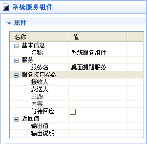

图4.19.48系统服务属性框

**操作说明**

l服务：

Ø服务名：选择一个对应系统服务的组件名。如：桌面提醒服务、邮件发送服务、外部服务、CoWork消息服务、移动短信服务及新浪OMS短信服务。并可为相应的服务指定相应的接收人及发送人等，以及对特有属性进行赋值

l服务接口参数：不同的系统服务设置其对应的服务参数，如：接收人、发送人、主题、内容、等待回应

l返回值：将服务组件的返回值调用给所设置的变量

Ø输出值：返回的数据以数值类型显示，根据结果来判断，当结果大于零时则一般表示成功

Ø输出说明：返回的数据以字符串类型显示

##### **4.10.2.3.7****FIX****操作组件**

执行一个FIX操作

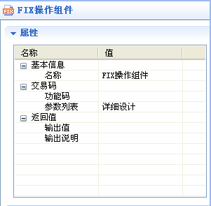

图4.19.49FIX操作属性框

**操作说明**

l交易码：通过设置功能码的值实现与FIX服务器的交互

Ø功能码：对应调用FIX的功能码

Ø参数列表：对应功能码调用的一些参数

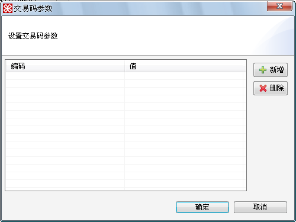

图4.19.50交易码参数设置对话框

l返回值：对FIX操作的返回值进行调用

Ø输出值：返回的数据以数值类型显示，根据结果来判断，当结果大于零时则一般表示成功

Ø输出说明：返回的数据以字符串类型显示

##### **4.10.2.3.8****存储过程组件**

调用系统存储过程对象的映射的存储过程

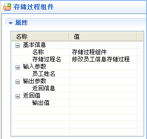

图4.19.51存储过程属性框

**操作说明**

l存储过程名：SQL存储过程资源集的表名

l输入参数：存储过程资源集中定义的输入参数

l输出参数：存储过程资源集中定义的输出参数

l返回值：

Ø输出值：当执行完该动作时，将返回的结果赋值给所设置的变量中。当值>0时为该流程的实例号，<=0则代表失败.

##### **4.10.2.3.9****对象流程组件**

调用其他对象流程

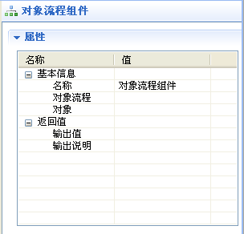

图4.19.52对象流程属性框

l对象流程：待调用的对象流程的表名

l对象：待调用对象流程的主体对象实例或对象ID值

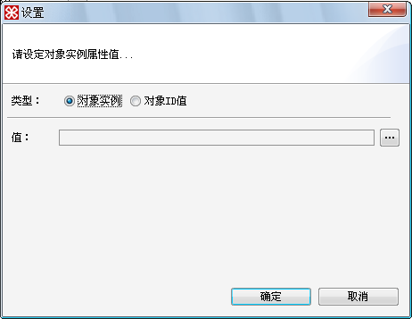

图4.19.53对象实例属性设置对话框

l返回值：对对象流程的返回值进行调用

Ø输出值：返回的数据以数值类型显示，根据结果来判断，当结果大于零时则一般表示成功

Ø输出说明：返回的数据以字符串类型显示

##### **4.10.2.3.10****消息确认框**

当设定操作内容为消息确认框时，则在展示页面上会自动弹出一个页面，供用户进行选择。并且当用户选择后，操作会继续进行，并在随后操作内容中会获取用户选择的内容。

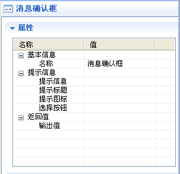

图4.19.54消息确认属性框

**操作说明**

l提示信息：

Ø提示信息：提示消息的内容

Ø提示标题：提示消息的标题

Ø提示图标：消息对话框显示的图标

Ø选择按钮：显示在消息对话框中的按钮，可以通过选择对话框进行选择，如图4.11.5，也可以通过下拉选择框进行选择，如图4.11.6：

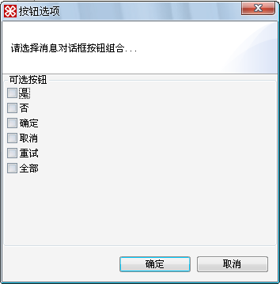

图4.19.55选择按钮选择对话框

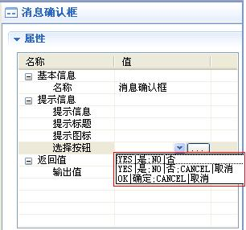

图4.19.56选择按钮下拉选择框

l返回值：

Ø输出值：将用户选择的按钮代码输出到对应的变量中

##### **4.10.2.3.11****执行脚本**

执行脚本语句

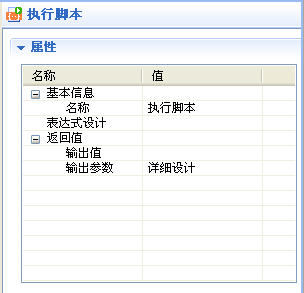

图4.19.57执行脚本属性框

**操作说明**

l表达式设计：设计脚本语句的内容

l返回值：

Ø输出值：返回的数据以数值类型显示，根据结果来判断，当结果大于零时则一般表示成功

Ø输出参数：在表达式中出现的变量可以赋值给流程指定的变量

##### **4.10.2.3.12****Email****组件**

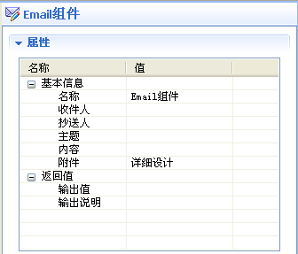

图4.19.58 Email组件属性框

**操作说明**

l收件人：邮件收件人地址（注：添加多个邮件收件人时，用逗号或者分号分隔）

l抄送人：邮件抄送人地址（注：添加多个邮件抄送人时，用逗号或者分号分隔）

l主题：邮件主题

l内容：邮件内容

l附件：邮件附件，支持多附件发送

l返回值：

Ø输出值：返回的数据以数值类型显示，根据结果来判断，当结果大于零时则一般表示成功

Ø输出说明：返回的数据以字符串类型显示

##### **4.10.2.3.13****日志输出组件**

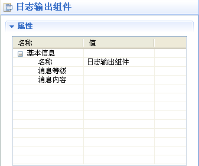

图4.19.59日志输出组件属性框

**操作说明**

l消息等级：日志输出级别，分别有信息、调试、警告、错误。

l消息内容：日志输出内容，可设置为表达式

##### **4.10.2.3.14****数据集查询组件**

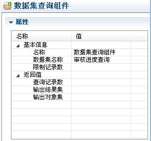

**操作说明**

l数据集名称：待获取的数据集实例的表名，如审核进度查询。

l限制记录数：限制待获取数据集的数据条数

l返回值：

Ø查询记录数：将查询结果的记录数以数值方式输出到流程变量中（即>0时，结果正确）

Ø输出结果集：将输出结果以结果集方式输出到流程变量中

Ø输出对象集：将输出结果以对象集方式输出到流程变量中。

### 4.10.3简单示例

下文将通过建立一个简单的对象流程进一步演示对象流程的使用。在本例中，员工信息对象有一个员工家庭情况表格模板字段，希望对员工家庭情况信息未录入（为空）的数据进行更新，更新操作向家庭情况表格中插入一条记录，记录的所有字段值设置成“未知”，并调用邮件服务提醒员工填写家庭情况信息。实现步骤：

1.在员工基本信息对象中，新建对象流程方法，在弹出的新建对话框中输入方法名和代码等信息后确定，新建完成。由于是对所有员工的家庭情况进行一次排查，需要将方法的操作方式改成所有记录，如下图所示：

图4.19.60新建对象流程方法

2.通过对象流程属性的链接打开对象流程编辑器，进入设计，如下图所示：

图4.19.61对象流程编辑器

3.在对象流程编辑器中，完成设计整个对象流程的过程：

（1）由于对所有记录进行操作，需要将所有的对象数据传入对象流程中，在流程中添加入口参数变量“对象集”，并输入相应的变量代码和名称，确定后，就可在流程中通过引用该变量取得所有记录对应的对象集，如下图所示：

图4.19.62新增对象集入口参数

（2）首先要取得所有对象数据中的家庭情况字段的表格数据，但表格字段数据的获取只能一次从一个对象实例中获取，对象实例对应一条记录，而传入的对象集参数映射所有记录，在此需要使用迭代来依次取得一条对象实例，从每个对象实例中获取表格数据。实现的过程是：在流程的变量中新增对象类型变量object\_i，在流程图中放置迭代节点，设置迭代的集合为all\_object\_result变量，输出至变量为object\_i，如下图所示：

图4.19.63新增迭代节点

（3）接下来在迭代中依次取得object\_i对象实例中的家庭情况的表格数据：在左边的操作组件树中拖入获取表格操作组件，选择对象名称为“员工基本信息”、对象实例为迭代中的输出变量object\_i，表格字段为“家庭情况”，并将输出对象指定为对象名称为家庭情况的表格对象，这样查找到的家庭情况数据集就存放在这个对象实例里了，如下图所示：

图4.19.64调用获取表格操作组件

（4）通过以上的操作，已经可以获取每个员工的家庭情况的表格数据，接着对员工家庭情况的数据进行检查，检查是否是空数据，不为空则跳出这次迭代，否则将新增一条家庭情况的数据并通知该员工填写家庭情况。实现过程：添加判断节点，设计表达式条件为家庭情况的数据为空，条件满足时，新增一条家庭情况数据，在此添加表格对象组件\_新增组件，由于家庭情况数据依附员工基本信息数据，单独的新增表格字段的数据并不会得以保存，而需要调用对象修改操作组件让宿主对象（即员工基本信息）的所有修改的数据保存。之后添加系统服务组件调用邮件服务来通知员工填写信息；同时添加ELSE节点，在不满足条件时，即家庭情况中有数据时，跳出本次循环，但可以放置一个空语句的节点，以备将来需要进行特殊处理时预留设计的空间。如下图所示：

图4.19.65对象流程图

图4.19.66判断是否无家庭情况数据

图4.19.67新增家庭情况记录属性设置

图4.19.68对象修改操作组件属性设置

图4.19.69调用系统服务属性设置

至此，检查员工家庭情况的流程设计完成，如下图所示：

图4.19.70员工未录入家庭情况的数据流程处理结果

**几点应用补充**

l在流程启动前，常需要进行适当的验证，验证成功进入流程，否则不启动流程。此时，可在开始节点点右键添加启动限制，并在启动限制节点中防止验证节点，设置验证条件，验证成功后启动对象流程。

l在设计过程中，常遇到一些不确定的输出结果或者是期望之外的流转，需要基本的调试来检查数据的正确性。在这种情况下，可以通过不同控制节点或是操作节点的输出值结合消息对话框操作组件将数据输出到屏幕上，或者通过对变量的处理输出测试数据

l对于流程中包含其他对象流程已经实现的流程方法，可以考虑调用对象流程组件实现

### 4.10.4主体型对象流程方法

注：LiveBOS3.3.1及以后版本支持该方法的配置。

主体型对象流程方法，是一种以向导方式建立的对象流程方法，根据用户选择的操作类型配置相应的字段，从而自动生成一个缺省的对象流程方法。主体型对象流程方法的使用可以免除对象流程手动添加主体对象字段参数的步骤，对象流程新建步骤和对象流程一一绑定的步骤。

该向导中可以完成将配置的字段转成主体参数，这些主体参数仅允许配置名称、显示控件、刷新数据、禁止输入、是否隐藏及展示属性等，其他的不能配置。该向导还可以设置相应的操作模式。该向导生成的对象流程，根据操作类型，选择调用对象组件的新增、删除、修改操作，并置上相应的主体参数。

如，我们为“职位信息”对象添加一个主体型对象流程方法“修改职位信息”，建立步骤如下：

1.选择流程方法下拉框，在下拉列表中选择主体型对象流程方法，如下图所示。主体型对象流程方法也可以通过右击新建à主体型对象流程方法的方式来添加。

图4.19.71为对象添加主体型对象流程方法

2.弹出对象流程方法设置向导，如图4.17.72所示。方法名称和方法显示名默认为“方法1”，这里我们可以根据实际的应用进行修改，这里我们将其修改为“修改职位信息”，方法展示模式采用默认，操作类型选择“修改”。设置完成后，点击【下一步】；

图4.19.72对象流程方法设置向导1

3.向导进入方法参数设置页面（见下图）。这里系统默认将主体对象的所有字段添加到对象流程中，用户可以依据实际的需要选择添加字段，这里我们将除了需求人数、性别要求、薪酬范围、职位描述、人员要求这几个字段之外的其他字段前的勾去掉，其他采用系统默认。设置完成后，点击【完成】。

图4.19.73对象流程方法设置向导2

4.此时我们会看到，该向导已将“修改职位信息”对象流程建立好，并且主体参数也被添加到流程方法中了（见下图）。这样就免除了用户手动添加主体对象参数和对象流程建立、绑定的步骤。

图4.19.74对象流程建立完成后

5.双击新建的流程，我们会看到系统自动为该流程添加了一个“对象组件\_修改”的组件（见下图）。

图4.19.75流程相应的操作组件已经添加

6.下面即可进行对象流程的设计了，主体型对象流程方法的设计与普通的对象流程方法的设计相同，这里就不赘述了。
