# 向导方法设计

> LiveBOS Studio > 用户手册 > 业务建模设计

---

## 4.11向导方法设计

### 4.11.1说明

向导方法，以向导模式提示用户在当前页面进行参数的输入，提供给用户进行操作。例如，我们进行邮箱注册时，可以按照步骤指示一步步地执行下去，从而告诉用户当前正在进行哪些操作、下一步将要执行哪些操作，页面提供选项供用户进行填写或者选择，从而完成邮箱的注册。本例将给出一个简单的邮箱注册向导示例。

### 4.11.2向导方法的使用

#### 4.11.2.1新增向导方法

1.在一个包中右键点击“新建”à”对象”à“实体对象”，修改实体对象名为”邮箱注册向导”，弹出如下图：

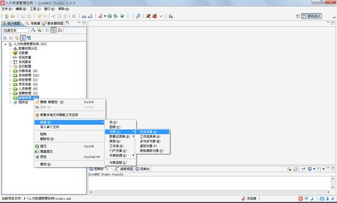

图4.20.1新建实体对象

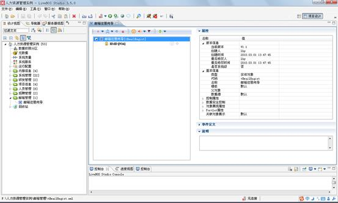

图4.20.2“邮箱注册向导”对象

2.在”邮箱注册向导”实体对象上，右键点击”新建”à”向导方法”，修改向导方法的方法名称和方法显示名为”邮箱注册”，如下图：

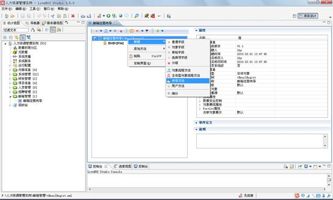

图4.20.3新建向导方法

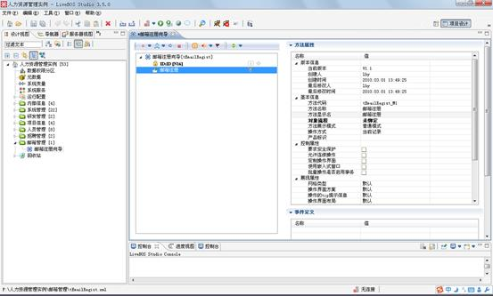

图4.20.4 “邮箱注册”向导方法

【属性说明】

l基本信息：和实体对象的用户方法相同

Ø对象流程：向导方法进行绑定的对象流程

l控制属性：和实体对象的用户方法相同

l对象展现属性：和实体对象的用户方法相同

Ø显示页标题：是否显示页面标题，系统默认显示

Ø显示步骤指示：是否显示步骤指示信息，系统默认显示

Ø导航按钮标签：

²上一步：自定义“上一步”操作按钮标签

²下一步：自定义“下一步”操作按钮标签

²完成：自定义“完成”操作按钮标签

²取消：自定义“取消”操作按钮标签

#### 4.11.2.2对象流程绑定

向导方法必须绑定一个对象流程，对象流程作为向导方法的逻辑主体，执行对象新增操作后将向导方法的操作结果写入到数据库中，然后在页面上返回邮箱注册是否成功的消息对话框。具体步骤如下：

1.为”邮箱注册向导”新建一个对象流程”邮箱注册向导对象流程”，如下图：

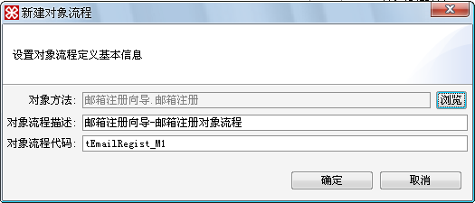

图4.20.5新建对象流程

2.为该对象流程新建一个变量V\_1，该变量用来保存“邮箱注册向导”的返回值。添加一个对象组件\_新增、一个判断节点、一个Else节点和两个消息确认框节点。其设置如下图：

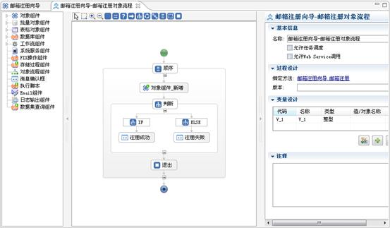

图4.20.6”邮箱注册对象流程”设置页面

(1)对象组件\_新增组件，将向导方法返回的对象值赋给另一个对象”邮箱”。属性设置如下图：

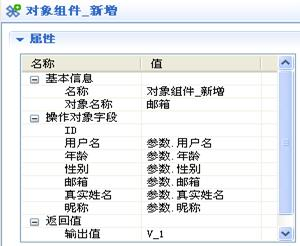

图4.20.7对象组件\_新增属性设置

(2)判断节点，判断邮箱注册操作的返回值是否大于0，即判断节点的表达式条件设计为：V\_1>0。

(3)注册成功消息确认框，提示邮箱注册成功的消息对话框。属性设置如下图：

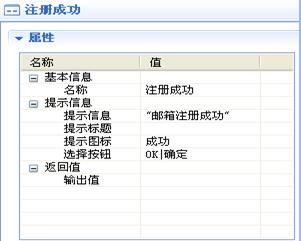

图4.20.8注册成功消息确认框属性设置

(4)注册失败消息确认框，提示邮箱注册失败的消息对话框。属性设置如下图：

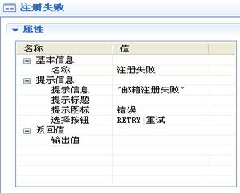

图4.20.9注册失败消息确认框属性设置

#### 4.11.2.3普通参数设计

普通参数，作为向导方法的参数使用，在向导页中表现为各向导页的字段，其属性与一般实体对象的字段属性相同。

1.右键点击”邮箱注册”，选择“新建”à“普通参数”，弹出如下图：

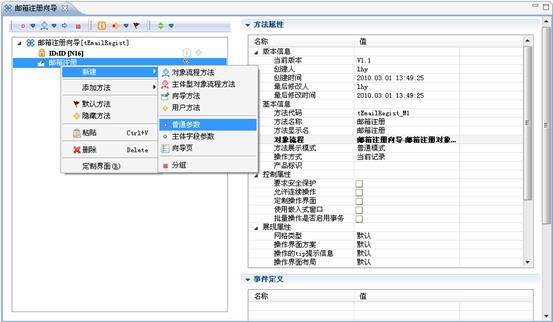

图4.20.10新增普通参数

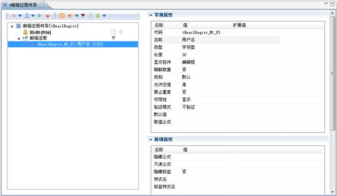

图4.20.11新增用户名参数

2.为“邮箱注册”分别增加几个普通参数，如：用户名、年龄、性别、邮箱、真实姓名、昵称等。

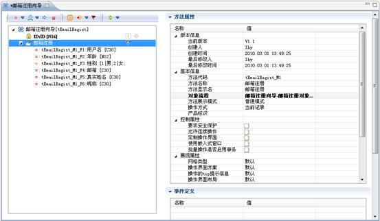

图4.20.12“邮箱注册”向导方法的所有参数

#### 4.11.2.4向导页设计

向导方法的逻辑是由各个向导页之间的逻辑切换组成的。

1.选择”邮箱注册”向导方法，右键点击选择”新建”à”向导页”，如下图：

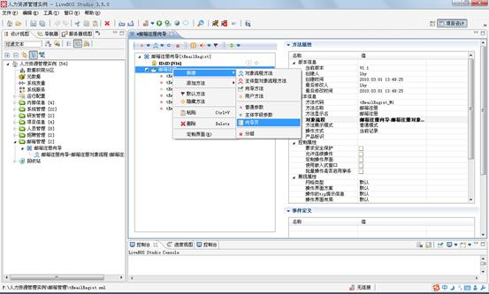

图4.20.13新建向导页

2.在“新建向导页面”对话框中输入向导页面名称，即页标题。

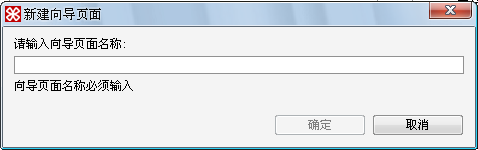

图4.20.14新建向导页对话框

3.为“邮箱注册”向导方法建立五个向导页：欢迎、基本信息设置、保密邮箱设置、安全设置、注册成功。如下图

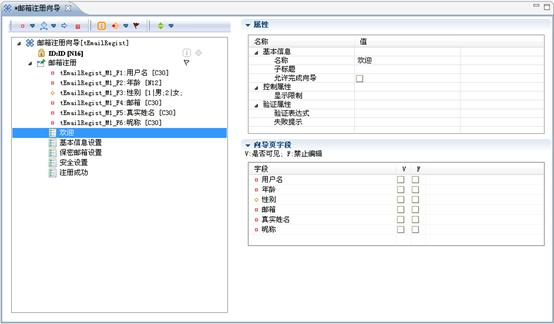

图4.20.15”邮箱注册”中所有向导页

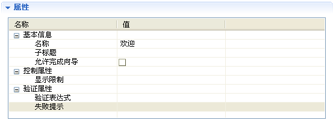

图4.20.16向导页属性框

表4.41向导页基本属性描述

|  |  |  |
| --- | --- | --- |
| **名称** | **描述** | |
| **基本信息** | **名称** | 对向导页的描述，可更改 |
| **子标题** | 对名称的补充说明 |
| **允许完成向导** | 允许用户在当前页面直接完成向导操作 |
| **控制属性** | **显示限制** | 如果有限制表达式，则满足表达式条件，当前向导页面才会显示；如果无限制表达式，则直接显示当前向导页面 |
| **验证属性** | **验证表达式** | 若满足验证表达式，则转入下一页面的操作，否则操作停留在当前页面 |
| **失败提示** | 若不满足验证表达式，则在当前页面给出失败信息的提示 |

4.我们为”保密邮箱设置”向导页设置显示限制。若注册用户年龄大于或等于18岁时，方可进入该页面进行保密邮箱的设置。进入显示限制的表达式设计窗口，如下图：

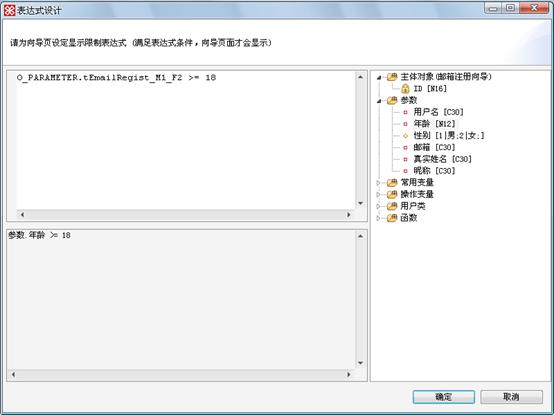

图4.20.17显示限制表达式设计

5.我们在”安全设置”向导页中，为该向导页的验证属性设置验证表达式。若真实姓名和昵称为空，则无法通过验证进行下一步操作，并给出错误提示，验证表达式设计如下图：

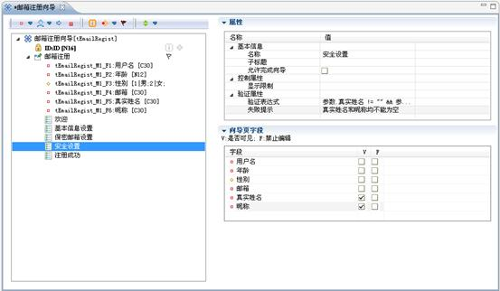

图4.20.18验证属性设计

6.我们设置”基本信息设置”向导页的展示字段为”用户名”、”年龄”、”性别”，且都是可编辑的，如下图：

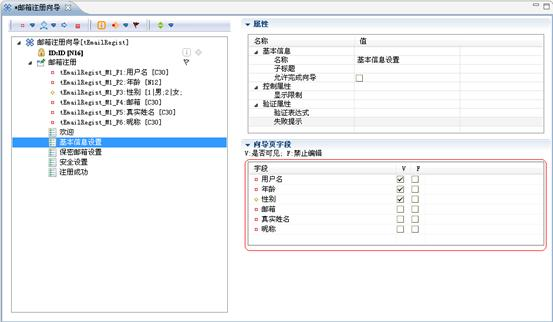

图4.20.19向导页字段设置

如图4.19.19向导页字段，可以在该属性框内设置该向导页所要展示的字段，设置展示字段的可见性和可编辑性。

向导方法的页面展示，如下图：

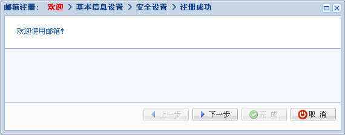

图4.20.20”欢迎”页面展示

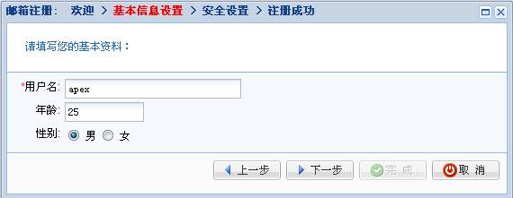

图4.20.21”基本信息设置”页面展示

注：如上图4.19.21所示，年龄所输入25，满足”保密邮箱设置”页面中的显示限制条件(年龄>=18)，因而”保密邮箱设置”页面方显示，如图4.19.22。若图4.19.21中的年龄值小于18，则图4.19.22不显示。

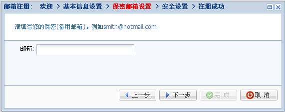

图4.20.22”保密邮箱设置”页面展示

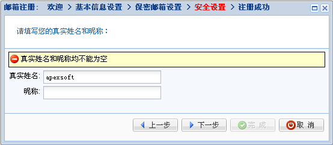

图4.20.23”安全设置”页面展示

注：如图4.19.23，若昵称选项未填写，则给出”真实姓名和昵称均不能为空”的错误信息提示。即验证表达式未通过，操作停留在当前页面，并显示错误提示信息。

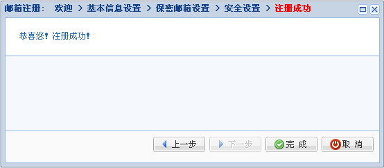

图4.20.24”注册成功”页面展示

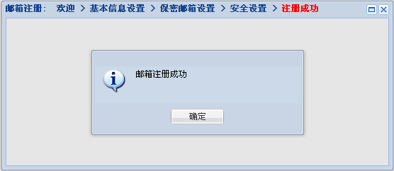

图4.20.25消息确认对话框
