# 界面逻辑事件设计

> LiveBOS Studio > 用户手册 > 业务建模设计

---

## 4.12界面逻辑事件设计

界面逻辑事件设计和以前的流程方法的设计相似。在对象的属性上，专门增加了一个事件定义功能，新增后，进入界面事件的设计界面。

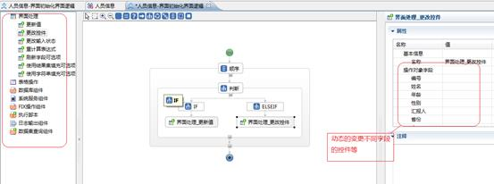

图4.21.1界面逻辑设计窗口

### 4.12.1逻辑事件定义

逻辑事件的定义支持2种类型。一种是界面初始化的逻辑事件，即当界面进行初始化时触发事件；一种是普通字段或参数的逻辑事件，即当字段值发生变化时触发相应的字段事件。逻辑事件定义不仅支持普通对象，还支持用户自定义方法（用户方法/对象流程方法）。

打开事件定义栏目（见下图），这里有2个简单的事件定义操作（新建/删除）。

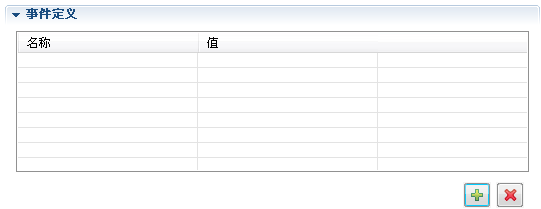

图4.21.2事件定义窗口

点击“新建”按钮，将弹出一个字段选择窗口，如下图：

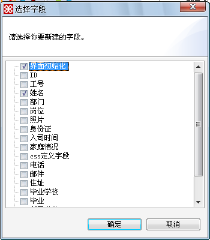

图4.21.3选择事件定义触发更新字段

这里我们选择“界面初始化”和“姓名”，点击确定后，我们会发现事件定义框中已经将他们添加进来了（如下图）

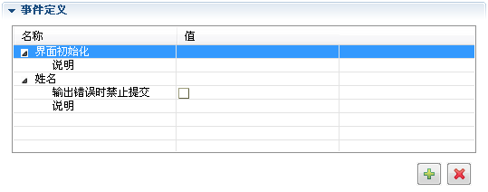

图4.21.4事件定义列表框

【操作说明】

**输出错误时禁止提交**：选中后，事件逻辑处理输出错误时界面禁止提交。

**说明**：事件逻辑的说明信息

### 4.12.2界面逻辑设计

#### 4.12.2.1新建界面逻辑

在事件定义框的“值”一栏中点击新建，或者选择一个已存在的界面逻辑。这里我们做新建操作。

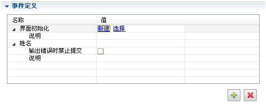

图4.21.5新建界面逻辑

系统将会弹出一个界面逻辑定义的对话框，我们可以对界面逻辑的描述和代码信息作修改，一般情况下采用系统默认。

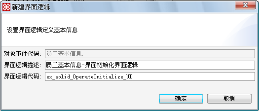

图4.21.6新建界面初始化界面逻辑

点击确定后，我们会发现左侧项目树的对象节点下多了一个界面逻辑的节点，双击这个新建的界面逻辑，打开界面逻辑设计窗口：

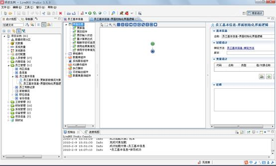

图4.21.7界面逻辑设计窗口

#### 4.12.2.2操作组件使用方法

界面逻辑的设计界面与对象流程方法的设计界面类似，这里我们将介绍界面逻辑设计器中特有的组件--界面处理。

1.更新值：变更逻辑界面的字段值

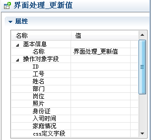

图4.21.8界面处理\_更新值属性框

**操作说明**：这里可以对操作对象字段设置属性值，若不设置则默认是字段原有值。

2.更改控件：更改逻辑界面字段的显示控件

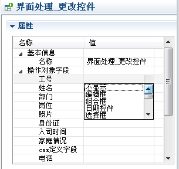

图4.21.9界面处理\_更改控件属性框

**操作说明**：这里为字段设置相应的控件，若不设置则默认是字段原有控件。

3.更改输入状态：更改界面字段的输入状态，如是否禁止输入、是否隐藏等属性。

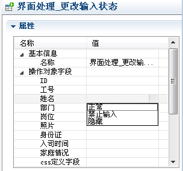

图4.21.10界面处理\_更改输入状态属性框

**操作说明**：这里为字段设置相应的输入状态，若不设置则默认是字段原有状态。

4.重计算表达式：重新计算字段中绑定列，虚拟列及预计算列的值。

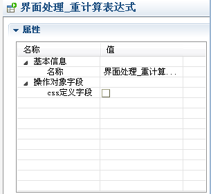

图4.21.11界面处理\_重计算表达式属性框

**操作说明**：这里为计算列字段设置是否进行重计算操作。

5.刷新字段可选项：重新根据字段取值限制来更新字段可用值。

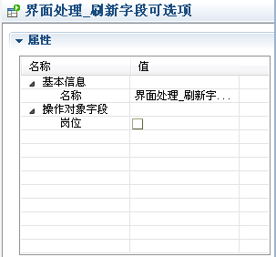

图4.21.12界面处理\_刷新字段可选项属性框

**操作说明**：这里的可选项即为选择项字段，即是否重新根据字段取值限制来更新选择项字段的值。

6.使用结果集填充可选项：使用一个结果集来更新字段可选项

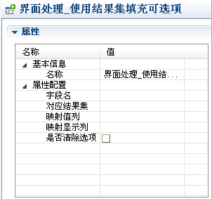

图4.21.13界面处理\_使用结果集填充可选项属性框

**操作说明：**

l字段名：可选项字段

l对应结果集：对应的结果集变量

l映射值列：可选项字段的值信息

l映射显示列：可选项字段的显示值信息

l是否清除选项

**使用说明：**

（1）新建添加一个对象集类型的变量Pv\_1

（2）添加一个数据集查询组件，将输出结果赋值到对象集类型的变量（Pv\_1）中

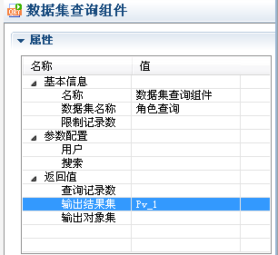

图4.21.14

（3）将已赋值的对象类型的变量（Pv\_1）添加到对应结果集选项中。

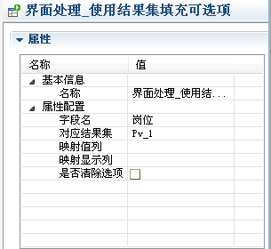

图4.21.15

7.使用字符串填充可选项：使用一个字符串的值来更新可选项.

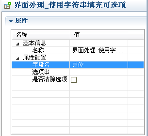

图4.21.16界面处理\_使用字符串填充可选项属性框

**操作说明**：选项串：字符串格式为:值1|说明1;值2|说明2...

8.表格操作：针对界面中的表格类型字段进行操作（获取表格/新增/修改/删除/添加结果集数据/批量修改/批量删除），同对象流程方法中的表格对象组件。设计方式同对象流程。

l获取表格：根据指定的表格对象变量可以将该表格对象中的记录以记录集或者对象集方式输出。

Ø表格字段：表格字段在宿主对象中的字段代码

Ø输出对象：输出查找到的表格对象集实例到指定的变量中

### 4.12.3简单示例

下面我们以一个简单的示例来介绍界面逻辑的设计过程。下文将通过建立一个简单的界面逻辑进一步演示界面逻辑事件的使用。在本例中，分期项目预算表工作流表单有一个表格字段项目列表，希望能够根据不同的项目分期将分期项目表中该分期下的项目名称和项目金额预先填入分期预算表的项目列表中。

实现步骤：

1.在分期项目预算表工作流表单中，打开事件定义栏，添加界面逻辑，在弹出的字段选择窗口中，选择”分期”字段，将根据这个字段值的变化触发界面逻辑事件。在随后弹出的新建对话框中输入界面逻辑描述和代码等信息后确定（一般采用默认），新建完成：

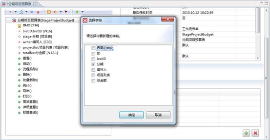

图4.21.17选择触发界面逻辑事件的字段

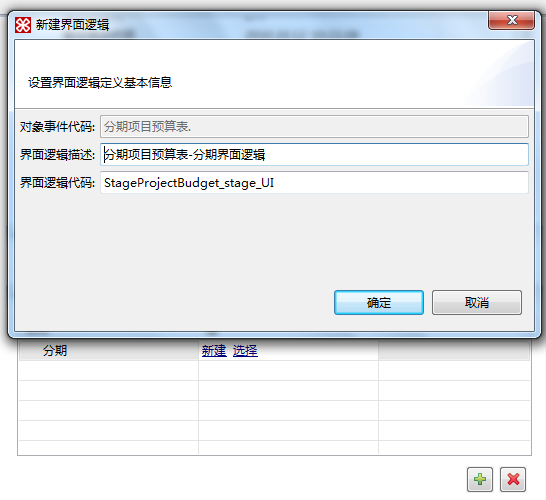

图4.21.18修改界面逻辑描述和代码

2.通过事件定义栏的链接打开界面逻辑编辑器，进入设计，如下图所示：

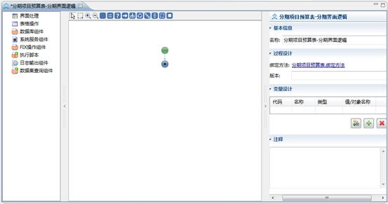

图4.21.19界面逻辑设计窗口

3.在界面逻辑编辑器中，完成设计整个界面逻辑事件的过程：

（2）首先要新建一个对象类型的变量V\_1，用来存储分期项目表的查询结果集数据。

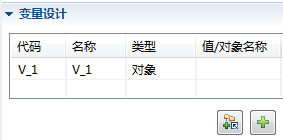

图4.21.20添加对象类型变量V\_1

（3）添加一个执行SQL查询的数据库组件，用来查询分期项目表的数据，并将结果集存储到变量V\_1中。

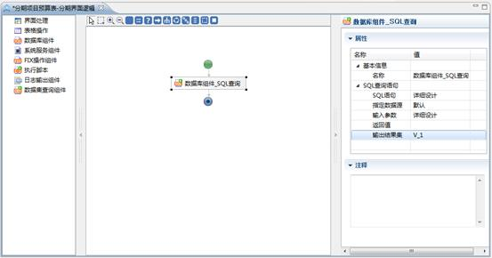

图4.21.21 SQL查询组件属性设置窗口

SQL查询语句设计如下，取出分期项目表中为当前所选分期的结果集数据：

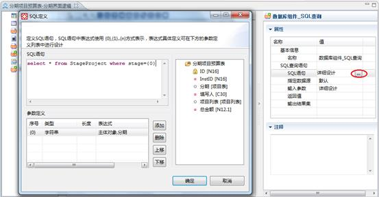

图4.21.22 SQL查询语句定义

（4）添加一个表格操作\_添加结果集数据组件，用来获取保存在V\_1变量中的结果集数据，并将结果集相应的字段值填至表格对象项目列表的字段中。

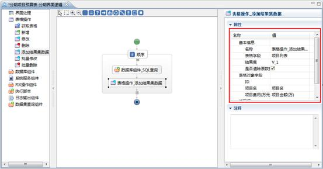

图4.21.23添加结果集数据组件属性设置窗口

（5）界面逻辑事件定义，预览效果。

分期项目表数据预览如下：

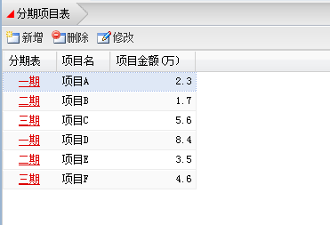

图4.21.24分期项目表数据预览

启动项目分期预算流程，分期选择一期，则项目列表会将分期项目表中一期项目的项目名和项目金额填写至表格对象项目列表中。即页面进行分期选择时，会触发分期界面逻辑事件。

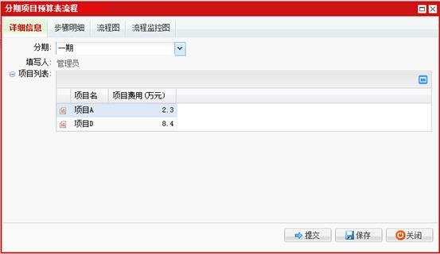

图4.21.25分期变化触发界面逻辑事件
