# 扩展按钮设计

> LiveBOS Studio > 用户手册 > 业务建模设计

---

## 4.13扩展按钮设计

### 4.13.1功能说明

Studio3.9.0版本开始新增字段扩展按钮和页面扩展按钮的支持。扩展按钮的支持使得操作界面的元素更加丰富，更大程度上满足操作界面上的复杂逻辑处理。

页面扩展按钮的属性在【操作界面】--【扩展按钮】节点配置，字段扩展按钮的属性在【展现属性】--【扩展按钮】节点配置。

下文我们将以表格字段上的字段扩展按钮为例，来介绍扩展按钮的设计及使用方式。表格字段上的扩展按钮使用有着比较重要的意义，可以实现表格字段上的自定义操作，而在以前的LiveBOS版本，都是由开发人员通过嵌入iFrame的定制方式实现。

### 4.13.2简单示例

本例中，我们假设人力资源管理系统中有这样一个实体对象“员工加班信息表”，里面记录了员工的加班信息，如图：

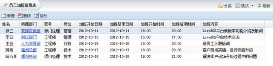

图4.22.1员工加班信息表

基于上面的实体对象建立一个查询数据集对象“加班信息统计查询”，用来查询某部门下的员工加班信息，如图：

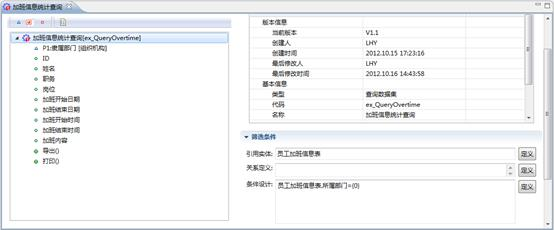

图4.22.2加班信息统计查询

建立一个“员工加班信息导入处理”的对象，该对象上添加2个字段【部门】（内部对象，引用组织机构）、【加班信息】（表格字段），我们要在“加班信息”这个表格字段上添加一个“导入员工加班信息”的扩展按钮，该按钮实现的界面逻辑是根据【部门】字段查询某部门下的员工加班信息，并将查询结果填入到【加班信息】表格对象字段中。实现方式如下：

#### 4.13.2.1为表格字段添加扩展按钮

实体对象中选中字段【加班信息】，在字段的【展现属性】--【扩展按钮】中点击详细设计按钮，打开扩展按钮设计窗口：

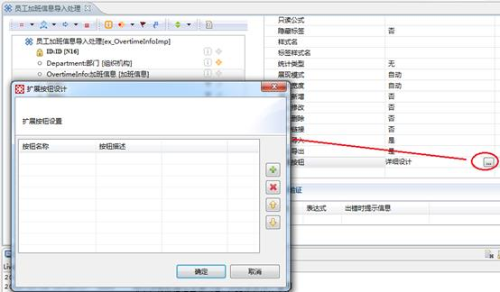

图4.22.3字段扩展按钮设计窗口

在扩展按钮设计窗口中点击添加按钮，会弹出扩展按钮新增窗口，该窗口中我们作如下设计。按钮名称改为“导入加班信息”，按钮代码和记录操作类型为系统默认，选择一个导入的图标，如图：

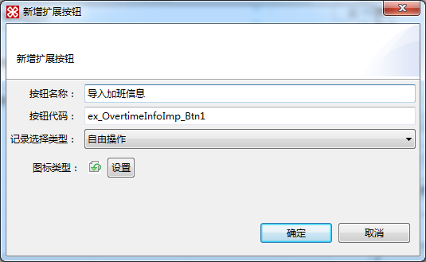

图4.22.4扩展按钮新增窗口

点击确定后，扩展按钮设计窗口如图所示：

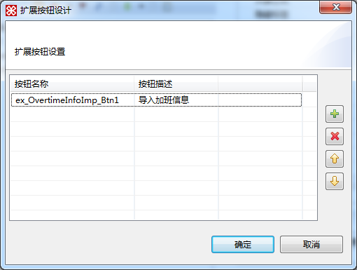

图4.22.5字段扩展按钮设计完成

#### 4.13.2.2为扩展按钮设计界面逻辑方法

打开实体对象上的界面事件定义，点击新增，我们会在弹出窗口中看到刚刚添加的扩展按钮，选中后点击确定：

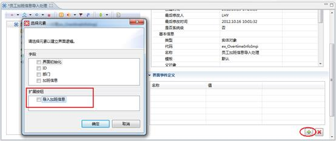

图4.22.6为扩展按钮添加界面事件定义

为“导入加班信息”扩展按钮新建界面逻辑，打开界面逻辑设计界面，我们做如下设计：

（1）首先新建一个结果集类型的变量V\_1。用来存储“加班信息统计查询”的结果集数据。

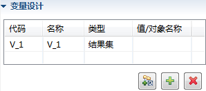

图4.22.7添加结果集变量

（2）添加一个【对话框组件】--【数据集记录选择框】组件。在弹出的窗口中选择 “加班信息统计查询”结果集对象。该组件用来获取查询结果，并将结果集返回值存储到变量V\_1中。

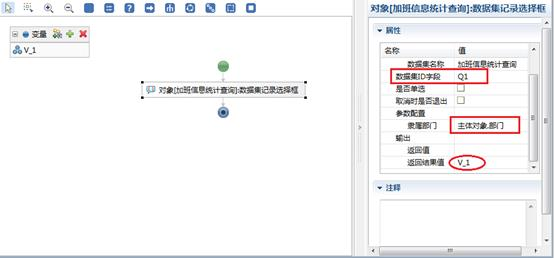

图4.22.8添加【数据集记录选择框】组件

这里还需要注意的是，数据集ID字段应与查询数据集的ID显示字段的代码做映射。如果这里添加的是SQL数据集，且SQL语句的查询结果中包含ID字段，这里可以不用填写。

这里的参数配置，即是将**主体对象****.****部门**字段的值传给“加班信息统计查询”的查询参数**隶属部门**。

（3）添加一个【表格操作】--【添加结果集数据】组件。在弹出窗口中选择当前主体对象的表格字段“加班信息”。该组件用来获取保存在V\_1变量中的结果集数据，并将结果集相应的字段值填写到表格对象的字段中。

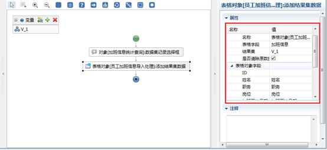

图4.22.9为表格增加【添加结果集数据】组件

（4）扩展按钮的界面逻辑设计完成后，我们可以预览下“员工加班信息导入处理”中扩展按钮的展现效果。“员工加班信息导入处理”对象中点击新增，在弹出页面中，我们可以看到“加班信息”的表格字段中多了一个“导入加班信息”的按钮。部门中我们选择一条数据，然后点击“导入加班信息”按钮。

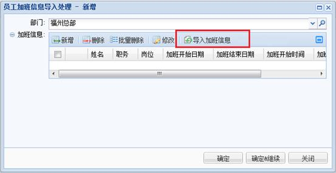

图4.22.10表格字段里扩展按钮的展现界面

此时会弹出一个“加班信息统计查询”的对话框，选中几条记录后，点击确定。

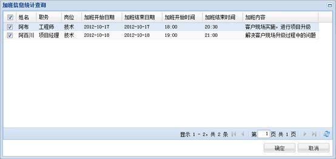

图4.22.11数据集记录选择对话框

这时我们会看到上图中选中的几条记录已经填写到表格字段“加班信息”中了。

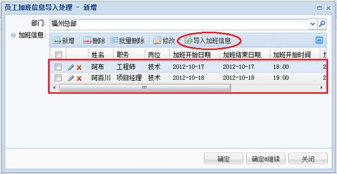

图4.22.12导入加班信息成功
