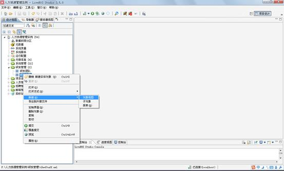
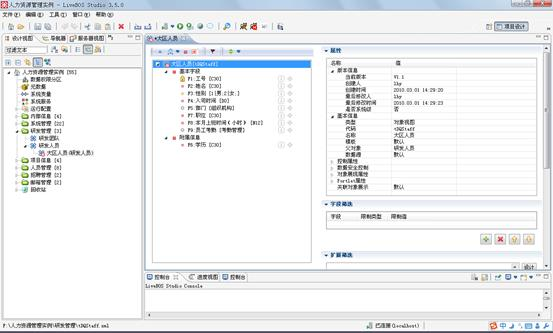
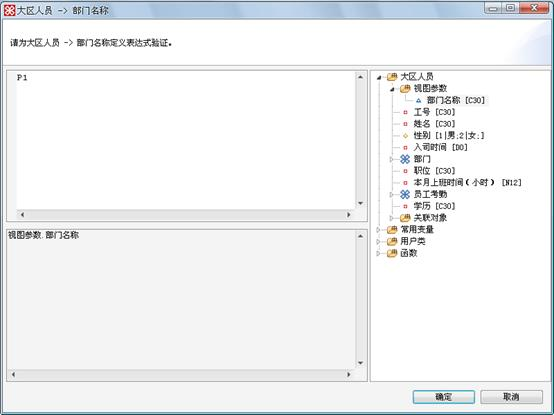
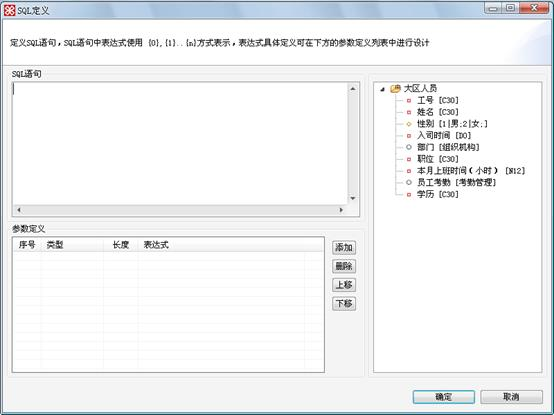

# 对象视图设计

> LiveBOS Studio > 用户手册 > 业务建模设计

---

## 4.14对象视图设计

### 4.14.1说明

对象视图必须依附于一个实体对象建立，但它不同于数据库意义上的视图，它是在对象基础上，进行记录的筛选，在视图上，可以定义自己特定的操作。对象视图本身在数据库中并不产生实际的数据存储。

当用户想对某个对象的所有记录进行查询，但又不想对这些记录进行修改的时候，可以使用对象视图。视图可以继承它源对象的的一些属性，如方法，展现方式，但是，视图也可以有自己的方法，展现方式等。如基于“研发人员”建立一个“大区员工”。

### 4.14.2实现步骤

**1.**在“研发管理”包下的对象列表中，选择“研发人员”，右键点击后选择“新建”à“对象视图”，弹出如下图：

图4.23.1新建基于“研发人员”对象上的对象视图

图4.23.2新建基于“研发人员”对象上的对象视图“大区人员”

【栏目说明】

l常规属性：和实体对象的常规属性相同。

l基本信息：和实体对象的基本信息相同。

l控制属性：和实体的控制属性基本相同。

Ø是否使用源对象字段权限：标识实体字段权限是独立还是依附于源对象。

l数据安全控制：和实体的数据安全控制基本相同。

l对象展现属性：和实体的对象展现属性基本相同

Ø直接查询：是否直接根据默认参数进行查询并显示结果，而无需用户点击查询按钮。

Ø操作界面à参数表单支持局部刷新：参数表单是否进行局部刷新。

lPortlet属性：和实体的数据的Portlet属性相同。

l字段筛选：通过设定字段的限制条件筛选对象数据，只用于基本字段类型的限制。字段的限制类型包括：等于、不等于、小于、小于等于、大于、大于等于、范围（逗号分隔）、其中一个（逗号分隔）、非其中一个等。其中比较关系（大于小于等于等）较好理解；范围：在范围内，其中一个：字段值是枚举的多个值其中，非其中一个：字段值不在枚举的多个值中。

l扩展筛选：设计条件表达式，将过滤掉不满足条件的记录。

**2.**如果这个视图有设置参数，这个参数的设计方式和实体的字段设计方式相同，参数设计好之后，则在这个视图字段限制值中就可以引用这个视图的参数，这样就可以通过字段和输入的参数的关系限制来筛选记录，也可在扩展筛选的筛选条件中引用参数值。如新增加一个“部门名称”的参数，则用户在编辑这个对象视图的时候就可以通过输入“部门名称”进行判断操作。如下图：

图4.23.3新建的视图参数的表达式验证

**3.**作为对象视图最常用的筛选条件设计，用户可以在图4.21.2中选择“扩展筛选”，然后在弹出的窗口中进行对对象实例的条件判断，如下图：

图4.23.4在对象视图中对对象记录进行筛选

弹出框内的按钮功能和对象细分中的按钮功能一致，详细信息可以在章节4.15.5中查看。
