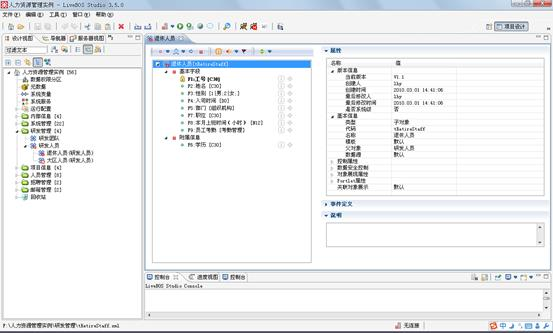
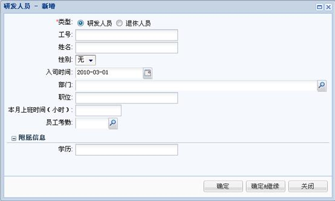
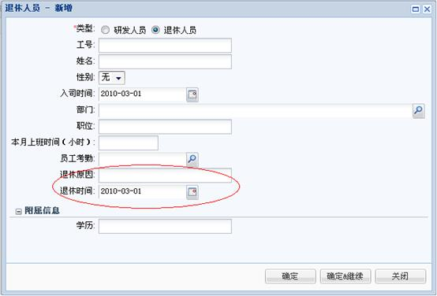

# 子对象设计

> LiveBOS Studio > 用户手册 > 业务建模设计

---

## 4.15子对象设计

在一个源对象（在此情况下，源对象称为父对象）基础上扩展属性、操作而产生的对象，称为子对象。一个父对象可以派生出多个子对象。多个子对象一般用于描述统一类型信息但又有类别差异的信息，如研发人员下的退休人员信息。因此子对象继承了父对象的所有字段和方法，并可以根据实际情况的需要更具体地定义自己的字段和方法。

右键点击研发人员，我们把研发人员对象作为父对象，选择“新建”à“子对象”，并命名为“退休人员”，得下图：

图4.24.1子对象“退休人员”编辑页面

之后可在退休人员对象中扩展自己的属性和方法，例如新增退休原因、退休时间的字段等。

父子对象展现如下图：

图4.24.2父对象展现页面

图4.24.3子对象展现页面
