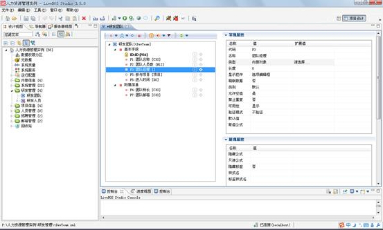
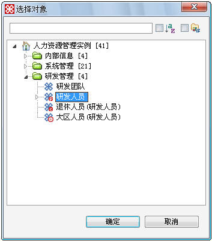
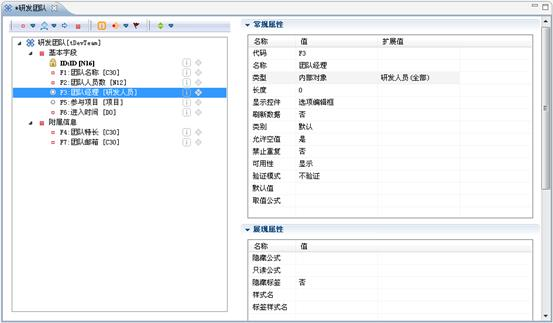

# 内部对象字段设计

> LiveBOS Studio > 用户手册 > 业务建模设计

---

## 4.16内部对象字段设计

内部对象字段描述一种对象与对象间的关联关系（对象引用另一对象表的一条或多条数据），用户可以通过编辑内部对象的扩展值，来选择这个对象的关联对象。

在下例中我们想为“研发团队”对象增加一个叫“团队经理”的内部对象。新建一个普通字段，然后对这个字段进行编辑，在字段类型中选择“内部对象”，编辑扩展值，在弹出框内选择“研发人员”，就建立起了这两个对象之间的相互关联。如图4.23.1～图4.23.3所示：

图4.25.1新建一个内部对象

图4.25.2选择要关联的对象

图4.25.3关联好了的对象
