# 模板对象设计

> LiveBOS Studio > 用户手册 > 业务建模设计

---

## 4.17模板对象设计

为了让应用开发更高效，LiveBOS将常用的具有类似属性操作的对象归纳成模板对象。开发人员在设计一个对象时，若基于预先设定的对象模式的基础上设计，则已具备LiveBOS系统定义好的模板特性。目前LiveBOS预先定义了层次模板、新闻对象模板、试卷模板、调查问卷模板、投票模板等多种模板。

### 4.17.1层次模板

层次模板的数据是按层次关系组织的，并且展示时需要体现上下级的关系。该模板保留字段有上级节点、节点类型、节点级别、组织名称和上级域编码等字段。

选择一个包，右键点击，选择新建à对象à实体对象，在弹出的新建实体对象对话框（见下图）中设置名称为层次，模板选择层次模板，表名更改为ex\_hierarchy。

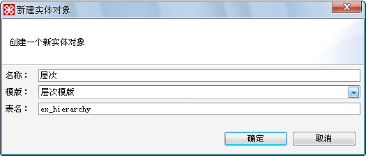

图4.26.1新建层次模板对象对话框

点击确定后，在左侧设计树中双击新建的层次对象，我们可查看该模板的保留字段，如下图：

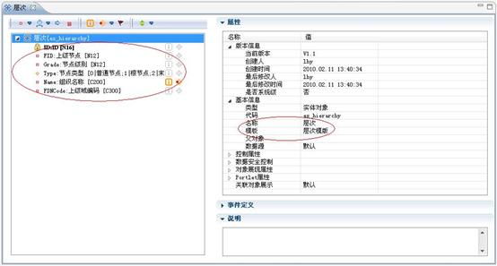

图4.26.2查看层次模板对象保留字段

将层次对象提交到应用服务管理器，在该对象页面执行新增操作，新增完成后可查看该对象展现，如下图所示：

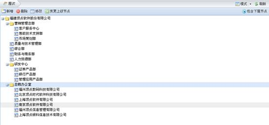

图4.26.3层次模板对象展现

### 4.17.2新闻模板

新闻模板中包含4个对象，新闻、新闻附件、新闻评论和新闻类别。新闻对象，作为新闻模板展现的主要方式，该模板数据以常见新闻方式来发布或者匿名发布，并可发表评论、匿名发布评论或引用评论等；新闻评论，作为新闻模板评论信息的载体。

1.建立新闻模板对象：选择一个包，右键点击，选择新建à对象à实体对象，在弹出的新建实体对象对话框（见下图）中设置名称为新闻模板对象，模板选择新闻模板，表名更改为ex\_news。

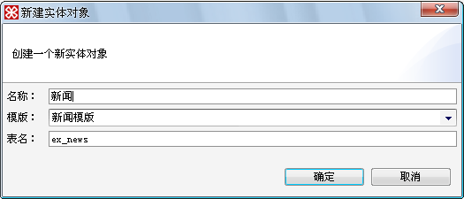

图4.26.4新建新闻模板对象对话框

点击确定后，我们会发现左侧设计树中多出4个对象节点，分别为新闻、新闻\_附件、新闻\_评论和新闻\_分类，这4个对象全部隶属于新闻模板对象。双击打开这些对象，我们可以分别查看他们的保留字段，展现如下图：

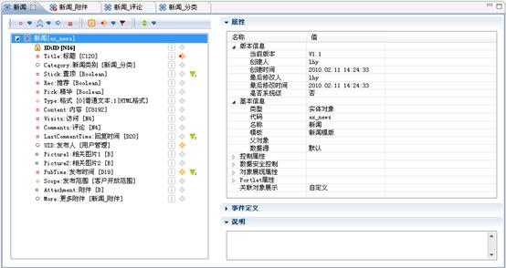

图4.26.5新闻保留字段

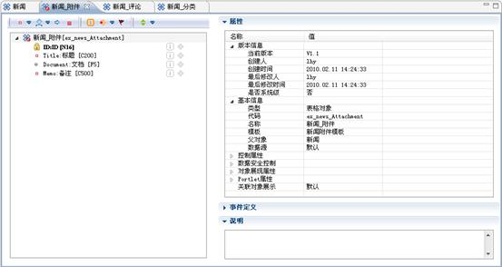

图4.26.6新闻\_附件保留字段

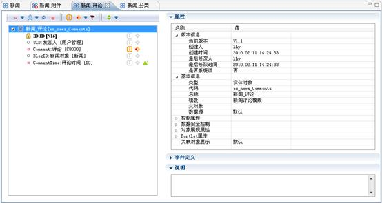

图4.26.7新闻\_评论保留字段

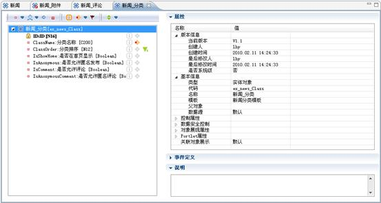

图4.26.8新闻\_分类保留字段

2，新闻模板展示，如下图：

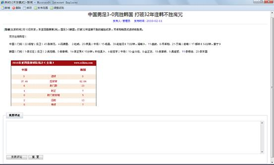

图4.26.9新闻

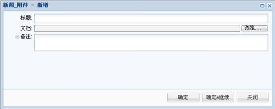

图4.26.10新闻\_附件

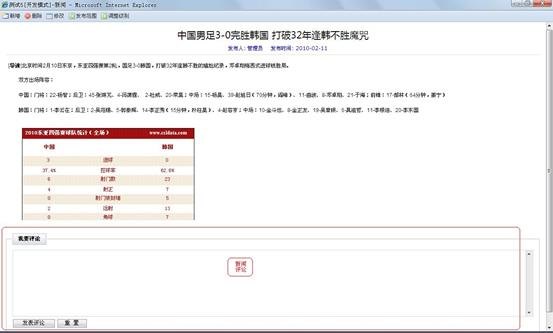

图4.26.11新闻\_评论

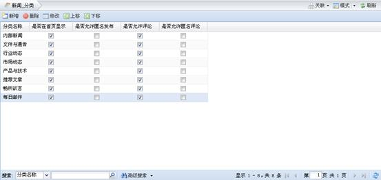

图4.26.12新闻\_分类

### 4.17.3调查问卷模板

调查问卷模板中包含5个对象，题库、问卷、题目、回复和答案。题库对象，该模板主要配合调查问卷模板使用，调查问卷模板从题库中选取题目；问卷，该模板建立调查问卷，配合题目模板使用，从题库中获取数据作为调查问卷的题目展现；题目，该模板由调查问卷调用；回复，调查问卷回复模板配合调查问卷模板使用，答案模板作为该模板的载体；答案，答案模板包含答案内容描述，作为调查问卷回复模板的载体使用。

1.建立调查问卷模板对象：选择一个包，点击右键，选择新建à对象à实体对象，在弹出的新建实体对象对话框（见下图）中，设置名称为问卷，模板选择调查问卷模板，表名为ex\_QuestionnaireBase。

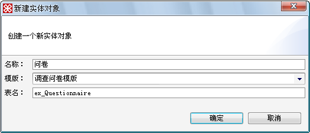

图4.26.13新建题库模板对象对话框

点击确定后，我们会发现左侧设计树中多出5个对象节点，分别为问卷\_题库、问卷、问卷\_题目、问卷\_回复和问卷\_答案，这5个对象全部隶属于调查问卷模板对象。双击打开这些对象，我们可以分别查看他们的保留字段，展现如下图：

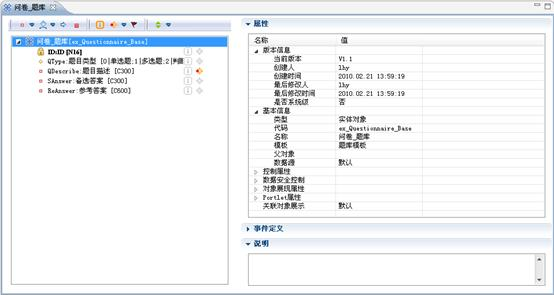

图4.26.14问卷\_题库保留字段

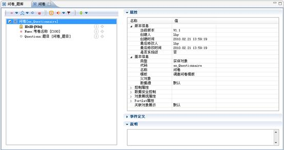

图4.26.15问卷保留字段

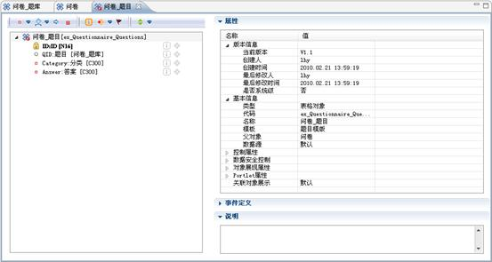

图4.26.16问卷\_题目保留字段

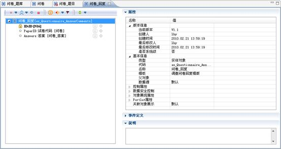

图4.26.17问卷\_回复保留字段

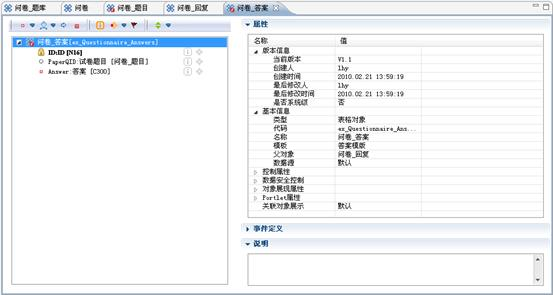

图4.26.18问卷\_答案保留字段

2.调查问卷模板对象展现，如下图：

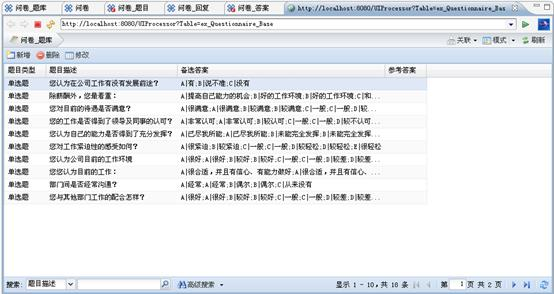

图4.26.19问卷\_题库

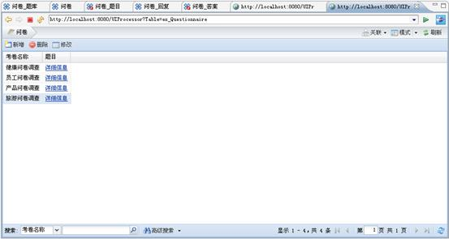

图4.26.20问卷

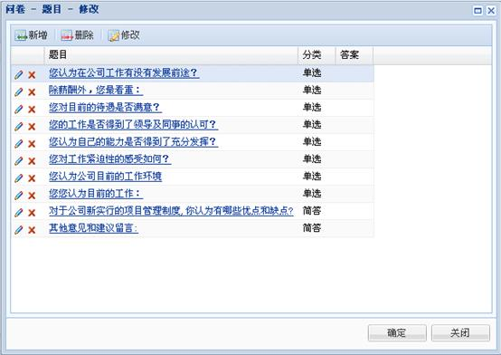

图4.26.21问卷\_题目

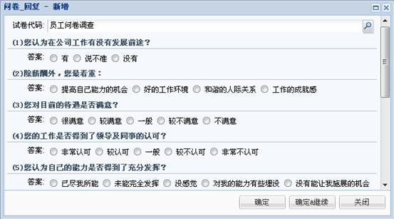

图4.26.22问卷\_回复

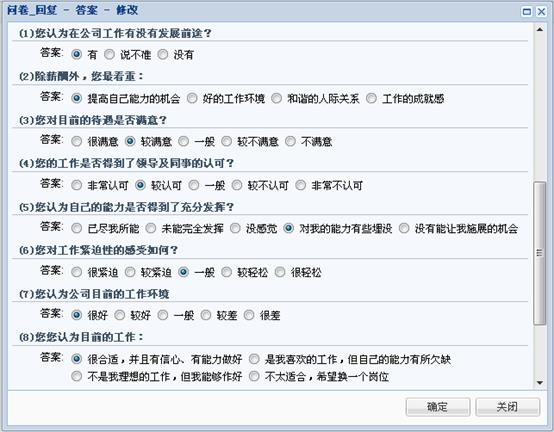

图4.26.23问卷\_答案

### 4.17.4考卷模板

考卷模板中包含5个对象，题库、考卷、题目、答题纸和答案。使用方法基本同调查问卷模板。

1、建立题库模板对象：选择一个包，点击右键，选择新建à对象à实体对象，在弹出的新建实体对象对话框（见下图）中，设置名称为考卷，模板选择考卷模板，表名为ex\_ExamPaper。

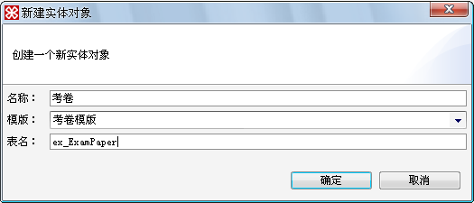

图4.26.24新建题库模板对象对话框

点击确定后，我们会发现左侧设计树中多出5个对象节点，分别为考卷\_题库、考卷、考卷\_题目、考卷\_答题纸和考卷\_答案，这5个对象全部隶属于考卷模板对象。双击打开这些对象，我们可以分别查看他们的保留字段，展现如下图：

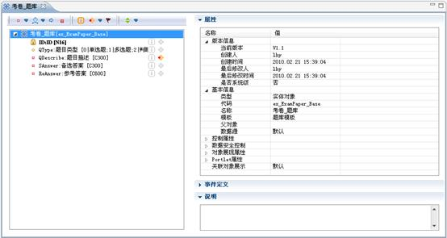

图4.26.25考卷\_题库保留字段

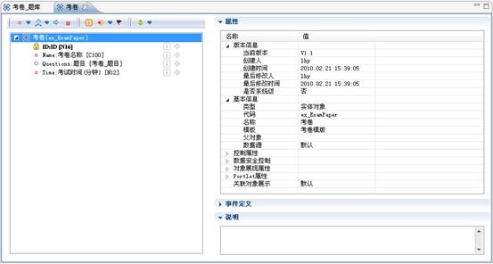

图4.26.26考卷保留字段

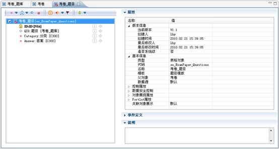

图4.26.27考卷\_题目保留字段

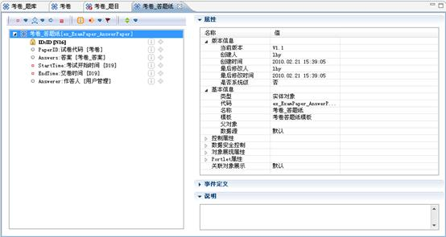

图4.26.28考卷\_答题纸保留字段

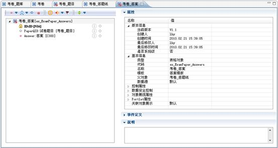

图4.26.29考卷\_答案保留字段

2、试卷模板对象展现，如下图：

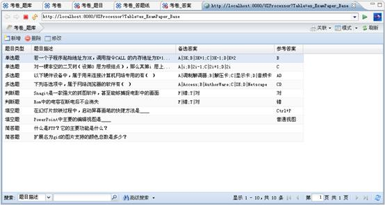

图4.26.30考卷\_题库

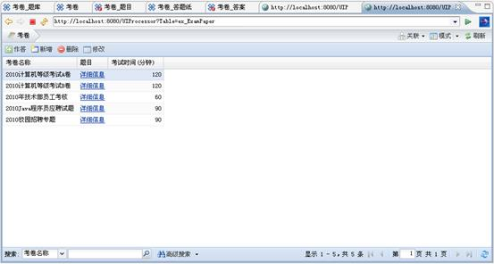

图4.26.31考卷

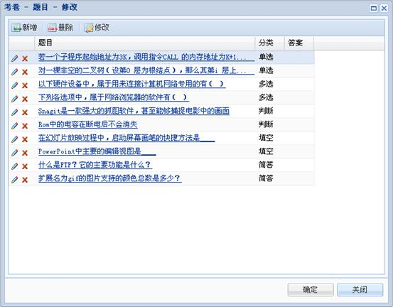

图4.26.32题目模板对象

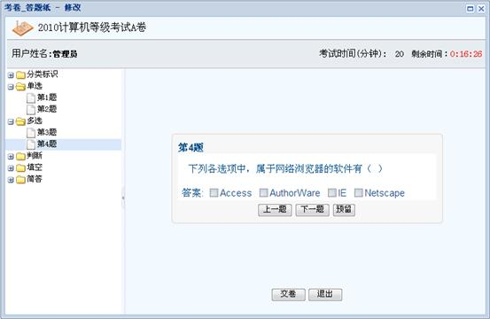

图4.26.33考卷\_答题纸

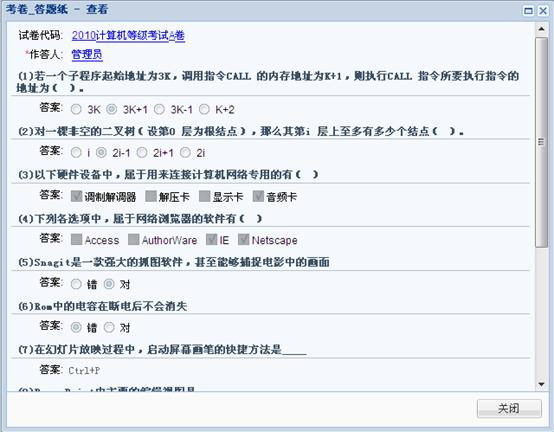

图4.26.34考卷\_答案

### 4.17.5投票模板

投票模板中包含3个对象，投票、投票选项和投票结果。投票对象，可以让用户快速地对相关主题以投票形式进行调查；投票选项，即参与投票主题的相关选项，与投票模板配合使用，可单选也可多选；投票结果，即投票模板的结果，对票数进行统计的结果展示。

1.建立投票对象：选择一个包，右键点击，选择新建à对象à实体对象，在弹出的新建实体对象对话框（见下图）中，设置名称为投票，模板选择投票模板，表名为ex\_Vote。

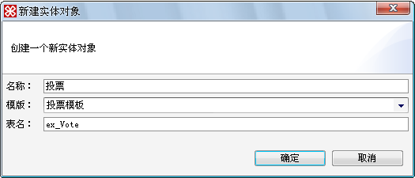

图4.26.35新建投票模板对象对话框

点击确定后，我们会发现左侧设计树中多出3个对象节点，分别为投票、投票\_选项和投票\_结果，这3个对象全部隶属于投票模板对象。双击打开这些对象，我们可以分别查看他们的保留字段，展现如下图：

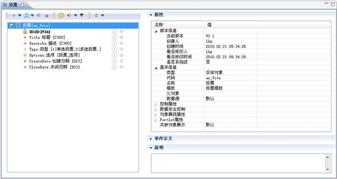

图4.26.36投票保留字段

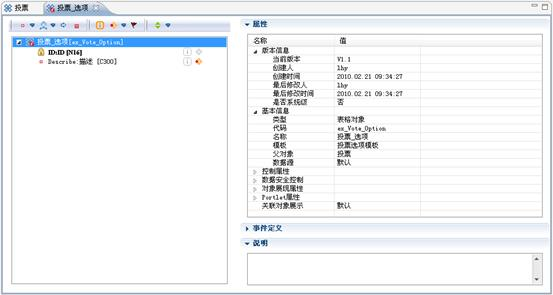

图4.26.37投票\_选项保留字段

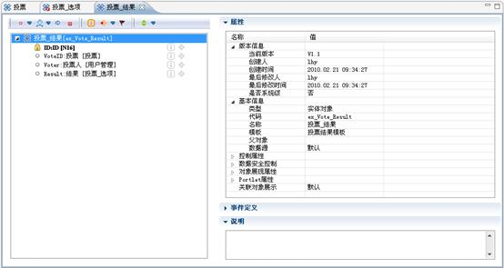

图4.26.38投票\_结果保留字段

2.投票模板展示，如下：

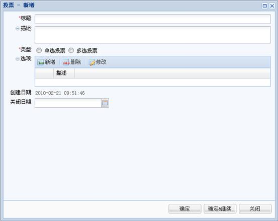

图4.26.39投票新增

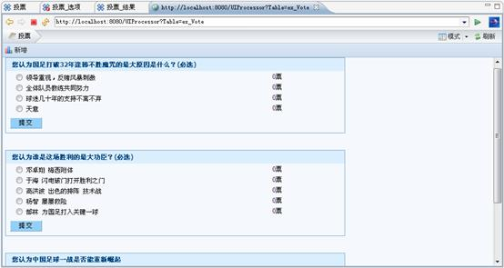

图4.26.40投票

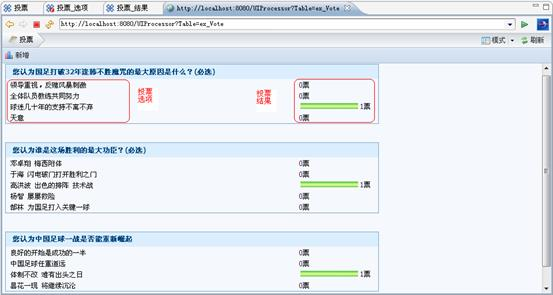

图4.26.41投票结果
