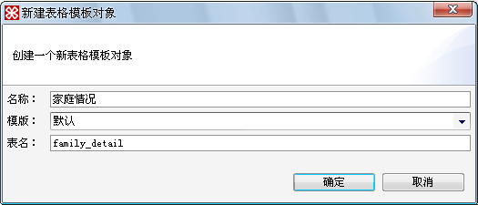
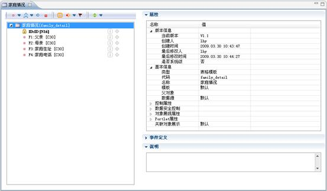
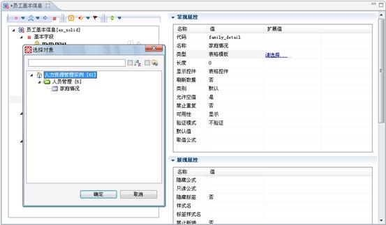
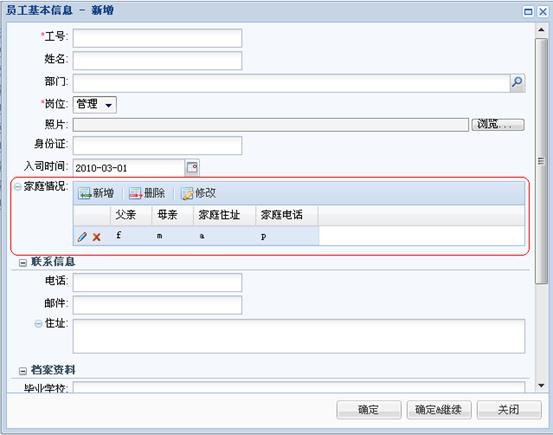

# 表格模板对象设计

> LiveBOS Studio > 用户手册 > 业务建模设计

---

## 4.18表格模板对象设计

表格模板对象，普通实体对象的一种，类似表格对象，但可依附在不同的对象上，作为对象的属性，可以对其数据进行维护。并可被多个对象以表格方式引用，其数据可全部或经筛选后预先填至表格中（通过建立表格模板视图或通过字段限制，实现预设的数据根据相关字段变化而变化）。

存放表格模板数据的数据表为模板对象表名，而引用表格模板字段的数据表则为[对象名\_字段名\_表格模板名]。

下面的例子中我们将建立一个“家庭情况”表格模板对象，并通过“员工基本信息”对象的字段引用表格模板对象。

左侧项目树中选中“人员管理”包节点，点击右键，在弹出菜单中选择新建à对象à表格模板对象。

图4.27.1新建表格模板对象对话框

点击确定后，在左侧项目树中双击打开新建的表格模板对象，为该对象设计字段。如下图：

图4.27.2表格模板对象字段展示

打开员工基本信息对象，并添加一个表格类型的字段“家庭情况”，修改字段类型为“表格模板”，扩展值选项中选择新建的表格模板对象“家庭情况”。如下图：

图4.27.3扩展值中选择表格模板对象

表格模板对象依附于实体对象上的展现如下图所示：

图4.27.4表格模板对象展现
