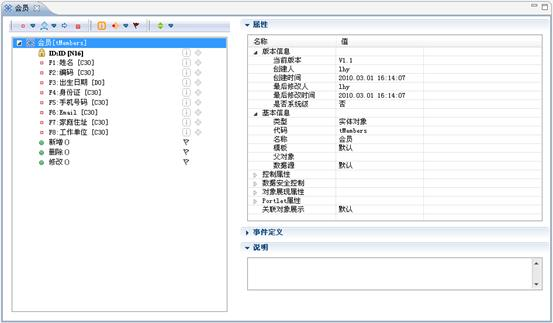
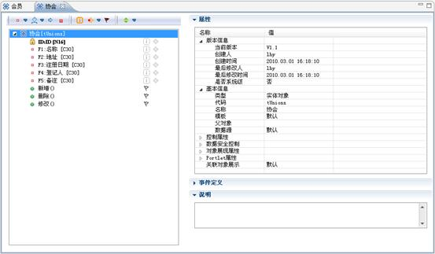
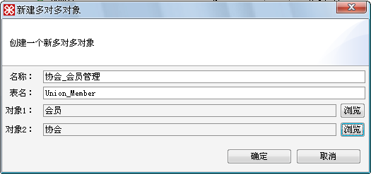
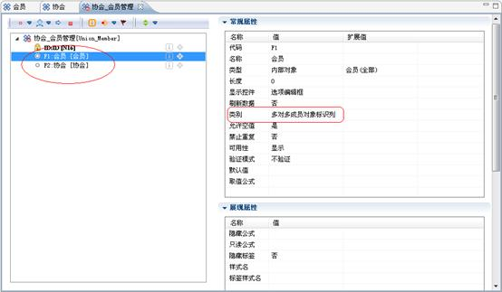
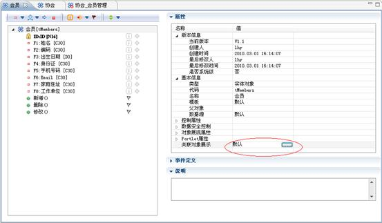
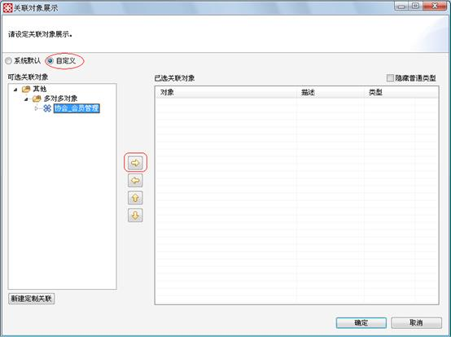
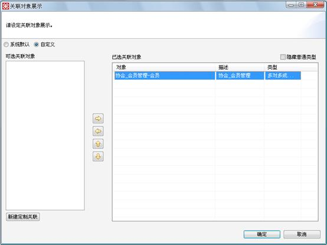
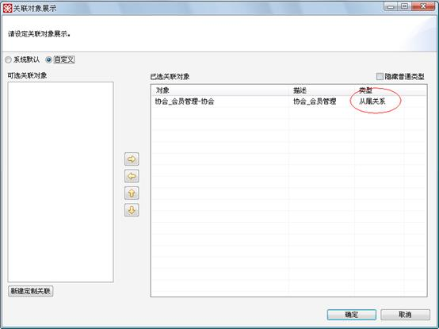
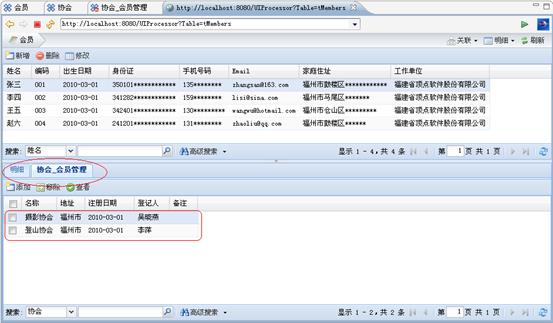
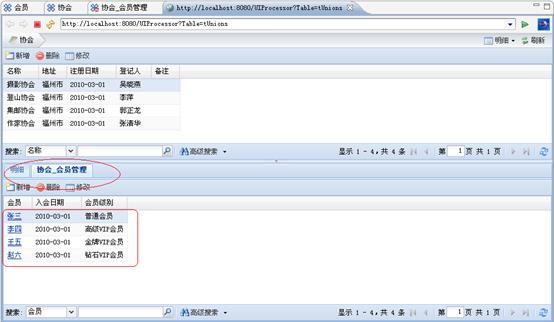

# 多对多对象设计

> LiveBOS Studio > 用户手册 > 业务建模设计

---

## 4.19多对多对象设计

多对多对象，本质上也是一个实体，适用于对象之间的关联是一种N-N方式的。比如：用户和角色之间，即一个用户可以拥有多个角色，一个角色可以分配给多个用户。这种关联方式的场合则适合通过多对多的方式来实现，同时，多对多对象也是存放这两个多对多关系的一个容器。

在下例中，我们设计一个多对多对象的实例，例如：一个会员可以同属于多个协会，而一个协会中又可包含多个会员。其会员与协会即为多对多对象。建立步骤如下：

**1.**新建一个实体对象，实体对象名为会员，为该实体对象新增字段：姓名、编码、出生日期、身份证、手机号码、Email、家庭住址、工作单位等字段，具体设计如下图：

图4.28.1会员对象字段编辑页面

新建一个实体对象，实体对象名为协会，为该实体对象新增字段：名称、地址、注册日期、登记人、备注字段，具体设计如下图：

图4.28.2协会对象字段编辑页面

**2.**新建一个多对多对象，选择新建à对象à多对多对象，在弹出的对话框（见下图）中设置名称为协会\_会员管理，表名更改为Union\_Member，对象1选择第一步建立的会员对象，对象2选择第二步建立的协会对象。

图4.28.3新建多对多对象对话框

点击确定后，在左边项目树中，双击协会会员管理对象，可看到该对象已包含了两个字段，即对象1（会员）和对象2（协会）。以上两个字段限制属性系统默认为多对多成员对象标识列。如下图：

图4.28.4多对多对象字段编辑页面

为该多对多对象添加其他字段，如入会日期、会员级别等字段，其中会员级别为选择项字段，其扩展值设置为：1|普通会员;2|VIP会员;3|高级VIP会员;4|金牌VIP会员;5|钻石VIP会员;

**3.**添加多对多关联，选择会员对象，在其属性设置栏中设置关联对象展示，如下图：

图4.28.5为成员对象添加关联

点击上图中的选择按钮，则会弹出如下所示的对话框，在对话框中选择自定义按钮，可选关联对象选择协会会员管理对象，点击图中的添加按钮：

图4.28.6关联对象添加窗口

添加完成后，即可看到协会会员管理多对多对象已经与它的成员对象会员建立起关联。在已选关联对象属性框中，选择关联类型为多对多成员关系，设置如下图：

图4.28.7添加关联对象成功

协会与协会\_会员管理的关联建立同上，关联的类型选择“从属”。

**4.**多对多对象展现：如图所示会员对象展现，我们可以查看到会员张三加入了摄影协会和登山协会。

图4.28.8多对多对象展示页面1

如下图所示协会对象展现，我们可以查看到摄影协会拥有4名会员。

图4.28.9多对多对象展示页面2
