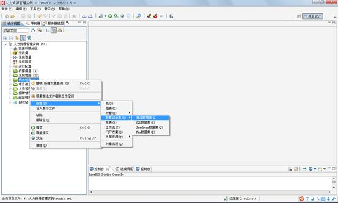
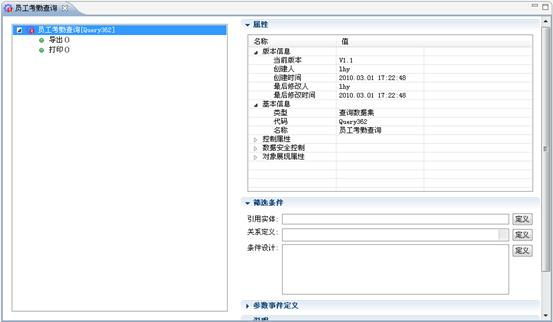
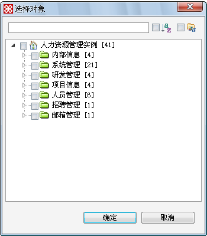
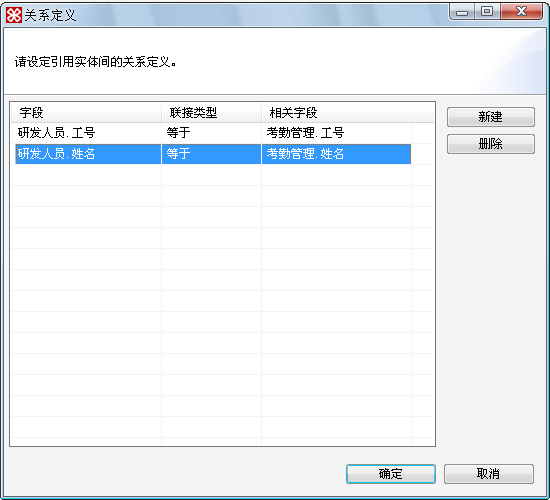
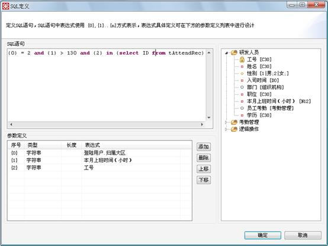
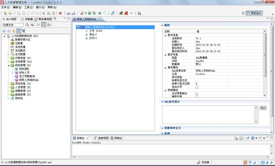
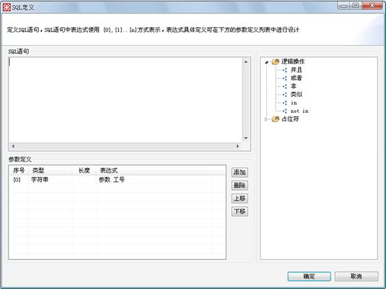
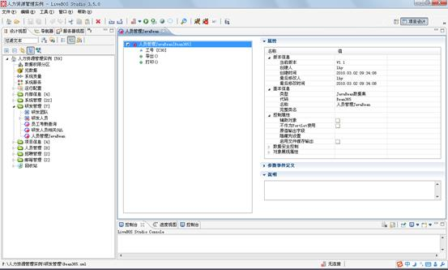

# 数据记录集设计

> LiveBOS Studio > 用户手册 > 业务建模设计

---

## 4.20数据记录集设计

### 4.20.1说明

数据记录集的作用是存放与对象相关的数据，或者本身就是与数据有关联的对象，如在线用户查询和合同金额查询等等。数据的基本属性用来控制数据的展现、操作和记录的安全性。用户可以通过数据记录集对对象进行查询，并且在存储过程中可以根据数据库种类的不同而采用不同的存储方式，方便了对数据的存储管理。

### 4.20.2建立查询数据集

查询数据集对对象数据进行查询，引入一个或多个对象，然后根据对象的属性进行对象的关系定义和条件设计。在本例中，我们希望在研发管理包内建立一个能够查看研发人员考勤状态的查询结果集，并为之命名为“员工考勤查询”。

右击“研发管理”包，选择“新建”à“数据记录集”à“查询数据集”，在弹出框内输入“员工考勤查询”（见下图）

图4.29.1新建查询结果集

图4.29.2查询结果集编辑页面

**栏目说明**

l数据属性：详细信息请查看下表

表4.42数据属性说明

|  |  |  |
| --- | --- | --- |
| 控制属性 | 全记录集输出 | **在查询数据时将全部记录取出并以分页的方式显示输出** |
| 辅助对象 | **该查询数据集只在被引用时使用，不能进行基本的授权，关联菜单使用** |
| 不作为Portlet使用 | **不能作为****Portlet****放置在门户上** |
| 原值输出字段 | **不对字段输出的值进行格式化。如数据记录集中有构造****html****标签的字段时，该功能会将****html****标签字段原样输出** |
| 隐藏列设置 | **展示时****，****这些列不显示****，****一般用于配合数据集辅助筛选****，****将一些内部的****ID****列隐藏** |
| 启用文件缓存输出 | **报表打印是否启用临时文件缓存，默认为****false****，大报表应该设置成****true** |
| 数据安全控制 | 要求安全保护 | **必须通过****SSL****安全连接才能访问对象数据** |
| 允许WebService调用 | **是否允许****WebService****调用** |
| 对象展现属性 | 直接查询 | **访问数据记录集时，不用点查询按钮便可查询数据** |
| 布局方案 | **同对象布局方案** |
| 显示模式 | **报表浏览模式或者表格浏览模式** |
| 参数表单布局方案 | **数据记录集参数的布局方案** |
| 每页显示行数 | **每页显示的查询记录行数** |
| 网格CSS定义 | **为数据记录集定义****css****选择符，同普通实体对象** |
| 网格CSS资源路径 | **为数据记录集定义****css****选择符的文件路径，同普通实体对象** |

l说明：对这个数据记录集的注释。

l筛选条件：对对象的筛选查询。

（1）引用实体：确定针对哪些对象进行筛选操作，点击“定义”按钮出现下图：

图4.29.3查询集中确定对哪个对象进行查询

（2）关系定义：对选择好了的对象数据进行第一次关联定义（即表与表之间的连接），在上图中，我们同时选择了研发人员和考勤管理两个对象，在下图中我们对这两个对象进行第一次的关联：

图4.29.4对选中的对象进行第一步关联

（3）条件设计：对关联好了的数据进行表达式定义：

图4.29.5对关联好的对象进行表达式设计

### 4.20.3建立SQL数据集

SQL结果集为创建起来的每一个对象定义SQL语句并进行处理，根据语句类型的不同而选择不同的执行方式。

右击“研发管理”包，选择“新建”à“数据记录集”à“SQL数据集”，打开SQL数据集的编辑窗口（见下图）：

图4.29.6 SQL数据集编辑窗口

**栏目说明**

l事务属性

Ø语句类型：判断当前的查询是一个存储过程，分页存储过程还是一个普通的SQL语句，如果是存储过程，那么在语句设计的时候就只要调用存储过程，如有需要传入适当的参数，如：

EXEC sp\_OA\_Vehicle\_ExpenseStat DateFrom,DateTo,Department,Vehicle;如果是普通的SQL语句，那么在SQL语句设计中就要定义出供执行的语句。

Ø数据记录集返回方式：当所用的数据库类型是ORACLE的时候，可以选用游标方式和临时表方式。

Ø结果集小数点位数：设定默认的浮点型字段显示的小数点位数。

Ø自动分页：是否自动分页

l控制属性

Ø全记录集输出：与查询数据集一致。

Ø辅助对象：与查询数据集一致。

Ø不作为Portlet使用：与查询数据集一致。

Ø原值输出字段：与查询数据集一致。

Ø隐藏列设置：与查询数据集一致。

l数据安全控制

Ø要求安全保护：与查询数据集一致。

Ø允许WebService调用：与查询数据集一致

l对象展现属性：与查询数据集一致。

图4.29.7 SQL语句设计对话框

### 4.20.4建立JavaBean数据集

JavaBean数据集可以让用户从外部引用JAVA类。右击“研发管理”包，选择“新建”à“数据记录集”à“JavaBean数据集”，打开JavaBean数据集的编辑窗口（见下图）：

图4.29.8 JAVABEAN数据集编辑页面

**栏目说明**

l完整类名：用户在这里输入想要获得帮助的完整类名，LiveBOS Studio可以通过访问来使用这些类。

l辅助对象：与查询数据集一致。

l不作为Portlet使用：与查询数据集一致。

l原值字段输出：与查询数据集一致。

l要求安全保护：与查询数据集一致。

l对象展现属性：与查询数据集一致。

JavaBean数据集的字段编辑与SQL结果集一致，详细信息请浏览上一章节。

要使用JavaBean结果集必须创建相应的JavaBean类，并将相应的class文件放在Classpath指定的路径或运行平台相应的plugins默认的路径中.

### 4.20.5建立Fix数据集

Fix数据集是用户保存自己定义的交易码的集合。右击“研发管理”包，选择“新建”à“数据记录集”à“Fix数据集”，打开Fix数据集的编辑窗口（见下图）：

图4.29.9FIX数据集编辑页面

**栏目说明**

l交易码：用户在这里输入他们的交易码

l辅助对象：与查询数据集一致。

l不作为Portlet使用：与查询数据集一致。

l原值字段输出：与查询数据集一致。

l要求安全保护：与查询数据集一致。

l对象展现属性：与查询数据集一致。

注：Fix数据集的字段编辑与SQL数据集一致，详细信息请浏览SQL数据集章节。

要使用Fix数据集必须定义相应的Fix配置文件并放入应用系统的Fix目录下。具体使用可参考**LiveBOS****高级开发例子**的文档说明。
