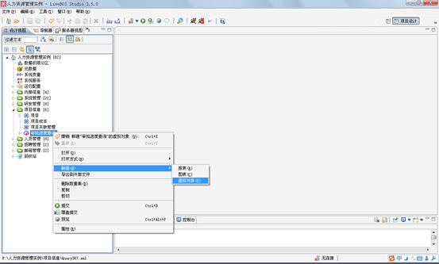
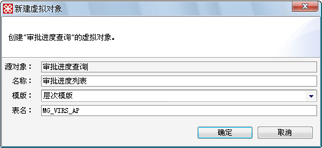
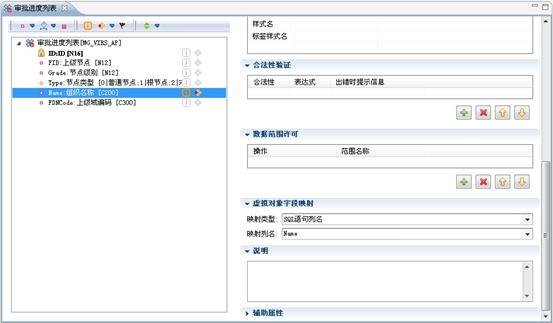
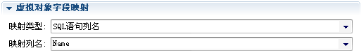

# 虚拟对象设计

> LiveBOS Studio > 用户手册 > 业务建模设计

---

## 4.21虚拟对象设计

虚拟对象是通过数据记录集构造的一个虚拟的实体对象，它拥有对象字段和操作。虚拟对象的主要用途是对数据记录集获得的目标数据进行深入的操作，使通过数据记录集获取的数据可以被用户更方便地使用。

下面的例子中我们将在查询数据集对象“审批进度查询”的基础上建立一个叫“审批进度列表”的虚拟对象，并通过“虚拟对象字段映射”属性模块来将查询数据集的字段和虚拟对象的字段进行一一映射。

点击查询数据集“审批进度查询”，在弹出菜单中选择“新建”à“虚拟对象”，在随后的弹出框内设定虚拟对象的名称、模板和表名，把名称设置为“审批进度列表”，采用层次模板，表名定义为MG\_VIRS\_AP.

**栏目说明**

l代码：对象的物理表名。

l名称：设定虚拟对象的名称。

l模板：该虚拟对象引用哪种模板，目前LiveBOS Studio支持的模板种类有：默认模板，新闻模板，文档模板，考卷模板，新闻评论模板，答案模板，层次模板，题目模板，答题纸模板，题库模板等

l父对象：该虚拟对象是依靠哪个查询数据集建立的。

打开新建好了的虚拟对象字段编辑页面，这个页面和实体对象字段相似，只不过多了一个“虚拟对象字段映射”模块，在这个模块里可以对选择出来的记录单列进行关系映射。

**重要数据属性说明**

l全记录集输出：在查询数据时将全部记录取出，并以分页的方式显示输出

l支持动态扩展列：可以将数据集中其他未映射的字段作为该虚拟对象的扩展字段.注意，这些扩展的动态列只支持列表查看，不能作为操作参数等使用。

l直接查询：访问这些对象时，不用点查询按钮便可查询数据

l操作界面à参数表单支持局部刷新：参数表单是否支持局部刷新。

**虚拟对象字段映射栏目说明**

l映射类型：当前LiveBOS Studio主要支持的是SQL语句列名和查询字段显示列，SQL语句列名指的主要是从依赖的物理表格中提取字段，而查询字段显示列，指的是从查询数据集中的提取单个字段。

l映射列名：每一个字段都可以通过在这里的设置使之与物理表的某列或者数据记录集的某个字段一一对应。

图4.30.1基于一个查询结果集对象新建一个虚拟对象

图4.30.2编辑虚拟对象的基础属性

图4.30.3虚拟对象字段编辑页面

图4.30.4虚拟对象字段映射模块
