# 图表对象设计

> LiveBOS Studio > 用户手册 > 业务建模设计

---

## 4.22图表对象设计

图表对象是通过数据记录集构造的图表类型的对象，将数据以可视化图表的形式呈现，便于进行数据的统计分析。

目前支持的图表类型有饼图、折线图、分类折线图、柱状图、分类柱状图、堆叠柱状图、仪表盘、表格等。

下面将通过例子说明图表对象的建立和使用。

### 4.22.1二维图表设计

首先建立一个仪表盘图表，本例中，通过查询记录集来构造仪表盘图表，查询记录集通过参数“公司”来取得不同公司的员工人数，建立查询记录集并设置参数和筛选条件以及普通字段“人数”的计算表达式，关于查询记录集的使用，请查看4.22.2章节。该查询记录集为“查询公司员工数情况”，如下图所示：

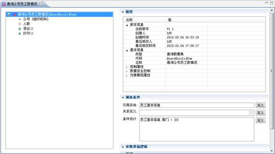

图4.31.1“查询公司员工数情况”查询记录集

根据建立的查询记录集建立图表对象“公司员工数统计”，选择图表类型为仪表盘，并设置仪表盘图表的“图表标题”、“最小值”、“最大值”等属性（详细属性说明参见下文属性说明部分）及设置值映射à值轴的映射类型为查询字段显示列、映射列名为人数，如下图所示：

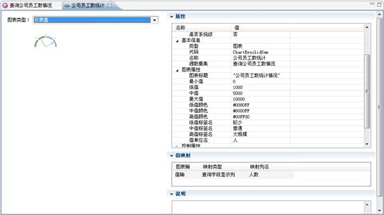

图4.31.2 “公司员工数”仪表盘图表对象

**重要数据属性说明**

l全记录集输出：在查询数据时将全部记录取出，并以分页的方式显示输出。

l直接查询：是否直接根据默认参数进行查询并显示结果，而无需用户点击查询按钮。

l每页显示记录数：允许设置每页分析的数据记录数，通过多页图表来显示统计数据

l参数表单支持局部刷新：参数表单是否进行局部刷新。

仪表盘图表对象展现如下：

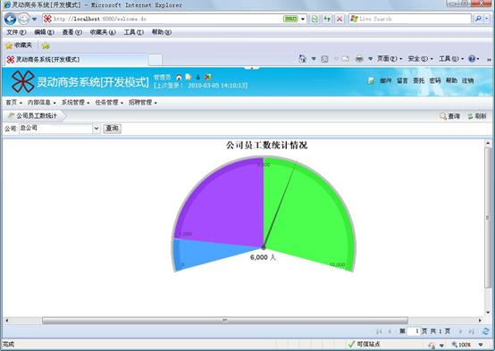

图4.31.3 “公司员工数统计情况”仪表盘图表

以上介绍了仪表盘图表的建立和使用，发现仪表盘只能统计一个列的值（本例为人数），但有些数据需要将不同标签的值也显示出来，这样容易进行比对，例如希望显示不同部门的人数，而部门这列作为标签，这样查看和分析其他部门的人数比较方便。以上需求可以通过折线图、柱状图、饼图和表格这些图表对象实现。

与仪表盘图表类似，通过数据记录集构造图表对象。建立SQL数据集“部门员工查询”，设置SQL语句为执行查询按部门分组的员工数的存储过程（SQL数据集相关说明参见4.25.3章节），如下图所示：

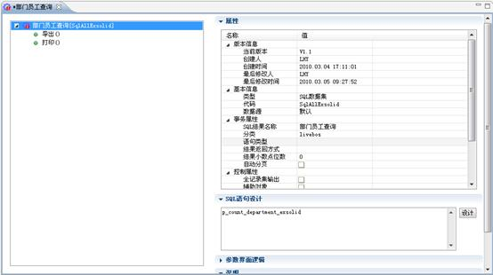

图4.31.4 “部门员工查询”SQL数据集

通过“部门员工查询”SQL数据集构造图表，以构造表格图表对象为例。建立图表对象“部门员工分布统计图表”，选择图表类型为表格，设置值轴和标签轴的映射列名为SQL语句列名、映射列名设为存储过程查询语句的列名（别名也可以，这里分别为total和ex\_solid\_department），并设置其他图表基本属性，如下图所示：

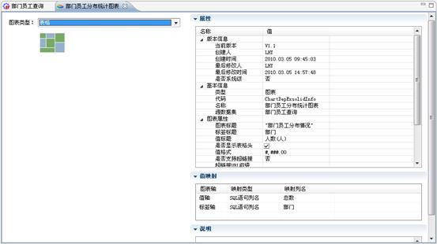

图4.31.5 “部门员工分布统计图表”表格图表对象

表格图表展现如下：

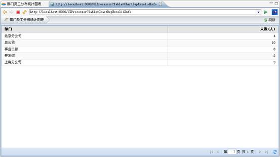

图4.31.6“部门员工分布统计图表”表格图表

若图表类型选择“饼图”，图表其他属性的设置与表格图表对象相同，如下图所示：

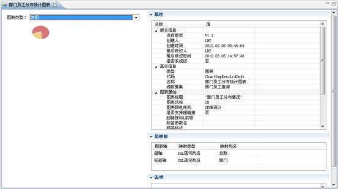

图4.31.7“部门员工分布统计图表”饼图图表对象

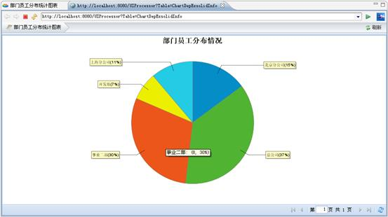

图4.31.8 “部门员工分布统计图表”饼图图表

其他图表类型展现如下：

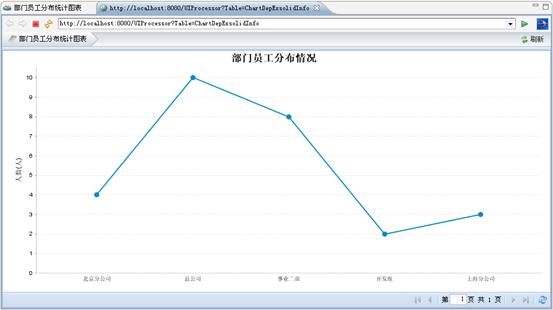

图4.31.9 “部门员工分布统计图表”折线图图表

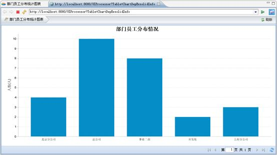

图4.31.10 “部门员工分布统计图表”柱状图表

### 4.22.2三维图表设计

上文介绍的图表的维度最多为二维，而LiveBOS还支持三维的图表，例如统计不同公司不同岗位的人数，并将数据集成到一张图表上，就需要使用分类柱状图、分类折线图、堆叠柱状图这三种图表类型。以分类折线图为例。

建立SQL数据集“公司岗位员工分布统计”，数据集查询不同公司在不同岗位的人数，如下图所示：

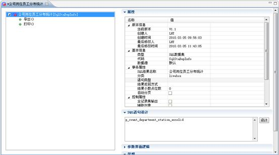

图4.31.11“公司岗位员工分布统计”SQL数据集

根据“公司岗位员工分布统计”SQL数据集建立图表对象“公司岗位员工分布情况”，选择图表类型为分类折线图，设置值轴、标签轴、分类轴的映射类型为SQL语句列名、映射类型分别为人数、部门、岗位的SQL列名（别名也可以，这里分别为：total、exs\_olid\_department、ex\_solid\_station），并设置图表基本属性，如下图所示：

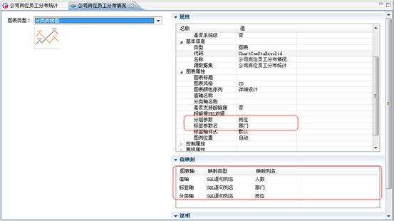

图4.31.12 “公司岗位员工分布情况“分类折线图图表对象

注意：设置值映射时，标签轴、分类轴的映射列名分别对应“属性”设置中的标签参数名、分组参数名。

分类折线图、分类柱状图和堆叠柱状图展现分别如下：

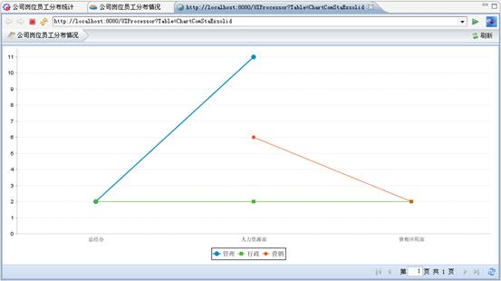

图4.31.13 “公司岗位员工分布情况“分类折线图

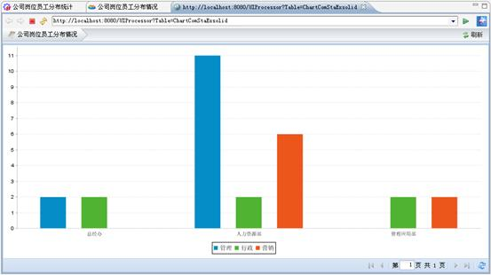

图4.31.14 “公司岗位员工分布情况“分类柱状图

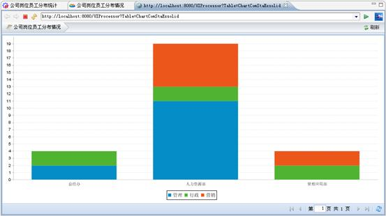

图4.31.15 “公司岗位员工分布情况“堆叠柱状图

**图表属性说明**

l图表标题：图表显示的标题，可设置为表达式

l图表风格：有两种：2D和3D，默认为2D，也可设置成3D效果

l值轴名称：图表值坐标轴的显示名称

l分类轴名称：对象图表分类坐标轴名称，只限分类列的图表：分类折线图、分类柱状图、堆叠柱状图等

l方向：只限柱状图，设置柱状值轴的方向是垂直还是水平

l标签格式：只限饼图，饼图各扇区的说明格式

l最小值：只限仪表盘，仪表盘刻度的最小值

l低值：只限仪表盘，仪表盘刻度的低值

l中值：只限仪表盘，仪表盘刻度的中值

l最大值：只限仪表盘，仪表盘刻度的最大值

l低值颜色：只限仪表盘，最小值到低值扇区的颜色

l中值颜色：只限仪表盘，低值到中值扇区的颜色

l高值颜色：只限仪表盘，中值到高值扇区的颜色

l低值标签名：只限仪表盘，最小值到低值扇区的标签名

l中值标签名：只限仪表盘，低值到中值扇区的标签名

l高值标签名：只限仪表盘，中值到高值扇区的标签名

l值单位名：只限仪表盘，显示仪表盘数据值的单位

l标签标题：只限表格图表，表格的标签列图表

l值标题：只限表格图表，表格的值行标题

l是否显示表格头：只限表格图表，是否显示表格的表格头

l值格式：只限表格图表，默认为#,###.00，这时取小数点后面两位小数

l是否显示超链接：只限除仪表盘之外的图表对象，是否显示超链接，默认为否

l超链接URL前缀：只限除仪表盘之外的图表对象，设置图表对象的URL链接

l标签参数名：只限除仪表盘之外的图表对象，设置图表对象的标签参数

l分组参数：只限分类折线图、分类柱状图、堆叠柱状图，设置图表对象的分组值

l标签显示样式：只限饼图，设置饼图标签的显示样式，有三种：不显示、普通、简单，默认普通

l标签最小百分比值：只限饼图，可设置标签最小百分比的比值，当比值小于这个数的时候，其在饼图上的标签不显示

l图例格式：只限饼图，图例显示的格式，可设置为表达式，默认格式为”标签=值（百分比）”

l比例条类型：只限表格，以柱状图的形式显示表格的数据，有四种类型：不显示、值/合计值、值/最大值、比例值，默认不显示

l比例栏名称：只限表格，比例栏显示标签

l图表颜色序列：只限仪表盘和表格之外的图表对象，设置图表显示的颜色

l图例位置：只限仪表盘和表格之外的图表对象，设置图例显示的位置，默认不显示

l标签轴样式：只限折线图和柱状图，支持两种样式：标签缩放显示、标签自动间隔显示

**值映射属性说明**

l值轴：映射方式有两种：SQL列名和查询字段显示列，若为SQL列名，则映射SQL语句中值的对应列，若为查询字段显示列，则映射值对应的查询字段

l标签轴：映射方式有两种：SQL列名和查询字段显示列，若为SQL列名，则映射SQL语句中标签的对应列，若为查询字段显示列，则映射标签对应的查询字段

l分类轴：映射方式有两种：SQL列名和查询字段显示列，若为SQL列名，则映射SQL语句中分类的对应列，若为查询字段显示列，则映射分类对应的查询字段

### 4.22.3图表链接设计

首先建立一个名称为”试用期员工查询”，代码为” SqlTryPeriodQuery”的SQL查询对象，并为其添加一个查询参数，该对象如下：

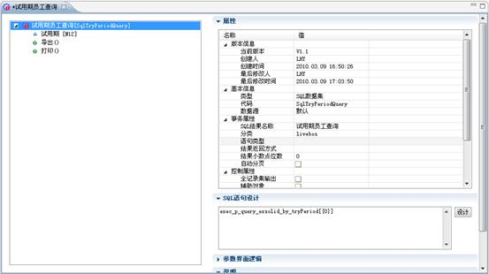

图4.31.16 “试用期员工查询”SQL数据集

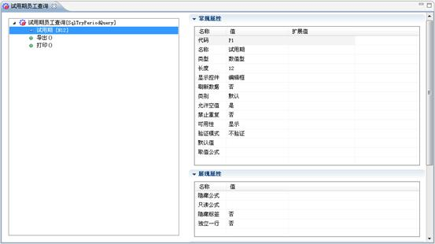

图4.31.17试用期员工查询参数”试用期P1”

建立一个”试用期员工情况查询”的查询对象，并在该查询对象基础上，创建一个饼图对象。

如果我们要从饼图对象链接到“试用期员工查询SqlTryPeriodQuery”对象，则应在“超链接URL前缀”设置：/UIProcessor?Table=SqlTryPeriodQuery&ParamAction=true，并设置标签参数名为试用期员工查询对象的查询参数P1。如图4.28.9～4.28.12所示：

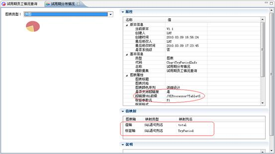

图4.31.18设置超链接URL前缀和标签参数名

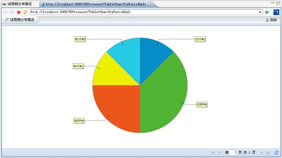

图4.31.19“试用期分布情况”饼图对象预览

若我们想进一步查询试用期具体分布情况，通过超链接URL前缀可进一步查询到试用期的具体情况。如下图所示：

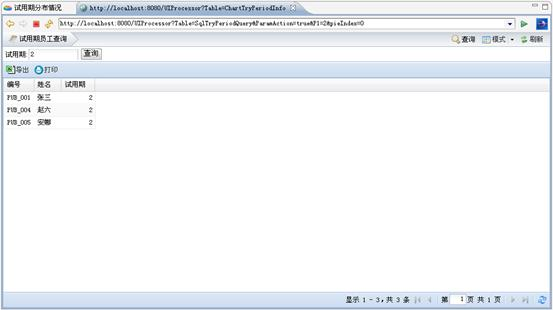

图4.31.20 “试用期员工查询”

在链接的过程中，我们使用了SQL数据集的两个存储过程：

（1）SET
QUOTED\_IDENTIFIER ON

GO

SET ANSI\_NULLS ON

GO

ALTER  proc
p\_query\_exsolid\_by\_tryPeriod

@tryperiod intas

select no '编号',name
'姓名',tryperiod '试用期'
from PUB\_Employee where tryperiod=@P1

GO

SET QUOTED\_IDENTIFIER OFF

GO

SET ANSI\_NULLS ON

GO

（2）SET
QUOTED\_IDENTIFIER ON

GO

SET ANSI\_NULLS ON

GO

alter  proc
p\_count\_tryPeriod\_exsolidas

select count(\*) total, tryperiod
from PUB\_Employee where tryperiod is not null group by tryperiod

GO

SET QUOTED\_IDENTIFIER OFF

GO

SET ANSI\_NULLS ON

GO
