# 多对象组合页面设计

> LiveBOS Studio > 用户手册 > 业务建模设计

---

## 4.23多对象组合页面设计

LiveBOS从3.5.2版本开始，提供了一种新的对象类型，多对象组合页面。该类型对象，是一种页面集成展现的方式，相当于一个页面容器，支持将多个彼此相关联的对象以多标签的形式展现在同一个页面上。该功能与自由关联的功能类似，与之不同的地方在于对象之间没有主对象和从属对象的区分。

多对象组合页面没有自己独立的字段和方法，可以有自己的查询参数字段，多个对象在同一个页面共享同一个查询参数，并且通过数据筛选的方式过滤出该页面想展现的对象数据。

下面我们以建立员工基本信息实体对象和员工考勤查询数据集对象的组合页面为例，详细介绍多对象组合页面的设计步骤：

**步骤****1**：新建多对象组合页面。左侧项目树中选中指定包，右键单击”新建” à “多对象组合页面”，将弹出新建对话框（如图），在对话框中填入多对象组合页面的名称（”多对象组合”）和表名（系统默认）后，单击确定：

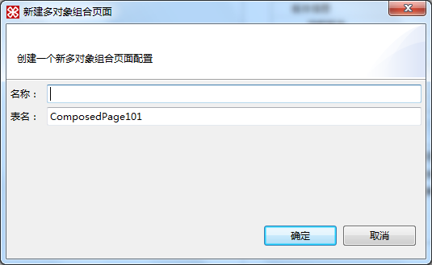

图4.32.1多对象组合页面新建对话框

多对象组合页面的设计窗口展现如下：

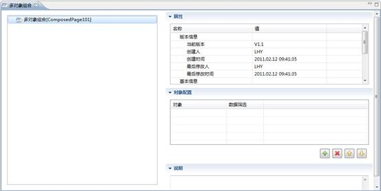

图4.30.1多对象组合页面设计窗口

【栏目说明】

**对象配置**：该设计区域主要是完成当前项目要集中展现对象的新增、修改、删除以及数据筛选的详细设计。数据筛选的类型包括字段限制、参数映射和SQL筛选这3种方式，其中字段限制和SQL筛选主要针对普通实体对象而言，而参数映射则是针对带参数的视图或查询对象。

**步骤****2**：为多对象组合页面添加参数。设计窗口中，右键单击”新建”—>”参数”（如图）：

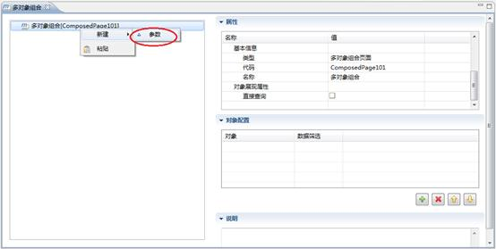

图4.30.2新建组合页面参数

查询参数设计方式同普通字段相同，这里我们设计该参数为内部对象，引用组织机构对象，如下：

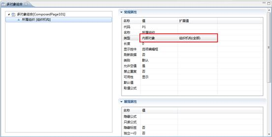

图4.30.3多对象组合页面参数设计

**步骤****3**：添加对象，建立数据筛选。打开对象配置区域，点击”新建”，在弹出的窗口中选中要添加的对象”员工基本信息”（如图），点击确定：

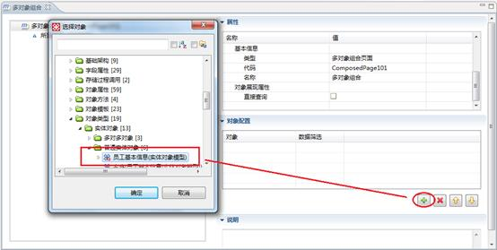

图4.30.4添加多对象组合页面的展现对象

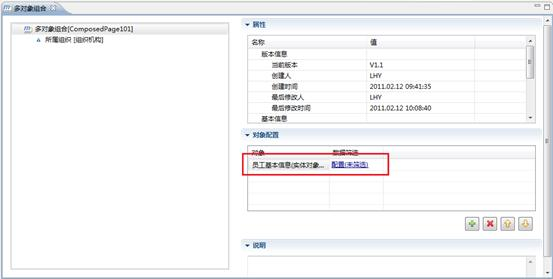

图4.30.5添加完成

点击上图中的”配置”链接，打开数据筛选设计窗口，如图：

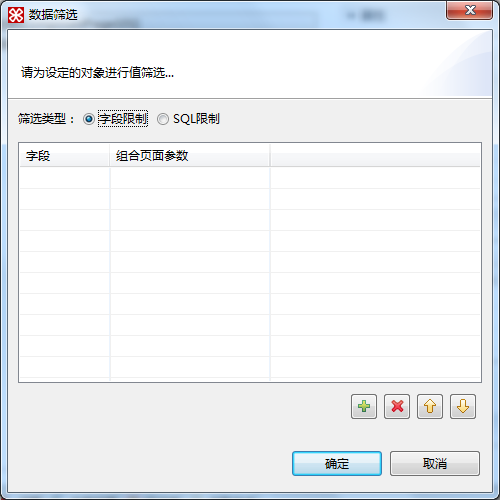

图4.30.6字段限制数据筛选设计窗口

这里的字段限制与SQL限制与内部对象字段的设计方式相同，主要是建立查询参数与引用对象之间的映射关系。这里我们以字段限制设计为例，SQL限制设计方式，请参考SQL筛选设计章节。

点击新增，建立”员工基本信息”对象的”部门”字段与组合页面参数”所属组织”之间的映射（如图）：

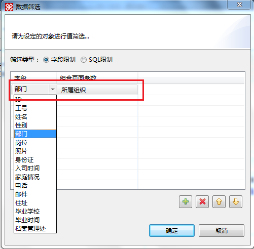

图4.30.7建立组合页面参数与对象字段之间的映射

设计完成后，返回到对象配置区域，再以同样的方式添加”考勤查询”数据集对象，打开数据筛选设计窗口：

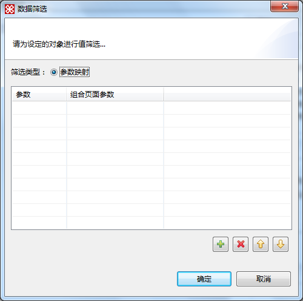

图4.30.8参数映射数据筛选窗口

设计方式与上面基本相同，这里建立的是查询数据集的查询参数与组合页面参数之间的映射：

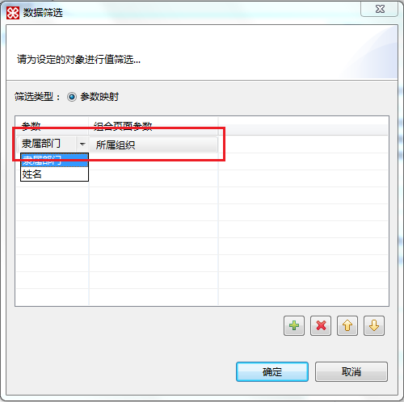

图4.30.9建立组合页面参数与数据集查询参数之间的映射

这样就完成了，多对象组合页面的设计：

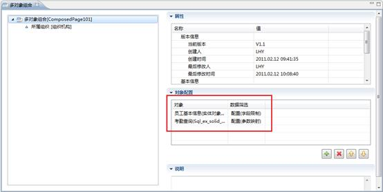

图4.30.10多对象组合页面设计完成

提交后，预览效果如下：

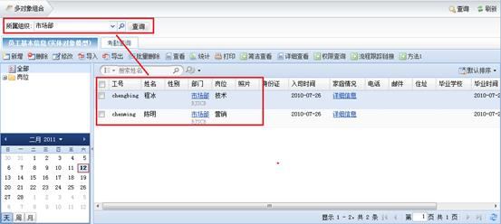

图4.30.11多对象组合页面展现页面
