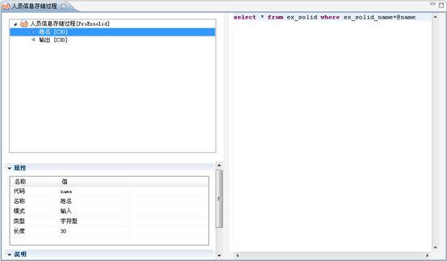
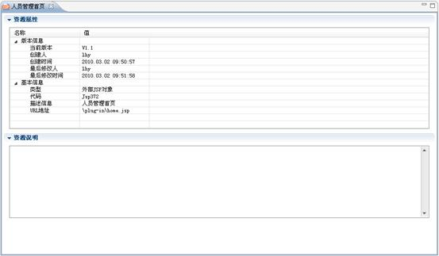
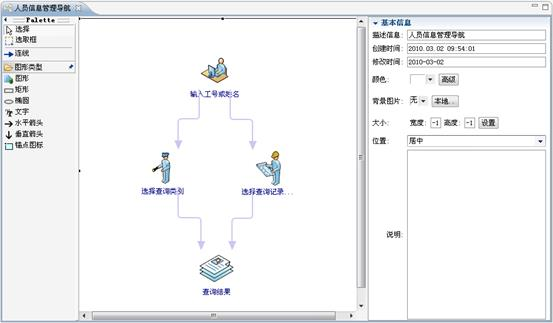
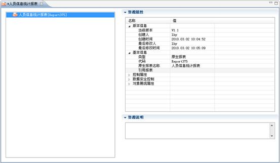
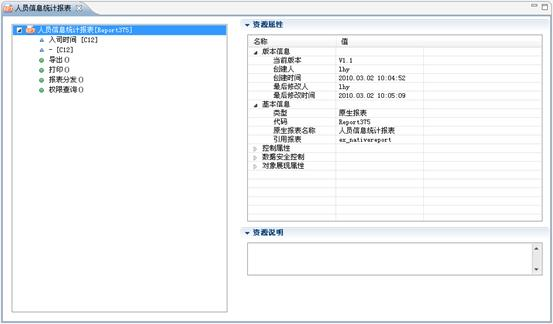
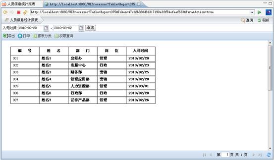

# 外部资源集设计

> LiveBOS Studio > 用户手册 > 业务建模设计

---

## 4.24外部资源集设计

### 4.24.1说明

外部资源集里面设定的是用户对外部资源的利用方法，它包含有SQL存储过程、JSP资源集、原生报表资源集、页面导航器。

### 4.24.2建立SQL存储过程

用户可以新建SQL存储过程，作为资源供项目使用。右击“人员管理”包，选择“新建”à“外部资源”à“SQL存储过程”，打开SQL存储过程的编辑窗口（见下图），可在编辑器中编写SQL语句，编辑器支持基本的SQL语句的语法着色，自动补齐，以及拖动生成参数等功能。

图4.31.1 SQL存储过程编辑器

**栏目说明**

l参数规则

Ø如果数据库使用的是SQLServererver，则建立的参数名无须增加@，但是在存储过程主体中引用该参数时需要增加@参数。

Ø输出参数和输入参数类型由在存储过程对象中建立参数对应的参数属性中的“模式”来指定。

l过程定义

Ø存储过程在提交的时候，服务端会自动根据定义的过程名和参数生成建立过程或者修改过程的头部信息。过程的头部信息包括：

create procedure 过程名（参数......）

as

过程的其它部分则需要在定义过程的时候加入。

### 4.24.3建立JSP资源集

JSP资源集里保存了访问用户自定义JSP页面的路径。右击“人员管理”包，选择“新建”à“外部资源”à“JSP资源”，打开JSP资源集的编辑窗口（见下图）：

图4.31.2 JSP资源集编辑页面

**栏目说明**

lURL地址：在这里输入访问用户自定义JSP页面的路径。

### 4.24.4建立页面导航器

页面导航器提供系统的页面导航功能，用户可在页面导航器中建立页面导航图，通过页面导航图，可将系统的逻辑走向直观的呈现出来。右击“人员管理”包，选择“新建”à“外部资源”à“页面导航器”，打开页面导航器的编辑窗口（见下图）：

图4.31.3页面导航器编辑器

### 4.24.5建立原生报表集

原生报表集可以由报表本身获取数据，系统提供参数值传入功能。右击“人员管理”包，选择“新建”à“外部资源”à“原生报表”，打开原生报表集的编辑窗口（见下图）：

图4.31.4原生报表编辑页面

右键点击”人员信息统计报表”，选择”新建”à”参数”，为该报表添加两个查询参数。选择”添加方法”à”所有方法”，为该报表添加所有方法，即导出和打印方法。在引用报表属性中为该报表添加报表资源，其相关属性设置如下图所示：

图4.31.5 原生报表属性设置页面

**栏目说明**

l参数：属性与实体对象的字段一致。

打开iReport3.0查看报表ex\_nativereport.jasper查询语句的设计，SQL设计语句如下所示：

Select ex\_solid\_no,ex\_solid\_name,(select
Name from lbOrganization where id=ex\_solid\_department)
'ex\_solid\_department',ex\_solid\_station,ex\_solid\_phone,ex\_solid\_email,ex\_solid\_number,ex\_solid\_address,ex\_solid\_date
from ex\_solid where ex\_solid\_date between convert(datetime,$P,126)
and convert(datetime,$P,126)

（备注：这里引用的参数应与”人员统计信息报表”里的参数相对应，其中report\_param1对应参数”入司时间”， report\_param2对应参数”-”）

l引用报表：在这里输入被引用报表的资源信息。（引用报表一般存储路径如：D:\ABS\_DOCUMENT\灵动商务系统\Report\3.0.1\ex\_nativereport.jasper，这里所填写的为相对路径）。

该报表展现如下图所示：

图4.31.6原生报表查询结果展示页面
