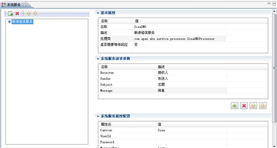

# 系统服务设计

> LiveBOS Studio > 用户手册 > 业务建模设计

---

## 4.3系统服务设计

LiveBOS Studio系统服务设计工具允许用户自定义系统服务，以满足不同客户对系统服务调用功能的不同需求。自定义系统服务与系统自带的系统服务用法是一样的，可以在用户方法、对象流程方法及工作流中被引用到。具体处理类的编写请参考《LiveBOS高级开发例子》文档中关于定制系统服务的例子。

用户只需要在平台中调用自定义的处理类，并在需要的地方调用这个自定义的系统服务即可。新建系统服务的方法与新建系统参数类似，可通过右键新增或单击表格左上角的新建按钮来建立。建立系统服务时，LiveBOS Studio为用户默认生成以”Service”开头的系统服务名称和”Param”系统服务请求参数名称，用户可根据自己的需要对这些名称进行修改（见下图）。

图4.5.1系统服务属性设置窗口

**栏目说明**

l基本属性

Ø名称：系统服务显示标签，可更改。

Ø描述：系统服务具体描述，可更改。

Ø处理类：用户自定义系统服务的处理类。（注：使用时需将自定义处理类的包路径添加进来）

Ø是否需要等待回应：表示是否以同步方式调用系统服务。选择是，则表示当接收到系统服务的回应之后，当前操作才能进入后续操作；选择否，则表示系统服务一旦发送，操作将进入后续操作。默认为否。

l系统服务请求参数：系统服务请求过程中传递的参数。

l系统服务属性配置：为系统服务配置相关属性。
