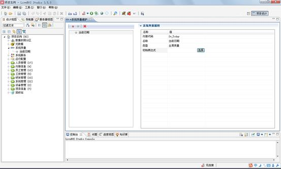
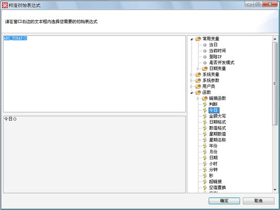

# 系统变量设计

> LiveBOS Studio > 用户手册 > 业务建模设计

---

## 4.4系统变量设计

LiveBOS Studio系统变量设计工具是设定平台运行变量的工具，运行平台根据变量的类型对其进行初始化，并可在其相应的生命周期中对其进行赋值.新建系统变量的方法与新建系统参数类似，同样可以通过右击新增和点击表格右上角的新建按钮这两种办法来建立。

在建立系统变量的时候，LiveBOS Studio为用户默认生成了以“SV\_”开头的系统变量内部代码和以“Name\_”开头的系统变量名称，并根据已有的条目信息来进行是否重名的判断。用户可以通过编辑“初始表达式”栏目来定义系统变量的初始表达式（见图4.6.1）。

图4.6.1用户通过点击“选择”进行初始表达式设计

**系统变量类型说明**

l全局变量：变量的生命周期为全局，即变量被赋值后，该值一直有效，即使服务器被重启.

l用户变量：为每个用户绑定一个变量，在当前的用户变量被赋值后，不会影响其他的用户变量.其生命周期也为全局.

l会话期变量：变量的生命周期为会话期，即变量赋值变更只会影响当前的会话期。

lCookie变量：存放在浏览器客户端的变量。

l线程期变量：变量的生命周期为当前线程。

用户在点击了“选择”按钮以后，LiveBOS
Studio会弹出一个可供编辑的初始表达式设计框（见图4.6.2）

图4.6.2初始表达式设计框

**栏目说明**

l左上方是可以设计的公式栏目，可以引用右边的本系统变量集合内部的信息和LiveBOS Studio预先定义的常用变量信息，也可以调用LiveBOS Studio系统提供的各个函数，或者是系统变量。注意：这里公式的书写语法和JavaScript的语法相同而非Java的语法。

l左下方的表达式描述则是把设计的公式转化成对应的文字描述。

l框体右侧陈列的是与该对象关联的系统变量集合信息和LiveBOS Studio预先设定以供使用的系统变量和系统函数。
