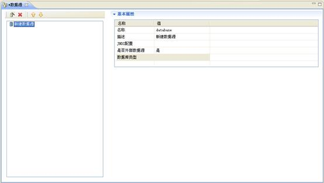
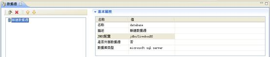
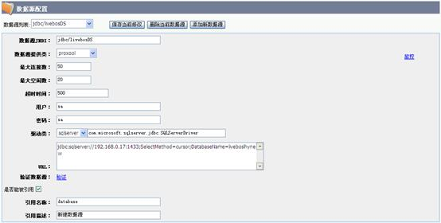
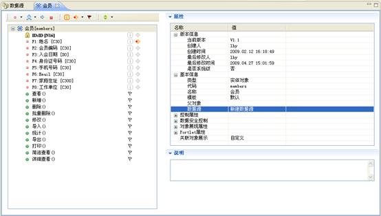

# 数据源设计

> LiveBOS Studio > 用户手册 > 业务建模设计

---

## 4.5数据源设计

注：LiveBOS3.3.0及以后版本支持该属性。

### 4.5.1功能说明

LiveBOS Studio数据源允许将实体对象部署到其他数据库。通过这个功能，当前对象的结构信息仍然在当前LiveBOS系统中，实际物理表在所指定数据源对应的数据库中，而其它对象可以像引用普通的实体对象一样引用这个实体。可以很好的实现实体对象的跨数据库部署。也可以比较好的集成系统已有的数据信息。

在左侧项目树中双击”数据源”节点，在弹出的框体中添加数据源，可以通过点击左上角的新建图标或者右键点击新建来实现，新增数据源窗口如下图：

图4.13.1数据源编辑窗口

**栏目说明**

l名称：数据源的名称，可更改。（注：数据源名称必须为英文字符）

l描述：数据源的描述信息，可更改。

lJNDI配置：数据源节点的JNDI名称，如jdbc/livebosDS。

l是否外部数据源：是否是外部数据源。选择是，则不能更改新增数据源的表结构及其中的数据，只是简单查询表中的数据；选择否，则可以在新增数据源中创建或更改表结构，可以完成数据的增、删、改、查等功能。

l数据库类型：目前仅支持五种数据库类型，即microsoft sql server，oracle 9i以上，oracle 8i，db2，mysql.

### 4.5.2实现步骤

数据源在Studio端的操作，只能当作简单的声明，而数据源的定义则是在管理控制台完成的。本例将给出数据源在实际应用中的使用步骤：

1.声明：打开数据源编辑器，点击新增，数据源的属性配置如下图所示：

图4.13.2数据源属性配置页面

配置完成后将数据源提交到服务器。

2.定义：打开管理控制台，进入数据源管理页面，在数据源列表中选择新建的数据源jdbc/livebosDS，在当前页面配置数据源属性（具体可参考管理员手册中的数据源配置），如下图：

图4.13.3管理控制台新增数据源配置页面

点击”保存当前修改”，服务器会自动重启，重启后新增数据源的配置才能生效。

**栏目说明**

l是否能被引用：建议勾选该项，即这个数据源中的数据能否被当前LiveBOS系统的对象引用。

l引用名称：对应数据源编辑器中的数据源名称，即database。

l引用描述：对应数据源编辑器中的数据源描述信息，即新建数据源。

3.引用：在实体对象或SQL数据集的基本信息à数据源属性中，选择刚才新建的数据源，如下图所示：

图4.13.4对象中引用新增数据源

点击保存，提交实体对象即可将这个实体对象部署到指定的数据源所连接的数据库中。

注：这里的数据源引用信息指的是新增数据源的JNDI名称。
