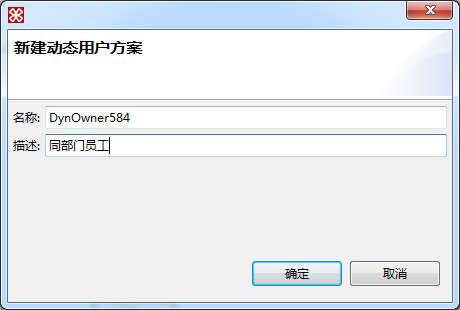
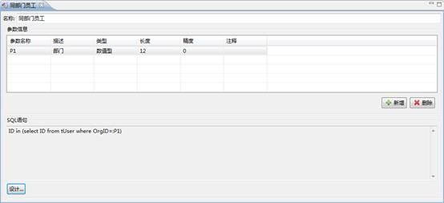
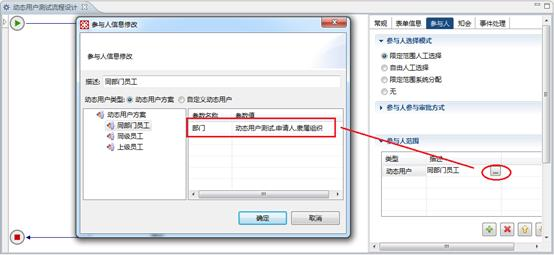

# 动态用户设计

> LiveBOS Studio > 用户手册 > 业务建模设计

---

## 4.6动态用户设计

为了降低动态用户设计表达式的复杂度，Studio从3.9.0版本开始支持在动态用户方案中，预先配置几种动态用户筛选方案，流程定义人员只需选择相应的方案后，作相关的参数映射配置即可。

例如，我们可以预先定义同部门员工、同级员工、上级员工几种动态筛选方案，在流程进行参与人设计时，选择相应的动态用户方案，做好参数映射即可。

在左侧项目树中，选择**运行配置**—>**动态用户方案**节点，右键点击 新建à动态用户方案，在弹出的新建窗口中修改动态用户方案的代码和名称，如图：

图4.15.1动态用户方案新建窗口

打开新建的动态用户方案设计界面，在这里添加参数信息及进行SQL语句的设计，这里的SQL语句设计相当于针对系统tUser表进行筛选的where条件。如我们对动态用户方案“同部门员工”进行以下设计：

图4.15.2动态用户方案设计窗口

流程定义参与人时，如果需要使用预先定义的动态用户方案，可以在参与人范围设计窗口，做如下设计：

图4.15.3流程参与人与引用预先定义的动态用户方案
