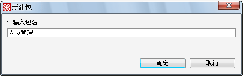

# 包的设计

> LiveBOS Studio > 用户手册 > 业务建模设计

---

## 4.7包的设计

### 4.7.1说明

包：是完成某个特定功能的对象的集合，包含若干个对象和对象方法，对象查询等。后面所有的对象，包括对象的方法等，都必须依附在建立的具体的包里面，包可以包含包。在LiveBOS Studio中，每个包对应着一个具体的文件夹，这样方便了文档的管理和查询。

### 4.7.2实现步骤

进入LiveBOS Studio业务建模设计工具，如下图，选中想要建立包的节点，右击后在弹出的菜单中选择“新建”à“包”，在这个例子中，我们想建立一个在根目录“人力资源管理实例”下的包“人员管理”，因此我们在弹出框内输入“人员管理”：

图4.16.1新建一个包操作

图4.16.2新建“人员管理”包

按确定。成功则可以在左边的树中可以看到新增的人员管理包。
