# 实体对象设计

> LiveBOS Studio > 用户手册 > 业务建模设计

---

## 4.8实体对象设计

### 4.8.1基本概念介绍

l**对象：**指具有特定属性，特定操作管理方式的信息记录。它在数据库中体现为一个“表”，也可能由一个以上的表来存储。在LiveBOS Studio中不同的场合，对象有两类含义，一是指对象的所有记录集。另一是指一个对象记录。可能的对象类似：客户，合同，项目等。

l**实体对象：**实体对象对应着系统数据库中具体的物理表名。

实体对象记载了对目标对象的描述，实体对象中的每一个字段都是对目标对象一个特性的具体描述，这样通过多个字段的记载，实体对象就可以完整记录下目标对象的所有特征属性。

由于实体对象与数据库中的具体表一一对应，所以对实体对象的操作就成为用户在开发模型过程中最重要也是最基础的操作。视图，子对象，内部对象等高级的修改应用也都要依靠实体对象进行。

### 4.8.2实现步骤

以下将新增一个研发管理包中的一个实体对象”研发团队”。在操作过程中，如果采用默认的命名方式，则系统将自动为每个表进行命名（命名方式如：T464），在新增的时候也可以自己定义表名。每一个实体对象在被创建出来的时候都会自动被赋予一个对象ID，对象ID是一个不能重名的字符串。对象ID的存在代表了该表格的唯一性，它可以作为文件的索引，作为该表格被提交到数据库时的验证信息。

#### 4.8.2.1新增一个实体对象

在左边的树中选择一个业务模型包，如“研发管理”，右键点击后选择“新建”à“对象”à“实体对象”，见下图：

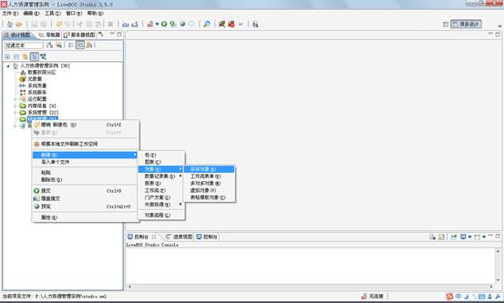

图4.17.1新增实体对象

点击后弹出如下对话框：

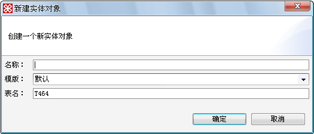

图4.17.2实体对象弹出框

**栏位说明**

名称：对这个实体对象的描述。

表名：注意，如果类型是实体对象、工作流表单、多对多对象，则这里的表名对应数据库中的表名。可以自己命名。

模板：指这个对象可以拥有哪个LiveBOS Studio预定义对象模板的属性。目前LiveBOS Studio支持的模板种类有：默认模板，新闻模板，文档模板，考卷模板，新闻评论模板，答案模板，层次模板，题目模板，考卷答题纸模板，题库模板，调查问卷模板，调查问卷回复模板。

l默认模板：创建时不自带任何字段。

l调查问卷模板：创建时同时建立问卷题库、问卷、问卷题目、问卷回复和问卷答案等对象，并建立相应的对象字段。

l新闻模板：创建时同时建立新闻、新闻类别、新闻附件、新闻评论等对象，并建立相应的对象字段。

l投票模板：创建时同时建立投票、投票选项、投票结果等对象，并建立相应的对象字段。

l层次模板：创建时同时建立上级节点、节点类型、节点级别、组织名称和上级域编码等字段。

l考卷模板：创建时同时建立考卷题库、考卷、考卷题目、考卷答题纸、考卷答案等对象，并建立相应的对象字段。

l任务反馈模板：任务反馈填写过程中的个性化信息展现的载体，是LiveBOS实体对象的一种。

名称中输入“研发团队”，表名采用系统自定义（可更改），对象模板采用系统默认模板。按确定。新增成功，则在研发管理包中，可以看到这个“研发团队”对象。

进行对象的设计，在右边的对象列表中，选择刚才新增的“研发团队”，然后双击进入设计界面，如下图：

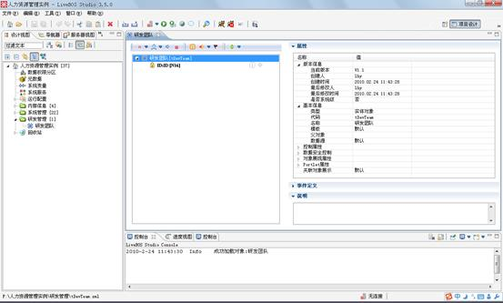

图4.17.3实体对象设计界面

**栏位说明**

l对象属性：包含这个对象的版本信息，创建人和修改人信息，以及对这个对象的具体描述信息，当需要详细说明这个对象内部属性的时候，可以在这里设计。详细的属性信息请查阅表4.7

l对象说明：在这里输入对该对象的注释

表4.7对象属性表

|  |  |  |
| --- | --- | --- |
| 控制属性 | 隐含自动对象引用 | **对象被引用时，不自动出现在其引用该对象的关联对象栏。** |
| 对象被引用时查看模式 | **当对象被引用时，查看该对象的信息。查看模式有默认、不显示、普通、简洁、详细信息** |
| 辅助对象 | **该对象设置为只做内部关联使用，不能对其进行基本的权限控制等操作** |
| 对象被引用时进行数据限制 | **层次型模板视图特性，****允许层次模板视图的数据在选择分组时根据分组进一步过滤数据** |
| 被引用时显示附加显示标识 | **对象被引用时是否显示附加显示标志字段信息** |
| 初始加载层数 | **指定层次模板对象展现数据时，默认初始加载几层的数据到客户端****.****加载层数较小时，页面初始展示速度将更快****.** |
| 不作为Portlet使用 | **不能作为****Portlet****放置在门户上** |
| 字段权限控制 | **对象浏览查看时是否根据其字段权限显示其可查看的字段** |
| 缺省字段权限 | **字段权限控制对象是否要求必须进行字段授权，默认读取系统参数：**  **form.column.need.permissible****。为****true****时，没进行授权的字段（如表单新添加的字段，或者该用户未进行字段授权）就没有相应权限；为****false****时，自动拥有没授权字段的权限，如果该对象字段没对用户进行授权时，用户拥有全部字段的权限。** |
| 数据安全控制 | 要求安全保护 | **必须通过****SSL****安全连接才能访问对象数据。** |
| 要求安全审记 | **对对象的增，删，改操作记录审计日志中。** |
| 删除控制模式 | **控制删除对象数据的模式，自由删除：默认模式。同步删除关联对象：对象数据被引用时，删除对象数据将同步删除引用该数据的记录。有关联对象禁止删除：当对象实例被其他对象引用时，该实例禁止删除** |
| 允许WebService调用 | **是否允许WebService****调用** |
| 对象展现属性 | 基本分组 | **在展示界面可以用分组字段的值快速筛选记录。** |
| 层次分组 | **按设定的字段顺序树状展示分组（在界面方案为树状分组，值为****5****）中有效。** |
| 细分作为分组项 | **在展示界面用****细分对象****快速筛选记录。** |
| 可搜索列 | **限制可以显示在搜索栏中的字段，默认为对象字段全部可见** |
| 布局方案 | **对象设定的界面方案，默认为系统参数****LayoutType****的值。可选择简单模式、普通模式、竖排查询表单、分组树模式、左右模式、分组树左右模式中的一种** |
| 显示模式 | **可选择表格浏览模式、主从浏览模式、列表主从模式、单记录浏览模式、单记录主从模式、卡片浏览模式、卡片主从模式、自由高度布局、卡片自由高度布局、主题浏览模式中的一种。基于其他模板对象的显示模式有其自身定制的几种模式供选择** |
| 明细信息显示模式 | **在主从模式中出现明细标签的模式****.****可选择：不显示、普通、简洁** |
| 单记录浏览模式隐藏从属关系 | **是否隐藏单记录浏览模式中的从属信息** |
| 参数表单布局界面方案 | **视图或记录集对象的参数布局。可选择：普通方案、左对齐方案、上下布局方案、分组页标签方案、完全页标签方案** |
| 显示搜索栏 | **是否显示搜索栏，默认为显示** |
| 网格类型 | **是普通表格还是可编辑表格** |
| 网格层次分组 | **根据选定的字段进行表格的层次分组** |
| 网格显示分组 | **根据选定的字段进行表格的显示分组** |
| 网格显示字段 | **控制网格中显示哪些字段，默认为全部显示** |
| 每页显示行数 | **展示界面列表中每页的行数。** |
| 网格初始大小 | **设定页面显示网格的大小** |
| 网格css定义 | **自定义****css****样式时，****css****选择符的定义** |
| 网格css资源路径 | **自定义****css****样式时，****css****选择符的定义文件路径** |
| 网格脚本定义 | **自定义****JavaScript****脚本时，****JavaScript****的定义** |
| 网格脚本资源路径 | **自定义****JavaScript****脚本样式时，脚本的定义文件路径** |
| 显示记录号 | **是否在表格行头显示记录号** |
| 支持冻结列 | **表格中的列表不会随着窗口大小的改变而改变，处于冻结状态** |
| 显示小计行 | **对网格列表的某一列进行统计，并且将统计结果数据显示在页面上** |
| 显示操作列 | **不显示（默认），网格中不显示操作列；显示记录模式方法，网格操作列中仅显示方法展示位置为网格记录模式的方法；显示需选择记录方法，网格操作列中仅显示操作方式为当前记录的方法** |
| 操作列显示模式限制 | **网格中的操作列限制在某种显示模式下展现，默认情况下不展现** |
| 列表浏览自定义模板 | **对象在进行列表主从模式展现时，允许通过定义****HTML****的标签自定义列表展现样式** |
| 主题浏览属性 | **对象在主题浏览页面模式下的界面控制属性，包括标题列、副标题列、描述列、列展示风格等。** |
| 可编辑表格/显示删除图标 | **当表格数据可删除时是否在行头显示删除图标** |
| 操作界面方案 | **操作界面的布局方案，如左对齐、上下布局、分组页标签、完全页标签方案等。** |
| 定制操作界面 | **使用定制的操作界面。** |
| 使用嵌入式窗口 | **操作时不弹出新窗口，直接在当前页面下操作** |
| 操作界面布局 | **设置操作界面每行显示的列数，可自定义操作布局** |
| 支持局部刷新 | **是否进行局部刷新** |
| 弹出窗口初始大小 | **设置操作界面弹出窗口初始大小** |
| 表单CSS定义 | **操作表单****CSS****选择符的定义** |
| 表单CSS资源路径 | **操作表单****CSS****选择符的定义文件路径** |
| 客户端脚本定义 | **操作界面客户端脚本的定义，****允许附加一些自定义的客户端****javascript****脚本** |
| 客户端脚本资源路径 | **操作界面客户端脚本的定义文件路径** |
| 页面扩展按钮 | **操作界面上的扩展按钮，指弹出的操作界面上展现的按钮，业务逻辑通过界面逻辑事件进行定义** |
| Portlet属性 | 允许缓存 | **在****Portlet****显示中是否允许****缓存** |
| 缓存过期时间 | **由用户定义****缓存的过期时间** |
| 排序配置 | **当一个排序字段不能满足控制网格记录输出的排序需求时，可以通过设置多个不同的排序字段组合供用户灵活选择** | |
| 关联对象展示 | **进行这个对象在展现时候可以直接连接的对象的展现方式，同时可以设计关联关系映射，加入其他的带参数的对象，然后在界面上根据映射条件直接展现。** | |
| 关联信息面板设计 | **全部对象支持关联面板功能。除了在工作流活动中可以显示关联面板外，普通实体对象、工作流表单、视图类型等对象均支持关联面板的显示功能。视图对象上的关联面板支持继承。可根据选中记录执行关联面板中的数据计算等。支持的面板类型有关联对象显示面板、内部字段显示面板、相关对象字段显示面板、图表显示面板和统计面板** | |
| 界面展示面板 | **控制关联信息面板在对象展现界面上的展示方式。关联面板在界面上展现的方式有****3****种：全部显示、全部隐藏、显示指定面板** | |

**对象设计器工具栏说明**

l新建字段：点击生成该对象的附属字段，可选字段种类有普通字段，对象字段，表格字段，和选择项字段。其中对象字段是把其他包中的实体对象做为选定对象的一个字段；表格字段是把其他包中的表格对象作为选定对象的一个字段；选择项字段是获取数据字典中的条目（也可自己定义选择项，详细请参见表4.6）作为字段。

l用户方法：用户可以设定对对象的执行方法，详细信息请查看本章第9节对象方法设计。

l对象业务流程方法（也称对象流程方法）：用户自定义的方法，类似用户方法，在方法的设计上与用户方法有明显区别。对象流程方法可在对象流程设计器中设计，设计说明请参见4.17对象流程方法。

l细分：用户在这里设定为对象设定细分的代码，名称，以及筛选条件，生成合适的筛选条件以后，在展示界面中就可以利用这个细分对象进行快速的筛选。

l分组：分组的用处是管理对象中的字段，可以把字段分别归类到不同的组别中，方便用户对字段的管理。

l输入标识：对象的编码字段，在其他对象引用该对象时，用户可以直接输入[输入标识]字段的值来选择一个对象实例。

l显示标识：对象的显示字段，在其他对象引用该对象时，系统用[显示标识]字段的值代表一个对象实例。

l英语标识：国际化语言环境下对象的显示字段。

l 附加显示标志：当对象的一个字段不足以标志一个对象实例时，可添加附加显示标志与显示标志组合代表对象实例。

l默认方法：将方法设置成默认方法，则该方法为对象记录中双击默认执行的方法

l 排序字段：用于控制记录输出的排序属性，方便客户后台管理。

在新建对象操作结束后，LiveBOS Studio会为这个对象自动生成一个ID列，这个ID列的用处是方便数据库管理，为新生成的对象表创建了一个主键，这个主键是可以修改的，用户可以为这个对象建立其他字段，并把其他字段设定为该对象的ID字段，并使该字段成为物理表的主键。

下面我们将为这个对象建立一个叫“进入时间”的字段。选中“研发团队”右击，在弹出菜单中选择“新建”à“普通字段”（图4.16.4），就可以进入对象字段编辑界面（图4.16.5），在“对象字段常规属性”中将“名称”改为“进入时间”，并将类型改为日期：

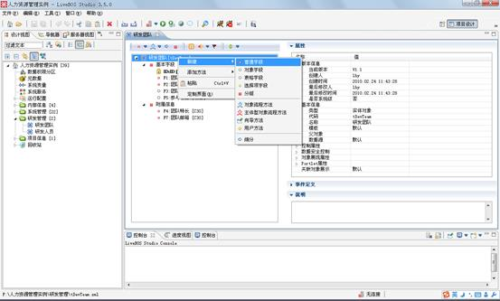

图4.17.4新建普通字段

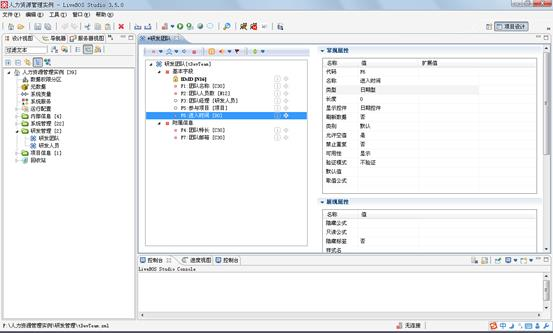

图4.17.5字段编辑界面

表4.8对象字段说明

|  |  |  |
| --- | --- | --- |
| 字段常规属性 | 代码 | **该字段文件的实际表名，建议不要修改** |
| 名称 | **对该字段的描述，可更改** |
| 类型 | **LiveBOS Studio****为对象字段定义了各种不同的类型，详细情况请看表****4.6** |
| 长度 | **定义该字段的最大长度** |
| 显示控件 | **设定控件的显示方式，目前支持的显示方式有：不显示****,****编辑框****,****组合框****,****日期控件****,****选择框****,****单选框****,****列表框****,****多行编辑域****,****密码框****,****选项编辑框****,****文本标签****,HTML****编辑控件****,****下拉选项编辑框****,****颜色选择控件****,****星级评分控件****,****日期时间控件****,****下拉时间选择器****,****文件上传控件****,****完全选项编辑框****,****多列下拉选择框****,****表格控件****,****可编辑表格控件****,****泛对象选择器****,****泛对象单选器****,****多值对象选择器****,****下拉多选框****,****图形控件。控件的样式和使用在****studio****帮助****à****帮助内容****à****概念手册****à****对象模型****à****对象属性****à****字段基本属性****à****展示属性中有详细说明** |
| 刷新数据 | **在字段取值公式发生改变时字段值是否马上刷新数据，如果选否，则在保存时才刷新** |
| 类别 | **在这里设定对字段的限制，****LiveBOS Studio****规定了****7****种限制方式，分别是：允许空值、禁止空值、禁止重复、禁止输入、绑定列、虚拟列、预计算列** |
| 允许空值 | **字段的输入数据是否可以为空值** |
| 禁止重复 | **字段的数据在所有记录中是否唯一** |
| 可用性 | **字段是否显示，包括：显示****,****不显示****,****只读（字段值不可修改）** |
| 默认值 | **字段的默认值** |
| 取值公式 | **当字段限制为绑定列或者是预计算列或虚拟列的时候可以为选定的字段设置取值公式，字段值为公式计算结果** |
| 仅存储图片 | **该属性为内部文档和外部文档字段的特有属性，当上传附件为图片时有效。设置为是，网格中可以直接查看图片附件的缩略图；设置为否，图片附件则作为普通的附件存储在数据库或文件服务器上，网格中显示图片附件的查看****/****下载链接。** |
| 字段展现属性 | 隐藏公式 | **隐藏公式中表达式结果为真时隐藏该字段** |
| 只读公式 | **只读公式中表达式结果为真时该字段值不可修改** |
| 隐藏标签 | **不显示该字段的标签** |
| 字段样式名 | **字段展现样式名，即定义界面字段控件对应****css****的****Class****名称，可以通过设置表单或网格的****css****来定义字段的风格** |
| 标签样式名 | **自定义字段标签，即定义界面字段标签对应****css****的****Class****名称，可以通过设置表单****css****来定义字段标签的风格** |
| 统计类型 | **可以对字段（一般指字段类型为字符型、数值型或日期型）的数据记录进行统计** |
| 展现模式 | **多行显示，字段内容较多时，支持换行显示** |
| 字段宽度 | **允许用户自定义字段展现宽度****，单位是像素** |
| 支持的文件类型 | **支持上传的文件类型，多文档字段特有属性。默认****\*.\*****指所有。如定义图片类型附件：****\*.gif;\*.jpg;\*.jpeg;\*.png** |
| 文件类型描述 | **支持上传的文件类型描述，多文档字段特有属性** |
| 文件大小限制(KB) | **上传文件大小限制，多文档字段特有属性** |
| 可搜索列 | **进行选择内部对象时，选择控件中可显示在搜索栏的字段，默认设置时，控件搜索栏仅显示输入标识和显示标识字段。内部对象字段特有属性** |
| 附加显示标识 | **当一个内部对象的显示标识不能精确代表对象实例时****,****可以用内部对象的多个附加显示字段一起复合显示表达****。内部对象字段特有属性** |
| 网格是否显示附加显示列 | **网格中是否显示内部对象字段的附加显示标识列，内部对象字段特有属性** |
| 网格附加显示标识显示模式 | **内部对象字段的附加显示标识列在网格中展示的模式，包含多列显示和折行显示****2****种模式，内部对象字段特有属性** |
| 空值显示为 | **空值选择项在默认情况下显示【无】，这里支持配置不是【无】的描述项，如全部、所有等** |
| 字段扩展按钮 | **字段上的扩展按钮，指字段编辑框中展现的按钮，业务逻辑通过界面逻辑事件进行定义** |
| 字段合法性验证 | 合法性 | **可以从合法性的下拉框中获得需要验证的字段属性，常用的属性有最大值，最小值，值范围验证，必须项，掩码验证，****EMAIL****地址验证，表达式验证等** |
| 表达式 | **表达式结果为真时字段值合法** |
| 出错提示信息 | **表达式结果为假时，即字段不合法时提示的错误信息** |
| 数据范围许可 | 操作 | **在对象的何种操作时验证数据范围** |
| 范围名称 | **数据权限分析定义的范围因子的名称** |
| 说明 | 说明 | **字段的说明** |
| 辅助属性 | 允许URL传值 | **是否允许****URL****传值** |
| 清除数据限制无效内容 | **是否清除数据限制无效内容** |

表4.9对象字段类型说明

|  |  |  |  |
| --- | --- | --- | --- |
|  | **类型** | **说明** | **长度** |
| 简单类型 | 字符 | 一般的文字 | 1－5000 |
| 数值 | 包括整数与小数 | 1位以上 |
| 布尔型 | 是或否 |  |
| 日期 | 日期与时间 |  |
| 数值型日期(yyyyMMdd) | 以数字类型显示日期 |  |
| 时间类型 | 时间 |  |
| 密码 | 特殊加密文字 |  |
| 高级类型 | 选择项 | 用于表达可罗列的情况中的一种情况。必须事先在数据字典中定义，或者自定义选择项，定义格式举例：0|普通文本;1|HTML格式（编码|值，选择项之间以;隔开） | 系统预设定 |
| 多值选择项 | 从罗列的选项中选择一条或多条选项 |  |
| 位与选择项 | 从罗列的选项中选择一条或多条选项，字段值按位与进行保存 |  |
| 内部对象 | 通过编辑内部对象的扩展值，来得到这个对象的关联对象 |  |
| 表格 | 从属于一个父对象，表格对象作为父对象的一个字段而存在 |  |
| 泛对象 | 表达一个不事先约定类型的对象，每次可选多条数据 |  |
| 单选泛对象 | 表达一个不事先约定类型的对象，但每次只能选择一条数据 |  |
| 多值对象 | 从关联的对象中选择多条数据作为对象的字段值 |  |
| 内部文档 | 用于保持文档的字段，可以上传或下载，文档内容存放在数据库中 | 系统设定 |
| 外部文档 | 用于保持文档的字段，可以上传或下载，但其实际保存在数据库外。 |  |
| 表格模板 | 类似表格字段，但一个表格模板可依附在多个对象中，体现表格模板的复用性 |  |

表4.10对象字段限制说明

|  |  |  |
| --- | --- | --- |
| 字段限制 | **限制类型** | **说明** |
| 允许空值 | 字段的输入数据可以为空值 |
| 禁止空值 | 输入数据不可以为空值 |
| 禁止重复 | 字段的输入数据不可以与对象其他实例的该字段值重复 |
| 禁止输入 | 不允许输入数据 |
| 绑定列 | 一种特定的对象属性，它是按照预先定义的规则计算获得，无需独立输入 |
| 虚拟列 | 与绑定列类似，它也是由系统自动计算获得，但它不在数据库中保存。 |
| 预计算列 | 用预定义的公式计算获得默认值，用户可自行修改值。 |

#### 4.8.2.2自定义操作界面布局

Studio2.0.6及之后版本对应服务端LiveBOS2.5及之后版本支持对象操作的自定义布局，允许Studio在建模过程定制操作界面的布局。

值得注意的是，这里提到的定制操作界面，不同于对象的定制界面和定制操作界面，对象的定制界面和定制操作界面产生一个附加的定制界面文件（formui文件），通过附加的定制界面文件可实现更为复杂灵活的界面设计，当然掌握起来则需要Web UI的设计基础。而对象展现属性à操作界面à操作界面布局中提供的自定义操作界面布局，则是提供对象操作界面中字段的基本布局方式的定制。目前可调整的字段布局包括字段是否独占一行、字段的占列数、字段的下一字段是否另起一行排列等。

下文通过例子介绍自定义操作界面布局的使用。以员工基本信息为例，如下图，用户可设置布局为默认，此时将根据操作列数使用平台默认的布局：

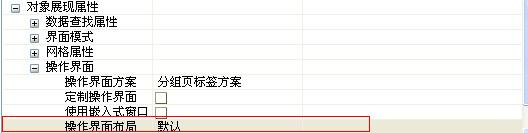

图4.17.6操作界面布局

点击操作界面布局值单元格中的按钮进入设计对话框，选择操作界面显示列数为2，并选中自定义布局复选框。此时，将根据不同字段的字段类型、控件类型或者控件长度产生字段默认的布局属性，例如表格字段或者表格模板字段独自成行等等。如下图所示，初始设置自定义布局的样式。

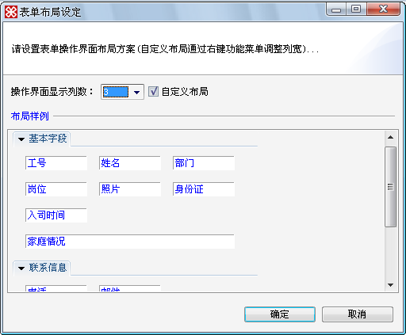

图4.17.7studio设置操作界面自定义布局

操作界面显示如下：

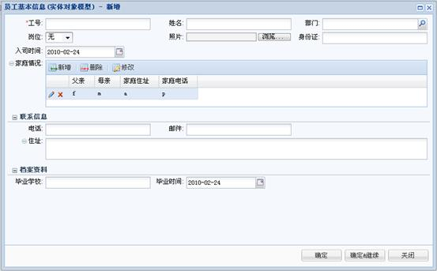

图4.17.8操作界面自定义布局1

如果希望设置字段是否独立成行、下一字段是否需要换行或者该字段占几列，可在字段上右键弹出菜单后设置。例如工号占两列，设置如下图所示：

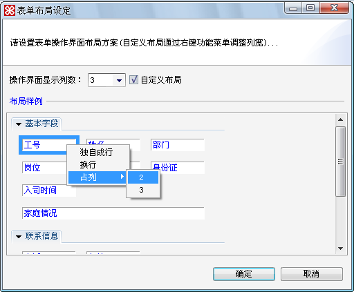

图4.17.9studio设置操作界面自定义布局

设置效果展现如下：

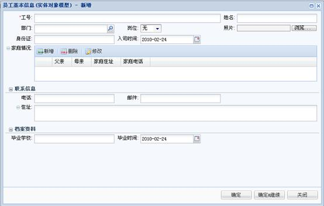

图4.17.10操作界面自定义布局2

其他布局属性设置类似，不再重复。

#### 4.8.2.3自定义网格CSS样式

LiveBOS提供用户自定义对象网格的CSS样式的方法，通过Studio定义CSS选择符或者根据外部的CSS文件资源可以灵活的设置对象数据的网格风格。Studio2.0.5 、LiveBOS3.1.0及新版本支持。

以员工基本信息为例，介绍配置LiveBOS对象网格CSS样式的方法。

首先，在对象属性à对象展现属性à网格属性à网格CSS定义中，定义需要设置的CSS选择符，如下所示，定义了两个选择符，此处作为例子，只简单设置样式中的颜色。

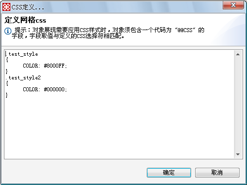

图4.17.11css定义窗口

其次，需要在对象中定义一个字段，字段有两点约束：

1、字段代码必须是@@CSS；

2、字段限制为虚拟列。如下图所示：

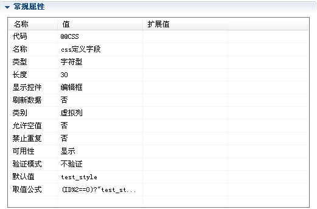

图4.17.12css字段设置

最后，设置该字段的默认值和取值公式，根据不同的情况设置不同样式。例如将员工ID为双号的记录字体设置成紫色（定义上文test\_style选择符），单号的设置成黑色（对应上文test\_style2），默认为紫色，则在默认值处填入test\_style值，在取值公式中定义单双号ID的选择语句，取值公式设计如下图所示：

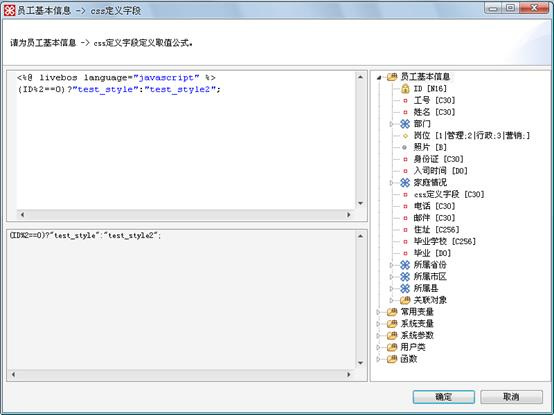

图4.17.13CSS定义字段选择语句设计

对象提交后展现如下：

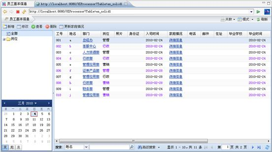

图4.17.14员工基本信息自定义网格css样式

LiveBOS还支持SQL数据集数据的网格CSS样式的定义，定义方式和对象略有不同。在本例中，数据集查询岗位字段非空的数据，并将不同岗位的员工信息表现为不同的颜色样式。定义不同岗位代码对应的样式选择符，岗位定义：1|管理;2|行政;3|营销;，SQL数据集的网格CSS定义如下：

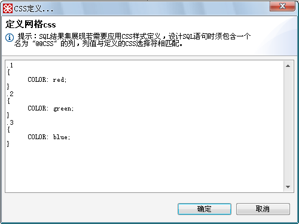

图4.17.15css定义

设计SQL语句，语句查询员工工号、姓名、岗位等字段，并新增一列，其别名为@@CSS，这样通过查询语句查询的该列的值就可以与CSS定义中的选择符号进行匹配，达到不同的岗位数据显示不同颜色的效果。SQL语句如下：

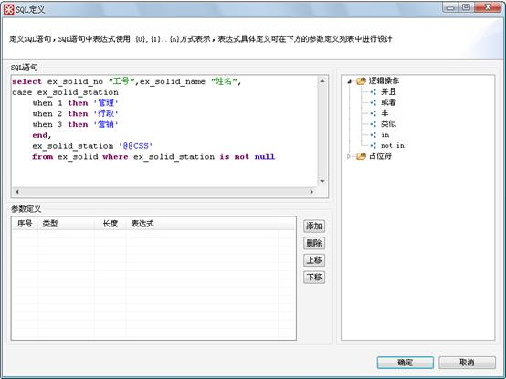

图4.17.16包含@@CSS列的查询语句

提交后，SQL数据集数据的展现样式效果如下：

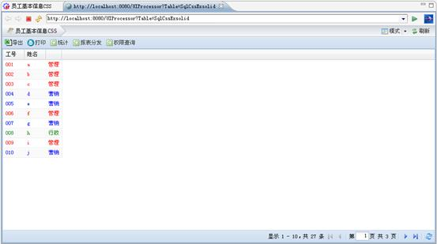

图4.17.17根据岗位使用不同样式

#### 4.8.2.4表单CSS样式定义

注：LiveBOS3.3.0及以后版本支持该属性的配置。

LiveBOS提供用户自定义操作界面的CSS样式的方法，通过Studio定义CSS选择符可以灵活设置操作界面表单的展现风格。

下面我们以员工基本信息为例，在操作表单中将该对象的照片的图片设置为固定大小，以此介绍配置LiveBOS操作界面表单CSS样式的使用方法。

首先，在对象属性à对象展现属性à操作界面à表单CSS定义中，定义需要设置的CSS选择符，如下图所示，定义了一个CSS选择符，此处只简单设置样式中的图片显示大小。

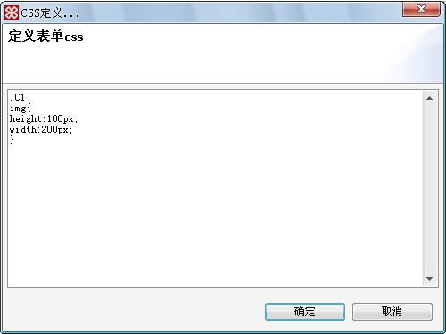

图4.17.18css定义窗口

然后，在照片字段的展现属性中设置样式名，如下图所示：

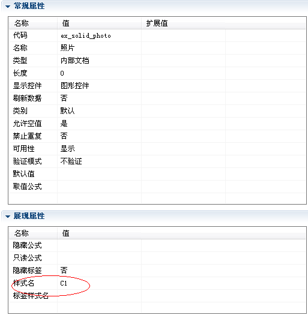

图4.17.19字段样式设置

对象提交后，执行对象的修改操作，我们可以看到照片是按照150\*100显示的，展现如下：

图4.17.20操作表单CSS定义展示

#### 4.8.2.5表单CSS资源路径

注：LiveBOS3.3.0及以后版本支持该属性配置。

LiveBOS提供用户自定义操作界面的CSS样式的方法，也可以通过外部的CSS文件资源实现灵活设置操作界面表单的展现风格。

下面我们仍以员工基本信息对象为例，该例中我们在操作表单中突出显示员工工号和姓名字段的标签，以此说明操作界面表单CSS资源路径的使用方法

首先，在服务端定义一个CSS文件，为其取名testpath.css，文件定义内容如下：

table.OperateForm .style1

table.OperateForm .style2

然后，在对象属性à对象展现属性à操作界面à表单CSS资源路径中，定义CSS选择符的引用路径。

**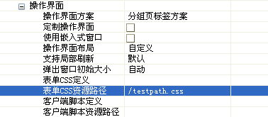**

图4.17.21设置表单CSS资源路径

最后，在员工工号和姓名字段的展现属性à标签样式名中分别设置style1和style2，如下图：

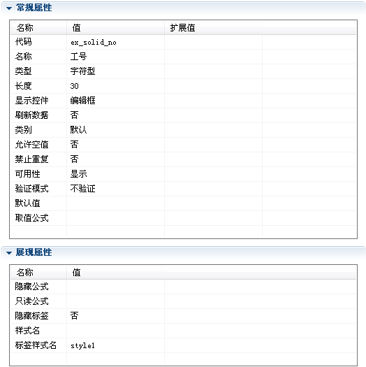

图4.17.22设置字段标签样式名

提交对象至服务端后，执行对象的修改操作，我们可以看到工号和姓名字段的标签颜色变为我们设置的颜色了，展现如下：

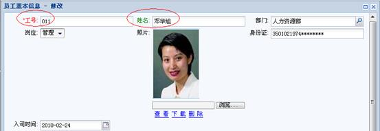

图4.17.23字段标签样式展现页面

#### 4.8.2.6为实体对象增加关联对象

LiveBOS Studio提供了便捷的对象关联机制，通过使用关联对象，用户可以很容易从当前对象中获得与之相关联的对象的信息，并可以对这些信息进行引用。

比如为了查询开发团队参与的项目的详细资料，我们必须把“项目”对象和“研发团队”对象相关联，为了达到这个目的，我们只要把“项目”作为“研发团队”的一个对象字段，点击工作台上的“项目”标签，按住鼠标把它拖动到“研发团队”对象中，如图4.16.24所示。这样一来，在“研发团队”中做的修改就可以很方便地传值到“项目”中去了。

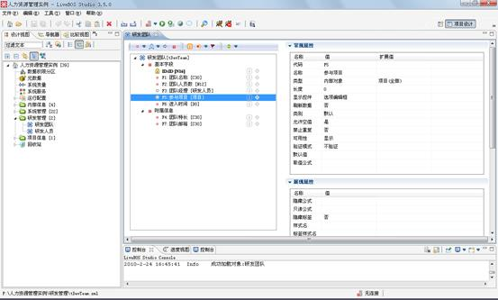

图4.17.24 “项目”作为“研发团队”的对象字段

打开“项目”对象，点击“对象属性”中的“对象关联展示”，就可以看到如下图的弹出框：

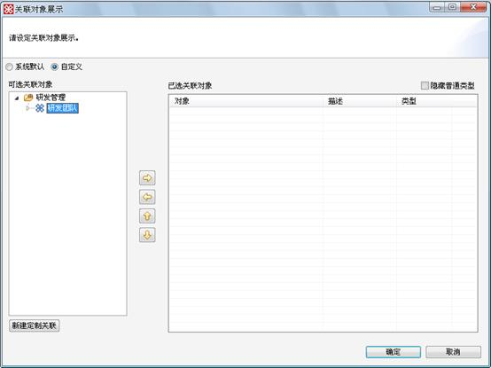

图4.17.25建立项目和研发团队两个对象之间的关联

**关联类型说明：**

**普通关联**：一般关联关系，即与内部对象进行关联。

**从属关联**：指对象间存在主从依附关系。

**一对一从属关联**：从属关联中的特殊关联方式，指对象间的主从依附关系仅限于一对一。

**多对多关联**：多对多关联通过多对多成员对象展现。页面上则以主从关系展示其多对多成员的关联。

**外部对象关联**：该对象与主对象没有直接关联关系，如：没有内部字段引用主对象。

²***定制条件从属关联***：一个带参数的视图或者查询可以通过将该对象的参数与主对象字段进行绑定，可实现从属关系。

²***自由关联***：该关联与主对象没有任何联系，只是以链接方式展示在主对象上，作为页面导航使用。

²***需选中记录***：与主对象的关系仅限于需要引用一个主对象记录才能导航到该页面上一般适用于自定义的JSP中。

### 4.8.3实体对象字段操作

#### 4.8.3.1取值公式设计

当字段类别选择【预计算列】、【虚拟列】、【绑定列】，用户就可以在对象字段属性中的“取值公式”中为字段设置自定义的公式。通过设定取值公式，用户可以在数据库以及针对表格输入记录的过程中取得由公式计算的结果来作为该字段的值。

点击公式定义，进入生成这个编码的自定义公式界面。在本例中我们想知道某个员工的本月工作时间，而本月工作时间与“考勤管理”中的“本月上班时间”和“本月加班时间”有关，所以我们通过预计算列功能就可以很容易地得到本月工作时间。

点击“研发人员”中的“本月上班时间”字段，把字段限制为“预计算列”，点开“取值公式”，并在弹出框内设置取值公式，如下图所示：

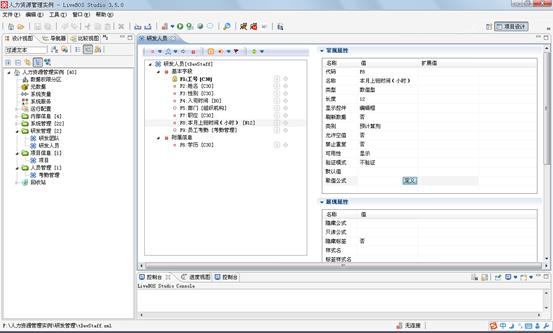

图4.17.26对字段“本月上班时间”进行设置

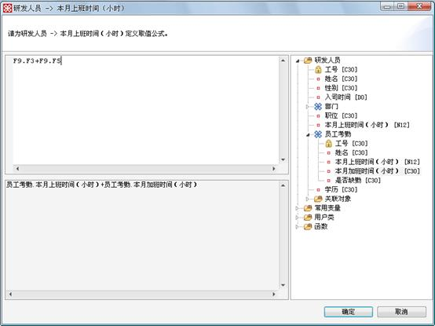

图4.17.27表达式设计

**栏目说明**

l左上方的框体中输入的是表达式的计算公式，可以点击右边引用树的节点快速的增加表达式的计算元素。

l左下方的框体中显示的是经过LiveBOS Studio转化后简单易懂的表达式文字说明。

l右边的框体中显示的是在函数编译时可以引用的变量，这些变量可以从与之关联的对象，常用变量，用户类，函数中得到。

#### 4.8.3.2展现属性设计

当为字段设置展现属性时，用户可以通过自定义的条件来设置当前字段展现的方式。字段展现属性包括隐藏公式、只读公式、隐藏标签，下面我们将在例子中对字段展现的【隐藏公式】属性给出具体的使用说明。

例如在“人员工资管理”对象里，包含有“月基本工资”和“应税工资”两个字段，在操作“月基本工资”字段的数据时，我们对“应税工资”字段的展现加以控制。比如，按照目前个人所得税征收的起点为2000算，“月基本工资”小于或等于2000的员工，应不扣除个人所得税，即可以将“应税工资”字段隐藏，不必对其进行操作。那么我们就可以在“应税工资”字段的展现属性中设置【隐藏公式】，如图4.16.28，4.16.29所示。

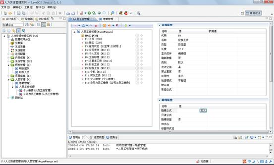

图4.17.28定义隐藏公式

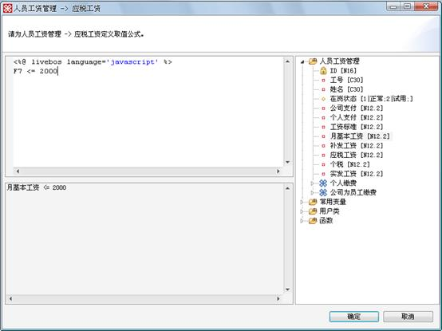

图4.17.29表达式设计窗口

**栏目说明**

l隐藏公式：当表达式为真时，该字段不显示。

l只读公式：当表达式为真时，该字段不可修改。

l隐藏标签：是否显示该字段名称的标签。选择是，不显示标签。

l样式名：字段展现样式名，即定义界面字段控件对应CSS的Class名称，可以通过设置表单或网格的CSS来定义字段的风格。

l标签样式名：自定义字段标签，即定义界面字段标签对应CSS的Class名称，可以通过设置表单CSS来定义字段标签的风格。

l展现模式：多行显示，字段内容较多时，支持换行显示。

l字段宽度：允许用户自定义字段展现宽度，单位是像素。

l支持的文件类型：支持上传的文件类型，多文档字段特有属性。默认\*.\*指所有。如定义图片类型附件：\*.gif;\*.jpg;\*.jpeg;\*.png

l文件类型描述：支持上传的文件类型描述，多文档字段特有属性

l文件大小限制(KB)：上传文件大小限制，多文档字段特有属性

l可搜索列：进行选择内部对象时，选择控件中可显示在搜索栏的字段，默认设置时，控件搜索栏仅显示输入标识和显示标识字段。内部对象字段特有属性。

l附加显示标识：当一个内部对象的显示标识不能精确代表对象实例时,可以用内部对象的多个附加显示字段一起复合显示表达。内部对象字段特有属性。

l网格是否显示附加显示列：网格中是否显示内部对象字段的附加显示标识列，内部对象字段特有属性。

l网格附加显示标识显示模式：内部对象字段的附加显示标识列在网格中展示的模式，包含多列显示和折行显示2种模式，内部对象字段特有属性。

#### 4.8.3.3合法性验证设计

LiveBOS Studio提供了强大的合法性验证机制，它的主要目的对对象字段进行有效性判断。

比如在“研发团队”对象里，包含有“团队邮箱”字段，在修改这个字段的数据时，我们要对新输入的数据进行有效性验证，举个例子，我们希望限制该字段类型为email类型，那么我们就可以在字段的合法性定义中选择“email地址验证”，如图4.16.30-4.16.31所示。

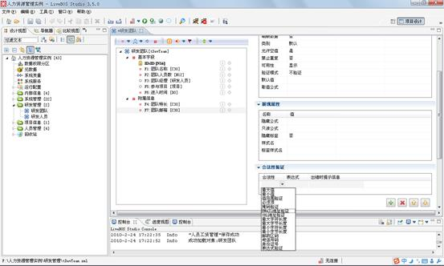

图4.17.30选择Email地址验证

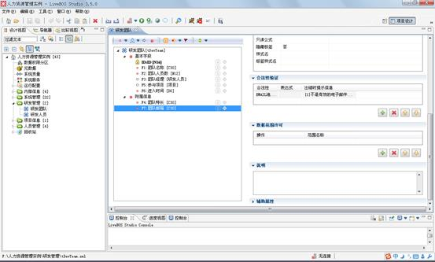

图4.17.31设置出错时提示信息

如果需要复杂的合法性验证，如我们要为“研发团队”中“团队人员数”设置大于零的验证方式，则进行表达式验证的设计。

先在合法性栏中选择新建，再在下拉框中选择“表达式验证”（图4.16.32），然后我们就可以在“表达式”中定义我们的要求，点击表达式的“定义”按钮（图4.16.33），在弹出框中设计语句（图4.16.34）。

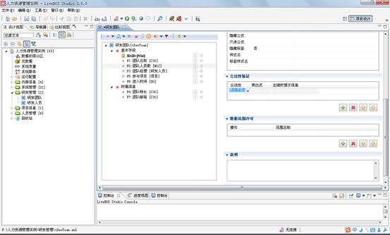

图4.17.32对合法性进行验证

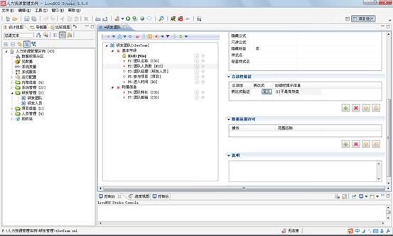

图4.17.33定义表达式

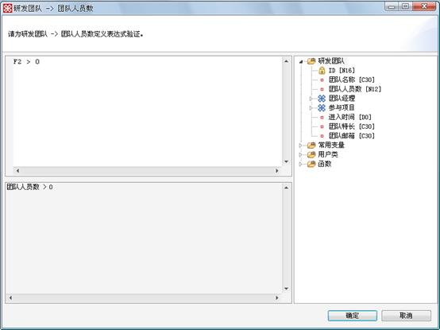

图4.17.34设计合法性表达式

**合法性验证说明**

合法性验证包括两部分，基础约束和表达式约束。基础约束对字段的值进行简单的验证，常用的有最大值、最小值、值范围、必须项、掩码验证、Email地址、URL地址、最大字符长度、最大字节长度、最小字符长度、最小字节长度、邮政区码、电话号码、身份证号等验证方式。表达式约束则是根据定义的表达式验证字段进行验证，如果字段的输入值不满足表达式，则显示出错信息。

以下将对上述验证方式的使用方法给出详细的说明：

（1）最大值：若字段的输入值大于表达式中设置的值，则给出错误提示：【字段】不能大于100.

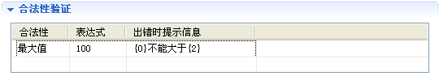

图4.17.35最大值验证

（2）最小值：若字段的输入值小于表达式中设置的值，则给出错误提示：【字段】不能小于20.

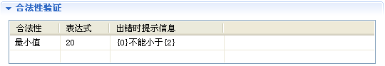

图4.17.36最小值验证

（3）值范围验证：若字段的输入值介于最小值和最大值之间，则为真，否则为假，给出错误提示：【字段】必须介于1和100之间。（注：表达式里最小值和最大值之间必须用逗号隔开）

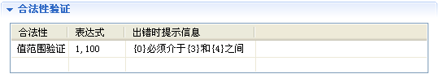

图4.17.37值范围验证

（4）必须项：若字段的输入值为空，则给出错误提示：【字段】不能为空。

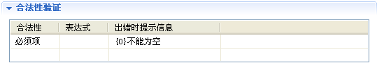

图4.17.38必须项验证

（5）掩码验证：表达式中的正则表达式由用户设计，若字段的输入值符合正则表达式，则为真，否则为假，给出错误提示：【字段】不是个有效的值。如下图所示，设置该表达式为：^-[1-9]\d\*$，即匹配所有负整数.若输入的值为0或正整数，则给出错误提示。

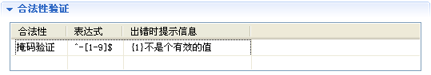

图4.17.39掩码验证

（6）Email地址验证：若字段的输入值不符合Email地址的命名规则，则给出错误提示：【字段】不是有效的电子邮件地址.

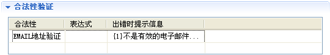

图4.17.40Email地址验证

（7）URL地址验证：若字段的输入值不符合URL地址命名规则，则给出错误提示：【字段】不是有效的URL地址.

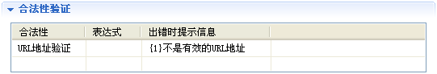

图4.17.41 URL地址验证

（8）最大字符长度：若字段的输入值字符长度大于表达式里设置的值，则给出错误提示：【字段】字符串最大长度不能超过10.

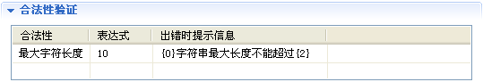

图4.17.42最大字符长度验证

（9）最大字节长度：若字段的输入值字节长度大于表达式里设置的值，则给出错误提示：【字段】字符串最大长度不能超过2.

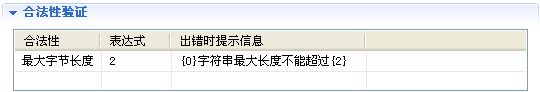

图4.17.43最大字节长度验证

（10）最小字符长度：若字段的输入值字符长度小于表达式里的值，则给出错误提示：【字段】字符串长度不能小于10.

图4.17.44最小字符长度验证

（11）最小字节长度：若字段的输入值字节长度小于表达式里的值，则给出错误提示：【字段】字符串长度不能小于2.

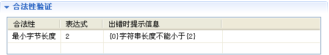

图4.17.45最小字节长度验证

（12）邮政区码：若字段的输入值不符合邮政区码的命名规则，则给出错误提示：【字段】不是有效的邮政区码.

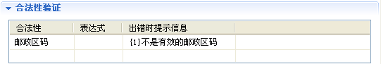

图4.17.46邮政区码验证

（13）电话号码：若字段的输入值不符合电话号码（包括固定电话号码和手机号码）的命名规则，则给出错误提示：【字段】不是有效的电话号码.

图4.17.47电话号码验证

（14）身份证号：若字段的输入值不符合身份证号的命名规则，则给出错误提示：【字段】不是有效的身份证号.

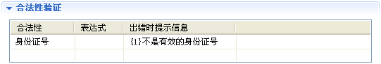

图4.17.48身份证号验证

（15）表达式验证：表达式由用户设计，若不满足表达式条件，则给出错误提示：【团队成员数】不是有效值.（注：表达式验证的表达式条件必须在表达式定义窗口里设计）

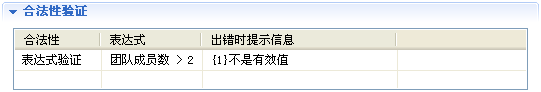

图4.17.49表达式验证

在实际开发过程中，字段合法性验证的出错提示信息一般由用户自己设定，如Email验证时，系统默认的出错提示信息为“不是有效的电子邮件地址”，这里用户也可以更改提示信息的内容。其中的参数,,……含义如下：

：指当前字段的列标签；

：指当前字段的列值；

：指表达式的结果；

：指表达式中自定义的参数。

#### 4.8.3.4设置取值限制

LiveBOS提供了一种数据过滤的方式，即字段筛选。如：我们在维护员工籍贯信息时发现，省属下级有多个市属，市属下级有多个县属，这些关系的信息比较繁杂，如在”县信息”中要选择”福建省龙岩市武平县”时，下拉选择值就有很多。字段筛选可以解决这样的难题。

字段筛选本身类似一种数据的过滤方式，它允许当前字段的值可以根据其它的几个字段的值来限定。字段筛选的类型目前有四种方式：普通字段的限制筛选，视图参数筛选，SQL筛选和数据集辅助筛选。普通字段的筛选方式是根据设定当前设置的控制字段来限制当前内部对象的几个字段的值来达到字段筛选的目的；视图参数筛选指当前的内部对象所引用的必须是带参数的视图，通过设定当前对象字段的值和当前字段所引用的视图的参数的值来达到限制的目的；SQL筛选是通过设定内部对象查询SQL的where语句来达到值范围限制的目的；数据集辅助筛选则是为内部对象建立一个数据集对象，可以将这个数据集对象的内容作为值范围的筛选。

##### **4.8.3.4.1****普通字段筛选**

这里我们以员工籍贯信息的层级筛选来简单介绍普通的字段限制筛选使用方法。我们设置员工籍贯信息的”市区信息”、”县信息”的字段限制功能，”市区信息”字段的值将根据所选择的”省份信息”来筛选值，”县信息”则根据”省份信息”和”市区信息”来筛选，这样用户就可以很轻松的找到所需要的记录了。设置步骤如下：

1.设置”所属市区”的字段筛选：在员工基本信息对象的”籍贯信息”分组中，选中”所属市区”字段，在该字段的属性设置页面选中”字段类型”属性的扩展值，点击扩展值的”全部”进入字段筛选的设置界面（如下图）。

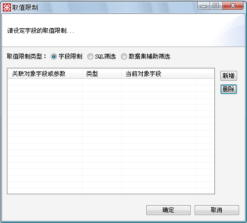

图4.17.50取值限制设置窗口

在上图中点击”新增”，在”关联对象字段或参数”中选择”所属省份”，”当前对象字段”选择”所属省份”，如下图：

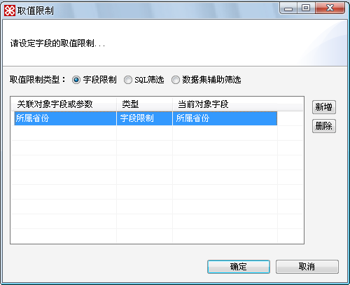

图4.17.51所属市区的字段限制

设置完成后，点击确定。

2.设置”所属县”的字段筛选：同步骤1（如下图）

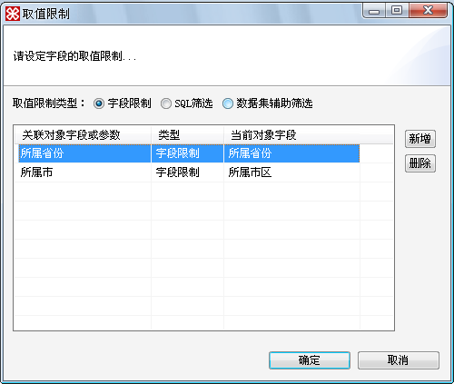

图4.17.52所属县的字段限制

“所属市区”字段筛选展示如下图：

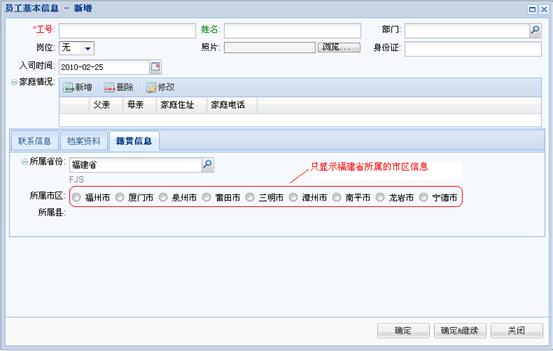

图4.17.53所属市区字段限制展现

“所属县”字段筛选展示如下图：

图4.17.54所属县字段限制展现

##### **4.8.3.4.2****SQL****筛选**

我们以设置”员工考勤记录”对象的”员工姓名”字段的SQL筛选为例，简单介绍SQL筛选的使用方法。本例中，我们通过部门筛选下属所有员工，以便快速定位某员工的姓名信息。步骤如下：

1.选中”员工考勤记录”的员工姓名字段，该字段的内部关联对象为”员工基本信息”，在该字段的属性设置页面选中”字段类型”属性的扩展值，点击扩展值的”全部”进入字段筛选的设置界面，选中SQL筛选，进入SQL筛选设置页面，如下图：

图4.17.55 SQL筛选设置窗口

**栏目说明：**

lSQL筛选：筛选条件，筛选条件中的SQL为where子句；

l引用字段，若字段值发生变化，将触发这个筛选条件。

在上图中筛选条件框体的右侧点击”设定”按钮，即进入SQL筛选语句定义窗口（见下图），在该窗口中我们作如下定义，即员工基本信息的部门字段=员工考勤记录的所属部门的ID：

图4.17.56 SQL筛选语句定义窗口

2.点击SQL筛选窗口的引用字段框体右侧的选择按钮，在弹出的引用字段选择窗口中，我们将”所属部门”字段加入到右侧已选字段列表，点击确定即可。

图4.17.57引用字段添加窗口

预览员工考勤记录对象，执行新增操作，在弹出新增窗口中，所属部门我们选择”人力资源部”（见下图）

图4.17.58新增操作窗口选择所属部门字段

选择员工姓名，则弹出的选择窗口中，只列出”人力资源部”下属的所有员工（见下图），选择其中的一个要添加的员工，点击确定即可：

图4.17.59 SQL筛选展现窗口

##### **4.8.3.4.3****数据集辅助筛选**

下面我们以”工资结算”对象为例介绍数据集辅助筛选的使用方法。我们为员工考勤信息建立一个SQL数据集，该数据集可根据员工所在的部门及姓名信息筛选出该员工本月的缺勤信息，员工本月考勤工资的结算是根据该员工本月的考勤记录而进行结算的。

步骤如下：

1.新建一个”考勤查询”的SQL数据集，该数据集基于”考勤管理”对象建立，根据查询条件（部门和姓名）查询某部门某员工的考勤信息，如下图：

图4.17.60考勤查询SQL数据集

图中SQL语句定义如下：

图4.17.61 SQL语句定义窗口

该查询对象展现如下：

图4.17.62查询结果集展现页面

2.新建一个”工资结算”的对象，该对象的”本月考勤”字段关联”考勤管理”对象。

图4.17.63工资结算对象编辑页面

在该字段的属性设置页面选中”字段类型”属性的扩展值，点击扩展值的”全部”进入字段筛选的设置界面，选择”数据集辅助筛选” ，进入数据集辅助筛选设置页面（如下图）。

图4.17.64数据集辅助筛选设置窗口

**栏目说明：**

l数据集，该内部对象的数据集；

l映射类型，支持SQL列映射和查询字段映射。注：若该数据集是普通查询数据集，这里应选择”查询字段映射”；

l内部值映射列，数据集字段值的映射列。注：这里一定是数据集的查询列，若该数据集无该查询列，则设置无效；

l显式值映射列，数据集映射列的显示值。注：这里是数据集的显示列，即数据集的展示字段名，而不是数据集的字段代码；

l扩展值映射，将数据集对应的列值赋值给该字段及这个对象的其他字段；

l参数设置，数据集参数映射；

l引用字段，同SQL筛选属性。

预览”工资结算”对象，执行新增操作，窗口如下：

图4.17.65工资结算对象新增窗口

当选择”所属部门”为客服中心时，此时已触发辅助查询条件，则”本月考勤”字段的选择窗口中只列出管理应用产品部的员工考勤信息，如图：

图4.17.66数据集筛选结果展现

选择其中一个员工考勤信息，如”林文清”，确定后会发现，考勤信息中的两个字段已经分别赋值给了工资结算对象中的相应字段。

图4.17.67数据集辅助筛选效果展现

### 4.8.4表格对象

表格对象有对象固有的属性，但它隶属于一个对象，是对象的一个属性。当用户对对象中的某一属性要加以详细说明的时候，就可以为这个对象新建一个表格对象。比如我们想创建“项目提供方”对象的详细说明，那么在作为项目中重要组成部分的“项目提供方”信息就无法用简单的一个字段来加以说明，因此，我们把学习经历这个字段作为一个表格对象来创建，然后在“项目提供方”中构造详细信息，比如“提供方名称”和“提供资金”等等。

点击打开“项目”对象，在工作区内右击“项目”，然后在弹出菜单中选择“新建”à“表格字段”：

图4.17.68新建一个表格字段

在新建了一个表格字段以后，我们可以修改它的名称和为这个字段设定一个扩展值，设置扩展值的结果就会创建一个实体表，用于包含这个表格对象的信息。点击编辑，在弹出的对话框内为表格对象设置表名和描述，随后在新生成的对象的编辑页面中新增加“提供方名称”和“提供资金”两个字段。

图4.17.69在弹出框内设置对象代码和描述

图4.17.70表格字段的编辑页面

图4.17.71在新表格编辑页面内新增字段

### 4.8.5对象细分

#### 4.8.5.1说明

对象细分必须依附于一个源对象建立，并通过自定义的筛选条件对这个对象的记录进行筛选。这个源对象可以是普通的实体（表格对象除外），细分适合使用的场合如：只需要进行简单的一些记录的分组筛选，如，一个对象关联中，只需要关联“研发人员”对象中的所有“男性员工”并且大区属于“XX”的时候，则可以单独在这个对象上建立一个细分对象，这个细分的取值条件即为性别为男，并且属于XX大区的。

#### 4.8.5.2实现步骤

在“研发管理”包的对象列表中，选择“研发人员”对象，右击后在弹出菜单中选择“细分”进入细分编辑页面（图4.16.72）：

**栏目说明**

l**细分代码**：为后台提供一个细分的代码

l**细分名称**：对细分的描述

l**字段筛选**：对所属对象的相关字段进行筛选

l**扩展筛选**：对细分进行条件设定

图4.17.72细分页面设计

图4.17.73细分条件设计
