# 对象方法设计

> LiveBOS Studio > 用户手册 > 业务建模设计

---

## 4.9对象方法设计

### 4.9.1说明

对象方法的存在必须依附于具体的对象，这些对象可以是普通的实体对象，对象视图，或者是虚拟对象。当对一个对象的期望操作在LiveBOS Studio提供的增、删、改、查基本操作没法满足应用要求时，可以采用这种方式。如，对员工进行管理的时候，可能需要判断一些前提条件，和确定员工的隶属大区等等。在本例中，我们想找出几个隶属福州大区的男性员工。

### 4.9.2进入编辑界面

从研发管理包中选定“研发人员”信息对象，双击打开后进入对象设计界面，选中“研发人员”右键点击，在弹出菜单中选择“新建”à“用户方法”，然后双击新生成的方法进入方法编辑页面，如下图：

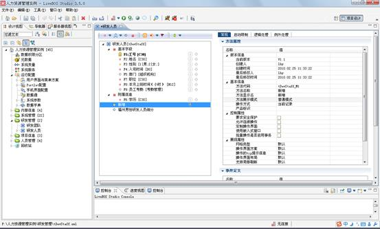

图4.18.1进入用户方法编辑页面

表4.11用户方法属性说明

|  |  |  |
| --- | --- | --- |
| 基本信息 | 方法代码 | **标志方法的代码** |
| 方法名称 | **对该方法的描述，可更改** |
| 方法显示名 | **方法在****LiveBOS Studio****里面的显示名字** |
| 方法展示模式 | **普通模式、记录模式或者是新窗口模式** |
| 操作方式 | **确定对哪些内容进行操作，****LiveBOS Studio****支持的是：自由操作、当前记录、选中记录、所有记录、表格中编辑记录** |
| 产品标识 | **标识方法对应的产品，标识方案有两种，一种是范围，范围的采用（****10,1000****）方式；一种是字符串匹配，如未设定则适用于所有产品。服务端对应的标识由系统参数****product-mark****决定。如果不在当前范围或数据不匹配的话，则相应的方法在服务端不可见** |
| 控制属性 | 要求安全保护 | **必须通过****SSL****安全连接才能访问对象数据。** |
| 允许连续操作 | **是否连续对同一对象进行操作** |
| 定制操作界面 | **使用定制的操作界面** |
| 使用嵌入式窗口 | **操作时不弹出新窗口，直接在当前页面下操作** |
| 批量操作是否启用事务 | **在进行批量操作的时候，启用事务进行处理** |
| 对象展现属性 | 网格类型 | **默认，普通表格还是可编辑表格** |
| 操作界面方案 | **操作界面的布局方案，如普通、左对齐、上下布局、分组页标签、完全页标签等** |
| 操作的tip提示信息 | **鼠标停留在方法按钮上显示的信息** |
| 操作界面布局 | **设置操作界面每行显示的列数，可自定义操作布局** |
| 支持局部刷新 | **是否支持局部刷新** |
| 弹出窗口初始大小 | **设置操作界面弹出窗口初始大小** |

### 4.9.3设计启动限制

用户在启动限制页面可以对对象记录进行筛选，让符合条件的记录进入下一轮操作，提高执行效率。在方法界面中选中“启动限制”，进入启动限制编辑页面，如下图：

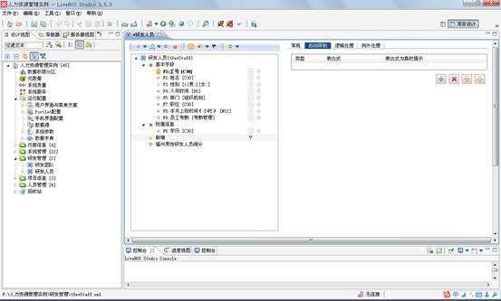

图4.18.2进入用户方法启动限制编辑器

**栏目说明**

l类型：确认是表达式验证还是SQL验证。

l表达式：确认启动异常的条件，设置异常的表达式。

l表达式为真时提示：当启动时出现了已知异常时的提示。

点击进入表达式编辑页面，如下图，在这里我们要进行表单的前提条件判断，这个人员是隶属于福州大区的：

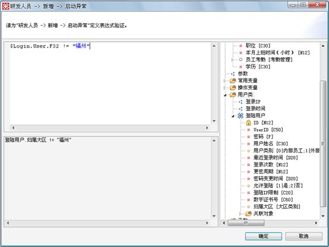

图4.18.3判断该人员是否隶属福州大区

当该对象被操作的时候，LiveBOS Studio就会根据我们上面已经设定好了的表达式进行判断，当表达式为真，也就是说这个人不是属于福州大区的员工，那么就会抛出异常，我们可以在“表达式为真时提示”标签中设置对异常的描述，在这里我们设置为“此人不属于福州大区”。

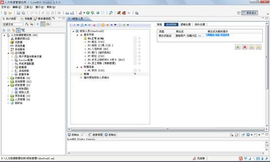

图4.18.4启动限制设定

### 4.9.4设计逻辑处理

点击图4.17.2中的“逻辑处理”进入逻辑处理页面（图4.17.5），逻辑处理是定义对象方法的主要场所，用户在这里通过定义预处理，处理主体和后处理来进行对对象的操作。

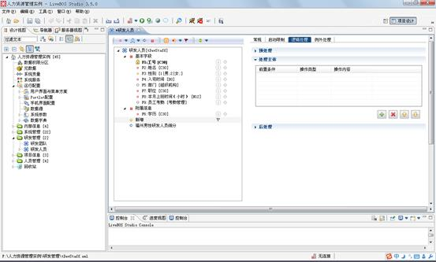

图4.18.5逻辑处理编辑页面

【栏目说明】

l预处理：处理主体为多条数据的时候可以将需要统一处理的内容集中在一起，这样相似的操作只要执行一次，而不要多次重复操作。

l处理主体：在这里设置要对对象进行怎么样的处理。

l后处理：当对对象的操作结束了以后，要进行怎么样的处理。

对一般的操作来说，处理主体是使用最频繁的模块，用户在这里定义对对象所进行的操作。右击处理主体，选择新建，得到窗口如下：

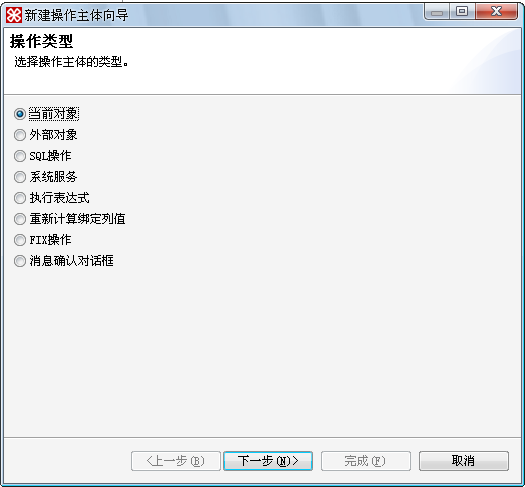

图4.18.6新建操作主体向导第一页

【栏目说明】

l当前对象：选中当前对象，对当前对象进行操作处理，点击出现下图，用户在这里选择对象的某些字段，并为它们设计表达式。

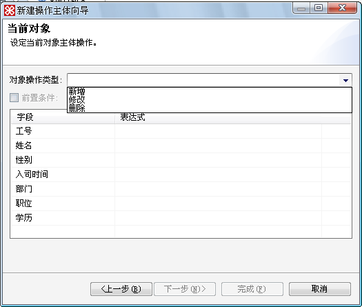

图4.18.7选择当前操作类型

l外部对象：以外部引入的对象进行操作，点击出现下图。

1.对象操作类型：新增、修改、删除。

2.选择外部对象：点击“设定”按钮就可以在弹出的窗口中选择外部的对象。

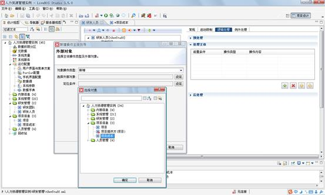

图4.18.8外部对象编辑框

3.定位条件：在这里设定选中对象的定位条件，点击设定后出现下图：

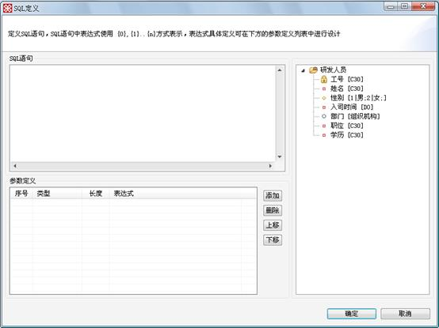

图4.18.9为选中的对象设置定位条件

lSQL操作：直接对对象进行SQL操作，点击出现下图。

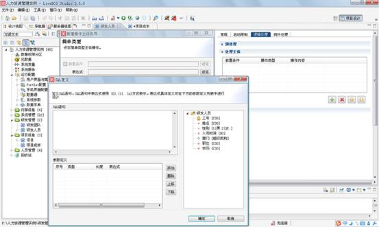

图4.18.10SQL操作页面

1.前置条件：在这里设置的条件可以对选中的记录进行筛选，只有符合前置条件的记录才可以被进一步操作。

2.表达式：在这里设置表达式，用于对选中对象进行操作。

l系统服务：即对增加的系统服务进行具体的设计，选中一种系统服务，对框体中出现的字段进行编辑，下面以对接收人字段的修改为例

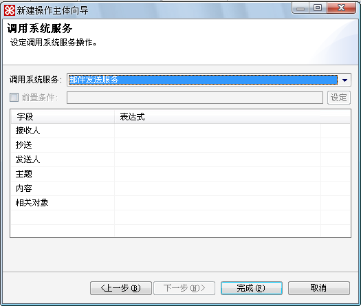

图4.18.11系统服务编辑页面

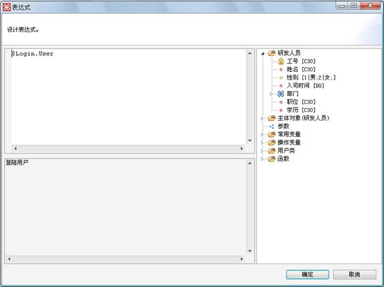

图4.18.12表达式页面

1.调用系统服务：LiveBOS Studio当前支持的系统服务有桌面提醒服务，新浪OMS短信服务，邮件发送服务，外部服务，CoWork消息服务，移动短信服务和公告服务。

2.字段框体：在这里定义对所选字段的操作，本例想对所有登录用户发送邮件。

l执行表达式：直接执行表达式，执行表达式的过程和执行SQL语句的过程类似，点击后弹出类似的编辑框，然后在操作主体中设定表示式，表达式语法可以由系统参数配置默认的语法，也可以在表达式头部直接指定如<%@ LiveBOS
language='javascript' %>，默认未配置的语法为类javascript的语法，变量赋值用=，相等判断用==（新版本仍支持旧版本中的语法定义，只需在表达式头部添加<%@ LiveBOS language='abs' %>即可，变量赋值用:=，相等判断用=）

l重新计算绑定列值：将对象中所有绑定列字段的值根据设定的公式重新计算赋值

lFIX操作：执行特定的FIX操作

l消息确认框：页面中弹出消息确认框，可设置消息的标题、内容、按钮等

### 4.9.5设计例外处理

用户方法的例外处理在全局中执行判断，判断对对象执行该操作的过程中是否出现例外，在例外处理编辑器里，用户可以预先设定好多个可能发生的异常情况，并且对每一个异常情况做出异常描述。

点击图4.17.2中的“例外处理”进入例外处理页面，如图4.17.13：

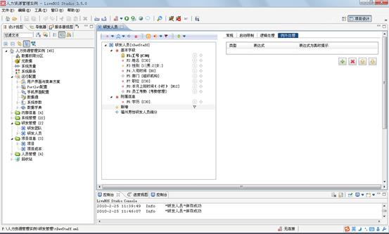

图4.18.13例外处理的编辑设计框

【栏目说明】

l类型：确认是表达式验证还是SQL验证。

l表达式：确认启动异常的条件，设置异常的表达式。

l表达式为真时提示：当启动时出现了已知异常的时候抛出什么样的提示。

我们在这里设定，在整个操作的过程中，任何研发人员的姓名都不可能为空，否则弹出异常信息：“姓名不能为空”。

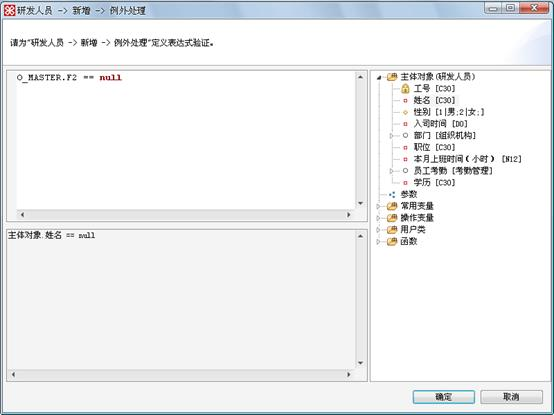

图4.18.14进行例外处理的表达式定义

### 4.9.6高级应用

在对多个对象操作的时候，某些类似的操作可以归类后一次执行而不需要分次执行SQL语句，比如我们选定了多个对象，要对他们进行操作，这时候对他们ID的判断就是十分类似的过程，可以一次就判断完毕。我们可以通过在预处理和后处理中的设置来实现这一功能。

在预处理的过程中，点击“设定”在弹出的框体中定义一个字符串，准备把所有的ID都保存到这个字符串中去。表达式设计如下图：

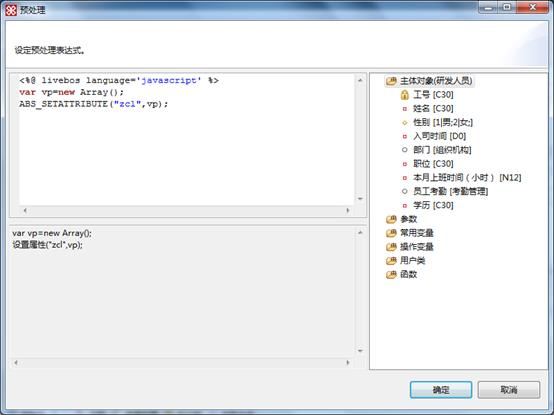

图4.18.15预处理表达式设计页面

**栏目说明**

lvp为定义的参数数组变量，用于存储所勾选的记录ID

lzcl为定义的属性，存储vp中的值

l所输信息如下：

<%@ livebos language="javascript" %>

**var**  vp=**new** Array();

ABS\_SETATTRIBUTE("zcl",vp);

然后在处理主体中对每个字段而言，先分别处理其他差异性较大的操作，然后把相似的ID字段的操作提取出来放到预定义中定义好的字符串中去，表达式设计如下图：

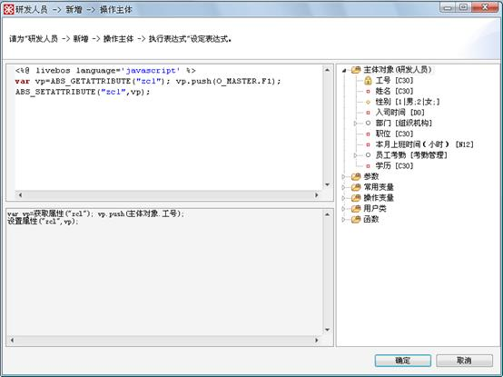

图4.18.16操作主体编辑页面

**栏目说明**

l定义变量vp，取得属性值，此时值为空

l用push方法，将所勾选的记录ID依次添加到变量vp中

l将vp的值设置为属性zcl的值得

l所输信息如下

<%@ livebos language="javascript" %>

**var** vp=ABS\_GETATTRIBUTE("zcl"); vp.push(O\_MASTER.F1);

ABS\_SETATTRIBUTE("zcl",vp);

经过处理主体的处理之后，差异性较大的操作已经执行完毕，在后处理中就可以一次调用SQL语句的方法，并获得一个操作是否成功的返回值，点击后处理表达式的“设定”按钮，在弹出框内设定表达式如下图：

图4.18.17后处理的编辑窗口

**栏目说明**

l定义vp变量，取得属性zcl的值

l对vp中的值进行解析，解析后的格式如：（1,2,3,4,5,6）其中数值为所选记录ID

l调用平台定义的ABS\_SQLPROCVALUE(SQL过程值函数)，将解析后的ID字符串vpam做为一个参数传进去，这样只需要对这个字符串执行一次命令而不需要对字符串中的每个数据分别执行

l所输信息如下

**（备注：****O\_PARAMETER.P1****为对象方法定义的参数，其中第****1****个****?****为平台规定的返回值参数，变量****reinfo****为存储过程的返回值，当为****1****时，表示执行成功，否则为失败）：**

**<%@
livebos language="javascript" %>**

**var**
vp=ABS\_GETATTRIBUTE("zcl");

**var**
vlen=vp.length;

**var** vpam='';

**for**(**var** i=0; i <
vlen; i++)

vpam="(" + vpam +")";

**var** reinfo
=ABS\_SQLPROCVALUE("",[vpam,O\_PARAMETER.P1]);

reinfo;

当所有的操作定义结束以后，逻辑处理窗口表现为下图：

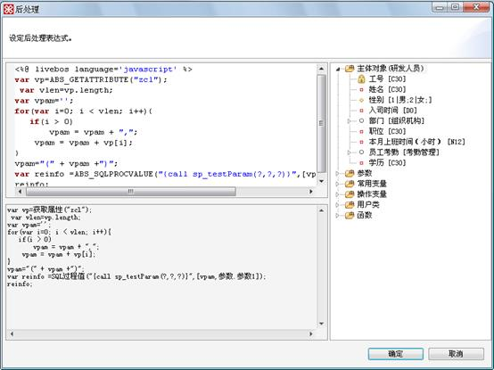

图4.18.18逻辑操作设定好后的窗口
