# 分类简单图示

> LiveBOS Studio > 用户手册 > 导入导出功能

---

## 5.4分类简单图示

### 5.4.1从LiveBOS项目中导入

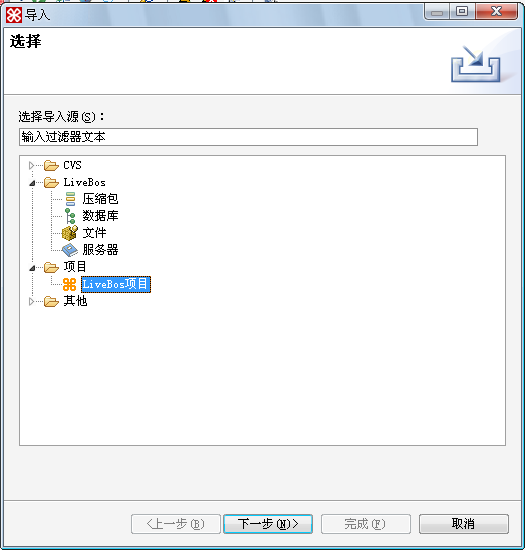

图5.4.1导入LiveBOS
Studio 项目

单击”下一步”：

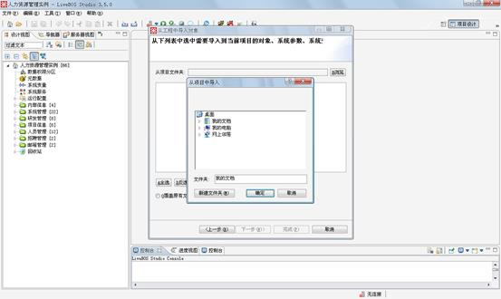

图5.4.2从项目中导入

选择已经存在的项目按“确定”出现如下图：

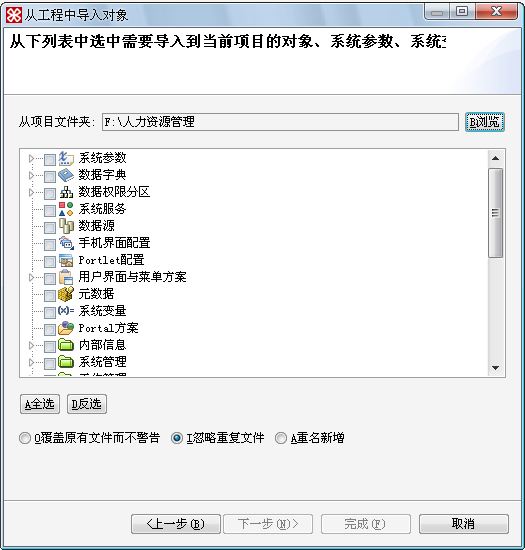

图5.4.3从项目中导入视图，选择要导入的部分

选择要导入的对象：

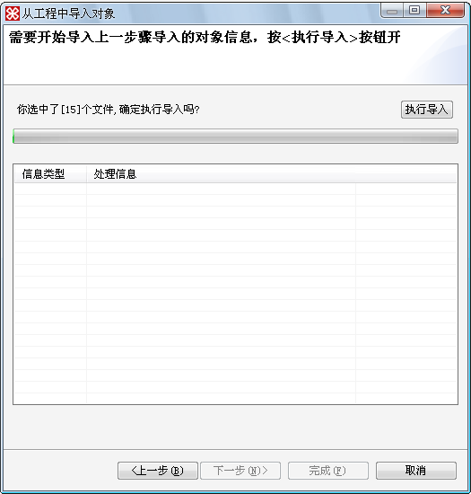

图5.4.4选择完要导入对象后出现页面

按“执行导入”按钮：

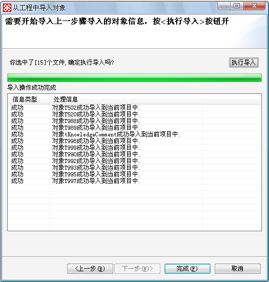

图5.4.5导入进度

按完成，结束导入操作。

### 5.4.2从服务器中导入

导入界面选中从“服务器”导入，按下一步进入如下图：

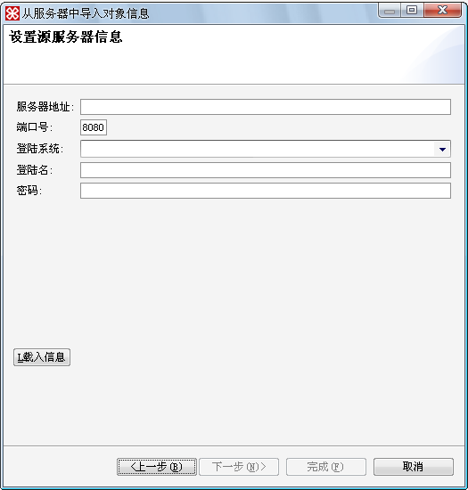

图5.4.6从服务器中导入

**栏目说明**

l服务器地址：为源LiveBOS应用服务器的主机IP地址或者主机名称（目前不支持Https的访问方式）。

l端口号：为源LiveBOS应用服务器使用的端口号。

l登录系统：即源LiveBOS服务器上具体的方案（注意：这个只有在LiveBOS应用服务器上，部署为多方案的方式才有意义）.

l登录名：即登录应用系统的用户名如admin（注意：这个登录用户必须是系统管理员或者是开发人员类型才有权限，否则不能通过验证）。

l载入信息：按载入信息，系统将从输入的LiveBOS应用服务器中载入对应系统到studio。

载入完成后，点击“下一步”将进入从项目中导入相同的操作界面。

### 5.4.3从文件中导入

选中从“文件”中导入按“下一步”进入如下图：

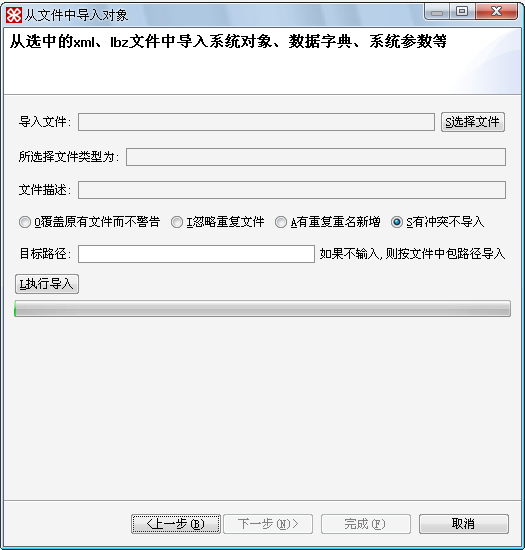

图5.4.7从文件中导入

**栏目说明**

l导入文件：所选择LiveBOS对象的源文件，目前支持xml，sql，formui文件等。点击选择文件按钮弹出文件选择框，选择后在这行列出选择文件的绝对路径.

l选择文件类型：文件选择后，将显示所选择文件的具体类型。

l文件描述：为所选择的对象的描述信息。

l目标路径：为选择导入文件导入到当前项目的包路径（注意：如果不输入则按原路径导入，但这个只针对导入的是普通对象有意义，对系统对象则无意义）。

### 5.4.4从压缩包导入

选择从“压缩包”导入，按“下一步”，进入压缩包选择界面，选择需要导入的LiveBOS压缩包。按确定后系统将先自动解压文件，然后按下一步，进入和“从项目中导入”相同的操作界面。

### 5.4.5从数据库导入

从数据库中导入适合于那些历史遗留系统，想借助LiveBOS来整合各个系统情况。能够执行此项的前提条件是：目前系统已经存在了表结构信息，但是这些表结构还是原始的物理表结构，不能够被LiveBOS所感知，为非LiveBOS对象，同时当前数据库必须导入LiveBOS必须的系统表信息。

导入的一些注意点：

A：导入的时候系统原则上不改变当前物理表结构信息，表的信息转化为实体对象的时候，转化后的对象名称将从数据库的系统表中取得：oracle将从”USER\_TAB\_COMMENTS”表的”COMMENTS”列中的值作为对象的描述信息；SQLServer将从系统表中“sysproperties”的Value值作为该对象的描述信息。

B：转换时候列的描述信息，oracle中将从“user\_col\_comments”表中取Comments列的值作为描述信息，SQLServer中将取sysproperties表中的Value值作为描述信息。

C：外键关联关系的变化：转化后的外键关联关系将转换为LiveBOS系统的对象的关联方式。

D：主键的变化：如果当前已经存在多个列作为主键，系统将取第一个作为LiveBOS系统的主键，其它均设置为禁止重复属性。如果没有设置主键，则自动加一个ID列作为主键。

E：oracel的时候，LiveBOS系统表必须和这些物理表处于相同的表空间下。

选择“数据库”，按“下一步”进入如下操作界面：

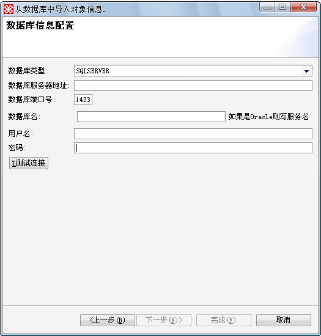

图5.4.8从数据库中导入

**栏目说明**

l数据库类型：即将从哪种类型的数据库中导入对象，目前只支持oracle8i及以上版本，Sqlserver2000，2005数据库。

l数据库服务器地址：即数据库所在的主机名称或者IP地址。

l数据库名：数据库的名称（Oracle时候为服务名）。

l用户名：登录数据库的用户名。（Oracle数据库为LiveBOS系统表所在表空间相同的用户名）

点击“下一步”进入如下图：

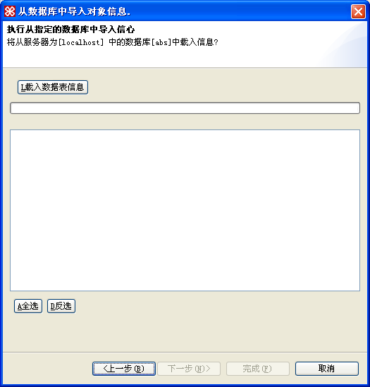

图5.4.9从数据库中导入的第二步

点击“载入信息”进入如下图：

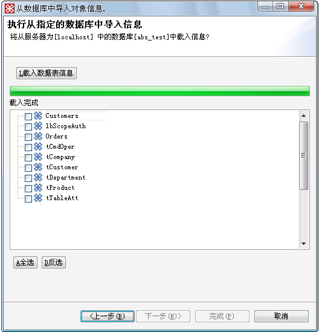

图5.4.10导入数据完成

选择要导入的对象按“下一步”进入下图：

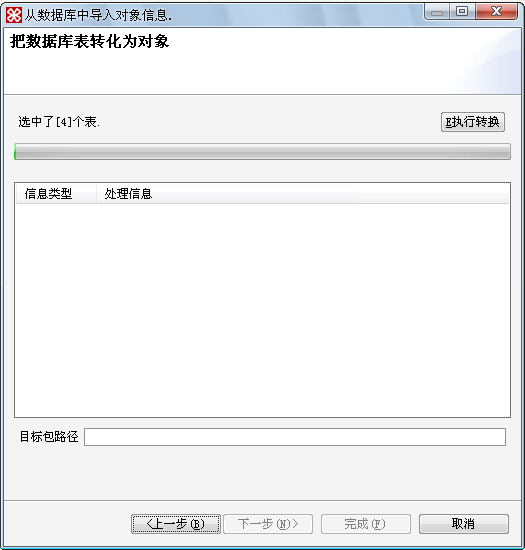

图5.4.11把表格生成为对象

**栏目说明**

l目录路径：即上一步所选择的对象将导入到当前系统的哪个包里。

点击“执行转换”导入对象。

### 5.4.6导出到服务器

说明：这个导出，相当于把当前的项目部署到目标服务器上的对应系统中，导出的时候，将把当前项目的对象信息覆盖目标系统中的所有对象信息。

在向导中选择导出到“服务器”，进入图5.4.12：

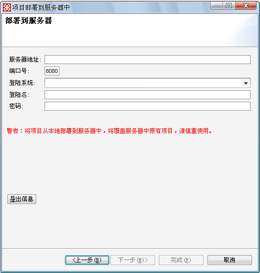

图5.4.12部署要导出的服务器

栏目说明见“从服务器中导入项”

### 5.4.7导出为压缩包

说明：当前压缩包支持的格式为zip格式，今后将统一改为LiveBOS自定义的文件格式lar的格式。

向导中，选择导出到“项目包”，按“下一步”进入图5.4.13：

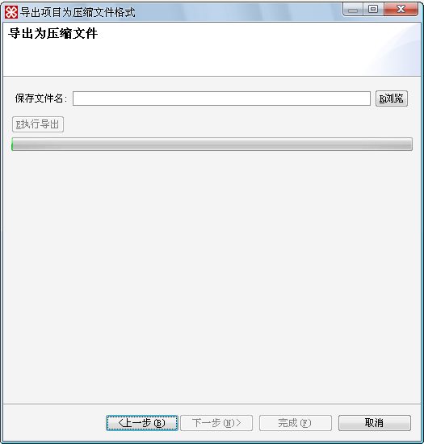

图5.4.13导出为压缩包形式

输入导出的文件名，按“执行导出”，把当前项目导出为项目包形式。
