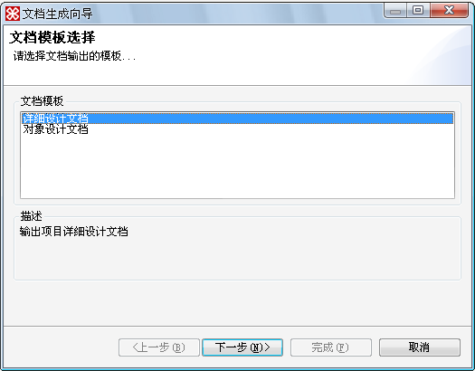
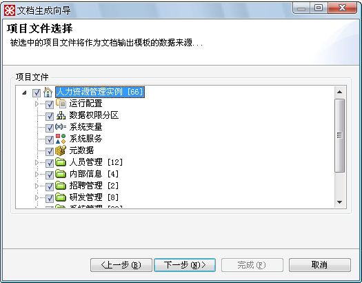
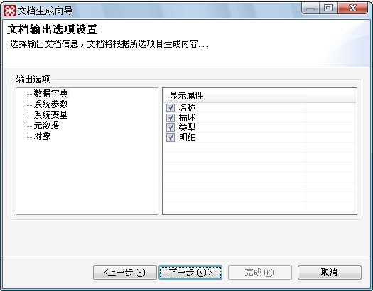
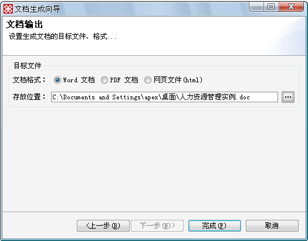

# 如何使用

> LiveBOS Studio > 用户手册 > 文档输出

---

## 6.2如何使用

LiveBOS
Studio提供文档输出向导的方式逐步引导用户进行相关操作。具体操作步骤如下所示：

1.点击Studio左上角的文件à文档输出，弹出如图所示的文档输出向导，选择详细设计文档，单击”下一步”：

图6.2.1选择详细设计文档

**备注**：详细设计文档，输出模板信息包括系统参数、数据字典、用户界面与方案菜单等详细设计信息；对象设计文档，输出模板信息仅包含对象设计的详细信息。

2.选择项目文件作为文档输出模板的数据来源，如图所示，我们选择整个项目作为文档输出数据源，单击”下一步”：

图6.2.2选择数据源

3.弹出的文档输出选项设置窗口中，全部采用系统默认，单击”下一步”：

图6.2.3选择项目生成内容

4.设置文档输出的格式和目标文件的存放位置，单击”完成”。

图6.2.4选择文档输出方式及存放路径
