# 如何使用

> LiveBOS Studio > 用户手册 > LiveBOS工作流设计器

---

## 7.3如何使用

### 7.3.1和旧版本设计方式的区别

[注]本节摘自工作流升级指南

#### 7.3.1.1将原来的工作流导入到Studio中进行设计

通过服务器比较视图或导入导出工具将流程导入本地项目中。

#### 7.3.1.2概念上的变更

l步骤改为活动

l执行人变更为参与人

l预处理和后处理统一变更为事件处理

l人工活动新增明确的动作概念，动作表现上为执行界面上的按钮

l设计区别

#### 7.3.1.3工作流设计上的区别

a)普通的人工活动和其他活动不能直接连线，要先创建动作后，通过动作连线到其他活动或自身。

创建动作方法：在活动上点右键，通过弹出菜单选择动作、定时动作、干预动作。

b)参与人一般直接在活动上指定，一些特别的转向也可以在连线上指定下一步执行人。

c)原来的预处理和后处理现在统一在活动上设定事件处理。

事件针对原来的预处理和后处理分别为：

[活动]XXXX
等同于原来的步骤预处理

[动作]XXXX
等同于原来的动作预处理

[转向]XXX
等同于原来的转向后处理

[注意：原来的活动后处理，动作后处理，转向预处理在新的流程设计器中不提供设置功能，如果原来有设定这些处理的可以通过手工修改xml文件将其移到合适的位置。]

d)流程表单可见性不是通过添加删除字段，而是直接点击表单信息是否可见选择框。

e)原先转向上定时功能现在通过新增定时动作实现，并在定时动作上设定启动时间等参数。

f)原先转向上允许回收现在通过新增干预动作实现，并在干预动作上指定干预人。

g)新增子流程活动类型。在子流程上可设定调用的子流程、调用方式，并可将主流程的值作为入口参数赋值给子流程表单、子流程表单的值也可作为出口参数返回给主流程表单。

h)开始节点的有条件转向可以指定是否由父流程调用的条件，表明当该流程作为其他流程的子流程时，启动后将转向到哪个活动。

### 7.3.2开始设计一个流程

通过上面简单介绍了有关本工作流设计器中涉及的概念之后，我们将尝试着通过工作流设计器定义一个休假申请流程。本流程分以下几个步骤：申请人填写休假申请单，提交给部门经理审批，部门经理审批之后，提交给总经理审批，总经理审批通过之后，转为人力资源部备案，流程就算完成了。这个是一个非常简单的流程。现在就开始来通过本设计器来定义这个流程。

#### 7.3.2.1建立工作流表单

1.打开LiveBOS
Studio ，建立一个工作流表单对象，如图8.3.1：

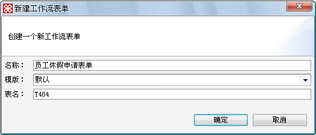

图8.3.1新建工作流表单

2.设置工作流表单的属性，如图8.3.2：

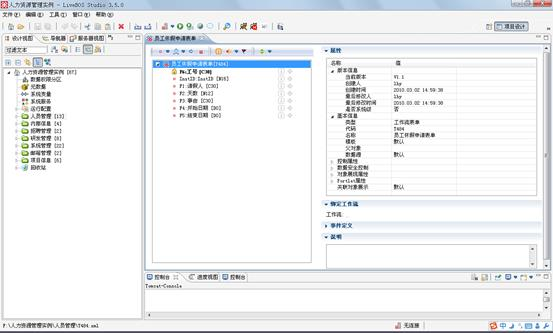

图8.3.2设置表单对象

#### 7.3.2.2连接服务器

连接服务器的方式和通过LiveBOS Studio中对象设计时候，提交操作时候连接服务器相同，因为在设置流程的参与人信息的时候，必须依赖于具体系统的用户信息，所以这个步骤是一个必须的操作，否则将影响到后续的流程设计。

#### 7.3.2.3建立一个新的流程

1.建立完工作流表单后，在Studio左边菜单工作流分类项节点、包节点或根节点上，点击右键，选择建立工作流，如图8.3.3：

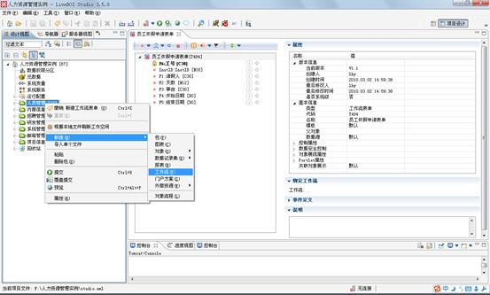

图8.3.3新建工作流

2.单击工作流菜单后，进入如图8.3.4：

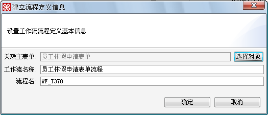

图8.3.4关联工作流表单

**栏目说明**

l关联主表单：为刚才建立的工作流表单

l工作流名称：即这个工作流的名称，进入设计器之后可以修改

l流程名：工作流的一个内部定义的名称，系统会默认给出一个值，可以根据需要修改，但是所修改的名不能和系统已有的重复。

3.点击“确定”后，在左边树中双击新增的”员工休假申请表单流程”进入工作流设计器界面，如图8.3.5：

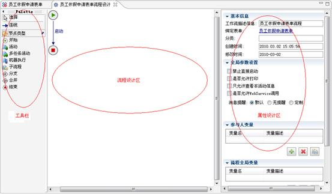

图8.3.5工作流设计器

**栏目说明**

从上图看，本工作流设计器可以分为三个区域：工具栏，流程设计区，属性设置区，其它和LiveBOS Studio中对象建模一样。

l工具栏：上面包含了流程设计时候需要的所有工具面板，上面包含：选择工具，连线工具，各种流程节点工具（开始节点，普通活动节点，多任务活动节点，机器执行节点，子流程节点，分支，合并，结束），设计时，直接把这些节点拖入流程设计区即可增加一个选定类型。

l流程设计区：流程的图形化设计区域。

l属性设置区：主要用来设置流程设计区域中选定节点的对应属性，工作流中所有的属性都可以在这个区域中进行设置。

#### 7.3.2.4加入流程中需要的活动

进入设计器后，加入我们流程中需要的几个活动节点：填写申请单，经理审批，总经理审批，人力资源部备案。如图8.3.6：

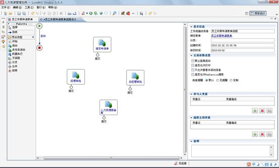

图8.3.6加入活动

**说明**：加入一个活动，系统会自动给这个活动加入一个动作，这个动作名称可以修改，加入的活动默认名称为”活动”，鼠标点击这个活动可以修改这个名称，也可以在属性设置区进行修改。

#### 7.3.2.5设置各个活动的属性

##### **7.3.2.5.1****设置基本属性**

在流程设计区中选中一个活动，出现如图8.3.7：

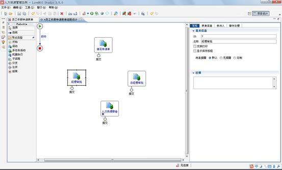

图8.3.7设置活动属性

**栏目说明**

l常规：

Ø基本信息：基本信息包含了这个活动的ID号，活动的名称

Ø支持打印：如果选中，在这个步骤中，可以有个打印按钮，可以打印当前的表单信息。

Ø显示保存按钮：如果选中，在这个步骤中，可以显示保存按钮，可以保存当前的表单信息。

Ø消息提醒：消息提醒方式有三种，分别为默认、无提醒、定制（桌面提醒，电子邮件，短信）

l只允许查看本活动信息：如果选中，则本次活动执行成功后，当前活动的参与人只能看到当前设置的工作流表单的允许显示的字段信息。

l表单信息：用来设置当前活动中允许显示的表单字段信息，同时也可以设置显示的字段信息的编辑属性，和当前活动的摘要列信息。

l摘要列：是作为当前活动的一个主题信息字段，用来方便流程监控的时候查看当前流程的情况。

##### **7.3.2.5.2****设置参与人**

1.依次设定完各个活动的基本信息后，在属性栏选择参与人，进行各个活动的参与人设置，如图8.3.8：

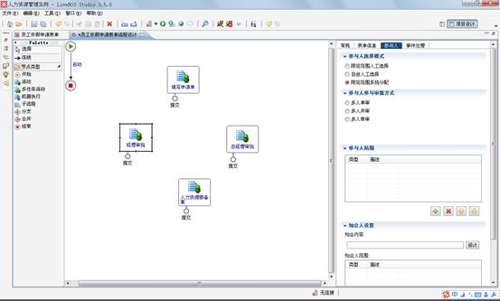

图8.3.8设置活动参与人

**栏目说明**

l参与人选择模式：参与人选择模式有三种可以供选择：限定范围人工选择、自由人工选择和限定范围系统分配。选中限定范围人工选择的时候，参与人由他的上一个活动执行人，在执行提交的时候动态指定。自由人工选择，是根据参与人筛选条件指定下一步骤的流程执行人。限定范围系统分配则是系统根据预先定义好的执行人，自动选择。

l参与人参与审批的方式：见相关概念介绍

l参与人范围：即本次活动参与人的一个集合。

l知会人设置

Ø知会内容：将流程处理的活动与状态报告给相应的人员，这些人员不参与具体的流程活动，只是获悉流程进展情况。

Ø知会人范围：设置方式同参与人范围

2.增加参与人信息，按”参与人范围”右下脚的”加号”，将弹出一个参与人新增的向导，如图8.3.9：

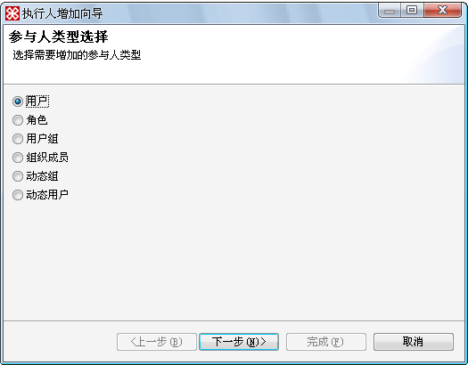

图8.3.9执行人类型

**栏目说明**

上图（图8.3.9）是用户选择的开始页面，目前参与人由五种类型组成，对这五种类型的说明请见涉及相关概念介绍。

（1）选择“用户”，进入如图8.3.10所示页面：

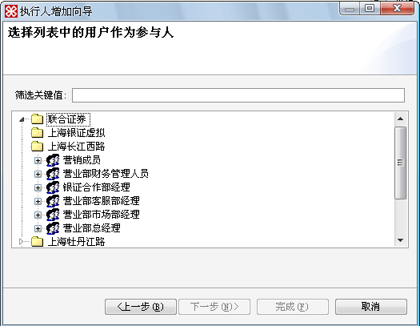

图8.3.10选择用户

**栏目说明**

图8.3.10按照所连接服务器中组织信息来列出系统中的用户信息。筛选关键值，通过这个栏目可以快速的查找需要加入的用户。

（2）选择“角色”，进入如图8.3.11所示页面：

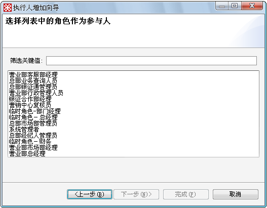

图8.3.11选择角色

【栏目说明】本界面将罗列出当前连接系统中所有的角色信息。

（3）选择“用户组”，进入如图8.3.12所示页面：

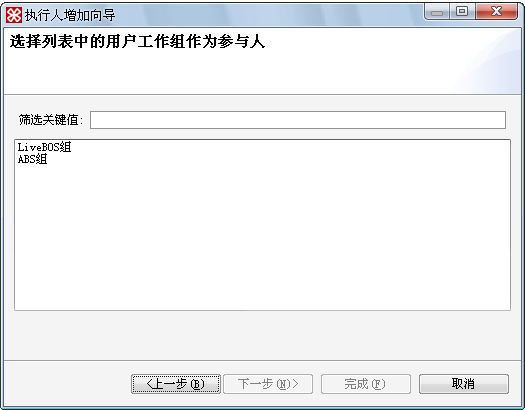

图8.3.12选择用户组

【栏目说明】本界面将罗列出当前连接系统中定义的用户组信息。

（4）选择“组织成员”，进入组织成员选择界面，如图8.3.13：

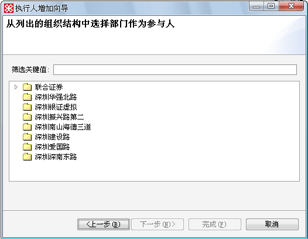

图8.3.13选择组织成员

**栏目说明**：本界面将罗列出所连接系统的所有的组织结构信息。

（5）选择“动态组”，进入图8.3.14所示界面：

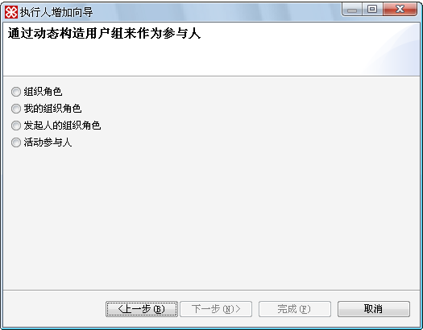

图8.3.14选择动态组

**栏目说明**：本界面将罗列出系统的动态组的类型

l组织角色：即动态组的参与人的集合，是某个组织节点的某个角色用户的集合

l我的组织角色：我指上一步执行人，筛选的时候以上一步执行人作为参照物。

l发起人的组织角色：则以当前流程的发起人作为参照物来筛选组织里面的人员。

l活动参与人：指加入的执行人为参与了某个活动的执行人。

##### **7.3.2.5.3****设置各个步骤中流程表单的字段**

流程中各个活动中的参与人设置完成之后，需要设置各个活动节点中，流程表单的显示属性，比如哪些字段在哪些活动中可见，和不可见，是否允许编辑等。系统默认会把流程表单的所有字段都按照流程表单中设置的显示属性来显示。在这个例子中，经理审批，总经理审批和人力资源部备案这三个活动中，表单中的字段都是只能查看不能编辑的，所以我们在这三个活动对应的属性设置中，进行设置，如图8.3.15：

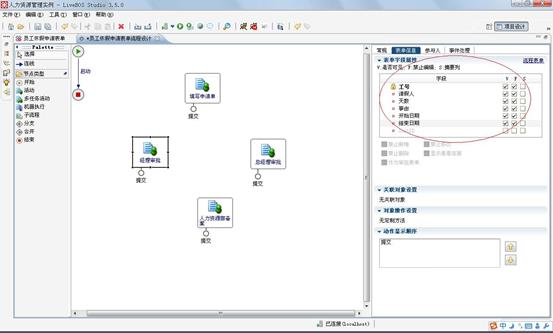

图8.3.15“经理审批”表单字段设置

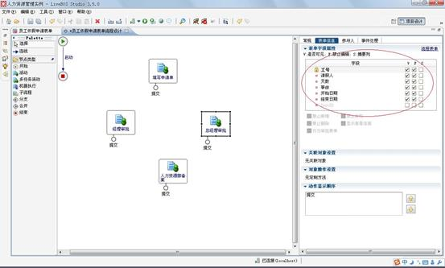

图8.3.16“总经理审批”表单字段设置

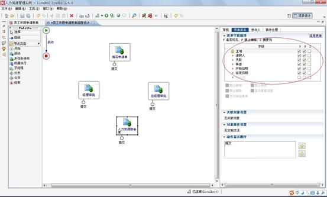

图8.3.17“人力资源备案”表单字段设置

#### 7.3.2.6加入动作

设置完了各个活动中，工作流表单的显示属性之后，我们将给经理审批和总经理审批再增加一个”不同意”的动作。在加入一个活动到当前的工作流的时候，系统会默认给每个活动加入一个动作，这个动作可以任意设置，也可以删除重新加入新的动作，没有什么特别的规定。给一个活动增加一个普通动作步骤如下：

##### **7.3.2.6.1****新增动作**

1.选中”经理审批”活动，然后点击鼠标右键，出现如图8.3.18：

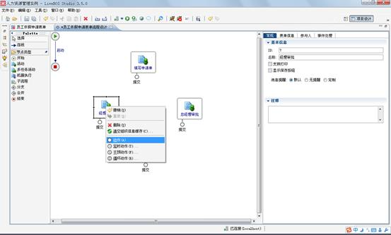

图8.3.18为活动新建动作

2.选中”动作”后，”经理审批”活动将新增加一个动作，如图8.3.19：

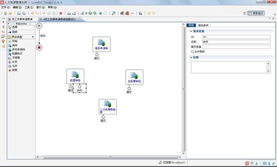

图8.3.19编辑动作基本属性

##### **7.3.2.6.2****更改动作默认名称**

更改动作的默认名称，选中刚才新增加的动作节点，该动作节点进入编辑状态，可以直接在节点上修改名称或者在属性设置页面修改然后给”总经理审批”也同样增加一个操作，如图8.3.20：

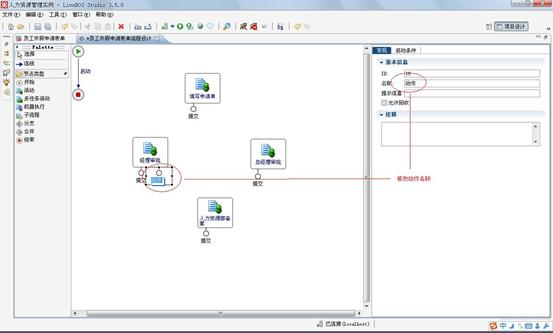

图8.3.20修改动作名称

如上图，我们把对应的”动作”修改为我们需要的动作名称”不同意”。把经理审批和总经理审批中的”提交”修改为”同意”，人力资源部备案中的提交修改为”确认”。

#### 7.3.2.7设计流程的流转

设计完成流程中的各个活动的操作之后，我们将把各个活动根据具体的业务流程，完成活动之间的流程走向。同时，本例将涉及到一个条件转向的设计，即，当申请人填写完申请单后，提交给部门经理审批同意后，根据公司规定，休假超过三天必须由总经理才能生效。

##### **7.3.2.7.1****加入流程的转向**

加入流程转向的方法是，选择流程设计器的工具栏中的连线工具，然后从流程中的某个活动或者动作为源点，鼠标拉到某个活动作为这个转向的终点，单击鼠标，即完成了一个转向的加入，如图8.3.21：

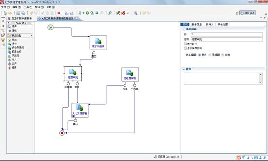

图8.3.21加入转向

##### **7.3.2.7.2****增加一个条件转向**

根据公司实际的规定，三天以上的休假申请，部门经理审批通过后，需要提交给总经理审批才能生效。所以体现到本设计器中，则需要增加一个条件转向。增加的步骤如下：

1.选择工具栏中的连线，以经理审批中的”同意”操作作为本次转向的源点，以”总经理审批”作为本次转向的终点，增加一个转向，则本次转向自动变为一个条件转向（注意：条件转向都必须基于一个普通的转向上建立，本次是因为上面加入流程转向的时候已经建立了一个到”人力资源部备案”的转向）。加入后如图8.3.22：

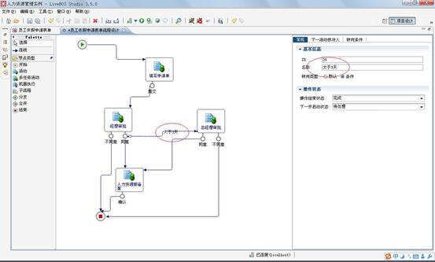

图8.3.22设置转向名称

2.设计转向条件

加入了条件转向后，我们将设计这个转向的具体条件，即根据申请人填写的休假天数，大于三天，这个条件，具体操作如下：

（1）在设计区域中，选中这个转向后，在属性设计区中，点击转向条件标签，进入图8.3.23：

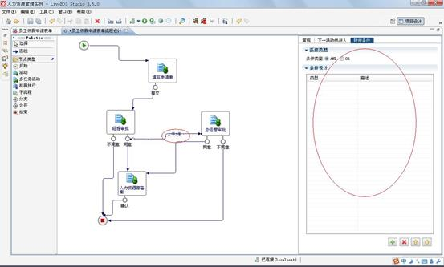

图8.3.23设置转向条件

**条件类型**：条件类型分为两种，一种是”**AND**”类型，选择这个类型表示所有的条件都成立的情况下，这个转向条件才满足；另外一种是”**OR**”类型，这个类型表示所加入的条件中，只要有一个条件成立则这个转向的转向条件都满足。

（2）按增加按钮，进入条件设计的向导，如图8.3.24：

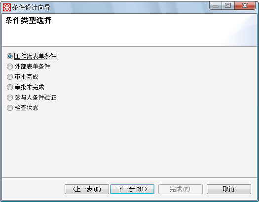

图8.3.24转向条件类型

l**工作流表单条件**：这个是根据当前工作流表单来建立判断条件。

l**外部表单条件**：根据具体的条件，判断LiveBOS中其它对象的属性是否满足一定的条件。

l**审批完成**：判断活动中所需执行的动作都已经执行完成。

l**审批未完成**：判断当前活动所需要执行的动作还未执行完成。

l**参与人条件验证**：判断当前动作的具体参与人是否是在本条件设定的参与人中。

l**检查状态**：这个条件是判断指定的活动是否处于某种状态。

（3）我们选择工作流表单条件，进入下一步，如图8.3.25：

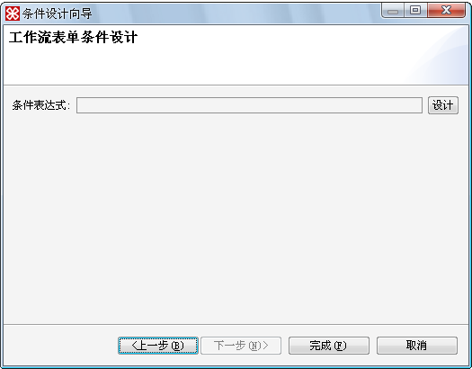

图8.3.25工作流表单条件

（4）点击设计，进入条件表达式设计，如图8.3.26：

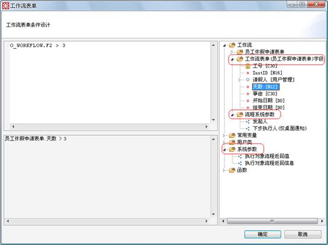

图8.3.26设计条件表达式

【栏目说明】表达式设计基本上和对象设计中的表达式设计相同。

l**工作流表单**：即当前运行的工作流表单，表现为工作流表单的一个具体实例，具体为一条记录。比如某个员工填写的休假申请单。

l**流程系统参数**：流程系统参数目前包含两个：工作流发起人（见定义）；工作流下一步执行人（仅桌面提醒）这个只有在具体事件处理中，有使用桌面提醒的时候有效果，来通知指定的下一步执行人。

l**系统参数**：工作流系统参数包含两个：执行对象流程返回值，工作流流程中调用对象流程，对象流程执行完的返回值；执行对象流程返回信息，工作流流程中调用对象流程，对象流程执行完的返回信息。

### 7.3.3发布流程到服务器中

到目前为止，一个简单的流程就基本上完成了，为了让LiveBOS平台能够解析我们刚才设计的流程，我们需要把这个流程定义发布到服务器中。

发布到服务器的操作非常简单，和提交普通的对象到服务器没有任何区别，点击提交，成功之后，即完成了发布工作。登录平台后，就可以使用这个新的流程了。如图8.3.27：

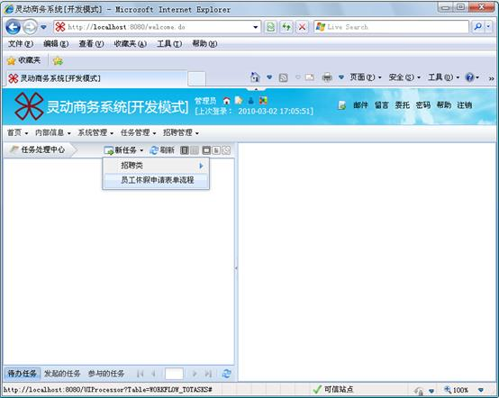

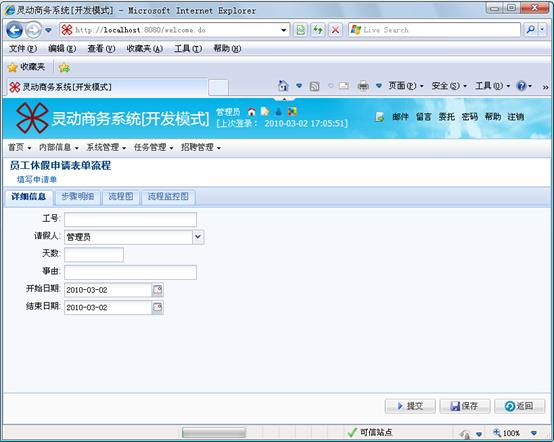

图8.3.27流程展现

我们接下来将继续完善这个流程。

### 7.3.4增加一个审批表单

实际的使用过程中，如经理和总经理在审批休假申请的各个活动中有一些审批的意见和一些备注信息时，就需要给这个流程加入审批表单了。

审批表单本质上也是这个工作流主表单的一个表格对象，表单的建立方式和普通对象的表格对象的建立方式相同。具体可以参考对象设计的用户手册，这里就不再进行重复说明了。我们将这个表格对象命名为”审批意见”，并在这个表格对象中加入两个字段，审批人（设置默认值为当前登录用户），另外一个是审批意见，用来填写具体的意见信息。

在LiveBOS Studio中为工作流表单中加入了表格对象字段后，重新打开当前设计的工作流。选中”经理审批”这个活动，会发现新增加的表格对象”审批意见”已经自动加入进来了。如图8.3.28：

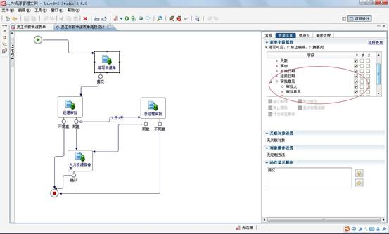

图8.3.28增加审批表单

从上图可以看出来，表格对象加入进来后，系统中所有的活动都默认显示这个表格对象，我们只需要在经理审批和总经理审批这两个活动中需要有记录审批信息，所以在”填写申请单”和”人力资源部备案”中都不要显示，我们则需要到这两个活动中设置这个表格对象为不可见，如图8.3.29：

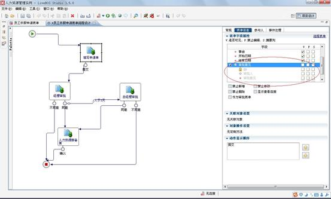

图8.3.29编辑表单字段

l**禁止新增**，**禁止删除**，**禁止修改**，**显示查看连接**：这四个属性是针对当前表格对象的显示属性和操作属性。

l**作为审批表单**：即设置当前表格对象在本次活动中，作为审批表单方式来使用。

注意：这个时候，表格对象加入到各个活动中，它还不具有表格字段表单的属性，所以我们还必须设置表格对象在具体的活动中作为审批表单。

依次设定”经理审批”和”总经理审批”这两个活动中的审批意见表格字段表单，设置为审批表单，并把这个表格字段表单的审批人字段设置为”禁止编辑”，因为在表格对象设计的时候，已经把这个字段的值默认为当前登录用户了。设置完成之后，重新发布到服务器中，再次执行这个流程，产生如下结果，如图8.3.30：

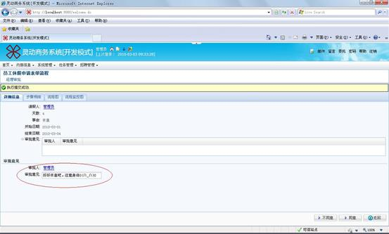

图8.3.30新增的审批表单展现

### 7.3.5增加一个干预动作

本工作流设计器为了加强工作流的流转能力，进一步增加工作流的灵活程度，引入了干预动作的概念，通过干预动作，给予工作流跟踪者能够干预流程的转向，这种需求在办公流程上比较常见，比如我们这个例子中，这个休假申请人在这个流程中，也就是这个流程的发起人，在提交申请之后，在经理还没有审批之前，发现申请的天数目前是两天，觉得不够，想申请为5天，想把这个申请单弄回来重新填写，这个时候就可以在经理审批这个活动中增加一个干预动作实现此功能。

具体实现步骤如下：

1.选中经理审批这个活动，点击鼠标右键，选择”干预动作”，如图8.3.31：

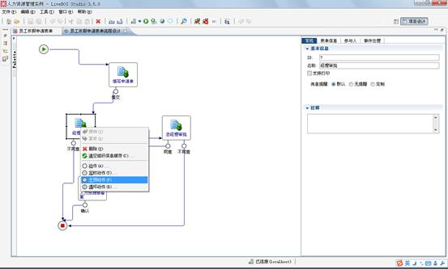

图8.3.31新增干预动作

2.增加一个干预工作到”填写申请表单”活动的转向，如图8.3.32：

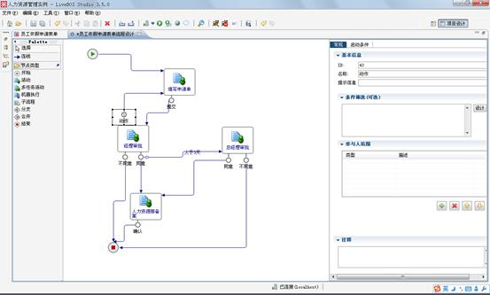

图8.3.32干预动作转向

3.选中新增加的动作，修改名称为”收回”，然后进行这个干预工作的相关属性设置，如图8.3.33：

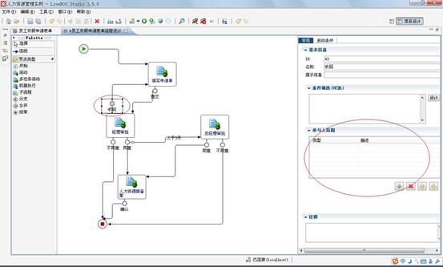

图8.3.33干预动作参与人范围设计

l**参与人范围**：干预动作的参与人范围有别于在活动和转向上设置的参与人范围。此处的参与人范围设置方式是相同的。参与人范围在这里指回收动作的执行人范围。设置方式和活动以及转向中设置的参与人设置相同。

4.设置参与人范围，我们设置为参与了填写申请表单的执行人，如图8.3.34：

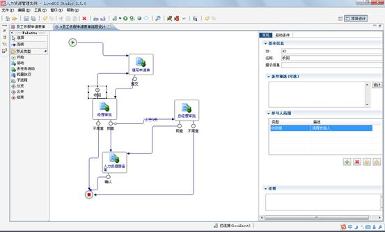

图8.3.34新增参与人

如上图设置，表明在”收回”动作执行的参与人为执行了填写申请表单的参与人。

5.保存并提交到服务器中。

6.到LiveBOS平台中，运行的效果如下：

图8.3.35工作流当前任务

如上图，当前工作流处于等待”经理审批”状态。也就是”经理审批”活动还未进行。

7.点击流程图标签，进入工作流的流程图查看页面，界面如图8.3.36：

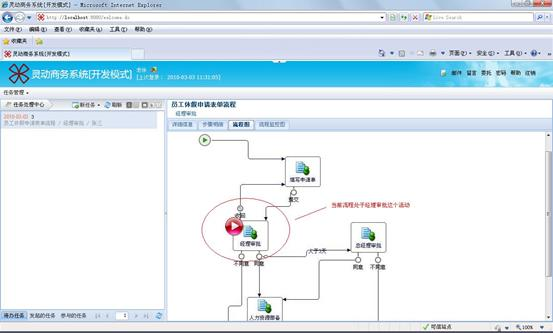

图8.3.36休假申请流程当前任务

如图8.3.36，流程处于处于”经理审批”活动中，并且”经理审批”活动还未执行，所以如图8.3.37，流程跟踪人进入后，可以看到”收回”动作。

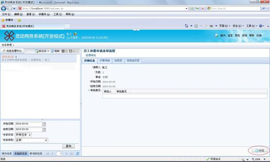

图8.3.37休假申请流程发起人的”收回”动作

8.执行”收回”干预动作后的效果图如图8.3.38：

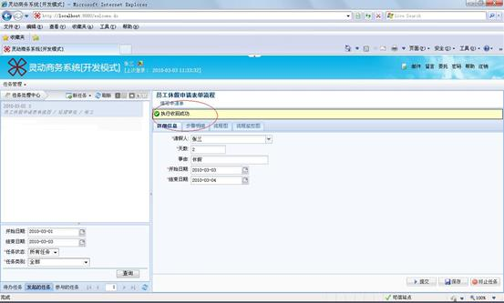

图8.3.38收回休假申请

如图8.3.38，”收回”干预动作执行成功之后，流程重新转向到”填写申请单”活动中，可以重新填写申请单。

注意：这种干预动作和普通活动中的动作是有区别的，普通动作流程监控人员是无法干预的，只有这个活动中指定的参与人才能操作。而干预动作则允许在这个操作中指定的参与人在本次活动没有执行之前被干预从而改变流程的流转。

### 7.3.6增加定时动作

在实际的流程中，可能我们会碰到这样的流程，当流程流转到某个活动中的时候，碰巧这个流程的参与人一直都没有进入系统进行审批。有些具体的流程就希望，如果这个步骤等待了若干时间后，仍然没有被执行，则自动进入下一个活动。比如：我们这个例子中，当申请人填写完休假申请单的时候，可能会碰到刚好自己的部门经理也请假了，需要好几天才能回来，总不能等他回来审批后再休假吧，这个时候公司就对休假审批流程出台了一个相关规定，当部门经理审批这个环节，如果超过半天没有审批，则直接转到总经理审批。这个时候我们该如何实现呢？工作流设计器中的”定时动作”就是为了解决诸如此类的问题而提供的解决方案。具体步骤如下：

1.选中”经理审批”操作，点击鼠标右键，选择”定时动作”，并修改动作名称为”超时同意”如图8.3.39：

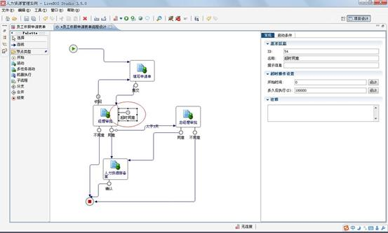

图8.3.39新增定时动作

2.增加一个从这个新增加的定时动作”超时同意”到”总经理审批”活动的转向，如图8.3.40：

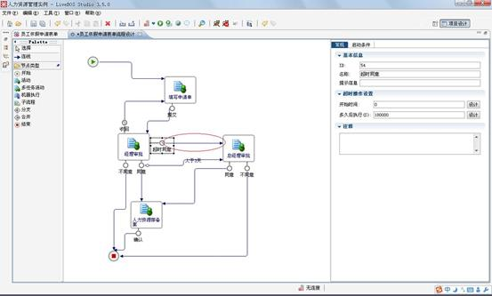

图8.3.40定时动作转向

3.设置超时的属性，选中”超时同意”，到属性设置界面：

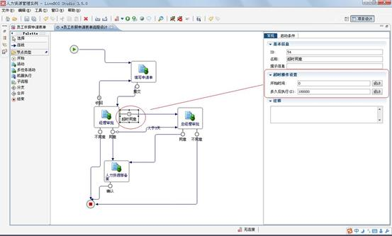

图8.3.41超时定义

l**开始时间**：即当流程流转到当前活动多长的时间后触发这个定时动作的计时器。如果为0则进入这个活动后就触发这个定时动作的计时器。这边可以通过设计一个表达式来进行设计开始时间

l**多久后执行**：则表示计时器启动后的多长时间来执行这个定时动作。这里也可以支持通过设计一个表达式来进行设计。

在这次的例子中，我们设置为一进入这个活动就启动计时器，并且四个小时后执行这个定时动作。则开始时间设置为0，多久后执行设置为14400S（单位为秒）即四个小时。但是为了更好的测试流程，则设置为1分钟即60秒。

4.保存后，提交到服务器。

5.执行效果如图8.3.42：

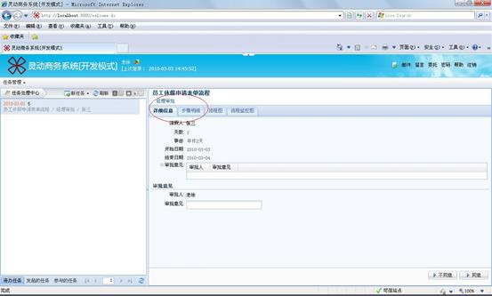

图8.3.42超时处理1

如图8.3.42，是在提交完申请后，流程监控中所查看到的新提交流程所处的活动为”经理审批”。

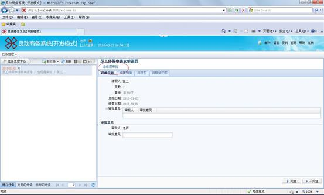

图8.3.43超时处理2

图8.3.43是60S后再次到流程监控中所看到的流程所处的活动变为”总经理审批”。仔细查看并且联系当初我们定义的流程，就很快明白这是我们刚才定义的”超时同意”动作执行的结果。因为按照正常流程，休假天数为两天的申请是不需总经理审批的。

点击步骤明细标签，我们就可以清楚地看到流程的流转方向，如下图所示：

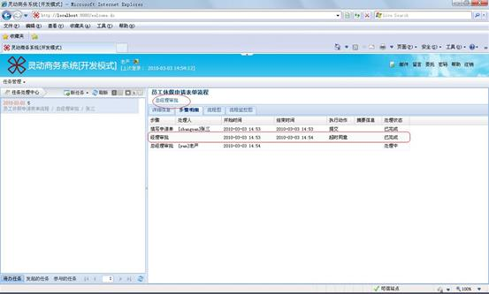

### 7.3.7给动作设置启动条件

在实际的流程中，一些活动有不同的动作分不同的类型人去执行，或者需要根据不同的条件这个活动允许执行的动作也不尽相同。比如在本次的例子中，当休假的天数大于两天的申请才允许收回去重新填写，小于2天的则不允许。这个时候我们就该给”收回”动作设置启动条件来满足这个要求，具体步骤如下：

1.选中”收回”动作，进入属性设置区域的启动条件设置标签栏，如图8.3.44：

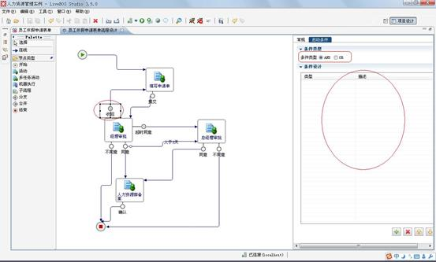

图8.3.44干预动作启动条件

2.增加一个条件表达式为天数>2的工作流表单条件，如图8.3.45：

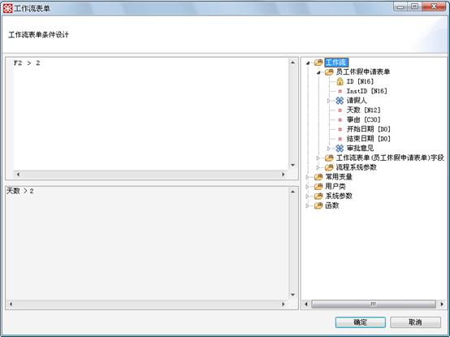

图8.3.45条件表达式

3.确定，保存成功后，提交到服务端。LiveBOS平台中运行的效果如图8.3.46：

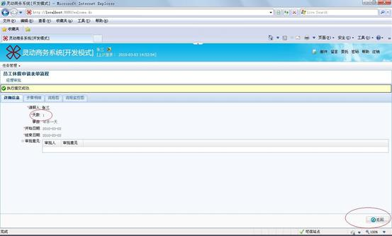

图8.3.46小于2天处理

如图8.3.46为天数为一天（小于2天），则”收回”动作不显示出来给参与人执行。

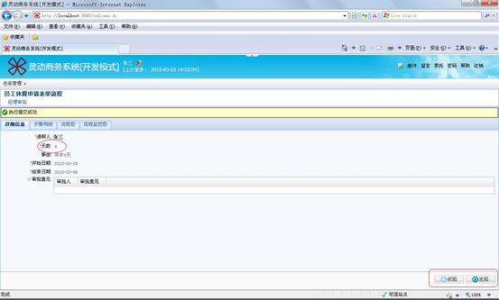

图8.3.47大于2天处理

如图8.3.47大于两天，”收回”动作的启动条件满足，则显示出来，允许监控者执行。

### 7.3.8增加事件处理

到目前为止，可能大家还是会感觉目前流程和已有的LiveBOS系统关联不是很紧密，在流程中还无法执行自己定制的一些方法，很多LiveBOS对象定制方法中的类似功能都无法实现。比如对已有的LiveBOS对象的处理，执行自定义的SQL操作等，或者一些服务如邮件服务等。其实这些功能，通过工作流设计器提供的”事件处理”设计，完全可以实现这些功能。里面包括对工作流表单的操作，对LiveBOS其它对象的操作，执行SQL操作，调用系统的服务等。可以和LiveBOS中的对象功能紧密联系在一起。

而且较之旧版本（即1.0）的设计器相比，本流程设计器进一步简化了事件的设计方式。所有的事件的处理都集中到活动中进行设计，在活动中的事件处理设计中，通过分层的方式，把各个层次的事件更清晰的罗列出来，减少设计上的难度系数。层次格式如下：

[活动]XXXX
等同于原来的步骤预处理

[动作]XXXX
等同于原来的动作预处理

[转向]XXX
等同于原来的转向后处理

在本次例子中，我们给这个流程增加了一个事件处理，即在”经理审批”这个活动中，当经理审批通过之后，自动发送一条消息给发起人。告知审批已经通过。

具体步骤如下：

1.选中”经理审批”活动，在属性设置区域中，选中“事件处理”标签，进入如图8.3.48：

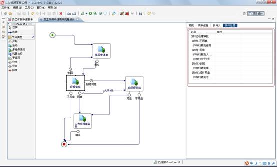

图8.3.48设置活动事件处理

l[**活动**]经理审批：这个事件，表示进入经理审批活动时执行的事件。

l[**动作**]同意：这个事件表示的是，当参与人执行审批这个操作时执行的事件。

l[**转向**]人力资源部备案：表示当参与人执行”同意”操作，并且流程是按”转到人力资源部备案”转向走的时候执行的事件。

2.点击”[动作]同意”进入设计，将进入事件设计界面，如图8.3.49：

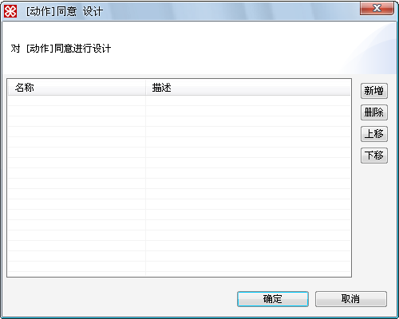

图8.3.49设计“同意”动作的处理事件

3.点击”新增”按钮增加具体的事件类型，如图8.3.50：

图8.3.50处理事件类型

l**表单操作**：表单操作和LiveBOS对象中定制方法的表单操作相同。

l**筛选执行人**：这个事件是用来筛选下一个活动的执行人，注意：这里面设计的表达式是一个SQL的条件类型的表达式。

l**执行****SQL****语句**：这个和LiveBOS对象中的定制方法中的SQL操作相同。

l**调用系统服务**：这个和LiveBOS对象中的定制方法中的调用系统服务操作相同。

l**返回信息**：通过这个事件，可以更改默认的操作提示信息，比如我们默认操作成功的提示信息”执行XX操作成功”，通过这个方法，可以改变这个提示信息。

l**调用对象流程**：事件执行设计好的对象流程

【调用对象流程属性说明】

l对象流程名称：选择项目中已有的对象流程的名称

l传入对象ID：通过表达式设计传入对象流程的对象实例的ID（记录ID）

l参数：对象流程方法的方法参数

l变量：对象流程的入口参数

4.我们选择调用系统服务，选择”桌面提醒服务”，设置好接收人，内容等（注：这里的设计方式和对象的定制方法中的调用系统服务相同），接收人登录系统后会收到桌面提醒，如图8.3.51：

图8.3.51调用系统服务

5.确定，保存后，提交到服务端。然后经理审批后，流程发起人桌面的右下角将出现对应的提示信息，如图8.3.52：

图8.3.52显示调用系统服务结果

### 7.3.9加入子流程

为了加强流程之间的协作和联系，LiveBOS增加了一个子流程的概念，通过引入子流程，可以加强流程间的关系，使工作流能够更好的满足实际的应用系统开发的需要。主流程和子流程之间的参数能够方便的进行交互。同时子流程又能够单独的使用，不必依赖某个主流程，因为子流程本质上也是一个完整流程。

主流程调用子流程的时候，有两种方式：一种是同步调用方式，另外一种是异步调用方式。两者不同在于在同步调用方式下，必须等待子流程执行完毕，主流程才能继续流转到下一个活动。而异步调用方式下，则无须等待子流程执行完毕，主流程可以照常流转。

主流程和子流程的交互方式通过流程设计器中设定的流程表单之间的映射关系进行交互。

为了说明问题，我们依然以当初建立的流程作为例子，实际的应用中，可能并没有类似的流程。我们假设，在活动”总经理审批”中，执行完”同意”操作后，当天数等于5天的时候，在转向”人力资源部”转向之间增加一个子流程，这个子流程就随便定义一个，叫做食堂”停餐申请”吧。

实现步骤如下：

1.新建一个”停餐申请流程”。

2.在主流程”员工休假申请流程”设计区域，增加一个”子流程”，并修改活动名称为”停餐申请”，如图8.3.53：

图8.3.53新增“停餐申请”子流程

3.选中增加的子流程活动，进入属性设置区域，如图8.3.54：

图8.3.54选择流程

l**调用流程**：这里选择系统中建立的流程作为当前流程的子流程。

l**流程调用方式**：分两种。一种是同步调用方式，另外一种是异步调用方式。两者不同在于在同步调用方式下，必须等待子流程执行完毕，主流程才能继续流转到下一个活动。而异步调用方式下，则无须等待子流程执行完毕，主流程可以照常流转。

l**打开子流程**：通过这个连接，可以直接打开所选择的子流程进行设计。

l**入口参数**：即当前流程和子流成的一种交互形式，把当前流程中的表单的值赋值给子流程中的表单。

l**出口参数**：即子流程和当前流程的一种交互方式，把子流程表单的值传回给主流程表单。

4.在选择流程项中，选择新建立的”停餐申请流程”流程作为子流程，并把调用方式选择为同步方式。

5.设置”入口参数”，把当前流程的”请假人”，”开始时间”，”结束时间”赋值给子流程（“停餐申请流程”）的”申请人”，”开始时间”，”结束时间”，出口参数设置中则把子流程中的”食堂审批意见”赋值给主流程的”事由”，如图8.3.55：

图8.3.55设置子流程入口参数

6.增加一个从”同意”到”停餐申请”活动的条件转向，并设置条件为”天数=5天”的工作流表单转向条件，增加一个”停餐申请”到”人力资源部备案”的转向，如图8.3.56：

图8.3.56建立与子流程转向

7.保存并提交到服务器中，并把子流程提交到服务器中。在LiveBOS平台中运行效果如下。

图8.3.57就是当天数为5天的时候，在总经理审批活动时候的截图：

图8.3.57子流程调用

图8.3.58则是执行同意之后转到子流程活动的截图：

图8.3.58停餐申请流程

然后到流程监控中，我们可以发现，系统自动增加了一个”停餐申请”的流程，并且当前子流程处在的活动为”停餐申请”，等待所出发的流程执行完毕，如图8.3.59：

图8.3.59处理停餐申请流程

打开”停餐申请”流程，会发现，通过设置入口参数的表达式已经生效，开始时间，结束时间，申请人都是从主流程表单中赋值而来，如图8.3.60：

图8.3.60成功传入入口参数

“停餐申请”流程走完之后，如图8.3.61：

图8.3.61停餐审批

再次进入流程监控界面，会发现主流程活动，进入到”人力资源备案”活动，并且查看这个主流程详细信息，会发现，事由已经赋值为子流程的”食堂审批意见”，流程定义中的”出口参数”已经生效，如图8.3.62：

图8.3.62人力备案

点击确认，即完成了人力资源部备案活动，流程结束，如图8.3.63：

图8.3.63人力备案完成

### 7.3.10关联面板设计与使用

LiveBOS从3.5版本开始支持关联面板设计功能。流程的每个活动都可以支持和该流程或者该活动相关的信息，比如相关的统计分析信息，图表信息等。

流程关联面板适用于流程办理过程中，与该流程相关的一些记录信息的展现。如公司总经理在进行合同表单申请流程的审批时，想查看与当前合同有关的历史合同统计信息、合同汇总图表展示等内容，关联面板可以实现这样的功能。

#### 7.3.10.1关联面板设计

打开”员工休假申请表单”，在右侧属性栏中找到”关联信息面板设计”，如图：

图8.3.64关联面板设计属性

点击进入关联面板设计窗口，如图：

图8.3.65关联面板列表

点击右侧的新增按钮，为表单添加关联面板。

图8.3.66面板类型选择窗口

上图展现的是关联面板类型选择窗口，目前提供5种面板类型供选择。

**栏目说明**

**关联对象显示面板**：通过参数映射或者SQL条件定义建立起关联对象与当前工作流表单之间的映射关系展现的面板；

面板类型选择”关联对象显示面板”,点击下一步，进入关联对象显示面板设计窗口，如图：

图8.3.67关联对象显示面板设计窗口

l名称：面板代码

l面板标题：面板显示标题

l关联对象：面板要显示的对象。支持普通实体对象、视图对象和虚拟对象。

l参数映射：关联对象为带参数的视图或虚拟对象时，在界面上根据映射条件展现关联对象信息。

lSQL条件定义：设计SQL条件表达式，将过滤掉不满足条件的关联对象记录。

l显示定义配置：面板中显示内容的定义，这里可设置为表达式。

**内部字段显示面板**：展现当前工作流表单的字段信息的面板；

面板类型选择”内部字段显示面板”,点击下一步，进入内部字段显示面板设计窗口，如图：

图8.3.68内部字段显示面板设计窗口

l名称：面板代码

l面板标题：面板显示标题

l显示列：面板中要显示的当前表单字段信息。

**相关对象字段显示面板**：通过ID定位表达式建立起关联对象与当前工作流表单之间的关联，展现关联对象字段的面板；

面板类型选择”相关对象字段显示面板”,点击下一步，进入相关对象字段显示面板设计窗口，如图：

图8.3.69相关对象字段显示面板设计窗口

l名称：面板代码

l面板标题：面板显示标题

l关联对象：面板要显示的对象。支持普通实体对象、视图对象和虚拟对象。

lID定位表达式：相当于SQL中的”where”语句，将过滤掉不满足条件的关联对象记录。

l显示列：面板中要显示的对象字段信息。

**图表显示面板**：对相关图表对象进行展现的面板；

面板类型选择”图表显示面板”,点击下一步，进入图表显示面板设计窗口，如图：

图8.3.70图表显示面板设计窗口

l名称：面板代码

l面板标题：面板显示标题

l图表对象：面板要显示的图表对象。

l参数映射：图表对象的源数据集带参数时，在界面上根据映射条件展现图表对象信息。

l图表大小：面板中图表显示的宽度和高度。支持自定义，单位是像素。

**统计面板**：对相关对象进行统计分析展现的面板。

面板类型选择”统计面板”,点击下一步，进入统计面板设计窗口，如图：

图8.3.71统计面板设计窗口

l名称：面板代码

l面板标题：面板显示标题

l面板类型：对象统计面板和SQL统计面板。对象统计，指对选中对象的字段做简单统计（如，求和/平均值/最大值/最小值/记录数）或表达式统计；SQL统计，指对制定数据源中的数据做SQL统计。

l对象：面板中要进行统计的对象。

lSQL条件定义：设计SQL条件表达式，将过滤掉不满足条件的对象记录。

l统计条目定义：定义面板中要显示的数据统计类型。

#### 7.3.10.2使用实例

关联面板的设计与使用大致分为以下步骤：1，工作流表单中设计关联信息面板；2，流程活动中引用添加已经设计好的面板。

本例中我们仍以”员工休假流程”简单介绍关联面板的设计与使用方法。

我们假设，在人力资源部经理办理员工休假流程的时候，想在关联面板中查看请假人的信息。设计步骤如下：

1，在”员工休假申请表单”的关联面板中,面板类型选择”相关对象显示面板”，面板设计窗口中，面板标题填入”请假人信息”，关联对象选择”用户管理”，ID定位表达式为”ID=请假人.ID”，即当前请假人，显示列中选择UserID,登录次数,隶属组织。设计如图：

图8.3.72 “请假人信息面板”设计窗口

2，打开员工休假申请流程，点击”人力资源部备案”活动，选中”表单信息”标签，找到”关联信息面板设置”，点击添加按钮，将以上步骤中建立的”请假人信息”面板加入到当前活动中，如图：

图8.3.73表单信息中添加“请假人信息”面板

3，将修改后的流程表单和工作流提交到服务器，请假人信息面板在人力资源部备案活动中展现如下：

图8.3.74 “请假人信息”面板在流程中的展现

下面我们为员工休假申请表单分别添加图表显示面板（请假记录统计图），对象统计面板（历史休假记录），如下图所示：

图8.3.75 “请假记录统计图”面板设计窗口

图8.3.76 “历史休假记录”面板设计窗口

将以上步骤建立的关联面板添加到人力资源备案活动，则以上面板在人力资源部经理审批活动展现如下：

图8.3.77面板在流程中的展现

#### 7.3.10.3分组统计面板设计

注：LiveBOS3.5.1及以后版本支持关联面板分组统计功能设计。

**分组对象统计面板**：分组方式展现相关对象统计信息的面板。

图8.3.78分组对象统计面板设计窗口

【栏目说明】设计方式与对象统计面板基本相同。

l分组类型：对象记录根据分组进行展现，分组类型有字段和SQL表达式2种。

l字段选择/SQL表达式设计：若分组是字段类型，则要选择进行分组展现的字段；若分组是SQL表达式，则要定义分组条件SQL表达式。

**分组****SQL****统计面板**：分组方式展现SQL统计信息的面板。

图8.3.79分组SQL统计面板设计窗口

【栏目说明】设计方式与SQL统计面板基本相同，不同点在于SQL统计定义语句里可以添加group by实现数据的分组统计功能。

分组对象统计面板和分组SQL统计面板可以实现相同的功能，本例中，我们以“员工休假流程”介绍这2种面板的设计方式。如人力资源部的人力资源部经理要查看【各部门累计休假次数统计】信息，并根据部门进行分组统计，则分组SQL统计面板设计方式如下图所示：

图8.3.80分组SQL统计面板实现各部门累计休假次数统计

分组对象统计面板实现各部门累计休假次数统计，设计方式如下图：

图8.3.81分组对象统计面板实现各部门累计休假次数统计

将以上步骤建立的关联面板添加到人力资源备案活动，则分组对象/SQL面板展现如下图所示：

图8.3.82分组统计面板在流程中的展现

### 7.3.11流程沟通方案设计

#### 7.3.11.1功能说明

在实际的流程中，可能我们会遇到这种情况。当流程流转到某个活动的时候，流程的审批人对当前流程表单数据有些存疑，这时我们就希望提供这样一个功能，在流程审批的过程中，征求其他流程参与人或者其他非流程参与人的一些意见，参考这些意见解除疑惑后，流程审批人做出正确的流程走向判断。LiveBOS沟通方案可以实现这样的需求。

Studio从3.6.0之后版本开始工作流支持沟通方案的设计，该模块的主要功能为：工作流流程审批过程中，当待审流程需要相关人员的支持时，当前活动节点的处理人可以通过沟通方式，发起沟通邀请，收集沟通意见。沟通结束后，流程继续往下一个活动节点流转。

例如，人力资源管理系统中，有这样一个需求，部门经理进行新员工转正申请的审批时，想征求下本部门一部分在职员工的意见，对发起当前流程的新员工在试用期间的表现给出一些反馈信息。反馈意见收集完成后，部门经理参考这些反馈意见，决定新员工是否继续留用，然后将流程提交给人力资源部。针对这样的需求，我们做如下设计：

首先，我们设计一个“员工转正申请单”的工作流表单对象，如图：

图8.3.83员工转正申请单

然后基于该工作流表单，我们建立一个“员工转正申请流程”，简单添加以下活动节点：填写申请单、经理审批、人力资源部备案。

图8.3.84员工转正申请流程设计界面

#### 7.3.11.2沟通方案设计

沟通可用方案分为2种，一种是系统缺省沟通方案，一种是流程中自定义的沟通方案。

**系统缺省沟通方案**，沟通发起人可以自由选择当前系统的人员参与到沟通中来。

**自定义的沟通方案**，流程中可以添加多个沟通方案节点，设置目标沟通参与人目标范围，沟通发起人可以在这个目标范围内选择哪些人可以参与沟通。

示例中，我们使用自定义的沟通方案。流程图中添加沟通方案节点，名称改为“部门沟通”，此时我们可以看到沟通方案节点中，需要配置的地方有2个：表单信息和参与人。这里的参与人指的是被邀请参与到沟通的人员（即沟通目标）；表单信息，指的是沟通目标所能看到的表单信息。

图8.3.85沟通方案设计界面

打开表单信息标签，我们会看到有2个选项：可见性同沟通发起人和自定义可见性。这里我们选择“可见性同沟通发起人”，参与人设计方式与普通活动节点相同，这里不再赘述。

图8.3.86沟通方案表单信息设计界面

这里我们需要注意的是沟通方案中的参与人分为沟通发起人和沟通目标。

**沟通发起人**，可以在流程活动节点处于允许沟通状态的情况下，发起一个沟通，邀请目标参与人参与沟通。

**沟通目标**，由具体的活动参与人发起沟通的时候指定，参与到具体的流程实例的某个活动中，本身不能进行流程的办理，只能填写相关的意见。

如例子中所示，部门经理执行人即为沟通发起人，沟通方案中设计的参与人就是我们说的沟通目标。

图8.3.87沟通方案参与人设计界面

最后，我们将设计好的自定义沟通方案“部门沟通”添加到“经理审批”活动节点中，如图：

图8.3.88沟通方案添加到活动节点属性

流程设计完成后，我们看下沟通的展现。如新员工发起一个转正申请，流程走到部门经理审批步骤，当前活动审批人在执行同意动作前，点击“沟通”按钮，发起沟通。在弹出的“部门沟通”执行人选择窗口中，选择邀请对象（即沟通目标）和填写邀请主题，如图：

图8.3.89流程审批人发起沟通请求

点击确定按钮后，当前流程实例处于【沟通中】状态，在沟通结束前，其他审批动作按钮暂时不可用，当前活动审批人等待沟通结束，或者在沟通目标反馈沟通意见前，也可以手动“结束沟通”，如图：

图8.3.90沟通发起人的沟通查看页面

我们以被邀请参与沟通的用户身份登录系统，会看到，流程中心待办流程列表中出现了待沟通的流程，在表单详细信息的上方，可以看到2个按钮：沟通和反馈。

**沟通**：继续邀请其他人参与到当前沟通中来。

**反馈**：填写意见，回复沟通邀请。

示例中，我们直接填写反馈意见后点击回复，如图：

图8.3.91沟通回复界面

等所有被邀请参与沟通的人员回复后，部门经理审批界面如图，可以进行下一步流程的流转操作了：

图8.3.92沟通意见收集完毕
