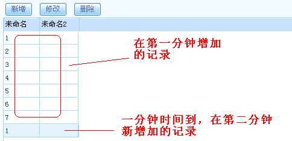

# LiveBOSStudio函数使用说明

> LiveBOS Studio > 用户手册 > 附录

---

## 9.2LiveBOS Studio函数使用说明

### 9.2.1判断(ABS\_IF(逻辑判断,真值返回,假值返回))

用户在调用判断函数的时候，LiveBOS Studio通过执行用户传入的逻辑判断表达式得出为“真”或者为“假”的判断，然后把用户传入的返回值参数根据真假情况选择返回。

l逻辑判断：一个进行逻辑判断的表达式；

l真值返回：当逻辑判断的结果为真值时返回的信息；

l假值返回：当逻辑判断的结果为假值时返回的信息。

l例子：输入
ABS\_IF(10>15,true,false)，

输出
false

### 9.2.2今日(ABS\_TODAY())

获得当前日期。

l例子：输入 ABS\_TODAY()

输出 2008.11.13

### 9.2.3金额大写(ABS\_MONEYTEXT(数值))

该函数的作用是把用户作为参数传入的数值转为大写形式

l数值：欲转化的数值型数值。

l例子：输入ABS\_MONEYTEXT(567.54)，

输出伍佰陆拾柒元伍角肆分整

### 9.2.4日期格式(ABS\_DATESTRING(日期字串,格式))

l日期字串：作为参数传入的字符型日期

l格式：日期的显示格式

l例子：输入 ABS\_DATESTRING("2008.11.13","yyyyMMdd")

输出 20081113

### 9.2.5数值格式(ABS\_NUMBERSTRING(数值字串,格式))

该函数的作用是把传入的数值按照用户指定的格式输出

l数值：传入的数字字串

l格式：用户定义的显示格式

l例子：输入ABS\_NUMBERSTRING(4596.365,"#,##0.###")

输出
4,596.365

### 9.2.6星期数值(ABS\_WEEKDAY(日期字串))

该函数可以对传入的日期进行分析，返回这个日期是星期几

l日期字串，输入一个日期作为参数

l例子：输入ABS\_WEEKDAY("2008.11.13")

输出
4

### 9.2.7星期名称(ABS\_WEEKNAME(日期字串))

该函数可以对传入的日期进行分析，返回这个日期是星期几

l日期字串，输入一个日期作为参数

l例子：输入ABS\_WEEKNAME("2008.11.13")

输出四

### 9.2.8年份(ABS\_YEAR(日期字串))

该函数可以对传入的日期进行分析，返回这个日期所属年份

l日期字串，输入一个日期作为参数

l例子：输入 ABS\_YEAR("2008.11.13")

输出 2008

### 9.2.9月份(ABS\_MONTH(日期字串) )

该函数可以对传入的日期进行分析，返回这个日期所属月份

l日期字串，输入一个日期作为参数

l例子：输入ABS\_MONTH("2008.11.13")

输出
11

### 9.2.10日期(ABS\_DAY(日期字串))

该函数可以对传入的日期进行分析，返回这个日期所属日期

l日期字串，输入一个日期作为参数

l例子：输入ABS\_DAY("2008.11.13")

输出 13

### 9.2.11小时(ABS\_HOUR(日期字串))

该函数可以对传入的日期及时间进行分析，返回这个时间的小时信息

l日期字串，输入一个日期及时间信息作为参数

l例子：输入ABS\_HOUR("2008-11-13 11:01:32")

输出
11

### 9.2.12分钟(ABS\_MINUTE(日期字串))

该函数可以对传入的日期及时间进行分析，返回这个时间的分钟信息

l日期字串，输入一个日期及时间信息作为参数

l例子：输入ABS\_MINUTE("2008-11-13 11:01:32")

输出
1

### 9.2.13秒(ABS\_SECOND(日期字串))

该函数可以对传入的日期及时间进行分析，返回这个时间的秒钟信息

l日期字串，输入一个日期及时间信息作为参数

l例子：输入ABS\_SECOND("2008-11-13 11:01:32")

输出 32

### 9.2.14超链接(ABS\_HYPERLINK(链接地址,链接名称))

这个函数可以对传入的参数分析，然后显示参数的超链接模式及说明

l链接地址：超链接的URL地址

l链接名称：对超链接地址的说明

l例子：输入ABS\_HYPERLINK("www.apexsoft.com.cn","顶点软件")

输出
<a href="www.apexsoft.com.cn">顶点软件</a>

### 9.2.15空值置换(ABS\_NULLSUB(字串1,字串2))

这个函数对传入的参数进行分析，当如果字符串1不是空值，就显示字符串1中的数据，反之则显示字符串2中的数据

l字串1：传入的第一个参数，LiveBOS将判断它是否是空值。

l字串2：传入的第二个参数，当字串1为空值的时候显示它。

l例子：输入ABS\_NULLSUB("before","after")

输出
before

### 9.2.16序列(ABS\_SERIALNO(变化参数))

根据传入的变化参数对新增的记录信息计算序列

l变化参数：根据这个参数对系统表进行修改

l例子：在本例中，我们想按分钟变化对当前表进行新增记录操作

输入ABS\_SERIALNO(ABS\_MINUTE($DateTime.Now))

输出见下图

图10.2.1输出

l返回值：整型

### 9.2.17动态序列(ABS\_DYNSERIALNO(计算标志,变化参数))

根据传入计算标志和变化参数对计算序列,和序列区别在于序列函数值仅在新增操作时会起作用,而动态序列不管操作类型,只要计算标志为真时就计算序列

l计算标志：一个为真或者为假的判断语句

l变化参数：如何对系统表进行变化

l返回值：整型

### 9.2.18JAVA对象(ABS\_LOADBEAN(javabean名称))

该函数加载一个javabean.

ljavabean名称：想使用的JAVA类的具体描述

l例子：当前字段可以使用java.awt.font

ABS\_LOADBEAN("java.awt.font")

l返回值：对象

### 9.2.19设置返回值(ABS\_SETRETNOTE(提示信息))

该函数可以设置返回的信息。

l提示信息：想返回的信息

l例子：ABS\_SETRETNOTE(“Do something here”)

l返回值：无

### 9.2.20数据权限判断(ABS\_ISSCOPEVALID(数据权限因子,参数值))

判断当前的用户是否对参数值是否有传入的”数据权限因子”的数据权限

l返回值：布尔型

### 9.2.21设置属性(ABS\_SETATTRIBUTE(属性名,属性值))

该函数可以为用户自定义的属性名称赋值。

l属性名：用户自定义的属性名称

l属性值：用户想要为自定义属性赋予的值

l例子：本例想自定义一个数组array，并把它命名为“apex”

array = new Array();
ABS\_SETATTRIBUTE("apex",array);

l返回值：无

### 9.2.22获取属性(ABS\_GETATTRIBUTE(属性名))

该函数可以通过执行对象的属性名得到相对应的属性值

l属性名：操作对象的属性名，LiveBOS Studio将返回这个对象相应的属性值。

l例子：本例想获得对象”apex”的属性值：

var array =
ABS\_GETATTRIBUTE("apex")

l返回值：对象

### 9.2.23页面重定向(ABS\_sendRedirect(url))

为操作页面设置可跳转的页面地址

lurl：为页面设置的跳转地址

l例子：让当前页面可跳转到”www.apexsoft.com.cn”

ABS\_sendRedirect("www.apexsoft.com.cn")

l返回值：true

### 9.2.24页面转向(ABS\_forward(url))

为操作页面设置可转向的页面地址

lurl：为页面设置的转向页面地址

l例子：让当前页面可转向到”www.apexsoft.com.cn”

ABS\_forward
("www.apexsoft.com.cn")

l返回值：true

### 9.2.25执行流程动作(LB\_workAction(流程表单,ID,动作ID,摘要说明))

可以在表达式中对于流程表单中对应ID记录执行一个对应的工作流节点的动作。

l流程表单：字符串类型，不能为空。指对应的工作流表单的对象名。

lID：数值型，不能为空。若启动已有流程，这里指流程表单对应记录的ID值。若启动新的流程，执行流程动作前要向流程表单中插入一条新的记录，这里ID值即指新的流程表单记录的ID值。

l动作ID：数值型，对应流程中动作的ID值，当该值小于0时代表不执行流程动作。一般常见于启动流程。当是合法的值时将执行对应流程动作，并引发流程转向就流程事件处理等。

l摘要说明：字符串类型，填入流程步骤明细中摘要信息的内容。

l返回值：instid.

例子：var instid =
LB\_workAction(....);

var instid = LB\_workAction(....);

### 9.2.26SQL结果集(LB\_sqlResultSet(SQL语句,[参数1,参数2,...],数据源))

该函数获取可以执行由用户自定义参数的SQL语句的结果集

lSQL语句：用户输入的可执行的SQL语句

l参数：用户在设置SQL语句的过程中可能用到的参数

l数据源：同SQL值函数数据源参数

l例子：从tUser表中获得用户ID和名字

var rs=
LB\_sqlResultSet(“select userId,name from tUser”,[]);

// var rs=
LB\_sqlResultSet(“select userId,name from tUser”,[],
//LiveBOS\_resource);

While(rs.next())

l返回值：ApexRowSet结果集对象

### 9.2.27是否隶属组织(LB\_isOrganization(组织ID,用户ID[可选]))

该函数判断指定ID用户的用户是否隶属于指定ID的组织

l组织ID：组织机构ID

l用户ID：用户ID值

l例子：LB\_isOrganization(101,$Login.User.ID)

l返回值：true,false

### 9.2.28是否隶属角色(LB\_isRole(角色ID,用户ID[可选]))

该函数判断指定ID用户的用户是否隶属于指定ID的角色

l角色ID:系统角色ID

l用户ID：用户ID值

l例子：LB\_isRole(2,$Login.User.ID)

l返回值：true,false

### 9.2.29选项是否存在(LB\_containsOption(选项串,选项值，分隔符))

该函数判断选项值是否包含在选项串里

l选项串：由多条选项组成，选项间用分隔符隔开，分隔符与分隔符参数统一，默认为;

l选项值：带判断的选项值

l分隔符：可选参数，若不输入该参数默认分隔符为;

l例子：LB\_containsOption(“1|ok;2|cancel;”, F2)

LB\_containsOption(“0|yes@1|no@3|unknow@”,F2,"@")

l返回值：true,false

### 9.2.30URL编码(LB\_URLEncode(参数值))

该函数可以对传入的参数进行解析，返回该参数的URL编码值。

l参数值：欲进行URL编码的参数

l例子：输入LB\_URLEncode("顶点软件")

输出 %B6%A5%B5%E3%C8%ED%BC%FE

### 9.2.31对象链接函数

#### 9.2.31.1对象链接

**LB\_ObjURI(objName,oparam,authFlag,uiMode,attribute)**

lobjName：对象名

loparam：对象查询参数,可选,用大括号括起来,中间用参数名:参数值格式传递,如"P1":1+2

lauthFlag：权限标识,可选,-1:系统配置,读取系统参数system.hyperlike.function.auth,
0 :不检查权限,1 :检查权限,默认为-1

luiMode：指定界面模式,可选,如UIMODE.LISTEX.MASTERDETAIL代表列表主从模式

lattribute：属性,可选,以[]数组方式传递,目前对象支持属性,NoQuery:不自动查询,NoTitle:界面不显示标题条

l返回值：URL链接地址的字符串

示例代码：LB\_ObjURI('T123',)

#### 9.2.31.2对象操作方法链接

**LB\_OperateURI(objName,
operate,oparam,authFlag,attribute)**

lobjName：对象名

loperate：方法名,使用方法代码

loparam：操作参数,可选,用大括号括起来,中间用参数名:参数值格式传递
,如 "P1":1+2

lauthFlag：权限标识,可选,-1:系统配置,读取系统参数system.hyperlike.function.auth,
0 :不检查权限,1 :检查权限,默认为-1

l返回值：URL链接地址的字符串

#### 9.2.31.3启动流程链接

**LB\_StartWorkflowURI(workflowName,oparam,attribute)**

lworkflowName：工作流流程名

loparam：工作流表单参数,可选,用大括号括起来,中间用参数名:参数值格式传递,如"P1":1+2

lattribute：属性,popup:使用弹出窗口模式

l返回值：URL链接地址的字符串

#### 9.2.31.4办理流程链接

**LB\_TranWorkflowURI(instId,stepId,oparam,attribute)**

linstId：流程实例ID值

lstepId：指定办理的流程活动ID值,-1代表当前活动节点

loparam：工作流表单参数,可选,用大括号括起来,中间用参数名:参数值格式传递,如"P1":1+2

lattribute：属性,popup:使用弹出窗口模式

l返回值：URL链接地址的字符串

#### 9.2.31.5流程跟踪链接

**LB\_MoniWorkflowURI(instId,attribute)**

linstId：流程实例ID值

lattribute：属性,可选,以[]数组方式传递,目前流程跟踪支持属性,Track:显示流程步骤明细

l返回值：URL链接地址的字符串

#### 9.2.31.6图片显示链接

**LB\_PictureURI(objName,columnName,idval)**

lobjName : 对象名

lcolumnName ：图片存放的字段名称

lidval ：图片字段对应的记录ID值

l返回值：URL链接地址的字符串

l示例：LB\_PictureURI("ex\_solid","ex\_solid\_photo",O\_MASTER.ID)

### 9.2.32数据库函数

#### 9.2.32.1SQL值(ABS\_SQLVALUE(SQL语句,[参数1,参数2,...],数据源))

此函数可以执行一条由用户自定义参数的SQL语句

lSQL语句：用户想执行的SQL语句

l参数1：用户自定义准备用于SQL语句中的参数。

l数据源：指定SQL语句操作的数据源,可选参数，若不填，默认为当前连接数据源

l例子：本例想执行一条选择语句，并准备使用“人名“这个参数

ABS\_SQLVALUE("select
?",[ Name ])

ABS\_SQLVALUE("select
?",[ Name ],livebos\_resource)，其中livebos\_resource为服务端formbuilder\web-inf\classes\resources.xml中配置的数据源名字

l返回值：字符型

#### 9.2.32.2SQL过程值(ABS\_SQLPROCVALUE(SQL语句,[参数1,参数2,...],数据源))

该函数把参数放入一个存储过程中以备将来使用

lSQL语句：这时候的SQL语句是一个存储过程

l参数1：准备放入存储过程中的参数

l数据源：同SQL值函数数据源参数

l例子：本例想把“人名”“ID”这两个参数传入存储体sp\_test中

ABS\_SQLPROCVALUE("sp\_test
(?,?,?)",[ Name, ID ])

ABS\_SQLPROCVALUE("sp\_test
(?,?,?)",[ Name, ID ]，LiveBOS\_resource)

l返回值：字符型

#### 9.2.32.3执行SQL语句LB\_sqlExecute(sql,vars,ds)

lsql：字符串，SQL语句

lvars：数组型，传人参数，位置属性对应SQL语句中“？”出现顺序位

lds：可选，字符串，指定数据源名称

l返回值： int型，代表语句影响的记录数

l示例：var ret = LB\_sqlExecute("update
xxx set Note=? where id=?",[O\_PARAMETER.P1,O\_PARAMETER.P5]);

#### 9.2.32.4执行存储过程LB\_sqlProcedure(sql, vars, ds)

支持多个输出变量，输出变量在语句中使用 :varname格式，即输出变量以冒号开头，后面跟着变量名（可自由定义），大括号中为输出的变量类型，可以不设置，默认以字符串方式输出。

l sql：字符串，SQL语句

lvars：数组型，传人参数，位置属性对应SQL语句中“?”出现顺序位

lds：可选，字符串，指定数据源名称

l返回值：动态类，可以通过get函数获取输出变量

l示例：var ret =
LB\_sqlProcedure(',
?,:db, ?,
:date)}',[O\_PARAMETER.T118\_M5\_F1,O\_PARAMETER.T118\_M5\_F2,O\_PARAMETER.T118\_M5\_F3,O\_PARAMETER.T118\_M5\_F4]);

ABS\_SETRETNOTE('过程返回值：'＋ret.get('retval')+'
变量name:['+ret.get('name')+']变量num:'+ret.get('num')+'
变量db:'+ret.get('db')+'
变量date:'+ret.get('date'));

### 9.2.33附加对数据库相关函数的说明

LiveBOS3.0.4，Studio2.0.4及其以后的版本对于以下三个函数新增了数据源参数：ABS\_SQLVALUE(SQL语句,[参数1,参数2,...],数据源)，ABS\_SQLPROCVALUE(SQL语句,[参数1,参数2,...],数据源)，LB\_sqlResultSet(SQL语句,[参数1,参数2,...],数据源)；

通过配置数据源参数可直接获取其他数据库的内容。同时保留对原来不设置数据源的这三个函数的支持，即不设置数据源参数默认为当前数据源。要使用数据源参数，必须在服务端设置配置有对应可用的数据源。

配置方法：在FormBuilder\WEB-INF\classes路径下打开resources.xml文件，添加上需要被使用的数据源即可。数据源内容如下：

<database
name="LiveBOS" jndi="jdbc/LiveBOSDS" describe="LiveBOS系统"
resource-ref="true" />

**属性说明：**

lname：数据源名称，函数中数据源参数的值对应的就是这个属性值

ljndi：数据源的jndi名

ldescribe：数据源的描述

lresource-ref：为true的时候说明数据源在web.xml文件中被引用
